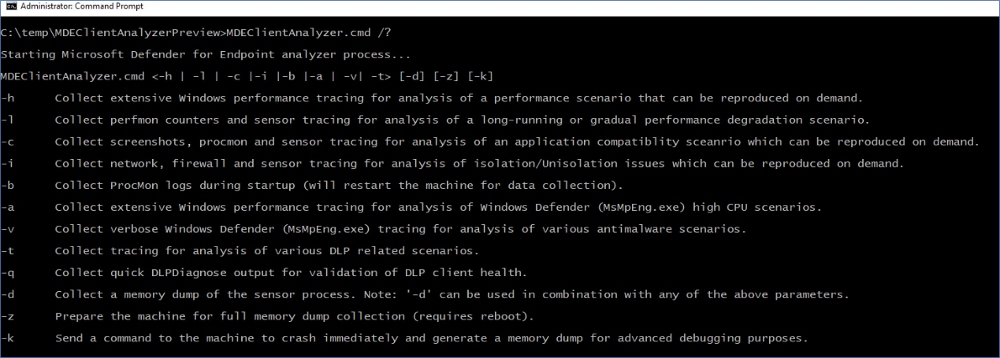

# Collecte de données pour la résolution avancée des problèmes sur Windows

**S’applique à :**
- [Microsoft Defender pour point de terminaison Plan 1](https://go.microsoft.com/fwlink/p/?linkid=2154037)
- [Microsoft Defender pour point de terminaison Plan 2](https://go.microsoft.com/fwlink/p/?linkid=2154037)

Lorsque vous collaborez avec des professionnels du support technique Microsoft, vous pouvez être invité à utiliser l’analyseur client pour collecter des données afin de résoudre les problèmes de scénarios plus complexes. Le script de l’analyseur prend en charge d’autres paramètres à cet effet et peut collecter un ensemble de journaux spécifique en fonction des symptômes observés qui doivent être examinés.

Exécuter '**MDEClientAnalyzer.cmd /?**' pour voir la liste des paramètres disponibles et leur description :

> [!NOTE]
> Lorsqu’un paramètre de dépannage avancé est  utilisé, l’analyseur appelle égalementMpCmdRun.exepour collecter Antivirus Microsoft Defender journaux de support associés.

**-h** : appelle [l’enregistreur Windows performance](/windows-hardware/test/wpt/wpr-command-line-options) pour collecter un suivi détaillé des performances générales en plus du jeu de journaux standard.

**-l** - Appels dans l’Windows [Performance Monitor](/windows-server/remote/remote-desktop-services/rds-rdsh-performance-counters) pour collecter un suivi perfmon léger. Cela peut s’avérer utile lors du diagnostic de problèmes de dégradation des performances lents qui se produisent au fil du temps, mais qui sont difficiles à reproduire à la demande.

**-c** - Appels dans le moniteur de [processus](/sysinternals/downloads/procmon) pour la surveillance avancée de l’activité en temps réel du système de fichiers, du Registre et des processus/threads. Cela est particulièrement utile lors du dépannage de différents scénarios de compatibilité d’application.

**-i** : appelle une  commandenetsh.exeintégrée pour démarrer un suivi du réseau et du pare-feu Windows qui est utile lors de la résolution de divers problèmes liés au réseau.

**-b** - Identique à '-c', mais la trace du moniteur de processus sera lancée lors du prochain démarrage et arrêtée uniquement lorsque le -b est de nouveau utilisé.

**-a** - Appelle l’Enregistreur de [performances Windows](/windows-hardware/test/wpt/wpr-command-line-options) pour collecter un suivi des performances détaillée spécifique à l’analyse des problèmes de processeur élevés liés au processus antivirus (MsMpEng.exe).

**-v** - Utilise l’antivirus [MpCmdRun.exe'argument](/windows/security/threat-protection/microsoft-defender-antivirus/command-line-arguments-microsoft-defender-antivirus) de ligne de commande avec la plupart des indicateurs de suivi détaillées.

**-t** : démarre la trace détaillée de tous les composants côté client pertinents pour le point de terminaison DLP. Cela est utile dans les scénarios où les [actions DLP](/microsoft-365/compliance/endpoint-dlp-learn-about#endpoint-activities-you-can-monitor-and-take-action-on) ne se produisent pas comme prévu pour les fichiers.

**-q** - Appels dans DLPDiagnose.ps1 script à partir du répertoire « Tools » de l’analyseur qui valide la configuration de base et la configuration requise pour le point de terminaison DLP.

**-d** - Collecte un vidage mémoire de MsSense **S**.exe (processus de capteur sur Windows Server 2016 ou un système d’exploitation plus ancien) et des processus associés.

- \* Cet indicateur peut être utilisé conjointement avec les indicateurs mentionnés ci-dessus.
- \*\* La capture d’un vidage mémoire de processus protégés par [PPL](/windows-hardware/drivers/install/early-launch-antimalware) tels que MsSense.exe ou MsMpEng.exe n’est pas prise en charge par l’analyseur pour le moment.

**-z** - Configure les clés de Registre sur l’ordinateur pour la préparer à la collecte de vidage mémoire complète de l’ordinateur via [CrashOnCtrlScroll](/windows-hardware/drivers/debugger/forcing-a-system-crash-from-the-keyboard). Cela serait utile pour l’analyse des problèmes de blocage de l’ordinateur.

\* Maintenez la touche Ctrl la plus à droite, puis appuyez deux fois sur la touche DE VERROUILLAGE DE DÉFILEMENT.

**-k** - Utilise [l’outil NotMyFault](/sysinternals/downloads/notmyfault) pour forcer le système à se crasher et à générer un vidage de mémoire de l’ordinateur. Cela serait utile pour l’analyse de divers problèmes de stabilité du système d’exploitation.

L’analyseur et tous les indicateurs de scénario ci-dessus peuvent être lancés à distance en exécutant « RemoteMDEClientAnalyzer.cmd » qui est également regroupé dans l’ensemble d’outils de l’analyseur :

> [!NOTE]
>
> - Lorsque vous utilisez RemoteMDEClientAnalyzer.cmd, il appelle psexec pour télécharger l’outil à partir du partage de fichiers configuré, puis l’exécuter localement via PsExec.exe.
    Le script CMD utilise l’indicateur « -r » pour spécifier qu’il s’exécute à distance dans le contexte SYSTÈME et qu’aucune invite ne sera donc présentée à l’utilisateur.
> - Ce même indicateur peut être utilisé avec MDEClientAnalyzer.cmd pour éviter une invite à l’utilisateur qui demande de spécifier le nombre de minutes pour la collecte de données. Par exemple :
>
>    **MDEClientAnalyzer.cmd -r -i -m 5**
>
>   - **-r** : indique que l’outil est exécuté à partir d’un contexte distant (ou non interactif)
>   - **-i** - Indicateur de scénario pour la collecte de suivi réseau avec d’autres journaux associés
>   - **-m** \# - Nombre de minutes à exécuter (5 minutes dans l’exemple ci-dessus)
