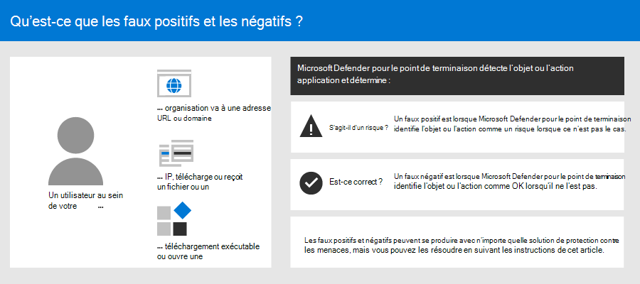
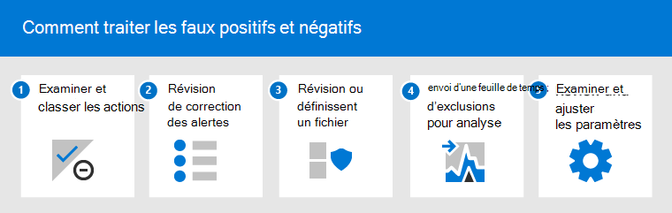
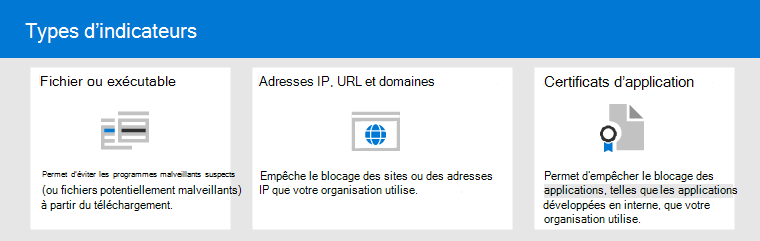

# <a name="address-false-positivesnegatives-in-microsoft-defender-for-endpoint"></a>Résoudre les faux positifs/négatifs dans Microsoft Defender pour point de terminaison

[!INCLUDE [Microsoft 365 Defender rebranding](../../includes/microsoft-defender.md)]

**S’applique à :**

- [Microsoft Defender pour point de terminaison Plan 2](https://go.microsoft.com/fwlink/p/?linkid=2154037)

Dans les solutions de protection des points de terminaison, un faux positif est une entité, telle qu’un fichier ou un processus, qui a été détectée et identifiée comme malveillante, même si l’entité n’est pas réellement une menace. Un faux négatif est une entité qui n’a pas été détectée comme une menace, même si elle est réellement malveillante. Les faux positifs/négatifs peuvent se produire avec n’importe quelle solution de protection contre les menaces, [y compris Microsoft Defender pour le point de terminaison.](microsoft-defender-endpoint.md)



Heureusement, des mesures peuvent être prises pour résoudre et réduire ces types de problèmes. Si vous voyez des faux positifs/négatifs dans [Microsoft 365 Defender](microsoft-defender-security-center.md) (anciennement Centre de sécurité Microsoft Defender), vos opérations de sécurité peuvent prendre des mesures pour les résoudre à l’aide du processus suivant :

1. [Examiner et classer les alertes](#part-1-review-and-classify-alerts)
2. [Examiner les actions correctives qui ont été prises](#part-2-review-remediation-actions)
3. [Examiner et définir des exclusions](#part-3-review-or-define-exclusions)
4. [Soumettre une entité pour analyse](#part-4-submit-a-file-for-analysis)
5. [Examiner et ajuster vos paramètres de protection contre les menaces](#part-5-review-and-adjust-your-threat-protection-settings)

Vous pouvez obtenir de l’aide si vous avez encore des problèmes avec des faux positifs/négatifs après avoir effectué les tâches décrites dans cet article. Vous avez [encore besoin d’aide ?](#still-need-help)



> [!NOTE]
> Cet article est destiné à aider les opérateurs de sécurité et les administrateurs de sécurité qui [utilisent Microsoft Defender pour endpoint](microsoft-defender-endpoint.md).

## <a name="part-1-review-and-classify-alerts"></a>Partie 1 : examiner et classer les alertes

Si vous voyez [une](alerts.md) alerte qui a été déclenchée parce qu’un élément a été détecté comme malveillant ou suspect qui n’aurait pas dû l’être, vous pouvez supprimer l’alerte pour cette entité. Vous pouvez également supprimer des alertes qui ne sont pas nécessairement de faux positifs, mais qui ne sont pas trèsimportantes. Nous vous recommandons également de classer les alertes.

La gestion de vos alertes et la classification des faux positifs permettent de former votre solution de protection contre les menaces et de réduire le nombre de faux positifs ou de faux négatifs au fil du temps. Ces étapes permettent également de réduire le bruit dans votre tableau de bord des opérations de sécurité afin que votre équipe de sécurité puisse se concentrer sur les éléments de travail prioritaires.

### <a name="determine-whether-an-alert-is-accurate"></a>Déterminer si une alerte est exacte

Avant de classer ou de supprimer une alerte, déterminez si l’alerte est exacte, faux positif ou anodin.

1. Go to the Microsoft 365 Defender portal ( [https://security.microsoft.com](https://security.microsoft.com) ) and sign in.

2. Dans le volet de navigation, sélectionnez **File d’attente des alertes.**

3. Sélectionnez une alerte pour plus de détails sur l’alerte. [(Consultez les alertes de révision dans Microsoft Defender pour le point de terminaison.)](review-alerts.md)

4. En fonction de l’état de l’alerte, prenez les étapes décrites dans le tableau suivant :

<br/><br/>

   |État de l’alerte|Procédure|
   |---|---|
   |L’alerte est exacte|Affectez l’alerte, puis [examinez-la plus](investigate-alerts.md) en détail.|
   |L’alerte est un faux positif|1. [Classifiez l’alerte](#classify-an-alert) comme faux positif.<br/><br/>2. [Supprimez l’alerte.](#suppress-an-alert)<br/><br/>3. [Créez un indicateur](#indicators-for-microsoft-defender-for-endpoint) pour Microsoft Defender pour le point de terminaison.<br/><br/>4. [Envoyez un fichier à Microsoft pour analyse.](#part-4-submit-a-file-for-analysis)|
   |L’alerte est précise, mais sans importance (sans importance)|[Classifiez l’alerte](#classify-an-alert) comme un vrai positif, puis [supprimez l’alerte.](#suppress-an-alert)|

### <a name="classify-an-alert"></a>Classifier une alerte

Les alertes peuvent être classées en tant que faux positifs ou vrais positifs dans Microsoft 365 Defender. La classification des alertes permet d’entraîner Microsoft Defender pour le point de terminaison afin que, au fil du temps, vous verrez plus d’alertes vraies et moins de fausses alertes.

1. Go to the Microsoft 365 Defender portal ( [https://security.microsoft.com](https://security.microsoft.com) ) and sign in.

2. Sélectionnez **la file d’attente des alertes,** puis sélectionnez une alerte.

3. Pour l’alerte sélectionnée, sélectionnez **Actions** \> **Gérer l’alerte.** Un volet volant s’ouvre.

4. Dans la section **Gérer l’alerte,** sélectionnez Alerte **True** ou **False.** (Utilisez **une alerte False pour** classer un faux positif.)

> [!TIP]
> Pour plus d’informations sur la suppression des alertes, voir [Gérer Microsoft Defender pour les alertes de point de terminaison.](/microsoft-365/security/defender-endpoint/manage-alerts) De plus, si votre organisation utilise un serveur de gestion des événements et des informations de sécurité (SIEM), veillez également à définir une règle de suppression à cet emplacement.

### <a name="suppress-an-alert"></a>Supprimer une alerte

Si vous avez des alertes qui sont de faux positifs ou qui sont de vrais positifs, mais pour des événements non importants, vous pouvez supprimer ces alertes dans Microsoft 365 Defender. La suppression d’alertes permet de réduire le bruit dans votre tableau de bord des opérations de sécurité.

1. Go to the Microsoft 365 Defender portal ( [https://security.microsoft.com](https://security.microsoft.com) ) and sign in.

2. Dans le volet de navigation, sélectionnez **File d’attente Alertes.**

3. Sélectionnez une alerte à supprimer pour ouvrir son **volet d’informations.**

4. Dans le **volet Détails,** choisissez les ellipses (**...**), puis créez **une règle de suppression.**

5. Spécifiez tous les paramètres de votre règle de suppression, puis sélectionnez **Enregistrer**.

> [!TIP]
> Vous avez besoin d’aide sur les règles de suppression ? Voir [Supprimer une alerte et créer une règle de suppression.](/microsoft-365/security/defender-endpoint/manage-alerts#suppress-an-alert-and-create-a-new-suppression-rule)

## <a name="part-2-review-remediation-actions"></a>Partie 2 : Examiner les actions de correction

[Les actions de](manage-auto-investigation.md#remediation-actions)correction, telles que l’envoi d’un fichier en quarantaine ou l’arrêt d’un processus, sont prises sur des entités (telles que des fichiers) détectées comme des menaces. Plusieurs types d’actions de correction se produisent automatiquement par le biais d’examens et d’Antivirus Microsoft Defender :

- Mettre en quarantaine un fichier
- Supprimer une clé de Registre
- Kill a process
- Arrêter un service
- Désactiver un pilote
- Supprimer une tâche programmée

D’autres actions, telles que le démarrage d’une analyse antivirus ou la collecte d’un package d’enquête, se produisent manuellement ou via [Live Response](live-response.md). Les actions prises via Live Response ne peuvent pas être annulées.

Une fois que vous avez examiné vos alertes, l’étape suivante consiste à passer [en revue les actions de correction.](manage-auto-investigation.md) Si des actions ont été prises à la suite de faux positifs, vous pouvez annuler la plupart des types d’actions de correction. Concrètement, vous pouvez :

- [Restaurer un fichier mis en quarantaine à partir du centre de mise en quarantaine](#restore-a-quarantined-file-from-the-action-center)
- [Annuler plusieurs actions à la fois](#undo-multiple-actions-at-one-time)
- [Supprimez un fichier de la quarantaine sur plusieurs appareils.](#remove-a-file-from-quarantine-across-multiple-devices) et
- [Restaurer un fichier à partir de la mise en quarantaine](#restore-file-from-quarantine)

Lorsque vous avez terminé de passer en revue et d’annuler les actions qui ont été prises à la suite de faux positifs, passer en revue [ou définir des exclusions](#part-3-review-or-define-exclusions).

### <a name="review-completed-actions"></a>Passer en revue les actions terminées

1. Dans le volet de navigation gauche du portail <a href="https://go.microsoft.com/fwlink/p/?linkid=2077139" target="_blank">Microsoft 365 Defender,</a>cliquez sur **Centre de l’action.**

2. Sélectionnez **l’onglet** Historique pour afficher la liste des actions qui ont été entreprises.

3. Sélectionnez un élément pour afficher plus de détails sur l’action de correction qui a été prise.

### <a name="restore-a-quarantined-file-from-the-action-center"></a>Restaurer un fichier mis en quarantaine à partir du centre de mise en quarantaine

1. Dans le volet de navigation gauche du portail Microsoft 365 Defender, cliquez sur **Centre de l’action.**

2. Sous **l’onglet** Historique, sélectionnez une action à annuler.

3. Dans le volet volant, sélectionnez **Annuler.** Si l’action ne peut pas être annulée avec cette méthode, vous ne verrez pas de **bouton** Annuler. (Pour plus d’informations, voir [Annuler les actions terminées.)](manage-auto-investigation.md#undo-completed-actions)

### <a name="undo-multiple-actions-at-one-time"></a>Annuler plusieurs actions à la fois

1. Dans le volet de navigation gauche du portail <a href="https://go.microsoft.com/fwlink/p/?linkid=2077139" target="_blank">Microsoft 365 Defender,</a>cliquez sur **Centre de l’action.**

2. Sous **l’onglet** Historique, sélectionnez les actions à annuler.

3. Dans le volet sur le côté droit de l’écran, sélectionnez **Annuler**.

### <a name="remove-a-file-from-quarantine-across-multiple-devices"></a>Supprimer un fichier de la quarantaine sur plusieurs appareils

> [!div class="mx-imgBorder"]
> 

1. Dans le volet de navigation gauche du portail <a href="https://go.microsoft.com/fwlink/p/?linkid=2077139" target="_blank">Microsoft 365 Defender,</a>cliquez sur **Centre de l’action.**

2. Sous **l’onglet** Historique, sélectionnez un fichier dont le fichier de mise en quarantaine du type d’action **est sélectionné.**

3. Dans le volet sur le côté droit de l’écran, sélectionnez Appliquer à **X plus d’instances** de ce fichier, puis **sélectionnez Annuler**.

### <a name="restore-file-from-quarantine"></a>Restaurer un fichier à partir de la mise en quarantaine

Vous pouvez récupérer et supprimer un fichier de la quarantaine si vous avez déterminé qu’il est propre après un examen. Exécutez la commande suivante sur chaque appareil sur lequel le fichier a été mis en quarantaine.

1. Ouvrez une invite de ligne de commande avec élévation de niveaux sur l’appareil :

   1. Accéder à **Démarrer** et taper _cmd_.
   2. Cliquez avec le bouton droit sur **Invite de commandes** et sélectionnez **Exécuter en tant qu'administrateur**.

2. Entrez la commande suivante, puis appuyez sur **Entrée**:

    ```console
    "ProgramFiles%\Windows Defender\MpCmdRun.exe" -Restore -Name EUS:Win32/CustomEnterpriseBlock -All
    ```

    > [!IMPORTANT]
    > Dans certains scénarios, **threatName** peut apparaître comme `EUS:Win32/CustomEnterpriseBlock!cl` . Defender for Endpoint restaure tous les fichiers bloqués personnalisés qui ont été mis en quarantaine sur cet appareil au cours des 30 derniers jours.
    >
    > Un fichier mis en quarantaine comme menace réseau potentielle peut ne pas être récupérable. Si un utilisateur tente de restaurer le fichier après sa mise en quarantaine, il se peut que ce fichier ne soit pas accessible. Cela peut être dû au fait que le système n’a plus d’informations d’identification réseau pour accéder au fichier. En règle générale, cela est le résultat d’une connexion temporaire à un système ou à un dossier partagé et les jetons d’accès ont expiré.

3. Dans le volet sur le côté droit de l’écran, sélectionnez Appliquer à **X plus d’instances** de ce fichier, puis **sélectionnez Annuler**.

## <a name="part-3-review-or-define-exclusions"></a>Partie 3 : Examiner ou définir des exclusions

Une exclusion est une entité, telle qu’un fichier ou une URL, que vous spécifiez comme exception aux actions de correction. L’entité exclue peut toujours être détectée, mais aucune action de correction n’est prise sur cette entité. Autrement dit, le fichier ou processus détecté ne sera pas arrêté, envoyé en quarantaine, supprimé ou modifié par Microsoft Defender pour le point de terminaison.

Pour définir des exclusions dans Microsoft Defender pour le point de terminaison, effectuez les tâches suivantes :

- [Définir des exclusions pour Antivirus Microsoft Defender](#exclusions-for-microsoft-defender-antivirus)
- [Créer des indicateurs « autoriser » pour Microsoft Defender pour le point de terminaison](#indicators-for-microsoft-defender-for-endpoint)

> [!NOTE]
> Antivirus Microsoft Defender exclusions s’appliquent uniquement à la protection antivirus, et non aux autres fonctionnalités de Microsoft Defender for Endpoint. Pour exclure les fichiers à grande étendue, utilisez des exclusions Antivirus Microsoft Defender et des indicateurs [personnalisés](/microsoft-365/security/defender-endpoint/manage-indicators) pour Microsoft Defender pour point de terminaison.

Les procédures de cette section décrivent comment définir des exclusions et des indicateurs.

### <a name="exclusions-for-microsoft-defender-antivirus"></a>Exclusions pour les Antivirus Microsoft Defender

En règle générale, il n’est pas nécessaire de définir des exclusions pour Antivirus Microsoft Defender. Veillez à définir les exclusions avec parcimonie et à n’inclure que les fichiers, dossiers, processus et fichiers ouverts par processus qui entraînent des faux positifs. En outre, veillez à examiner régulièrement vos exclusions définies. Nous vous recommandons [d’utiliser Microsoft Endpoint Manager](/mem/endpoint-manager-overview) pour définir ou modifier vos exclusions antivirus ; toutefois, vous pouvez utiliser d’autres méthodes, telles que la stratégie de groupe [(voir](/azure/active-directory-domain-services/manage-group-policy) [Gérer Microsoft Defender pour Endpoint](manage-mde-post-migration.md).

> [!TIP]
> Vous avez besoin d’aide sur les exclusions antivirus ? Voir [Configurer et valider les exclusions pour Antivirus Microsoft Defender analyses.](configure-exclusions-microsoft-defender-antivirus.md)

#### <a name="use-microsoft-endpoint-manager-to-manage-antivirus-exclusions-for-existing-policies"></a>Utiliser Microsoft Endpoint Manager pour gérer les exclusions antivirus (pour les stratégies existantes)

1. Go to the Microsoft Endpoint Manager admin center ( <https://endpoint.microsoft.com> ) and sign in.

2. Choisissez **l’Antivirus de sécurité des** points de \> terminaison, puis sélectionnez une stratégie existante. (Si vous n’avez pas de stratégie existante ou si vous souhaitez en créer une nouvelle, passez à [la procédure suivante).](#use-microsoft-endpoint-manager-to-create-a-new-antivirus-policy-with-exclusions)

3. Choose **Properties**, and next to **Configuration settings**, choose **Edit**.

4. Développez **Antivirus Microsoft Defender exclusions,** puis spécifiez vos exclusions.

5. Choose **Review + save,** and then choose **Save**.

#### <a name="use-microsoft-endpoint-manager-to-create-a-new-antivirus-policy-with-exclusions"></a>Utiliser Microsoft Endpoint Manager pour créer une stratégie antivirus avec des exclusions

1. Go to the Microsoft Endpoint Manager admin center ( <https://endpoint.microsoft.com> ) and sign in.

2. Choisissez **Endpoint security** \> **Antivirus** \> **+ Create Policy**.

3. Sélectionnez une plateforme (par **exemple, Windows 10 et** ultérieures, **macOS** ou **Windows 10 et Windows Server).**

4. Pour **profil,** **sélectionnez Antivirus Microsoft Defender exclusions,** puis choisissez **Créer.**

5. Spécifiez un nom et une description pour le profil, puis choisissez **Suivant**.

6. Sous **l’onglet Paramètres de configuration,** spécifiez vos exclusions antivirus, puis choisissez **Suivant**.

7. Sous **l’onglet Balises** d’étendue, si vous utilisez des balises d’étendue dans votre organisation, spécifiez des balises d’étendue pour la stratégie que vous créez. (Voir [balises d’étendue.)](/mem/intune/fundamentals/scope-tags)

8. Sous **l’onglet Affectations,** spécifiez les utilisateurs et les groupes auxquels votre stratégie doit être appliquée, puis choisissez **Suivant**. (Si vous avez besoin d’aide pour les affectations, voir Affecter des profils utilisateur et d’appareil [dans Microsoft Intune.)](/mem/intune/configuration/device-profile-assign)

9. Sous **l’onglet Révision + créer,** examinez les paramètres, puis choisissez **Créer.**

### <a name="indicators-for-microsoft-defender-for-endpoint"></a>Indicateurs pour Microsoft Defender pour le point de terminaison

Les indicateurs (en particulier, les indicateurs de compromission ou les IOC) permettent à votre équipe des [opérations](/microsoft-365/security/defender-endpoint/manage-indicators) de sécurité de définir la détection, la prévention et l’exclusion des entités. Par exemple, vous pouvez spécifier certains fichiers à ne pas spécifier dans les analyses et les actions de correction dans Microsoft Defender for Endpoint. Vous pouvez également utiliser des indicateurs pour générer des alertes pour certains fichiers, adresses IP ou URL.

Pour spécifier des entités en tant qu’exclusions pour Microsoft Defender pour le point de terminaison, créez des indicateurs « autoriser » pour ces entités. Ces indicateurs d'« autoriser » dans Microsoft Defender pour point de terminaison s’appliquent à la [protection](microsoft-defender-antivirus-in-windows-10.md)nouvelle génération, [aux](overview-endpoint-detection-response.md)protection évolutive des points de terminaison et aux examens automatisés & [correction.](/microsoft-365/security/defender-endpoint/automated-investigations)

Les indicateurs « Autoriser » peuvent être créés pour :

- [Files](#indicators-for-files)
- [Adresses IP, URL et domaines](#indicators-for-ip-addresses-urls-or-domains)
- [Certificats d’application](#indicators-for-application-certificates)



#### <a name="indicators-for-files"></a>Indicateurs pour les fichiers

Lorsque vous créez un indicateur « autoriser » pour un fichier, tel qu’un [exécutable,](/microsoft-365/security/defender-endpoint/indicator-file)cela empêche le blocage des fichiers que votre organisation utilise. Les fichiers peuvent inclure des fichiers exécutables portables (PE), tels que `.exe` des `.dll` fichiers.

Avant de créer des indicateurs pour les fichiers, assurez-vous que les conditions suivantes sont remplies :

- Antivirus Microsoft Defender est configuré avec la protection basée sur le cloud activée (voir [Gérer la protection basée sur le cloud)](/windows/security/threat-protection/microsoft-defender-antivirus/deploy-manage-report-microsoft-defender-antivirus)
- La version du client anti-programme malveillant est 4.18.1901.x ou version ultérieure
- Les appareils s’exécutent Windows 10 version 1703 ou ultérieure, ou Windows 11 ; Windows Server 2016, Windows Server 2019 ou Windows Server 2022
- La [fonctionnalité Bloquer ou autoriser est désactivée](/microsoft-365/security/defender-endpoint/advanced-features)

#### <a name="indicators-for-ip-addresses-urls-or-domains"></a>Indicateurs pour les adresses IP, les URL ou les domaines

Lorsque vous créez un indicateur « autoriser » pour une adresse [IP,](/microsoft-365/security/defender-endpoint/indicator-ip-domain)une URL ou un domaine, cela empêche le blocage des sites ou des adresses IP que votre organisation utilise.

Avant de créer des indicateurs pour des adresses IP, des URL ou des domaines, assurez-vous que les conditions suivantes sont remplies :

- La protection réseau dans Defender pour le point de terminaison est activée en mode blocage (voir [Activer la protection réseau)](/microsoft-365/security/defender-endpoint/enable-network-protection)
- La version du client anti-programme malveillant est 4.18.1906.x ou version ultérieure
- Les appareils s’exécutent Windows 10 version 1709 ou ultérieure, ou version Windows 11

Les indicateurs réseau personnalisés sont allumés dans le [Microsoft 365 Defender](microsoft-defender-security-center.md). Pour en savoir plus, consultez [Fonctionnalités avancées.](/microsoft-365/security/defender-endpoint/advanced-features)

#### <a name="indicators-for-application-certificates"></a>Indicateurs pour les certificats d’application

Lorsque vous créez un indicateur « autoriser » pour un certificat [d’application,](/microsoft-365/security/defender-endpoint/indicator-certificates)cela empêche le blocage des applications, telles que les applications développées en interne, que votre organisation utilise. `.CER` ou `.PEM` les extensions de fichier sont pris en charge.

Avant de créer des indicateurs pour les certificats d’application, assurez-vous que les conditions suivantes sont remplies :

- Antivirus Microsoft Defender est configuré avec la protection basée sur le cloud activée (voir [Gérer la protection basée sur le cloud)](deploy-manage-report-microsoft-defender-antivirus.md)
- La version du client anti-programme malveillant est 4.18.1901.x ou version ultérieure
- Les appareils s’exécutent Windows 10 version 1703 ou ultérieure, ou Windows 11 ; Windows Server 2016, Windows Server 2019 ou Windows Server 2022
- Les définitions de protection contre les virus et menaces sont à jour

> [!TIP]
> Lorsque vous créez des indicateurs, vous pouvez les définir un par un ou importer plusieurs éléments à la fois. Gardez à l’esprit qu’il existe une limite de 15 000 indicateurs pour un seul client. Vous devrez peut-être d’abord rassembler certains détails, tels que les informations de hachage de fichier. Veillez à passer en revue les conditions préalables avant de [créer des indicateurs.](manage-indicators.md)

## <a name="part-4-submit-a-file-for-analysis"></a>Partie 4 : Envoyer un fichier pour analyse

Vous pouvez soumettre des entités, telles que des fichiers et des détections sans fichier, à Microsoft pour analyse. Les chercheurs en matière de sécurité Microsoft analysent toutes les soumissions et leurs résultats aident à informer Microsoft Defender des fonctionnalités de protection contre les menaces des points de terminaison. Lorsque vous vous connectez au site de soumission, vous pouvez suivre vos soumissions.

### <a name="submit-a-file-for-analysis"></a>Envoyer un fichier pour analyse

Si vous avez un fichier qui a été détecté à tort comme malveillant ou a été manqué, suivez ces étapes pour soumettre le fichier à des fins d’analyse.

1. Examinez les recommandations ici : [Soumettre des fichiers pour analyse.](/windows/security/threat-protection/intelligence/submission-guide)

2. Visitez le Renseignement de sécurité Microsoft de soumission ( <https://www.microsoft.com/wdsi/filesubmission> ), et soumettez vos fichiers.

### <a name="submit-a-fileless-detection-for-analysis"></a>Soumettre une détection sans fichier pour analyse

Si un problème a été détecté comme programme malveillant en fonction du comportement et que vous n’avez pas de fichier, vous pouvez soumettre votre `Mpsupport.cab` fichier pour analyse. Vous pouvez obtenir le *fichier.cab* à l’aide de l’outil Utilitaire Command-Line de protection contre les programmes malveillants (MPCmdRun.exe) de Microsoft sur Windows 10 ou Windows 11.

1. Go to ` C:\ProgramData\Microsoft\Windows Defender\Platform\<version>` , and then run as an `MpCmdRun.exe` administrator.

2. `mpcmdrun.exe -GetFiles`Tapez, puis appuyez sur **Entrée**.

   Un .cab de diagnostic qui contient divers journaux de diagnostic est généré. L’emplacement du fichier est spécifié dans la sortie de l’invite de commandes. Par défaut, l’emplacement est `C:\ProgramData\Microsoft\Microsoft Defender\Support\MpSupportFiles.cab` .

3. Examinez les recommandations ici : [Soumettre des fichiers pour analyse.](/windows/security/threat-protection/intelligence/submission-guide)

4. Visitez le site Renseignement de sécurité Microsoft soumission ( ), et envoyez <https://www.microsoft.com/wdsi/filesubmission> vos fichiers .cab dossiers.

### <a name="what-happens-after-a-file-is-submitted"></a>Que se passe-t-il après l’dépôt d’un fichier ?

Votre soumission est immédiatement analysée par nos systèmes pour vous fournir la dernière détermination avant qu’un analyste ne commence à gérer votre cas. Il est possible qu’un fichier a déjà été envoyé et traitée par un analyste. Dans ce cas, une détermination est réalisée rapidement.

Pour les soumissions qui n’ont pas encore été traitées, elles sont prioritaires pour l’analyse comme suit :

- Les fichiers répandus qui peuvent avoir un impact sur un grand nombre d’ordinateurs ont une priorité plus élevée.
- Les clients authentifiés, en particulier les clients d’entreprise ayant des [ID d’assurance logiciel (SAID) valides,](https://www.microsoft.com/licensing/licensing-programs/software-assurance-default.aspx)ont une priorité plus élevée.
- Les soumissions marquées comme étant prioritaires par les titulaires DE LAS sont immédiatement signalées.

Pour vérifier les mises à jour concernant votre soumission, connectez-vous [sur le site Renseignement de sécurité Microsoft soumission.](https://www.microsoft.com/wdsi/filesubmission)

> [!TIP]
> Pour plus d’informations, voir [Envoyer des fichiers pour analyse.](/windows/security/threat-protection/intelligence/submission-guide#how-does-microsoft-prioritize-submissions)

## <a name="part-5-review-and-adjust-your-threat-protection-settings"></a>Partie 5 : Examiner et ajuster vos paramètres de protection contre les menaces

Microsoft Defender pour point de terminaison offre un large éventail d’options, notamment la possibilité d’affiner les paramètres de différentes fonctionnalités et fonctionnalités. Si vous avez de nombreux faux positifs, veillez à passer en revue les paramètres de protection contre les menaces de votre organisation. Vous devrez peut-être effectuer quelques ajustements pour :

- [Protection cloud](#cloud-delivered-protection)
- [Correction des applications potentiellement indésirables](#remediation-for-potentially-unwanted-applications)
- [Examen et correction automatisés](#automated-investigation-and-remediation)

### <a name="cloud-delivered-protection"></a>Protection fournie par le cloud

Vérifiez votre niveau de protection dans le cloud pour Antivirus Microsoft Defender. Par défaut, la protection cloud est définie sur Non **configuré,** ce qui correspond à un niveau de protection normal pour la plupart des organisations. Si votre protection cloud est définie sur **Tolérance** élevée, Élevée **+** ou **Zéro,** vous pouvez voir un plus grand nombre de faux positifs.

> [!TIP]
> Pour en savoir plus sur la configuration de votre protection cloud, voir Spécifier le niveau de [protection livré par le cloud.](/windows/security/threat-protection/microsoft-defender-antivirus/specify-cloud-protection-level-microsoft-defender-antivirus)

Nous vous recommandons [d’utiliser Microsoft Endpoint Manager](/mem/endpoint-manager-overview) pour modifier ou définir vos paramètres de protection cloud ; toutefois, vous pouvez utiliser d’autres méthodes, telles que la stratégie de groupe [(voir](/azure/active-directory-domain-services/manage-group-policy) [Gérer Microsoft Defender pour Endpoint](manage-mde-post-migration.md).

#### <a name="use-microsoft-endpoint-manager-to-review-and-edit-cloud-delivered-protection-settings-for-existing-policies"></a>Utiliser Microsoft Endpoint Manager pour examiner et modifier les paramètres de protection cloud (pour les stratégies existantes)

1. Go to the Microsoft Endpoint Manager admin center ( <https://endpoint.microsoft.com> ) and sign in.

2. Choisissez **l’Antivirus de sécurité des** points de \>  terminaison, puis sélectionnez une stratégie existante. (Si vous n’avez pas de stratégie existante ou si vous souhaitez en créer une nouvelle, passez à [la procédure suivante).](#use-microsoft-endpoint-manager-to-set-cloud-delivered-protection-settings-for-a-new-policy)

3. Sous **Gérer,** sélectionnez **Propriétés.** Ensuite, en de côté **des paramètres de configuration,** choisissez **Modifier.**

4. Développez **la protection** cloud et examinez votre paramètre actuel dans la ligne niveau **de protection livrée par le cloud.** Nous vous recommandons de définir la protection cloud sur Non **configuré,** ce qui fournit une protection forte tout en réduisant les risques d’obtention de faux positifs.

5. Choose **Review + save,** and then **Save**.

#### <a name="use-microsoft-endpoint-manager-to-set-cloud-delivered-protection-settings-for-a-new-policy"></a>Utiliser Microsoft Endpoint Manager pour définir des paramètres de protection cloud (pour une nouvelle stratégie)

1. Go to the Microsoft Endpoint Manager admin center ( <https://endpoint.microsoft.com> ) and sign in.

2. Choisissez **Endpoint security** \> **Antivirus** \> **+ Create policy**.

3. Pour **la plateforme,** sélectionnez une option, puis pour **profil,** sélectionnez **Antivirus** ou **Antivirus Microsoft Defender** (l’option spécifique dépend de ce que vous avez sélectionné pour la **plateforme.)** Ensuite, **sélectionnez Créer.**

4. Sous **l’onglet Informations de** base, spécifiez un nom et une description pour la stratégie. Sélectionnez **Suivant**.

5. Sous **l’onglet Paramètres de configuration,** développez **Protection cloud** et spécifiez les paramètres suivants :

   - Définissez **Activer la protection cloud sur** **Oui.**
   - Définissez **Niveau de protection assuré par le cloud** sur **Non configuré**. (Ce niveau fournit un niveau de protection élevé par défaut tout en réduisant les risques d’obtention de faux positifs.)

6. Sous **l’onglet Balises** d’étendue, si vous utilisez des balises d’étendue dans votre organisation, spécifiez des balises d’étendue pour la stratégie. (Voir [balises d’étendue.)](/mem/intune/fundamentals/scope-tags)

7. Sous **l’onglet Affectations,** spécifiez les utilisateurs et les groupes auxquels votre stratégie doit être appliquée, puis choisissez **Suivant**. (Si vous avez besoin d’aide pour les affectations, voir Affecter des profils utilisateur et d’appareil [dans Microsoft Intune.)](/mem/intune/configuration/device-profile-assign)

8. Sous **l’onglet Révision + créer,** examinez les paramètres, puis choisissez **Créer.**

### <a name="remediation-for-potentially-unwanted-applications"></a>Correction des applications potentiellement indésirables

Les applications potentiellement indésirables (PUA) sont une catégorie de logiciels qui peuvent ralentir l’utilisation des appareils, afficher des publicités inattendues ou installer d’autres logiciels qui peuvent être inattendus ou indésirables. Parmi les exemples de PUA, citons les logiciels de publicité, les logiciels de regroupement et les logiciels espions qui se comportent différemment avec les produits de sécurité. Bien que puA ne soit pas considéré comme un programme malveillant, certains types de logiciels le sont en fonction de leur comportement et de leur réputation.

> [!TIP]
> Pour en savoir plus sur puA, voir [Détecter et bloquer les applications potentiellement indésirables.](/windows/security/threat-protection/microsoft-defender-antivirus/detect-block-potentially-unwanted-apps-microsoft-defender-antivirus)

Selon les applications utilisées par votre organisation, vous pouvez obtenir des faux positifs suite à vos paramètres de protection PUA. Si nécessaire, envisagez d’utiliser la protection PUA en mode audit pendant un certain temps, ou appliquez la protection PUA à un sous-ensemble d’appareils de votre organisation. La protection PUA peut être configurée pour Microsoft Edge navigateur et pour Antivirus Microsoft Defender.

Nous vous recommandons [d’utiliser Microsoft Endpoint Manager](/mem/endpoint-manager-overview) pour modifier ou définir les paramètres de protection PUA ; toutefois, vous pouvez utiliser d’autres méthodes, telles que la stratégie de groupe [(voir](/azure/active-directory-domain-services/manage-group-policy) [Gérer Microsoft Defender pour Endpoint](manage-mde-post-migration.md).

#### <a name="use-microsoft-endpoint-manager-to-edit-pua-protection-for-existing-configuration-profiles"></a>Utiliser Microsoft Endpoint Manager pour modifier la protection PUA (pour les profils de configuration existants)

1. Go to the Microsoft Endpoint Manager admin center ( <https://endpoint.microsoft.com> ) and sign in.

2. Choisissez **les** \> **profils de configuration des** appareils, puis sélectionnez une stratégie existante. (Si vous n’avez pas de stratégie existante ou si vous souhaitez en créer une nouvelle, passez à [la procédure suivante.)](#use-microsoft-endpoint-manager-to-set-pua-protection-for-a-new-configuration-profile)

3. Under **Manage**, choose **Properties**, and then, next to **Configuration settings**, choose **Edit**.

4. Sous **l’onglet Paramètres de configuration,** faites défiler vers le bas et **développez Antivirus Microsoft Defender**.

5. Définissez **Détecter les applications potentiellement indésirables** à **auditer.** (Vous pouvez la désactiver, mais en utilisant le mode audit, vous pourrez voir les détections.)

6. Choose **Review + save,** and then choose **Save**.

#### <a name="use-microsoft-endpoint-manager-to-set-pua-protection-for-a-new-configuration-profile"></a>Utiliser Microsoft Endpoint Manager pour définir la protection PUA (pour un nouveau profil de configuration)

1. Go to the Microsoft Endpoint Manager admin center ( <https://endpoint.microsoft.com> ) and sign in.

2. Choose **Devices** \> **Configuration profiles** + Create \> **profile**.

3. Pour la **plateforme,** choisissez **Windows 10 et ultérieures,** et pour **profil,** sélectionnez **Restrictions d’appareil.**

4. Sous **l’onglet Informations de** base, spécifiez un nom et une description pour votre stratégie. Sélectionnez **Suivant**.

5. Sous **l’onglet Paramètres de configuration,** faites défiler vers le bas et **développez Antivirus Microsoft Defender**.

6. Définissez **Détecter les applications potentiellement indésirables** sur **Audit,** puis choisissez **Suivant**. (Vous pouvez désactiver la protection PUA, mais en utilisant le mode audit, vous pourrez voir les détections.)

7. Sous **l’onglet Affectations,** spécifiez les utilisateurs et les groupes auxquels votre stratégie doit être appliquée, puis choisissez **Suivant**. (Si vous avez besoin d’aide pour les affectations, voir Affecter des profils utilisateur et d’appareil [dans Microsoft Intune.)](/mem/intune/configuration/device-profile-assign)

8. Sous **l’onglet Règles d’applicabilité,** spécifiez les éditions ou versions du système d’exploitation à inclure ou à exclure de la stratégie. Par exemple, vous pouvez définir la stratégie à appliquer à tous les appareils, certaines éditions de Windows 10. Sélectionnez **Suivant**.

9. Sous **l’onglet Révision + créer,** examinez vos paramètres, puis choisissez **Créer.**

### <a name="automated-investigation-and-remediation"></a>Investigation et résolution automatiques

[Les fonctionnalités d’investigation](automated-investigations.md) et de correction automatisées (AIR) sont conçues pour examiner les alertes et prendre des mesures immédiates pour résoudre les violations. Lorsque des alertes sont déclenchées et qu’une enquête automatisée s’exécute, un verdict est généré pour chaque élément de preuve examiné. Les verdicts peuvent être *malveillants,* *suspects* ou *aucune menace trouvée.*

Selon le niveau [d’automatisation](/microsoft-365/security/defender-endpoint/automation-levels) de votre organisation et d’autres paramètres de sécurité, des mesures correctives sont prises sur les artefacts considérés comme malveillants *ou* *suspects.* Dans certains cas, les actions de correction se produisent automatiquement ; dans d’autres cas, les actions correctives sont prises manuellement ou uniquement après approbation par votre équipe des opérations de sécurité.

- [En savoir plus sur les niveaux d’automatisation](/microsoft-365/security/defender-endpoint/automation-levels); Et puis
- [Configurez les fonctionnalités AIR dans Defender pour le point de terminaison.](/microsoft-365/security/defender-endpoint/configure-automated-investigations-remediation)

> [!IMPORTANT]
> Nous vous recommandons *d’utiliser l’automatisation complète* pour l’examen et la correction automatisés. Ne pas désactiver ces fonctionnalités en raison d’un faux positif. Au lieu de cela, utilisez des indicateurs « autoriser » pour définir des [exceptions,](#indicators-for-microsoft-defender-for-endpoint)et conservez l’examen et la correction automatisés pour prendre les mesures appropriées automatiquement. Le [suivi de ces conseils](automation-levels.md#levels-of-automation) permet de réduire le nombre d’alertes que votre équipe des opérations de sécurité doit gérer.

## <a name="still-need-help"></a>Encore besoin d’aide ?

Si vous avez passé en revue toutes les étapes de cet article et que vous avez toujours besoin d’aide, contactez le support technique.

1. Go to <a href="https://go.microsoft.com/fwlink/p/?linkid=2077139" target="_blank">Microsoft 365 Defender</a> and sign in.

2. Dans le coin supérieur droit, sélectionnez le point d’interrogation (**?**), puis sélectionnez **support Microsoft.**

3. Dans la **fenêtre De l’Assistant** Support, décrivez votre problème, puis envoyez votre message. À partir de là, vous pouvez ouvrir une demande de service.

## <a name="see-also"></a>Voir aussi

[Gérer Microsoft Defender pour le point de terminaison](manage-mde-post-migration.md)

[Vue d’ensemble Microsoft 365 Defender portail](/microsoft-365/security/defender-endpoint/use)
