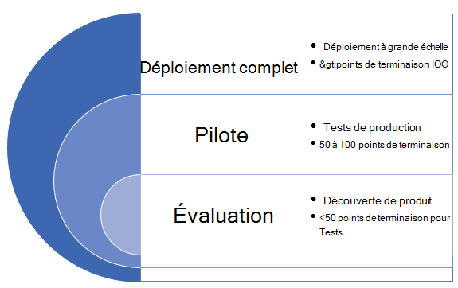

# Déployer Microsoft Defender pour le point de terminaison dans des anneaux

[!INCLUDE [Microsoft 365 Defender rebranding](../../includes/microsoft-defender.md)]

**S’applique à :**
- [Microsoft Defender pour point de terminaison](https://go.microsoft.com/fwlink/p/?linkid=2154037)
- [Microsoft 365 Defender](https://go.microsoft.com/fwlink/?linkid=2118804)

> Vous souhaitez faire l’expérience de Defender pour point de terminaison ? [Inscrivez-vous pour bénéficier d’un essai gratuit.](https://signup.microsoft.com/create-account/signup?products=7f379fee-c4f9-4278-b0a1-e4c8c2fcdf7e&ru=https://aka.ms/MDEp2OpenTrial?ocid=docs-wdatp-assignaccess-abovefoldlink)

Le déploiement de Microsoft Defender pour Endpoint peut être effectué à l’aide d’une approche de déploiement basée sur l’anneau.

Les anneaux de déploiement peuvent être appliqués dans les scénarios suivants :

- [Nouveaux déploiements](#new-deployments)
- [Déploiements existants](#existing-deployments)

## Nouveaux déploiements

Une approche basée sur l’anneau est une méthode d’identification d’un ensemble de points de terminaison à intégrer et de vérifier que certains critères sont satisfaits avant de poursuivre le déploiement du service sur un plus grand ensemble d’appareils. Vous pouvez définir les critères de sortie de chaque anneau et vous assurer qu’ils sont satisfaits avant de passer à l’anneau suivant.

L’adoption d’un déploiement basé sur l’anneau permet de réduire les problèmes potentiels qui peuvent survenir lors du déploiement du service. En pilotant d’abord un certain nombre d’appareils, vous pouvez identifier les problèmes potentiels et atténuer les risques potentiels qui peuvent survenir.

Le tableau 1 fournit un exemple des anneaux de déploiement que vous pouvez utiliser.

**Tableau 1**:

 

****

|Anneau de déploiement|Description|
|---|---|
|Évaluation|Anneau 1 : Identifier 50 systèmes pour les tests pilotes|
|Pilote|Anneau 2 : identifier les 50 à 100 points de terminaison suivants dans l’environnement de production|
|Déploiement complet|Anneau 3 : déployer le service dans le reste de l’environnement par incréments plus importants|
|

### Critères de sortie

Voici un exemple de critères de sortie pour ces anneaux :

- Les appareils s’affiche dans la liste d’inventaire des appareils
- Les alertes apparaissent dans le tableau de bord
- [Exécuter un test de détection](run-detection-test.md)
- [Exécuter une attaque simulée sur un appareil](attack-simulations.md)

### Évaluation

Identifiez un petit nombre d’ordinateurs de test dans votre environnement pour intégrer le service. Dans l’idéal, ces ordinateurs doivent être inférieurs à 50 points de terminaison.

### Pilote

Microsoft Defender pour le point de terminaison prend en charge divers points de terminaison que vous pouvez intégrer au service. Dans cet anneau, identifiez plusieurs appareils à intégrer et, en fonction des critères de sortie que vous définissez, décidez de passer à l’anneau de déploiement suivant.

Le tableau suivant présente les points de terminaison pris en charge et l’outil correspondant que vous pouvez utiliser pour intégrer des appareils au service.

 

****

|Point de terminaison|Outil de déploiement|
|---|---|
|**Windows**|[Script local (jusqu’à 10 appareils)](configure-endpoints-script.md) 
 **REMARQUE**: si vous souhaitez déployer plus de 10 appareils dans un environnement de production, utilisez plutôt la méthode de stratégie de groupe ou les autres outils pris en charge répertoriés ci-dessous. 
 [Stratégie de groupe](configure-endpoints-gp.md) 
 [Microsoft Endpoint Manager/ Gestionnaire de périphériques mobiles](configure-endpoints-mdm.md) 
 [Microsoft Endpoint Configuration Manager](configure-endpoints-sccm.md) 
 [Scripts VDI](configure-endpoints-vdi.md) 
 [Intégration à Azure Defender](configure-server-endpoints.md#integration-with-azure-defender)|
|**MacOS**|[Script local](mac-install-manually.md) 
 [Microsoft Endpoint Manager](mac-install-with-intune.md) 
 [JamF Pro](mac-install-with-jamf.md) 
 [Gestion des appareils mobiles](mac-install-with-other-mdm.md)|
|**Serveur Linux**|[Script local](linux-install-manually.md) 
 [Sondent](linux-install-with-puppet.md) 
 [Ansible](linux-install-with-ansible.md)|
|**iOS**|[Basée sur l’application](ios-install.md)|
|**Android**|[Microsoft Endpoint Manager](android-intune.md)|
|

### Déploiement complet

À ce stade, vous pouvez utiliser le matériel de [déploiement de plan](deployment-strategy.md) pour vous aider à planifier votre déploiement.

Utilisez les documents suivants pour sélectionner l’architecture microsoft Defender pour point de terminaison appropriée qui convient le mieux à votre organisation.

|**Élément**|**Description**|
|:-----|:-----|
|  [PDF](https://github.com/MicrosoftDocs/microsoft-365-docs/raw/public/microsoft-365/security/defender-endpoint/downloads/mdatp-deployment-strategy.pdf)  \| [Visio](https://github.com/MicrosoftDocs/microsoft-365-docs/raw/public/microsoft-365/security/defender-endpoint/downloads/mdatp-deployment-strategy.vsdx) | Le matériel architectural vous aide à planifier votre déploiement pour les architectures suivantes : <ul><li> Cloud-natif </li><li> Cogestion </li><li> Sur site</li><li>Évaluation et intégration locale</li></ul>

## Déploiements existants

### Windows de terminaison

Pour Windows serveurs et/ou Windows, vous sélectionnez plusieurs ordinateurs à tester à l’avance (avant le correctif de mardi) à l’aide du programme DE VALIDATION de mise à jour de sécurité **(PROGRAMME).**

Pour plus d’informations, voir :

- [Qu’est-ce que le programme de validation des mises à jour de sécurité ?](https://techcommunity.microsoft.com/t5/windows-it-pro-blog/what-is-the-security-update-validation-program/ba-p/275767)
- [Programme de validation de mise à jour logicielle et établissement Centre de protection Microsoft contre les programmes malveillants - Chronologie interactive TwC partie 4](https://www.microsoft.com/security/blog/2012/03/28/software-update-validation-program-and-microsoft-malware-protection-center-establishment-twc-interactive-timeline-part-4/)

### Points de terminaison Windows non-Windows

Avec macOS et Linux, vous pouvez prendre quelques systèmes et les exécuter dans le canal bêta.

> [!NOTE]
> Dans l’idéal, au moins un administrateur de sécurité et un développeur sont en mesure de trouver des problèmes de compatibilité, de performances et de fiabilité avant que la build n’entre dans le canal actuel.

Le choix du canal détermine le type et la fréquence des mises à jour proposées à votre appareil. Les appareils en version bêta sont les premiers à recevoir des mises à jour et de nouvelles fonctionnalités, suivis plus tard de la prévisualisation et enfin de l’état actuel.

Pour prévisualiser les nouvelles fonctionnalités et fournir des commentaires préliminaires, il est recommandé de configurer certains appareils de votre entreprise pour qu’ils utilisent la version bêta ou la prévisualisation.

> [!WARNING]
> Le basculement du canal après l’installation initiale nécessite la réinstallation du produit. Pour basculer le canal de produit : désinstallez le package existant, configurez de nouveau votre appareil pour utiliser le nouveau canal et suivez les étapes de ce document pour installer le package à partir du nouvel emplacement.
