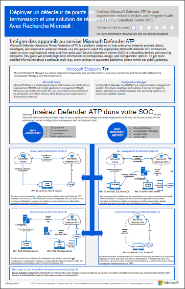

# Planifier le déploiement de Microsoft Defender pour point de terminaison

[!INCLUDE [Microsoft 365 Defender rebranding](../../includes/microsoft-defender.md)]

**S’applique à :**
- [Microsoft Defender pour point de terminaison](https://go.microsoft.com/fwlink/p/?linkid=2154037)
- [Microsoft 365 Defender](https://go.microsoft.com/fwlink/?linkid=2118804)

> Vous souhaitez faire l’expérience de Defender pour point de terminaison ? [Inscrivez-vous pour bénéficier d’un essai gratuit.](https://signup.microsoft.com/create-account/signup?products=7f379fee-c4f9-4278-b0a1-e4c8c2fcdf7e&ru=https://aka.ms/MDEp2OpenTrial?ocid=docs-wdatp-secopsdashboard-abovefoldlink)

Planifiez votre déploiement de Microsoft Defender pour endpoint afin d’optimiser les fonctionnalités de sécurité de la suite et de mieux protéger votre entreprise contre les cybermenaces.

Cette solution fournit des instructions sur l’identification de l’architecture de votre environnement, la sélection du type d’outil de déploiement qui répond le mieux à vos besoins et des instructions sur la configuration des fonctionnalités.

## Étape 1 : identifier l’architecture

Comme nous savons que chaque environnement d’entreprise est unique, nous avons fourni plusieurs options pour vous offrir la flexibilité nécessaire pour choisir le déploiement du service.

Selon votre environnement, certains outils conviennent mieux à certaines architectures.

Utilisez les documents suivants pour sélectionner l’architecture defender pour point de terminaison appropriée qui convient le mieux à votre organisation.

| Item | Description |
|:-----|:-----|
|  [PDF](https://github.com/MicrosoftDocs/microsoft-365-docs/raw/public/microsoft-365/security/defender-endpoint/downloads/mdatp-deployment-strategy.pdf)  \| [Visio](https://github.com/MicrosoftDocs/microsoft-365-docs/raw/public/microsoft-365/security/defender-endpoint/downloads/mdatp-deployment-strategy.vsdx) | Le matériel architectural vous aide à planifier votre déploiement pour les architectures suivantes : <ul><li> Cloud-natif </li><li> Cogestion </li><li> Sur site</li><li>Évaluation et intégration locale</li>

## Étape 2 : Sélectionner la méthode de déploiement

Defender pour le point de terminaison prend en charge divers points de terminaison que vous pouvez intégrer au service.

Le tableau suivant répertorie les points de terminaison pris en charge et l’outil de déploiement correspondant que vous pouvez utiliser pour planifier le déploiement de manière appropriée.

|Point de terminaison|Outil de déploiement|
|---|---|
|**Windows**|[Script local (jusqu’à 10 appareils)](configure-endpoints-script.md)    [Stratégie de groupe](configure-endpoints-gp.md)    [Microsoft Endpoint Manager/ Gestionnaire de périphériques mobiles](configure-endpoints-mdm.md)     [Microsoft Endpoint Configuration Manager](configure-endpoints-sccm.md)   [Scripts VDI](configure-endpoints-vdi.md)   [Intégration à Azure Defender](configure-server-endpoints.md#integration-with-azure-defender)|
|**MacOS**|[Script local](mac-install-manually.md)   [Microsoft Endpoint Manager](mac-install-with-intune.md)   [JamF Pro](mac-install-with-jamf.md)   [Gestion des appareils mobiles](mac-install-with-other-mdm.md)|
|**Serveur Linux**|[Script local](linux-install-manually.md)   [Sondent](linux-install-with-puppet.md)   [Ansible](linux-install-with-ansible.md)|
|**iOS**|[Basée sur l’application](ios-install.md)|
|**Android**|[Microsoft Endpoint Manager](android-intune.md)|

## Étape 3 : Configurer les fonctionnalités

Après l’intégration des points de terminaison, configurez les fonctionnalités de sécurité dans Defender pour endpoint afin que vous pouvez optimiser la protection de sécurité robuste disponible dans la suite. Les fonctionnalités sont les suivantes :

- Détection et réponse du point de terminaison
- Protection de nouvelle génération
- Réduction de la surface d'attaque

## Rubriques connexes

- [Phases de déploiement](deployment-phases.md)
