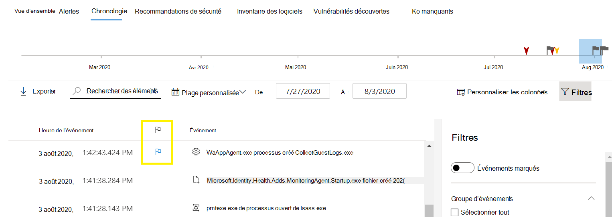
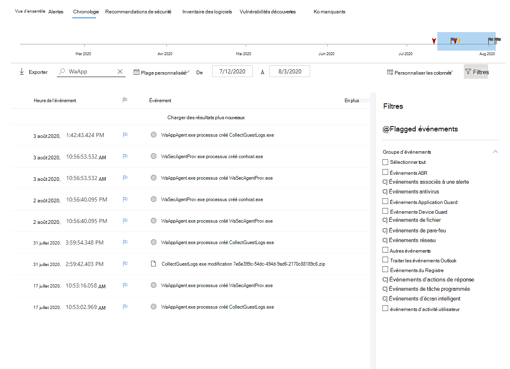

# Indicateurs d’événement de chronologie de l’appareil microsoft Defender pour point de terminaison

[!INCLUDE [Microsoft 365 Defender rebranding](../../includes/microsoft-defender.md)]

**S’applique à :**
- [Microsoft Defender pour point de terminaison](https://go.microsoft.com/fwlink/p/?linkid=2154037)
- [Microsoft 365 Defender](https://go.microsoft.com/fwlink/?linkid=2118804)

> Vous souhaitez faire l’expérience de Defender pour point de terminaison ? [Inscrivez-vous pour bénéficier d’un essai gratuit.](https://www.microsoft.com/microsoft-365/windows/microsoft-defender-atp?ocid=docs-wdatp-assignaccess-abovefoldlink)

Les indicateurs d’événement dans la chronologie de l’appareil Defender for Endpoint vous aident à filtrer et à organiser des événements spécifiques lorsque vous examinez des attaques potentielles.

La chronologie de l’appareil Defender pour point de terminaison fournit une vue chronologique des événements et des alertes associées observés sur un appareil. Cette liste d’événements offre une visibilité complète des événements, fichiers et adresses IP observés sur l’appareil. La liste peut parfois être longue. Les indicateurs d’événement de chronologie de l’appareil vous aident à suivre les événements qui peuvent être liés. 

Une fois la chronologie de l’appareil passée, vous pouvez trier, filtrer et exporter les événements spécifiques que vous avez signalés.

Lors de la navigation dans la chronologie de l’appareil, vous pouvez rechercher et filtrer des événements spécifiques. Vous pouvez définir des indicateurs d’événement en : 

- Mise en surbrillance des événements les plus importants 
- Marquage d’événements nécessitant une profondeur 
- Création d’une nouvelle chronologie de violation

## Indicateur d’un événement
1. Rechercher l’événement que vous souhaitez indicateur
2. Cliquez sur l’icône d’indicateur dans la colonne Indicateur. 

## Afficher les événements marqués  
1. Dans la section **Filtres de** chronologie, activez **les événements marqués.**
2. Cliquez sur **Appliquer**. Seuls les événements marqués sont affichés.
Vous pouvez appliquer des filtres supplémentaires en cliquant sur la barre d’heure. Cela affiche uniquement les événements antérieurs à l’événement marqué.  

