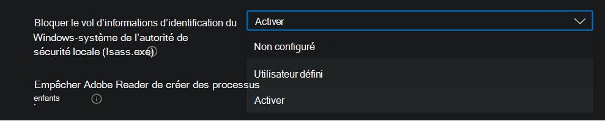

# <a name="enable-attack-surface-reduction-rules"></a>Activer les règles de réduction de la surface d’attaque

**S’applique à :**

- [Microsoft Defender pour point de terminaison Plan 2](https://go.microsoft.com/fwlink/p/?linkid=2154037)
- [Microsoft 365 Defender](https://go.microsoft.com/fwlink/?linkid=2118804)

> [!TIP]
> Vous souhaitez faire l’expérience de Defender for Endpoint ? [Inscrivez-vous pour bénéficier d’un essai gratuit.](https://signup.microsoft.com/create-account/signup?products=7f379fee-c4f9-4278-b0a1-e4c8c2fcdf7e&ru=https://aka.ms/MDEp2OpenTrial?ocid=docs-wdatp-assignaccess-abovefoldlink)

[Les règles de réduction de la surface](attack-surface-reduction.md) d’attaque (règles de réduction de la surface d’attaque) permettent d’éviter les actions que les programmes malveillants abusent souvent pour compromettre les appareils et les réseaux.

## <a name="requirements"></a>Configuration requise

Fonctionnalités de réduction de la surface d’attaque Windows versions

Vous pouvez définir des règles de réduction de la surface d’attaque pour les appareils qui exécutent l’une des éditions et versions suivantes de Windows :

- Windows 10 Professionnel, [version 1709 ou](/windows/whats-new/whats-new-windows-10-version-1709) ultérieure
- Windows 10 Entreprise, [version 1709 ou](/windows/whats-new/whats-new-windows-10-version-1709) ultérieure
- Windows Server, [version 1803 (canal semi-annuel)](/windows-server/get-started/whats-new-in-windows-server-1803) ou version ultérieure
- [Windows Server 2019](/windows-server/get-started-19/whats-new-19)
- [Windows Server 2016](/windows-server/get-started/whats-new-in-windows-server-2016)
- [Windows Server 2012 R2](/windows/win32/srvnodes/what-s-new-for-windows-server-2012-r2)
- Windows Server 2022

Pour utiliser l’ensemble des fonctionnalités des règles de réduction de la surface d’attaque, vous devez :

- Antivirus Windows Defender comme antivirus principal (protection en temps réel)
- [Protection de la distribution cloud](/windows/security/threat-protection/microsoft-defender-antivirus/enable-cloud-protection-microsoft-defender-antivirus) sur (certaines règles l’exigent)
- Windows 10 Entreprise licence E5 ou E3

Bien que les règles de réduction de la surface d’attaque ne nécessitent pas de licence [Windows E5](/windows/deployment/deploy-enterprise-licenses), avec une licence Windows E5, vous disposez de fonctionnalités de gestion avancées, y compris la surveillance, l’analyse et les flux de travail disponibles dans Defender for Endpoint, ainsi que des fonctionnalités de rapport et de configuration dans le portail <a href="https://go.microsoft.com/fwlink/p/?linkid=2077139" target="_blank">Microsoft 365 Defender</a>. Ces fonctionnalités avancées ne sont pas disponibles avec une licence E3, mais vous pouvez toujours utiliser l’Observateur d’événements pour passer en revue les événements de règle de réduction de la surface d’attaque.

Chaque règle asr contient l’un des quatre paramètres ci-après :

- **Non configuré** |  **Disabled**: Disable the ASR rule
- **Bloquer** : activer la règle asr
- **Audit** : évaluer l’impact de la règle asr sur votre organisation si elle est activée
- **Avertir :** activer la règle de la asr, mais autoriser l’utilisateur final à contourner le blocage

> [!IMPORTANT]
> Actuellement, le mode avertissement n’est pas pris en charge pour trois règles de récupération automatique lorsque vous configurez des règles asr dans Microsoft Endpoint Manager (MEM). Pour en savoir plus, consultez [les cas où le mode d’avertissement n’est pas pris en charge](attack-surface-reduction.md#cases-where-warn-mode-is-not-supported).

Nous vous recommandons d’utiliser des règles asr avec une licence Windows E5 (ou une référence SKU de licence similaire) pour tirer parti des fonctionnalités avancées de surveillance et de rapport disponibles dans [Microsoft Defender for Endpoint](microsoft-defender-endpoint.md) (Defender for Endpoint). Toutefois, si vous avez une autre licence, telle que Windows Professional ou Windows E3, qui n’inclut pas de fonctionnalités avancées de surveillance et de rapport, vous pouvez développer vos propres outils de surveillance et de rapport en plus des événements générés à chaque point de terminaison lorsque des règles de la assurance sont déclenchées (par exemple, le forwarding d’événement).

> [!TIP]
> Pour en savoir plus sur Windows gestion des licences, voir Windows 10 [Licences](https://www.microsoft.com/licensing/product-licensing/windows10?activetab=windows10-pivot:primaryr5) en volume et obtenir le guide des licences en [volume pour Windows 10](https://download.microsoft.com/download/2/D/1/2D14FE17-66C2-4D4C-AF73-E122930B60F6/Windows-10-Volume-Licensing-Guide.pdf).

Vous pouvez activer les règles de réduction de la surface d’attaque à l’aide de l’une de ces méthodes :

- [Microsoft Intune](#intune)
- [Gestion des périphériques mobiles (MDM)](#mdm)
- [Microsoft Endpoint Configuration Manager](#microsoft-endpoint-configuration-manager)
- [Stratégie de groupe](#group-policy)
- [PowerShell](#powershell)

Enterprise de niveau supérieur tel qu’Intune ou Microsoft Endpoint Manager est recommandée. Enterprise au niveau de l’entreprise a pour fonction de réécrire les paramètres de stratégie de groupe ou PowerShell en conflit au démarrage.

## <a name="exclude-files-and-folders-from-asr-rules"></a>Exclure des fichiers et des dossiers des règles de la asr

Vous pouvez exclure les fichiers et dossiers de l’évaluation par la plupart des règles de réduction de la surface d’attaque. Cela signifie que même si une règle de astérité détermine que le fichier ou le dossier contient un comportement malveillant, il ne bloquera pas l’exécution du fichier. Cela peut potentiellement permettre à des fichiers non sécurisés de s’exécuter et d’infecter vos appareils.

Vous pouvez également exclure les règles asr du déclenchement en fonction des hages de certificat et de fichier en permettant les indicateurs de certificat et de fichier Defender for Endpoint spécifiés. (Voir [Gérer les indicateurs](manage-indicators.md).)

> [!IMPORTANT]
> L’exclusion de fichiers ou de dossiers peut réduire considérablement la protection fournie par les règles de réduction de la réduction du nombre de messages. Les fichiers exclus sont autorisés à s’exécuter et aucun rapport ou événement n’est enregistré.
> Si les règles de la récupération automatique des données détectent des fichiers qui, selon vous, ne doivent pas être détectés, vous devez d’abord utiliser le [mode audit pour tester la règle](evaluate-attack-surface-reduction.md).

Vous pouvez spécifier des fichiers ou des dossiers individuels (à l’aide de chemins d’accès aux dossiers ou de noms de ressources complets), mais vous ne pouvez pas spécifier les règles à laquelle les exclusions s’appliquent. Une exclusion est appliquée uniquement au démarrage de l’application ou du service exclu. Par exemple, si vous ajoutez une exclusion pour un service de mise à jour déjà en cours d’exécution, le service de mise à jour continue à déclencher des événements jusqu’à ce que le service soit arrêté et redémarré.

Les règles de la asr prise en charge des variables d’environnement et des caractères génériques. Pour plus d’informations sur l’utilisation de caractères génériques, voir [Utiliser des caractères génériques dans les listes d’exclusions](configure-extension-file-exclusions-microsoft-defender-antivirus.md#use-wildcards-in-the-file-name-and-folder-path-or-extension-exclusion-lists) de nom de fichier et de dossier ou d’extension.

## <a name="policy-conflict"></a>Conflit de stratégie

1. Si une stratégie conflictuelle est appliquée via GDM et la stratégie de groupe, le paramètre appliqué à partir de GDM est prioritaire.

2. Les règles de réduction de la surface d’attaque pour les appareils gérés par mem gèrent désormais le comportement de fusion des paramètres de différentes stratégies, afin de créer un sur-ensemble de stratégies pour chaque appareil. Seuls les paramètres qui ne sont pas en conflit sont fusionnés, tandis que ceux en conflit ne sont pas ajoutés au sur-ensemble de règles. Auparavant, si deux stratégies incluaient des conflits pour un seul paramètre, les deux stratégies étaient marquées comme étant en conflit et aucun paramètre de l’un des profils ne serait déployé. Le comportement de fusion des règles de réduction de la surface d’attaque est le suivant :
   - Les règles de réduction de la surface d’attaque des profils suivants sont évaluées pour chaque appareil auquel les règles s’appliquent :
     - Les appareils > stratégie de configuration > profil endpoint protection > **Protection contre les attaques Microsoft Defender** >  [Réduction de la surface de](/mem/intune/protect/endpoint-protection-windows-10#attack-surface-reduction-rules) attaque.
     - Sécurité des points de terminaison > **stratégie de réduction de** >  la surface d’attaque [Règles de réduction de la surface d’attaque](/mem/intune/protect/endpoint-security-asr-policy#devices-managed-by-intune).
     - La sécurité des points de terminaison > les lignes de base de sécurité > règles de réduction de [la surface BaselineAttack](/mem/intune/protect/security-baseline-settings-defender-atp#attack-surface-reduction-rules) de  > **Microsoft Defender ATP**.
   - Paramètres qui n’ont pas de conflits sont ajoutés à un sur-ensemble de stratégies pour l’appareil.
   - Lorsque plusieurs stratégies ont des paramètres en conflit, ces paramètres ne sont pas ajoutés à la stratégie combinée, tandis que les paramètres qui ne sont pas en conflit sont ajoutés à la stratégie de sur-ensemble qui s’applique à un appareil.
   - Seules les configurations de paramètres conflictuelles sont maintenues en arrière.

## <a name="configuration-methods"></a>Méthodes de configuration

Cette section fournit des détails de configuration pour les méthodes de configuration suivantes :

- [Intune](#intune)
- [MEM](#mem)
- [GPM](#mdm)
- [Microsoft Endpoint Configuration Manager](#microsoft-endpoint-configuration-manager)
- [Stratégie de groupe](#group-policy)
- [PowerShell](#powershell)

Les procédures suivantes pour l’activation des règles de la asr. incluent des instructions pour exclure des fichiers et des dossiers.

### <a name="intune"></a>Intune

#### <a name="device-configuration-profiles"></a>Profils de configuration d’appareil

1. Sélectionnez **Profils de configuration d’appareil**\>. Choisissez un profil de protection de point de terminaison existant ou créez-en un. Pour en créer un, sélectionnez **Créer un profil** et entrez des informations pour ce profil. Pour **le type de profil**, **sélectionnez Endpoint Protection**. Si vous avez choisi un profil existant, sélectionnez **Propriétés**, puis **sélectionnez Paramètres**.

2. Dans le **volet de protection des points** de terminaison, **sélectionnez Windows Defender Exploit Guard**, puis sélectionnez **Réduction de la surface d’attaque**. Sélectionnez le paramètre souhaité pour chaque règle de asr.

3. Sous Les **exceptions de réduction de la surface d’attaque**, entrez des fichiers et dossiers individuels. Vous pouvez également sélectionner **Importer** pour importer un fichier CSV qui contient des fichiers et des dossiers à exclure des règles de la asr. Chaque ligne du fichier CSV doit être mise en forme comme suit :

   `C:\folder`, `%ProgramFiles%\folder\file`, `C:\path`

4. **Sélectionnez OK** dans les trois volets de configuration. Sélectionnez **Ensuite Créer** si vous créez un fichier de protection de point de terminaison ou **Enregistrer** si vous modifiez un fichier existant.

#### <a name="endpoint-security-policy"></a>Stratégie de sécurité des points de terminaison**

1. Sélectionnez **Réduction de la surface d’attaque de** \> **sécurité du point de terminaison**. Choisissez une règle de RSA existante ou créez-en une nouvelle. Pour en créer une nouvelle, **sélectionnez Créer** une stratégie et entrez des informations pour ce profil. Pour le **type de profil**, sélectionnez **Règles de réduction de la surface d’attaque**. Si vous avez choisi un profil existant, sélectionnez **Propriétés**, puis **sélectionnez Paramètres**.

2. Dans le **volet Paramètres de configuration** , sélectionnez Réduction de **la surface** d’attaque, puis sélectionnez le paramètre souhaité pour chaque règle de réduction de la surface d’attaque.

3. Sous Liste des **dossiers** supplémentaires qui doivent être protégés, Liste des applications qui ont accès aux dossiers protégés et Exclure les fichiers et les **chemins** d’accès des règles de réduction de la **surface** d’attaque, entrez des fichiers et dossiers individuels. Vous pouvez également sélectionner **Importer** pour importer un fichier CSV qui contient des fichiers et des dossiers à exclure des règles de la asr. Chaque ligne du fichier CSV doit être mise en forme comme suit :

   `C:\folder`, `%ProgramFiles%\folder\file`, `C:\path`

4. Sélectionnez **Suivant** dans les trois volets de configuration,  puis sélectionnez Créer si vous créez une stratégie  ou Enregistrer si vous modifiez une stratégie existante.

### <a name="mem"></a>MEM

Vous pouvez utiliser Microsoft Endpoint Manager OMA-URI (MEM) pour configurer des règles asr personnalisées. La procédure suivante utilise la règle Bloquer [l’abus des pilotes signés vulnérables exploités](attack-surface-reduction-rules-reference.md#block-abuse-of-exploited-vulnerable-signed-drivers) pour l’exemple.

1. Ouvrez le Microsoft Endpoint Manager d’administration de l’utilisateur. Dans le menu **Accueil** , cliquez sur  **Appareils**, sélectionnez **Profils de configuration**, puis cliquez **sur Créer un profil**.

   > [!div class="mx-imgBorder"]
   > 

2. Dans **Créer un profil**, dans les deux listes de listes suivantes, sélectionnez les listes suivantes :

   - Dans **Plateforme**, sélectionnez **Windows 10 et ultérieures**
   - Dans **le type de profil**, **sélectionnez Modèles**

   **Sélectionnez Personnalisé**, **puis Créer.**

   > [!div class="mx-imgBorder"]
   > 

3. L’outil Modèle personnalisé s’ouvre à **l’étape 1 Informations de base**. Dans **1 Informations de** base, dans **Nom**, tapez un nom pour votre modèle, et dans **Description** , vous pouvez taper une description (facultative).

   > [!div class="mx-imgBorder"]
   > 

4. Cliquez sur **Suivant**. Les **paramètres de configuration de l’étape 2 s’ouvrent** . Pour l’OMA-URI Paramètres, cliquez sur **Ajouter**. Deux options s’affichent maintenant : **Ajouter** et **Exporter**.

   > [!div class="mx-imgBorder"]
   > 

5. Cliquez **à nouveau sur** Ajouter. La **ligne Ajouter un OMA-URI Paramètres** s’ouvre. Dans **Ajouter une ligne**, faites les choses suivantes :

   - Dans **Nom**, tapez un nom pour la règle.
   - Dans **Description**, tapez une brève description.
   - Dans **OMA-URI**, tapez ou collez le lien OMA-URI spécifique pour la règle que vous ajoutez. Reportez-vous à la section mdM de cet article pour l’OMA-URI à utiliser pour cet exemple de règle. Pour les GUID de règle de réduction de la surface d’attaque, voir [les descriptions](attack-surface-reduction-rules-reference.md#per-rule-descriptions) par règle dans la rubrique : Règles de réduction de la surface d’attaque.
   - Dans **type de données**, sélectionnez **Chaîne**.
   - Dans **Value**, tapez ou collez la valeur GUID, \= le signe et la valeur State sans espace (_GUID=StateValue_). Où :

     - 0 : Désactiver (désactiver la règle asr)
     - 1 : Bloquer (activer la règle asr)
     - 2 : Audit (évaluer l’impact de la règle asr sur votre organisation si elle est activée)
     - 6 : Avertir (activer la règle asr mais autoriser l’utilisateur final à contourner le blocage)

   > [!div class="mx-imgBorder"]
   > 

6. Sélectionnez **Enregistrer**. **Ajouter des fermetures** de ligne. Dans **Personnalisé**, sélectionnez **Suivant**. À **l’étape 3, les balises d’étendue** sont facultatives. Effectuez l'une des opérations suivantes :

   - **Sélectionnez Sélectionner des balises d’étendue**, sélectionnez la balise d’étendue (facultative), puis sélectionnez **Suivant**.
   - Ou sélectionnez **Suivant**

7. À **l’étape 4 Affectations**, dans Groupes **inclus, pour** les groupes que vous souhaitez que cette règle applique, sélectionnez l’une des options suivantes :

   - **Ajouter des groupes**
   - **Ajouter tous les utilisateurs**
   - **Ajouter tous les appareils**

   > [!div class="mx-imgBorder"]
   > 

8. Dans **les groupes exclus**, sélectionnez les groupes que vous souhaitez exclure de cette règle, puis sélectionnez **Suivant**.

9. À **l’étape 5, règles d’applicabilité** pour les paramètres suivants, appliquez les étapes suivantes :

   - Dans **Règle**, sélectionnez **Attribuer un profil si** ou **n’affectez pas de profil si**
   - Dans **Propriété**, sélectionnez la propriété à laquelle vous souhaitez que cette règle s’applique
   - Dans **Valeur**, entrez la valeur applicable ou la plage de valeurs

   > [!div class="mx-imgBorder"]
   > 

10. Sélectionnez **Suivant**. À **l’étape 6 Révision + création**, examinez les paramètres et les informations que vous avez sélectionnés et entrés, puis sélectionnez **Créer**.

    > [!div class="mx-imgBorder"]
    > 

    > [!NOTE]
    > Les règles sont actives et actives en quelques minutes.

> [!NOTE]
> Gestion des conflits :
>
> Si vous affectez à un appareil deux stratégies DER différentes, la façon dont les conflits sont gérés est des règles qui sont affectées à différents états, il n’y a aucune gestion des conflits en place et le résultat est une erreur.
>
> Les règles non conflictuelles n’entraînent pas d’erreur et la règle est appliquée correctement. Résultat : la première règle est appliquée et les règles non conflictuelles suivantes sont fusionnées dans la stratégie.

### <a name="mdm"></a>GPM

Utilisez le fournisseur de services de configuration [./Vendor/MSFT/Policy/Config/Defender/AttackSurfaceReductionRules](/windows/client-management/mdm/policy-csp-defender#defender-attacksurfacereductionrules) (CSP) pour activer et définir individuellement le mode pour chaque règle.

Voici un exemple à référence, à l’aide des valeurs GUID de référence des règles de [réduction de la surface d’attaque](attack-surface-reduction-rules-reference.md).

`OMA-URI path: ./Vendor/MSFT/Policy/Config/Defender/AttackSurfaceReductionRules`

`Value: 75668c1f-73b5-4cf0-bb93-3ecf5cb7cc84=2|3b576869-a4ec-4529-8536-b80a7769e899=1|d4f940ab-401b-4efc-aadc-ad5f3c50688a=2|d3e037e1-3eb8-44c8-a917-57927947596d=1|5beb7efe-fd9a-4556-801d-275e5ffc04cc=0|be9ba2d9-53ea-4cdc-84e5-9b1eeee46550=1`

Les valeurs à activer (bloquer), désactiver, avertir ou activer en mode audit sont :

- 0 : Désactiver (désactiver la règle asr)
- 1 : Bloquer (activer la règle asr)
- 2 : Audit (évaluer l’impact de la règle asr sur votre organisation si elle est activée)
- 6 : Avertir (activer la règle asr mais autoriser l’utilisateur final à contourner le blocage). Le mode Avertissement est disponible pour la plupart des règles de la asr.

Utilisez le fournisseur de services de configuration [./Vendor/MSFT/Policy/Config/Defender/AttackSurfaceReductionOnlyExclusions](/windows/client-management/mdm/policy-csp-defender#defender-attacksurfacereductiononlyexclusions) (CSP) pour ajouter des exclusions.

Exemple :

`OMA-URI path: ./Vendor/MSFT/Policy/Config/Defender/AttackSurfaceReductionOnlyExclusions`

`Value: c:\path|e:\path|c:\Exclusions.exe`

> [!NOTE]
> N’oubliez pas d’entrer des valeurs OMA-URI sans espaces.

### <a name="microsoft-endpoint-configuration-manager"></a>Microsoft Endpoint Configuration Manager

1. In Microsoft Endpoint Configuration Manager, go to **Assets and Compliance** \> **Endpoint Protection** \> **Windows Defender Exploit Guard**.

2. Sélectionnez **Home** \> **Create Exploit Guard Policy**.

3. Entrez un nom et une description, sélectionnez **Réduction de la surface** d’attaque, puis sélectionnez **Suivant**.

4. Choisissez les règles qui bloqueront ou auditeront les actions, puis sélectionnez **Suivant**.

5. Examinez les paramètres et **sélectionnez Suivant** pour créer la stratégie.

6. Une fois la stratégie créée, sélectionnez **Fermer**.

### <a name="group-policy"></a>Stratégie de groupe

> [!WARNING]
> Si vous gérez vos ordinateurs et périphériques avec Intune, Configuration Manager ou toute autre plateforme de gestion au niveau de l’entreprise, le logiciel de gestion risque d’éviter les paramètres de stratégie de groupe en conflit au démarrage.

1. Sur votre ordinateur de gestion des stratégies de groupe, ouvrez la [Console de gestion des stratégies de groupe](https://technet.microsoft.com/library/cc731212.aspx), faites un clic droit sur l’objet de stratégie de groupe à configurer, puis sélectionnez **Modifier**.

2. Dans l’**Éditeur de gestion des stratégies de groupe**, accédez à **Configuration ordinateur**, puis sélectionnez **Modèles d’administration**.

3. Développez l’arborescence **Windows composants Antivirus Microsoft Defender** \>  \> **Protection contre les attaques Microsoft Defender réduction de la surface** **d’attaque**\>.

4. **Sélectionnez Configurer les règles de réduction de la surface d’attaque** et **Activer**. Vous pouvez ensuite définir l’état individuel de chaque règle dans la section Options. Sélectionnez **Afficher...** et entrez l’ID de  règle dans la colonne Nom de la valeur et  l’état choisi dans la colonne Valeur comme suit :

   - 0 : Désactiver (désactiver la règle asr)
   - 1 : Bloquer (activer la règle asr)
   - 2 : Audit (évaluer l’impact de la règle asr sur votre organisation si elle est activée)
   - 6 : Avertir (activer la règle asr mais autoriser l’utilisateur final à contourner le blocage)

   :::image type="content" source="images/asr-rules-gp.png" alt-text="Règles asr dans la stratégie de groupe.":::

5. Pour exclure des fichiers et des dossiers des règles de réduction de la surface d’attaque, sélectionnez le paramètre Exclure les fichiers et les chemins d’accès des règles de réduction de la **surface** d’attaque et définissez l’option **sur Activé**. **Sélectionnez Afficher** et entrez chaque fichier ou dossier dans la **colonne Nom de la** valeur. Entrez **0 dans** la colonne **Valeur** pour chaque élément.

   > [!WARNING]
   > N’utilisez pas de guillemets, car ils  ne sont pas pris en charge pour la colonne Nom de la valeur ou la **colonne** Valeur.

### <a name="powershell"></a>PowerShell

> [!WARNING]
> Si vous gérez vos ordinateurs et appareils avec Intune, Configuration Manager ou une autre plateforme de gestion au niveau de l’entreprise, le logiciel de gestion risque d’éviter les paramètres PowerShell en conflit au démarrage. Pour permettre aux utilisateurs de définir la valeur à l’aide de PowerShell, utilisez l’option « Défini par l’utilisateur » pour la règle dans la plateforme de gestion.
> « Défini par l’utilisateur » permet à un utilisateur administrateur local de configurer la règle.
> Le paramètre d’option Défini par l’utilisateur est illustré dans la figure suivante.

> [!div class="mx-imgBorder"]
> 

1. **Tapez powershell** dans le menu Démarrer, cliquez avec le **bouton droit sur Windows PowerShell** puis **sélectionnez Exécuter en tant qu’administrateur**.

2. Tapez l’une des cmdlets suivantes. (Reportez-vous à [la référence des](attack-surface-reduction-rules-reference.md) règles de réduction de la surface d’attaque pour plus d’informations, telles que l’ID de règle.)

    ```PowerShell
    Set-MpPreference -AttackSurfaceReductionRules_Ids <rule ID> -AttackSurfaceReductionRules_Actions Enabled
    ```

    Pour activer les règles asr en mode audit, utilisez l’cmdlet suivante :

    ```PowerShell
    Add-MpPreference -AttackSurfaceReductionRules_Ids <rule ID> -AttackSurfaceReductionRules_Actions AuditMode
    ```

    Pour activer les règles asr en mode d’avertissement, utilisez l';

    ```PowerShell
    Add-MpPreference -AttackSurfaceReductionRules_Ids <rule ID> -AttackSurfaceReductionRules_Actions Warn
    ```

    Pour activer l’utilisation abusive des pilotes signés vulnérables exploités, utilisez l’cmdlet suivante :

   ```PowerShell
   Add-MpPreference -AttackSurfaceReductionRules_Ids 56a863a9-875e-4185-98a7-b882c64b5ce5 -AttackSurfaceReductionRules_Actions Enabled
   ```

    Pour désactiver les règles de asr, utilisez l’cmdlet suivante :

    ```PowerShell
    Add-MpPreference -AttackSurfaceReductionRules_Ids <rule ID> -AttackSurfaceReductionRules_Actions Disabled
    ```

    > [!IMPORTANT]
    > Vous devez spécifier l’état individuellement pour chaque règle, mais vous pouvez combiner des règles et des états dans une liste séparée par des virgules.
    >
    > Dans l’exemple suivant, les deux premières règles sont activées, la troisième est désactivée et la quatrième règle est activée en mode audit :
    >
    > ```PowerShell
    > Set-MpPreference -AttackSurfaceReductionRules_Ids <rule ID 1>,<rule ID 2>,<rule ID 3>,<rule ID 4> -AttackSurfaceReductionRules_Actions Enabled, Enabled, Disabled, AuditMode
    > ```

    Vous pouvez également utiliser le verbe `Add-MpPreference` PowerShell pour ajouter de nouvelles règles à la liste existante.

    > [!WARNING]
    > `Set-MpPreference` est toujours en cours de réécriture de l’ensemble de règles existant. Si vous souhaitez l’ajouter à l’ensemble existant, utilisez-le `Add-MpPreference` à la place.
    > Vous pouvez obtenir une liste de règles et leur état actuel à l’aide de `Get-MpPreference`.

3. Pour exclure des fichiers et des dossiers des règles de la asr, utilisez l’cmdlet suivante :

    ```PowerShell
    Add-MpPreference -AttackSurfaceReductionOnlyExclusions "<fully qualified path or resource>"
    ```

    Continuez à l’utiliser `Add-MpPreference -AttackSurfaceReductionOnlyExclusions` pour ajouter d’autres fichiers et dossiers à la liste.

    > [!IMPORTANT]
    > Permet `Add-MpPreference` d’ajouter ou d’ajouter des applications à la liste. L’utilisation `Set-MpPreference` de la cmdlet va supprimer la liste existante.

## <a name="related-articles"></a>Articles connexes

- [Référence des règles de réduction de la surface d’attaque](attack-surface-reduction-rules-reference.md)
- [Évaluer la réduction de la surface d’attaque](evaluate-attack-surface-reduction.md)
- [FAQ sur la réduction de la surface d’attaque](attack-surface-reduction.md)
