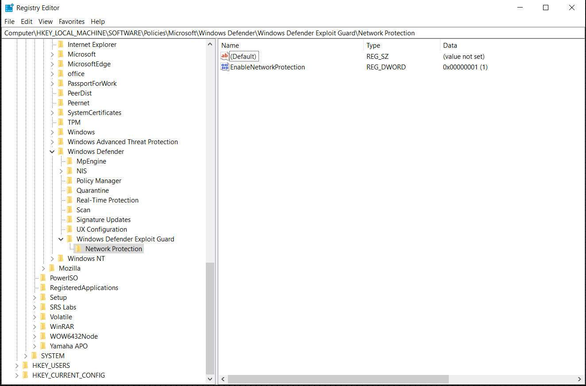

# <a name="turn-on-network-protection"></a>Activer la protection du réseau

[!INCLUDE [Microsoft 365 Defender rebranding](../../includes/microsoft-defender.md)]

**S’applique à :**
- [Microsoft Defender pour point de terminaison](https://go.microsoft.com/fwlink/p/?linkid=2154037)
- [Microsoft 365 Defender](https://go.microsoft.com/fwlink/?linkid=2118804)

> [!TIP]
> Vous souhaitez faire l’expérience de Defender for Endpoint ? [Inscrivez-vous pour bénéficier d’un essai gratuit.](https://signup.microsoft.com/create-account/signup?products=7f379fee-c4f9-4278-b0a1-e4c8c2fcdf7e&ru=https://aka.ms/MDEp2OpenTrial?ocid=docs-wdatp-assignaccess-abovefoldlink)

[La protection du](network-protection.md) réseau permet d’empêcher les employés d’utiliser n’importe quelle application pour accéder à des domaines dangereux qui peuvent héberger des tentatives d’hameçonnage, des attaques et d’autres contenus malveillants sur Internet. Vous pouvez [auditer la protection réseau](evaluate-network-protection.md) dans un environnement de test pour afficher les applications qui seraient bloquées avant de l’activer.

[En savoir plus sur les options de configuration du filtrage réseau](/mem/intune/protect/endpoint-protection-windows-10#network-filtering)

## <a name="check-if-network-protection-is-enabled"></a>Vérifier si la protection réseau est activée

Vérifiez si la protection réseau a été activée sur un appareil local à l’aide de l’éditeur du Registre.

1. Sélectionnez **le bouton** Démarrer dans la barre des tâches et tapez **regedit** pour ouvrir l’éditeur du Registre

2. Choisir **HKEY_LOCAL_MACHINE** dans le menu latéral

3. Naviguez dans les menus imbrmbrés pour accéder aux stratégies **LOGICIELLEs**  >    >  **Microsoft**  >    >  **Windows Defender Windows Defender Exploit Guard** Network  >  **Protection**

4. Sélectionnez **EnableNetworkProtection pour** voir l’état actuel de la protection réseau sur l’appareil

   - 0 ou **Off**
   - 1 ou **Sur**
   - 2 ou **mode Audit**

    

## <a name="enable-network-protection"></a>Activer la protection réseau

Activez la protection réseau à l’aide de l’une des méthodes ci-après :

- [PowerShell](#powershell)
- [Gestion des périphériques mobiles (MDM)](#mobile-device-management-mdm)
- [Microsoft Endpoint Manager / Intune](#microsoft-endpoint-manager-formerly-intune)
- [Stratégie de groupe](#group-policy)

### <a name="powershell"></a>PowerShell

1. Tapez **powershell** dans la menu Démarrer, cliquez avec le bouton **droit** sur Windows PowerShell puis **sélectionnez Exécuter en tant qu’administrateur**
2. Entrez l’cmdlet suivante :

    ```PowerShell
    Set-MpPreference -EnableNetworkProtection Enabled
    ```

3. Facultatif : activez la fonctionnalité en mode audit à l’aide de l’cmdlet suivante :

    ```PowerShell
    Set-MpPreference -EnableNetworkProtection AuditMode
    ```

    À `Disabled` utiliser à la place ou pour désactiver la `AuditMode` `Enabled` fonctionnalité.

### <a name="mobile-device-management-mdm"></a>Gestion des périphériques mobiles (GPM)

Utilisez le fournisseur de services de configuration [./Vendor/MSFT/Policy/Config/Defender/EnableNetworkProtection](/windows/client-management/mdm/policy-csp-defender) (CSP) pour activer ou désactiver la protection réseau ou activer le mode audit.

### <a name="microsoft-endpoint-manager-formerly-intune"></a>Microsoft Endpoint Manager (anciennement Intune)

1. Connectez-vous au Microsoft Endpoint Manager admin center (https://endpoint.microsoft.com)

2. Créer ou modifier un profil [de configuration de la protection des points de terminaison](/mem/intune/protect/endpoint-protection-configure)

3. Sous **Configuration Paramètres** dans le flux de profil, Protection contre les attaques Microsoft Defender Protection réseau de filtrage réseau  >    >    >  **Activer** ou **Auditer uniquement**

### <a name="group-policy"></a>Stratégie de groupe

Utilisez la procédure suivante pour activer la protection réseau sur des ordinateurs joints à un domaine ou sur un ordinateur autonome.

1. Sur un ordinateur autonome,  sélectionnez Démarrer, puis tapez et sélectionnez **Modifier la stratégie de groupe.**

    *-Or-*

    Sur un ordinateur de gestion de stratégie de groupe joint à un domaine, ouvrez la [Console](https://technet.microsoft.com/library/cc731212.aspx)de gestion des stratégies de groupe, cliquez avec le bouton droit sur l’objet de stratégie de groupe que vous souhaitez configurer et sélectionnez **Modifier.**

2. Dans l’**Éditeur de gestion des stratégies de groupe**, accédez à **Configuration ordinateur**, puis sélectionnez **Modèles d’administration**.

3. Développez l’arborescence **Windows composants**  >  **Antivirus Microsoft Defender**  >  **Windows Defender Exploit Guard** Network  >  **Protection**.

   > [!NOTE]
   > Sur les versions antérieures Windows, le chemin d’accès de la stratégie de groupe peut dire « Antivirus Windows Defender » au lieu de « Antivirus Microsoft Defender ».

4. Double-cliquez sur le paramètre Empêcher les utilisateurs **et les applications d’accéder** au paramètre sites web dangereux et définissez l’option sur **Activé.** Dans la section Options, vous devez spécifier l’une des options suivantes :
    - **Bloquer** : les utilisateurs ne peuvent pas accéder aux domaines et aux adresses IP malveillants
    - **Désactiver (par défaut)** : la fonctionnalité de protection réseau ne fonctionne pas. Les utilisateurs ne seront pas bloqués pour accéder aux domaines malveillants
    - **Mode audit** : si un utilisateur visite une adresse IP ou un domaine malveillant, un événement est enregistré dans le journal Windows’événements malveillants. Toutefois, l’utilisateur ne sera pas empêché de visiter l’adresse.

> [!IMPORTANT]
> Pour activer entièrement la protection réseau,  vous devez définir  l’option stratégie de groupe sur Activé et également sélectionner Bloquer dans le menu déroulant Options.

Confirmez que la protection réseau est activée sur un ordinateur local à l’aide de l’éditeur du Registre :

1. Sélectionnez **Démarrer** et **tapez regedit** pour ouvrir **l’Éditeur du Registre.**

2. Accédez à **HKEY_LOCAL_MACHINE\SOFTWARE\Policies\Microsoft\Windows Defender\Windows Defender Exploit Guard\Network Protection\EnableNetworkProtection**

3. Sélectionnez **EnableNetworkProtection et** confirmez la valeur :
   - 0=Off
   - 1=Sur
   - 2=Audit

## <a name="see-also"></a>Voir aussi

- [Protection du réseau](network-protection.md)

- [Protection du réseau et protocole d’handshake triple TCP](network-protection.md#network-protection-and-the-tcp-three-way-handshake)

- [Évaluer la protection du réseau](evaluate-network-protection.md)

- [Résoudre les problèmes de protection du réseau](troubleshoot-np.md)
