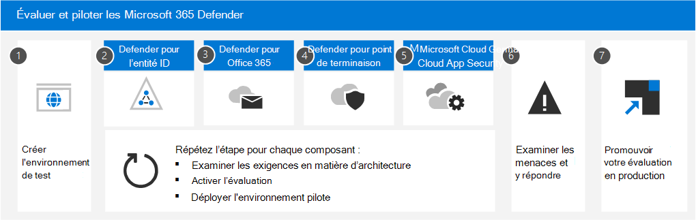

# Évaluation de Microsoft 365 Defender vue d’ensemble du point de terminaison

**S’applique à :**

- Microsoft 365 Defender

Les évaluations complètes des produits de sécurité peuvent être un processus complexe, nécessitant des configurations d’environnement et d’appareil fastidieuses avant qu’une simulation d’attaque de bout en bout puisse réellement être effectuée. L’ajout de la complexité est la difficulté de suivre l’endroit où les activités de simulation, les alertes et les résultats sont reflétés au cours de l’évaluation.

Le laboratoire d’évaluation de Microsoft Defender for Endpoint est conçu pour éliminer la complexité de la configuration des appareils et de l’environnement. Cela vous permet de :

- Se concentrer sur l’évaluation des fonctionnalités de la plateforme
- Exécuter des simulations
- Voir les fonctionnalités de prévention, de détection et de correction en action
 

> [!VIDEO https://www.microsoft.com/videoplayer/embed/RE4woug]

À l’aide de l’expérience de mise en place simplifiée, vous pouvez vous concentrer sur l’exécution de vos propres scénarios de test et des simulations pré-réalisées pour voir les résultats de Defender for Endpoint.

Vous disposez d’un accès complet aux fonctionnalités puissantes de la plateforme, telles que les enquêtes automatisées, le recherche avancée et l’analyse des menaces, ce qui vous permet de tester la pile de protection complète de Defender for Endpoint.

Vous pouvez ajouter des appareils Windows 10, Windows Server 2019 ou Windows Server 2022 qui sont pré-configurés pour avoir les dernières versions du système d’exploitation et les composants de sécurité en place, ainsi que Office 2019 Standard installé.

Vous pouvez également installer des simulateurs de menaces. Defender for Endpoint s’est associé à des plateformes de simulation de menaces de pointe pour vous aider à tester les fonctionnalités de Defender for Endpoint sans avoir à quitter le portail.

 Installez votre simulateur préféré, exécutez des scénarios dans le laboratoire d’évaluation, puis voyez instantanément les résultats de la plateforme. Cette fonctionnalité est disponible sans frais supplémentaires. Vous aurez également un accès pratique à un large éventail de simulations, que vous pouvez accéder et exécuter à partir du catalogue de simulations.
