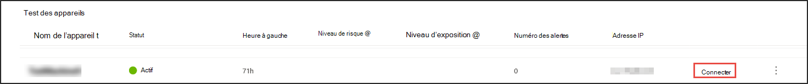
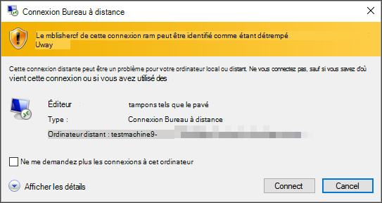
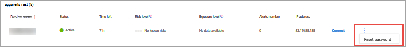
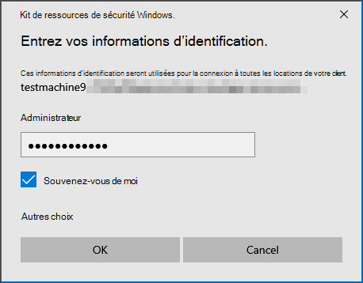
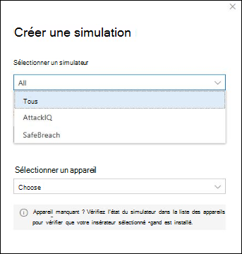
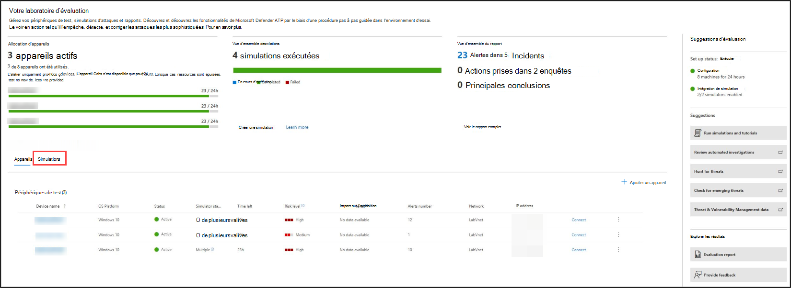

# Expérience microsoft Defender pour le point de terminaison (MDE) par le biais d’attaques simulées

**S’applique à :**
- [Microsoft Defender for Endpoint Plan 2](https://go.microsoft.com/fwlink/?linkid=2154037)

> [!TIP]
>
> - Découvrez les dernières améliorations apportées à Microsoft Defender pour le point de terminaison : Nouveautés [de Defender pour Point de terminaison .](https://cloudblogs.microsoft.com/microsoftsecure/2018/11/15/whats-new-in-windows-defender-atp/)
> - Defender pour le point de terminaison a démontré les fonctionnalités d’optique et de détection de pointe du secteur dans l’évaluation MITRE récente. Lire : [Informations tirées de l’évaluation de MITRE basée sur ATT&CK](https://cloudblogs.microsoft.com/microsoftsecure/2018/12/03/insights-from-the-mitre-attack-based-evaluation-of-windows-defender-atp/).

Vous souhaitez peut-être faire l’expérience de Defender for Endpoint avant d’intégrer plusieurs appareils au service. Pour ce faire, vous pouvez exécuter des simulations d’attaque contrôlée sur quelques périphériques de test. Après avoir réalisé les attaques simulées, vous pouvez examiner la façon dont Defender pour le point de terminaison fait face à des activités malveillantes et découvrir comment elle permet une réponse efficace.

## Avant de commencer

Pour exécuter l’une des simulations fournies, vous avez besoin d’au moins [un appareil intégré.](onboard-configure.md)

Lisez le document pas à pas fourni avec chaque scénario d’attaque. Chaque document inclut les exigences en matière de système d’exploitation et d’application, ainsi que des instructions détaillées propres à un scénario d’attaque.

## Exécuter une simulation

1. Dans **les** \> **simulations d'& didacticiels,** sélectionnez les scénarios d’attaque disponibles que vous souhaitez simuler :

   - **Scénario 1 : le document abandonne la porte dérobée** : simule la remise d’un document leurre d’ingénierie sociale. Le document lance une porte dérobée spécialement conçue pour donner le contrôle aux attaquants.

   - **Scénario 2** : script PowerShell dans une attaque sans fichier : simule une attaque sans fichier qui s’appuie sur PowerShell, présentant la réduction de la surface d’attaque et la détection de l’apprentissage de l’activité de mémoire malveillante.

   - **Scénario 3 : réponse** automatisée aux incidents : déclenche une enquête automatisée, qui recherche et remédie automatiquement aux artefacts de violation pour mettre à l’échelle votre capacité de réponse aux incidents.

2. Téléchargez et lisez le document de la walkthrough correspondant fourni avec votre scénario sélectionné.

3. Téléchargez le fichier de simulation ou  copiez le script de simulation en naviguant vers l’aide \> **simulations & didacticiels**. Vous pouvez choisir de télécharger le fichier ou le script sur le périphérique de test, mais ce n’est pas obligatoire.

4. Exécutez le fichier ou le script de simulation sur le périphérique de test comme indiqué dans le document pas à pas.

> [!NOTE]
> Les fichiers ou les scripts de simulation imitent l’activité d’attaque, mais sont en réalité anodins et ne compromettent pas ou ne compromettent pas le périphérique de test.

## TEXTE DE LA RUBRIQUE DE REMPLACEMENT

## Simuler des scénarios d’attaque

Utilisez les périphériques de test pour exécuter vos propres simulations d’attaques en vous y connectant.

Vous pouvez simuler des scénarios d’attaque à l’aide des outils suivants :

- Scénarios d’attaque « Faire [vous-même »](https://securitycenter.windows.com/tutorials)
- Simulateurs de menaces

Vous pouvez également utiliser la recherche [avancée pour](advanced-hunting-overview.md) interroger les données et l’analyse des [menaces](threat-analytics.md) afin d’afficher des rapports sur les menaces émergentes.

### Scénarios d’attaques do-it-yourself

Si vous recherchez une simulation pré-réalisée, vous pouvez utiliser nos [scénarios](https://securitycenter.windows.com/tutorials)d’attaque « Faites-le vous-même ». Ces scripts sont sûrs, documentés et faciles à utiliser. Ces scénarios reflèteront les fonctionnalités de Defender for Endpoint et vous feront découvrir l’expérience d’examen.

> [!NOTE]
> La connexion aux périphériques de test est effectuée à l’aide de RDP. Assurez-vous que vos paramètres de pare-feu autorisent les connexions RDP.

1. Connecter sur votre appareil et exécutez une simulation d’attaque en **sélectionnant Connecter**.

    

2. Enregistrez le fichier RDP et lancez-le en sélectionnant **Connecter**.

    

    > [!NOTE]
    > Si vous n’avez pas de copie du mot de passe enregistrée lors  de la configuration initiale, vous pouvez réinitialiser le mot de passe en sélectionnant Réinitialiser le mot de passe dans le menu :
    >
    > 
    >
    > L’appareil change son état en « Exécution de la réinitialisation du mot de passe », puis votre nouveau mot de passe vous sera présenté dans quelques minutes.

3. Entrez le mot de passe qui a été affiché lors de l’étape de création de l’appareil.

   

4. Exécutez des simulations d’attaques par vous-même sur l’appareil.

### Scénarios de simulateur de menaces

Si vous avez choisi d’installer l’un des simulateurs de menaces pris en charge pendant l’installation de l’atelier, vous pouvez exécuter les simulations intégrées sur les périphériques de laboratoire d’évaluation.

L’exécution de simulations de menaces à l’aide de plateformes tierces est un bon moyen d’évaluer microsoft Defender pour les fonctionnalités de point de terminaison dans les limites d’un environnement de laboratoire.

> [!NOTE]
> Avant d’exécuter des simulations, assurez-vous que les conditions suivantes sont remplies :
>
> - Les appareils doivent être ajoutés au laboratoire d’évaluation
> - Les simulateurs de menaces doivent être installés dans le laboratoire d’évaluation

1. Dans le portail, **sélectionnez Créer une simulation.**

2. Sélectionnez un simulateur de menaces.

    

3. Choisissez une simulation ou parcourez la galerie de simulations pour parcourir les simulations disponibles.

   Vous pouvez obtenir la galerie de simulations à partir de :

   - Tableau de bord d’évaluation principal dans la **vignette Vue d’ensemble simulations** ou
   - En naviguant à partir  du volet de navigation Évaluation et didacticiels \> **Simulation & didacticiels,** puis sélectionnez Le catalogue **simulations**.

4. Sélectionnez les appareils sur lequel vous souhaitez exécuter la simulation.

5. Sélectionnez **Créer une simulation.**

6. Affichez la progression d’une simulation en sélectionnant **l’onglet Simulations.** Afficher l’état de simulation, les alertes actives et d’autres détails.

    

Après avoir lancé vos simulations, nous vous encourageons à parcourir la barre de progression de l’atelier et à explorer Microsoft Defender pour le point de terminaison qui a déclenché une investigation et une correction **automatisées.** Consultez les preuves collectées et analysées par la fonctionnalité.

Recherchez des preuves d’attaque par le biais d’un recherche avancée à l’aide du langage de requête enrichi et de la télémétrie brute, puis consultez certaines menaces mondiales documentées dans l’analyse des menaces.
