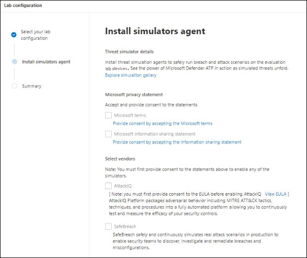

# Laboratoire d'évaluation de Microsoft Defender for Endpoint

[!INCLUDE [Microsoft 365 Defender rebranding](../../includes/microsoft-defender.md)]

**S’applique à :**
- [Microsoft Defender pour point de terminaison](https://go.microsoft.com/fwlink/?linkid=2154037)
- [Microsoft 365 Defender](https://go.microsoft.com/fwlink/?linkid=2118804)

>Vous souhaitez découvrir Microsoft Defender pour le point de terminaison ? [Inscrivez-vous à un essai gratuit.](https://www.microsoft.com/microsoft-365/windows/microsoft-defender-atp?ocid=docs-wdatp-enablesiem-abovefoldlink)

La conduite d'une évaluation complète du produit de sécurité peut être un processus complexe nécessitant une configuration fastidieuse de l'environnement et de l'appareil avant qu'une simulation d'attaque de bout en bout puisse réellement être effectuée. L'ajout de la complexité est la difficulté de suivre l'endroit où les activités de simulation, les alertes et les résultats sont reflétés au cours de l'évaluation.

Le laboratoire d'évaluation de Microsoft Defender pour points de terminaison est conçu pour éliminer la complexité de la configuration des appareils et de l'environnement afin de pouvoir vous concentrer sur l'évaluation des fonctionnalités de la plateforme, l'exécution de simulations et l'utilisation des fonctionnalités de prévention, de détection et de correction.

> [!VIDEO https://www.microsoft.com/en-us/videoplayer/embed/RE4qLUM]

Grâce à l'expérience de mise en place simplifiée, vous pouvez vous concentrer sur l'exécution de vos propres scénarios de test et des simulations pré-réalisées pour voir les résultats de Defender for Endpoint. 

Vous disposez d'un accès complet aux fonctionnalités puissantes de la plateforme, telles que les enquêtes automatisées, le recherche avancée et l'analyse des menaces, ce qui vous permet de tester la pile de protection complète de Defender for Endpoint. 

Vous pouvez ajouter des appareils Windows 10 ou Windows Server 2019 pré-configurés pour avoir les dernières versions du système d'exploitation et les composants de sécurité en place, ainsi qu'Office 2019 Standard installé.

Vous pouvez également installer des simulateurs de menaces. Defender for Endpoint s'est associé à des plateformes de simulation de menaces de pointe pour vous aider à tester les fonctionnalités de Defender for Endpoint sans avoir à quitter le portail.

 Installez votre simulateur préféré, exécutez des scénarios dans le laboratoire d'évaluation et voyez instantanément les résultats de la plateforme, le tout disponible sans frais supplémentaires. Vous aurez également un accès pratique à un large éventail de simulations que vous pouvez accéder et exécuter à partir du catalogue de simulations.
    

## Avant de commencer
Vous devez satisfaire  aux exigences de licence ou avoir accès en version d'évaluation à Microsoft Defender for Endpoint pour accéder au laboratoire d'évaluation.

Vous devez avoir **les autorisations Gérer les paramètres** de sécurité pour :
- Créer l'atelier
- Créer des appareils
- Réinitialiser le mot de passe
- Créer des simulations 
 
Si vous avez activé le contrôle d'accès basé sur un rôle (RBAC) et créé au moins un groupe d'ordinateurs, les utilisateurs doivent avoir accès à tous les groupes d'ordinateurs.

Pour plus d'informations, voir [Créer et gérer des rôles.](user-roles.md)

Vous souhaitez découvrir Microsoft Defender pour le point de terminaison ? [Inscrivez-vous à un essai gratuit.](https://www.microsoft.com/microsoft-365/windows/microsoft-defender-atp?ocid=docs-wdatp-main-abovefoldlink)

## Mise en place de l'atelier
Vous pouvez accéder à l'atelier à partir du menu. Dans le menu de navigation, sélectionnez **Évaluation et didacticiels > laboratoire d'évaluation.**

>[!NOTE]
>- Selon le type de structure d'environnement que vous sélectionnez, les appareils seront disponibles pour le nombre d'heures spécifié à partir du jour de l'activation.
>- Chaque environnement est mis en service avec un ensemble limité de périphériques de test. Lorsque vous avez utilisé les appareils mis en service, aucun nouvel appareil n'est fourni. Un appareil supprimé n'actualise pas le nombre de périphériques de test disponibles.
>- Vous ne pouvez plus utiliser l'atelier lorsque les ressources ont été utilisées. Il ne réinitialise ni ne s'actualise.
>- Il est conseillé d'utiliser les ressources avec soin. Les ressources de l'atelier sont limitées. Ils ne seront pas réinitialisés ni actualisés. 

Vous avez déjà un atelier ? Veillez à activer les nouveaux simulateurs de menaces et à avoir des appareils actifs.

## Configurer le laboratoire d'évaluation

1. Dans le volet de navigation, sélectionnez **Évaluation et didacticiels**  >  **Laboratoire** d'évaluation, puis sélectionnez **Laboratoire d'installation.**

    

2. En fonction de vos besoins d'évaluation, vous pouvez choisir de configurer un environnement avec moins d'appareils pendant une période plus longue ou plus d'appareils sur une période plus courte. Sélectionnez votre configuration d'atelier préférée, puis **sélectionnez Suivant.**

     

3. (Facultatif) Vous pouvez choisir d'installer des simulateurs de menaces dans l'atelier. 

    

    >[!IMPORTANT]
    >Vous devez d'abord accepter et donner votre consentement aux conditions générales et aux déclarations de partage d'informations. 

4. Sélectionnez l'agent de simulation de menace que vous souhaitez utiliser et entrez vos détails. Vous pouvez également choisir d'installer des simulateurs de menaces ultérieurement. Si vous choisissez d'installer des agents de simulation de menace lors de l'installation de l'atelier, vous profitez de leur installation pratique sur les appareils que vous ajoutez.  
    
    

5.  Examinez le résumé et sélectionnez **Le laboratoire d'installation.**  

Une fois le processus de configuration de l'atelier terminé, vous pouvez ajouter des appareils et exécuter des simulations. 

## Ajouter des appareils
Lorsque vous ajoutez un appareil à votre environnement, Defender pour le point de terminaison configure un appareil bien configuré avec des détails de connexion. Vous pouvez ajouter des appareils Windows 10 ou Windows Server 2019.

L'appareil sera configuré avec la version la plus à jour du système d'exploitation et d'Office 2019 Standard, ainsi que d'autres applications telles que Java, Python et SysIntenals. 

   >[!TIP]
   > Vous avez besoin de plus d'appareils dans votre atelier ? Envoyez un ticket de support pour que votre demande soit examinée par l'équipe Defender for Endpoint. 

Si vous avez choisi d'ajouter un simulateur de menaces lors de l'installation de l'atelier, l'agent de simulateur de menaces sera installé sur tous les appareils que vous ajoutez.

L'appareil est automatiquement intégré à votre client avec les composants de sécurité Windows recommandés, sous et en mode audit, sans aucun effort de votre côté. 

Les composants de sécurité suivants sont pré-configurés dans les périphériques de test :

- [Réduction de la surface d’attaque](https://docs.microsoft.com/windows/security/threat-protection/windows-defender-exploit-guard/attack-surface-reduction-exploit-guard)
- [Bloquer à la première vue](https://docs.microsoft.com/windows/security/threat-protection/microsoft-defender-antivirus/configure-block-at-first-sight-microsoft-defender-antivirus)
- [Accès contrôlé aux dossiers](https://docs.microsoft.com/windows/security/threat-protection/windows-defender-exploit-guard/controlled-folders-exploit-guard)
- [Exploit Protection](https://docs.microsoft.com/windows/security/threat-protection/windows-defender-exploit-guard/enable-exploit-protection)
- [Protection du réseau](https://docs.microsoft.com/windows/security/threat-protection/windows-defender-exploit-guard/network-protection-exploit-guard)
- [Détection d'applications potentiellement indésirables](https://docs.microsoft.com/windows/security/threat-protection/microsoft-defender-antivirus/detect-block-potentially-unwanted-apps-microsoft-defender-antivirus)
- [Protection fournie par le cloud](https://docs.microsoft.com/windows/security/threat-protection/microsoft-defender-antivirus/utilize-microsoft-cloud-protection-microsoft-defender-antivirus)
- [Microsoft Defender SmartScreen](https://docs.microsoft.com/windows/security/threat-protection/windows-defender-smartscreen/windows-defender-smartscreen-overview)

>[!NOTE]
> L'Antivirus Microsoft Defender sera en cours (pas en mode audit). Si l'Antivirus Microsoft Defender vous empêche d'utiliser votre simulation, vous pouvez désactiver la protection en temps réel sur l'appareil via la sécurité Windows. Pour plus d'informations, [voir Configure always-on protection](https://docs.microsoft.com/windows/security/threat-protection/microsoft-defender-antivirus/configure-real-time-protection-microsoft-defender-antivirus).

Les paramètres d'examen automatisé dépendent des paramètres du client. Elle sera configurée pour être semi-automatisée par défaut. Pour plus d'informations, voir [Vue d'ensemble des enquêtes automatisées.](automated-investigations.md)

>[!NOTE]
>La connexion aux périphériques de test est effectuée à l'aide de RDP. Assurez-vous que vos paramètres de pare-feu autorisent les connexions RDP.

1. Dans le tableau de bord, **sélectionnez Ajouter un appareil.** 

2. Choisissez le type d'appareil à ajouter. Vous pouvez choisir d'ajouter Windows 10 ou Windows Server 2019.

    

    >[!NOTE]
    >En cas de problème lors du processus de création de l'appareil, vous serez averti et vous devrez envoyer une nouvelle demande. Si la création de l'appareil échoue, elle n'est pas comptabilisée dans le quota autorisé global. 

3. Les détails de connexion sont affichés. Sélectionnez **Copier** pour enregistrer le mot de passe de l'appareil.

    >[!NOTE]
    >Le mot de passe n'est affiché qu'une seule fois. N'oubliez pas de l'enregistrer pour une utilisation ultérieure.

    

4. La mise en place de l'appareil commence. Cela peut prendre jusqu'à 30 minutes environ. 

5. Consultez l'état des périphériques de test, les niveaux de risque et d'exposition, ainsi que l'état des installations de simulateur en sélectionnant l'onglet **Appareils.** 

    
    

    >[!TIP]
    >Dans la colonne **État du** simulateur, vous pouvez pointer sur l'icône d'informations pour connaître l'état d'installation d'un agent.

## Simuler des scénarios d'attaque
Utilisez les périphériques de test pour exécuter vos propres simulations d'attaques en vous y connectant. 

Vous pouvez simuler des scénarios d'attaque à l'aide des outils suivants :
- Scénarios [d'attaque « Faites-le vous-même »](https://securitycenter.windows.com/tutorials)
- Simulateurs de menaces

Vous pouvez également utiliser le service [de recherche avancée](advanced-hunting-query-language.md) pour interroger les données et l'analyse des [menaces](threat-analytics.md) afin d'afficher des rapports sur les menaces émergentes.

### Scénarios d'attaques do-it-yourself
Si vous recherchez une simulation pré-réalisée, vous pouvez utiliser nos [scénarios](https://securitycenter.windows.com/tutorials)d'attaque « Faites-le vous-même ». Ces scripts sont sûrs, documentés et faciles à utiliser. Ces scénarios reflèteront les fonctionnalités de Defender for Endpoint et vous feront découvrir l'expérience d'investigation.

>[!NOTE]
>La connexion aux périphériques de test est effectuée à l'aide de RDP. Assurez-vous que vos paramètres de pare-feu autorisent les connexions RDP.

1. Connectez-vous à votre appareil et exécutez une simulation d'attaque en sélectionnant **Se connecter.** 

    

2. Enregistrez le fichier RDP et lancez-le en sélectionnant **Se connecter.**

    

    >[!NOTE]
    >Si vous n'avez pas de copie du mot de passe enregistrée lors  de la configuration initiale, vous pouvez réinitialiser le mot de passe en sélectionnant Réinitialiser le mot de passe dans le menu : Image de réinitialisation du mot  
    > L'appareil change son état en « Exécution de la réinitialisation du mot de passe », puis votre nouveau mot de passe vous sera présenté dans quelques minutes.

3. Entrez le mot de passe qui a été affiché lors de l'étape de création de l'appareil. 

   

4. Exécutez des simulations d'attaques par vous-même sur l'appareil. 

### Scénarios de simulateur de menaces
Si vous avez choisi d'installer l'un des simulateurs de menaces pris en charge pendant l'installation de l'atelier, vous pouvez exécuter les simulations intégrées sur les périphériques du laboratoire d'évaluation. 

L'exécution de simulations de menaces à l'aide de plateformes tierces est un bon moyen d'évaluer microsoft Defender pour les fonctionnalités de point de terminaison dans les limites d'un environnement de laboratoire.

>[!NOTE]
>Avant d'exécuter des simulations, assurez-vous que les conditions suivantes sont remplies :
>- Les appareils doivent être ajoutés au laboratoire d'évaluation
>- Les simulateurs de menaces doivent être installés dans le laboratoire d'évaluation

1. Dans le portail, **sélectionnez Créer une simulation.**

2. Sélectionnez un simulateur de menaces.

    

3. Choisissez une simulation ou parcourez la galerie de simulations pour parcourir les simulations disponibles. 

    Vous pouvez obtenir la galerie de simulations à partir de :
    - Tableau de bord d'évaluation principal dans la **vignette de vue d'ensemble simulations** ou
    - En naviguant à partir du volet de navigation Évaluation et didacticiels  >  **Simulation & didacticiels,** puis sélectionnez Le catalogue **simulations**.

4. Sélectionnez les appareils sur lequel vous souhaitez exécuter la simulation.

5. Sélectionnez **Créer une simulation.**

6. Affichez la progression d'une simulation en sélectionnant **l'onglet Simulations.** Afficher l'état de simulation, les alertes actives et d'autres détails. 

    
    
Après avoir lancé vos simulations, nous vous encourageons à parcourir la barre de progression de l'atelier et à explorer Microsoft Defender for Endpoint qui a déclenché une investigation et une correction **automatisées.** Consultez les preuves collectées et analysées par la fonctionnalité.

Recherchez des preuves d'attaque par le biais d'une recherche avancée à l'aide du langage de requête enrichi et de la télémétrie brute, puis consultez certaines menaces mondiales documentées dans l'analyse des menaces.

## Galerie de simulations
Microsoft Defender pour le point de terminaison s'est associé à différentes plateformes de simulation de menaces pour vous donner un accès pratique pour tester les fonctionnalités de la plateforme directement à partir du portail. 

Affichez toutes les simulations disponibles en allant dans le catalogue **Simulations et** didacticiels  >  **Simulations** à partir du menu. 

Une liste d'agents de simulation de menace tiers pris en charge est répertoriée, et des types spécifiques de simulations ainsi que des descriptions détaillées sont fournis dans le catalogue. 

Vous pouvez facilement exécuter n'importe quelle simulation disponible directement à partir du catalogue.  

Chaque simulation est livré avec une description détaillée du scénario d'attaque et des références telles que les techniques d'attaque MITRE utilisées et des exemples de requêtes de recherche avancée que vous exécutez.

**Exemples :** 
 

## Rapport d'évaluation
Les rapports de laboratoire résument les résultats des simulations effectuées sur les appareils.

En un coup d'œil, vous pourrez rapidement voir :
- Incidents déclenchés
- Alertes générées
- Évaluations sur le niveau d'exposition 
- Catégories de menaces observées
- Sources de détection
- Enquêtes automatisées

## Envoyer des commentaires
Vos commentaires nous aident à mieux protéger votre environnement contre les attaques avancées. Partagez votre expérience et vos impressions à partir des fonctionnalités du produit et des résultats d'évaluation.

Faites-nous part de vos commentaires en sélectionnant **Fournir des commentaires.**

