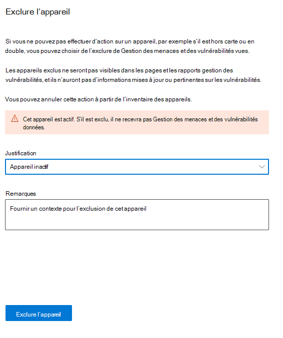
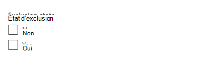
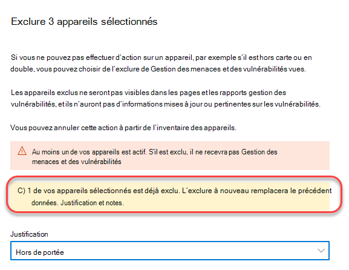
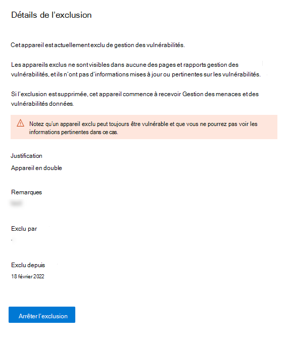

# Exclure des appareils

[!INCLUDE [Microsoft 365 Defender rebranding](../../includes/microsoft-defender.md)]

**S’applique à :**

- [Microsoft Defender pour point de terminaison Plan 1](https://go.microsoft.com/fwlink/p/?linkid=2154037)
- [Microsoft Defender pour point de terminaison Plan 2](https://go.microsoft.com/fwlink/p/?linkid=2154037)
- [Microsoft 365 Defender](https://go.microsoft.com/fwlink/?linkid=2118804)

> Vous voulez découvrir Defender pour point de terminaison ? [Inscrivez-vous pour bénéficier d’un essai gratuit.](https://signup.microsoft.com/create-account/signup?products=7f379fee-c4f9-4278-b0a1-e4c8c2fcdf7e&ru=https://aka.ms/MDEp2OpenTrial?ocid=docs-wdatp-respondmachine-abovefoldlink)

## Exclure des appareils de la gestion des vulnérabilités

L’exclusion des appareils inactifs, dupliqués ou hors de portée vous permet de vous concentrer sur la découverte et la hiérarchisation des risques sur vos appareils actifs. Cette action peut également contribuer à refléter un score d’exposition de gestion des vulnérabilités plus précis, car les appareils exclus ne seront pas visibles dans vos rapports de gestion des vulnérabilités.

Une fois les appareils exclus, vous ne pourrez plus afficher les informations mises à jour ou pertinentes sur les vulnérabilités et les logiciels installés sur ces appareils. Elle affecte toutes les pages de gestion des vulnérabilités, les rapports et les tables associées dans la chasse avancée.

Même si la fonctionnalité d’exclusion d’appareil supprime les données de l’appareil des pages et rapports de gestion des vulnérabilités, les appareils restent connectés au réseau et peuvent toujours présenter un risque pour l’organisation. Vous pourrez annuler l’exclusion de l’appareil à tout moment.

## Comment exclure un appareil

Vous pouvez choisir d’exclure un seul appareil ou plusieurs appareils en même temps.

### Exclure un seul appareil

1. Accédez à la page **Inventaire des appareils** et sélectionnez l’appareil à exclure.
2. Sélectionnez **Exclure** dans la barre d’action de la page d’inventaire des appareils ou dans le menu actions du menu volant de l’appareil.

   

3. Sélectionnez une justification :

    - Appareil inactif
    - Appareil en double
    - L’appareil n’existe pas
    - Non compris
    - Autre

4. Tapez une note, puis **sélectionnez Exclure l’appareil**.

Vous pouvez également exclure un appareil de sa page d’appareil.

> [!NOTE]
> L’exclusion des appareils actifs n’est pas recommandée, car il est particulièrement risqué de ne pas avoir de visibilité sur leurs informations de vulnérabilité. Si un appareil est actif et que vous essayez de l’exclure, vous recevez un message d’avertissement et une fenêtre contextuelle de confirmation vous demandant si vous êtes sûr de vouloir exclure un appareil actif.

L’exclusion complète d’un appareil des vues et des données de gestion des vulnérabilités peut prendre jusqu’à 10 heures.

Les appareils exclus sont toujours visibles dans la liste d’inventaire des appareils. Vous pouvez gérer votre vue des appareils exclus en :

- Ajout de la colonne **État d’exclusion** à la vue d’inventaire de l’appareil.
- Utilisation du filtre **d’état d’exclusion** pour afficher la liste appropriée des appareils.

### Exclusion d’appareil en bloc

Vous pouvez également choisir d’exclure plusieurs appareils en même temps :

1. Accédez à la page **Inventaire des** appareils et sélectionnez les appareils à exclure.

2. Dans la barre d’actions, **sélectionnez Exclure**.

3. Choisissez une justification, puis **sélectionnez Exclure l’appareil**.

Si vous sélectionnez plusieurs appareils dans la liste des appareils avec différents états d’exclusion, le menu volant exclure les appareils sélectionnés vous fournit des détails sur le nombre d’appareils sélectionnés qui sont déjà exclus. Vous pouvez exclure à nouveau les appareils, mais la justification et les notes seront remplacées.

Une fois qu’un appareil est exclu, si vous accédez à la page de l’appareil d’un appareil exclu, vous ne pouvez pas voir les données relatives aux vulnérabilités détectées, à l’inventaire logiciel ou aux recommandations de sécurité. Les données ne s’affichent pas non plus dans les pages de gestion des vulnérabilités, les tables de repérage avancée associées et le rapport sur les appareils vulnérables.

## Arrêter d’exclure un appareil

Vous pourrez arrêter d’exclure un appareil à tout moment. Une fois que les appareils ne sont plus exclus, leurs données de vulnérabilité sont visibles dans les pages de gestion des vulnérabilités, les rapports et la chasse avancée. L’application des modifications peut prendre jusqu’à 8 heures.

1. Accédez à l’inventaire des appareils, sélectionnez l’appareil exclu pour ouvrir le menu volant, puis sélectionnez **Détails de l’exclusion**
2. Sélectionner **Arrêter l’exclusion**

## Voir aussi

- [Inventaire des appareils](machines-view-overview.md)
