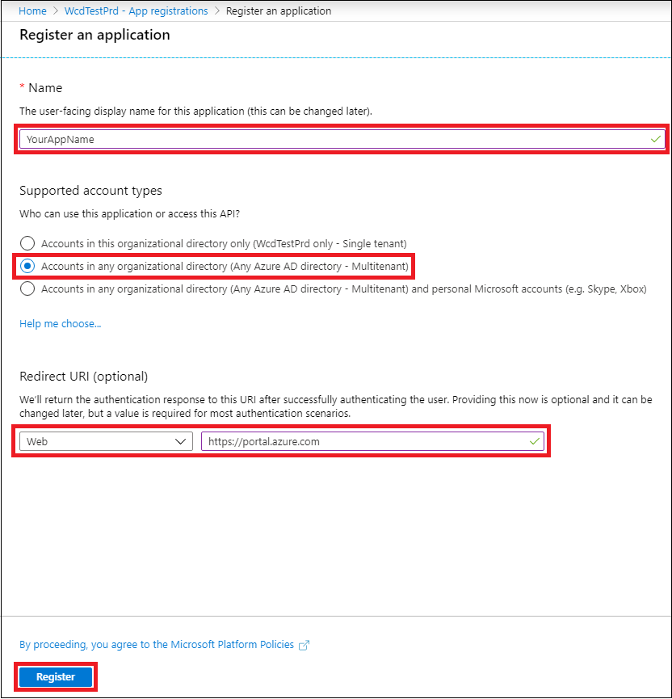

# <a name="partner-access-through-microsoft-defender-for-endpoint-apis"></a>Accès des partenaires via les API microsoft Defender pour les points de terminaison

[!INCLUDE [Microsoft 365 Defender rebranding](../../includes/microsoft-defender.md)]


**S’applique à :** 
- [Microsoft Defender for Endpoint Plan 2](https://go.microsoft.com/fwlink/?linkid=2154037)

> Vous voulez découvrir Microsoft Defender pour point de terminaison ? [Inscrivez-vous pour bénéficier d’un essai gratuit.](https://signup.microsoft.com/create-account/signup?products=7f379fee-c4f9-4278-b0a1-e4c8c2fcdf7e&ru=https://aka.ms/MDEp2OpenTrial?ocid=docs-wdatp-exposedapis-abovefoldlink)

[!include[Microsoft Defender for Endpoint API URIs for US Government](../../includes/microsoft-defender-api-usgov.md)]

[!include[Improve request performance](../../includes/improve-request-performance.md)]

Cette page explique comment créer une application Azure Active Directory (Azure AD) pour obtenir un accès par programmation à Microsoft Defender pour endpoint pour le compte de vos clients.

Microsoft Defender pour point de terminaison expose la plupart de ses données et actions par le biais d’un ensemble d’API par programme. Ces API vous aideront à automatiser les flux de travail et à faire preuve d’innovation en fonction des fonctionnalités de Microsoft Defender for Endpoint. L’accès à l’API nécessite une authentification OAuth2.0. Pour plus d’informations, [voir code d’autorisation OAuth 2.0 Flow](/azure/active-directory/develop/active-directory-v2-protocols-oauth-code).

En règle générale, vous devez suivre les étapes suivantes pour utiliser les API :

- Créez **une application Azure AD** client.
- Obtenez l’autorisation (consentement) de votre administrateur client pour que votre application accède aux ressources Defender pour les points de terminaison dont elle a besoin.
- Obtenez un jeton d’accès à l’aide de cette application.
- Utilisez le jeton pour accéder à l’API Microsoft Defender for Endpoint.

Les étapes suivantes vous guident pour créer une application Azure AD, obtenir un jeton d’accès à Microsoft Defender pour le point de terminaison et valider le jeton.

## <a name="create-the-multi-tenant-app"></a>Créer l’application multi-client

1. Connectez-vous à votre [client Azure avec](https://portal.azure.com) un utilisateur ayant le rôle **Administrateur** général.

2. Accédez à **Azure Active Directory** \> **inscription de l’application Nouvelle** \> **inscription.**

   

3. Dans le formulaire d’inscription :

   - Choisissez un nom pour votre application.

   - Types de comptes pris en charge : comptes dans n’importe quel annuaire d’organisation.

   - URI de redirection - type : Web, URI : https://portal.azure.com

   

4. Autorisez votre application à accéder à Microsoft Defender pour le point de terminaison et à l’affecter avec le jeu minimal d’autorisations requis pour terminer l’intégration.

   - Dans la page de votre application, sélectionnez **Autorisations api** Ajouter des API d’autorisation que mon \>  \>  organisation utilise > type **WindowsDefenderATP** et sélectionnez **sur WindowsDefenderATP**.

   - **Remarque**: *WindowsDefenderATP* n’apparaît pas dans la liste d’origine. Commencez à écrire son nom dans la zone de texte pour l’voir apparaître.

     

### <a name="request-api-permissions"></a>Demander des autorisations d’API

Pour déterminer l’autorisation qui vous est nécessaire, appelez la section **Autorisations** de l’API que vous souhaitez appeler. Par exemple :

- Pour [exécuter des requêtes avancées,](run-advanced-query-api.md)sélectionnez l’autorisation « Exécuter des requêtes avancées »
- Pour [isoler un appareil,](isolate-machine.md)sélectionnez l’autorisation « Isoler l’ordinateur »

Dans l’exemple suivant, nous allons utiliser **l’autorisation** « Lire toutes les alertes » :

1. Choose **Application permissions** \> **Alert.Read.All** > select on **Add permissions**

   

2. Sélectionnez **Accorder le consentement**

   - **Remarque**: chaque fois que vous ajoutez une autorisation, vous devez sélectionner l’autorisation **Accorder le consentement** pour que la nouvelle autorisation prenne effet.

   

3. Ajoutez une secret à l’application.

   - Select **Certificates & secrets,** add description to the secret and select **Add**.

    **Important**: après avoir cliqué sur Ajouter, **copiez la valeur de secret générée.** Vous ne pourrez plus récupérer une fois que vous êtes parti !

    

4. Notez votre ID d’application :

   - Dans la page de votre application, allez à **Vue d’ensemble** et copiez les informations suivantes :

   

5. Ajoutez l’application au client de votre client.

   Votre application doit être approuvée dans chaque client où vous avez l’intention de l’utiliser. Cela est dû au fait que votre application interagit avec l’application Microsoft Defender for Endpoint pour le compte de votre client.

   Un utilisateur dont **l’administrateur général** est issu du client de votre client doit sélectionner le lien de consentement et approuver votre application.

   Le lien de consentement est de la forme :

   ```http
   https://login.microsoftonline.com/common/oauth2/authorize?prompt=consent&client_id=00000000-0000-0000-0000-000000000000&response_type=code&sso_reload=true
   ```

   Où 000000000-0000-0000-0000-000000000000 doit être remplacé par votre ID d’application

   Après avoir cliqué sur le lien de consentement, connectez-vous avec l’administrateur général du client du client et consentez à l’application.

   

   En outre, vous devrez demander à votre client son ID de locataire et l’enregistrer pour une utilisation ultérieure lors de l’acquisition du jeton.

6. **Terminé !** Vous avez réussi à inscrire une application ! Voir les exemples ci-dessous pour l’acquisition et la validation des jetons.

## <a name="get-an-access-token-example"></a>Obtenir un exemple de jeton d’accès

**Remarque :** Pour obtenir un jeton d’accès au nom de votre client, utilisez l’ID de locataire du client sur les acquisitions de jeton suivantes.

Pour plus d’informations sur AAD, voir [AAD didacticiel](/azure/active-directory/develop/active-directory-v2-protocols-oauth-client-creds)

### <a name="using-powershell"></a>Utiliser PowerShell

```powershell
# That code gets the App Context Token and save it to a file named "Latest-token.txt" under the current directory
# Paste below your Tenant ID, App ID and App Secret (App key).

$tenantId = '' ### Paste your tenant ID here
$appId = '' ### Paste your Application ID here
$appSecret = '' ### Paste your Application key here

$resourceAppIdUri = 'https://api.securitycenter.microsoft.com'
$oAuthUri = "https://login.microsoftonline.com/$TenantId/oauth2/token"
$authBody = [Ordered] @{
    resource = "$resourceAppIdUri"
    client_id = "$appId"
    client_secret = "$appSecret"
    grant_type = 'client_credentials'
}
$authResponse = Invoke-RestMethod -Method Post -Uri $oAuthUri -Body $authBody -ErrorAction Stop
$token = $authResponse.access_token
Out-File -FilePath "./Latest-token.txt" -InputObject $token
return $token
```

### <a name="using-c"></a>Utilisation de C #

> Le code ci-dessous a été testé avec Nuget Microsoft.IdentityModel.Clients.ActiveDirectory

- Créer une application console
- Installer NuGet [Microsoft.IdentityModel.Clients.ActiveDirectory](https://www.nuget.org/packages/Microsoft.IdentityModel.Clients.ActiveDirectory/)
- Ajouter les valeurs ci-dessous à l’aide

    ```console
    using Microsoft.IdentityModel.Clients.ActiveDirectory;
    ```

- Copiez/collez le code ci-dessous dans votre application (n’oubliez pas de mettre à jour les trois variables : `tenantId` `appId` , et `appSecret` )

    ```console
    string tenantId = "00000000-0000-0000-0000-000000000000"; // Paste your own tenant ID here
    string appId = "11111111-1111-1111-1111-111111111111"; // Paste your own app ID here
    string appSecret = "22222222-2222-2222-2222-222222222222"; // Paste your own app secret here for a test, and then store it in a safe place!

    const string authority = "https://login.microsoftonline.com";
    const string wdatpResourceId = "https://api.securitycenter.microsoft.com";

    AuthenticationContext auth = new AuthenticationContext($"{authority}/{tenantId}/");
    ClientCredential clientCredential = new ClientCredential(appId, appSecret);
    AuthenticationResult authenticationResult = auth.AcquireTokenAsync(wdatpResourceId, clientCredential).GetAwaiter().GetResult();
    string token = authenticationResult.AccessToken;
    ```

### <a name="using-python"></a>Utilisation de Python

Voir Obtenir un [jeton à l’aide de Python](run-advanced-query-sample-python.md#get-token)

### <a name="using-curl"></a>Utilisation de l’outil

> [!NOTE]
> La procédure ci-dessous supposée Windows est déjà installée sur votre ordinateur

- Ouvrir une fenêtre de commande
- Définir CLIENT_ID sur votre ID d’application Azure
- Définir CLIENT_SECRET sur votre secret d’application Azure
- Définissez TENANT_ID sur l’ID de client Azure du client qui souhaite utiliser votre application pour accéder à Microsoft Defender pour l’application Endpoint
- Exécutez la commande ci-dessous :

```curl
curl -i -X POST -H "Content-Type:application/x-www-form-urlencoded" -d "grant_type=client_credentials" -d "client_id=%CLIENT_ID%" -d "scope=https://securitycenter.onmicrosoft.com/windowsatpservice/.default" -d "client_secret=%CLIENT_SECRET%" "https://login.microsoftonline.com/%TENANT_ID%/oauth2/v2.0/token" -k
```

Vous recevez une réponse du formulaire :

```console
{"token_type":"Bearer","expires_in":3599,"ext_expires_in":0,"access_token":"eyJ0eXAiOiJKV1QiLCJhbGciOiJSUzI1NiIsIn <truncated> aWReH7P0s0tjTBX8wGWqJUdDA"}
```

## <a name="validate-the-token"></a>Valider le jeton

Vérifiez que vous avez reçu un jeton correct :

- Copier/coller dans [JWT](https://jwt.ms) le jeton que vous obtenez à l’étape précédente afin de le décoder
- Valider que vous obtenez une revendication « rôles » avec les autorisations souhaitées
- Dans la capture d’écran ci-dessous, vous pouvez voir un jeton décodé acquis à partir d’une application avec plusieurs autorisations pour Microsoft Defender pour le point de terminaison :
- La revendication « tid » est l’ID de client à qui appartient le jeton.


## <a name="use-the-token-to-access-microsoft-defender-for-endpoint-api"></a>Utiliser le jeton pour accéder à l’API Microsoft Defender for Endpoint

- Choisissez l’API que vous souhaitez utiliser, pour plus d’informations, voir API De Microsoft Defender pris en charge pour [les points de terminaison](exposed-apis-list.md)
- Définissez l’en-tête Authorization dans la requête Http que vous envoyez à « Bearer {token} » (le porteur est le schéma d’autorisation)
- Le délai d’expiration du jeton est de 1 heure (vous pouvez envoyer plusieurs demandes avec le même jeton)

- Exemple d’envoi d’une demande pour obtenir une liste d’alertes à **l’aide C#**

    ```csharp
    var httpClient = new HttpClient();

    var request = new HttpRequestMessage(HttpMethod.Get, "https://api.securitycenter.microsoft.com/api/alerts");

    request.Headers.Authorization = new AuthenticationHeaderValue("Bearer", token);

    var response = httpClient.SendAsync(request).GetAwaiter().GetResult();

    // Do something useful with the response
    ```

## <a name="see-also"></a>Voir aussi

- [API prises en charge Microsoft Defender pour point de terminaison](exposed-apis-list.md)
- [Accéder à Microsoft Defender pour le point de terminaison au nom d’un utilisateur](exposed-apis-create-app-nativeapp.md)
