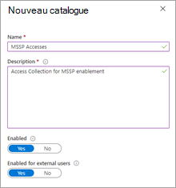
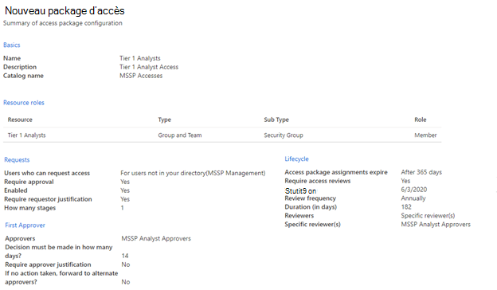
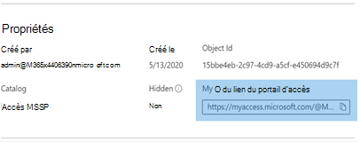

# Accorder un accès au fournisseur de services de sécurité gérés (MSSP) (prévisualisation)

[!INCLUDE [Microsoft 365 Defender rebranding](../../includes/microsoft-defender.md)]

**S’applique à :**
- [Microsoft Defender pour point de terminaison](https://go.microsoft.com/fwlink/p/?linkid=2154037)
- [Microsoft 365 Defender](https://go.microsoft.com/fwlink/?linkid=2118804)

> Vous souhaitez faire l’expérience de Defender pour point de terminaison ? [Inscrivez-vous pour bénéficier d’un essai gratuit.](https://signup.microsoft.com/create-account/signup?products=7f379fee-c4f9-4278-b0a1-e4c8c2fcdf7e&ru=https://aka.ms/MDEp2OpenTrial?ocid=docs-mssp-support-abovefoldlink)

> [!IMPORTANT]
> Certaines informations ont trait à un produit préalablement publié, qui peut être modifié de manière significative avant sa publication commerciale. Microsoft n’offre aucune garantie, explicite ou implicite, concernant les informations fournies ici.

Pour implémenter une solution d’accès délégué multi-locataire, prenez les mesures suivantes :

1. Activez [le contrôle d’accès basé sur](rbac.md) les rôles dans Defender pour le point de terminaison et connectez-vous à des groupes Active Directory (AD).

2. Configurer des [packages d’accès de gouvernance pour](/azure/active-directory/governance/identity-governance-overview) la demande d’accès et la mise en service.

3. Gérer les demandes d’accès et les audits [dans Microsoft Myaccess](/azure/active-directory/governance/entitlement-management-request-approve).

## Activer les contrôles d’accès basés sur les rôles dans Microsoft Defender pour le point de terminaison

1. **Créer des groupes d’accès pour les ressources MSSP dans Customer AAD : Groupes**

    Ces groupes seront liés aux rôles que vous créez dans Defender for Endpoint. Pour ce faire, dans le client AD client, créez trois groupes. Dans notre exemple d’approche, nous créons les groupes suivants :

    - Analyste de niveau 1
    - Analyste de niveau 2
    - Approbations d’analyste MSSP

2. Créez des rôles Defender pour les points de terminaison pour les niveaux d’accès appropriés dans Customer Defender for Endpoint.

    Pour activer RBAC dans l’Centre de sécurité Microsoft Defender client, accédez à **Paramètres > Permissions > Roles** et « Activer les rôles », à partir d’un compte d’utilisateur ayant des droits d’administrateur général ou d’administrateur de sécurité.

    

    Ensuite, créez des rôles RBAC pour répondre aux besoins du niveau SOC MSSP. Lier ces rôles aux groupes d’utilisateurs créés via « Groupes d’utilisateurs affectés ».

    Deux rôles possibles :

    - **Analystes de niveau 1**

      Effectuez toutes les actions à l’exception de la réponse en direct et gérez les paramètres de sécurité.

    - **Analystes de niveau 2**

      Fonctionnalités de niveau 1 avec l’ajout de la [réponse en direct](live-response.md)

    Pour plus d’informations, voir [Utiliser le contrôle d’accès basé sur un rôle.](rbac.md)

## Configurer les packages d’accès de gouvernance

1. **Ajouter MSSP en tant qu’organisation connectée dans Customer AAD : Gouvernance des identités**

    L’ajout du MSSP en tant qu’organisation connectée permettra au MSSP de demander et de mettre en service des accès.

    Pour ce faire, dans le client AD client, accédez à Gouvernance des identités : Organisation connectée. Ajoutez une nouvelle organisation et recherchez votre client d’analyste MSSP via un ID de client ou un domaine. Nous vous suggérons de créer un client AD distinct pour vos analystes MSSP.

2. **Créer un catalogue de ressources dans Customer AAD: Identity Governance**

    Les catalogues de ressources sont une collection logique de packages d’accès, créés dans le client Client AD.

    Pour ce faire, dans le client AD client, accédez à La gouvernance des identités : catalogues et ajoutez **nouveau catalogue**. Dans notre exemple, nous l’appeller **MSSP Accesses**.

    

    Pour plus d’informations, voir [Créer un catalogue de ressources.](/azure/active-directory/governance/entitlement-management-catalog-create)

3. **Créer des packages d’accès pour les ressources MSSP Client AAD : Gouvernance des identités**

    Les packages d’accès sont la collection de droits et d’accès accordés à un demandeur lors de l’approbation.

    Pour ce faire, dans le client AD client, accédez à Gouvernance des identités : packages d’accès et ajoutez **un nouveau package d’accès.** Créez un package d’accès pour les approuveurs MSSP et chaque niveau d’analyste. Par exemple, la configuration suivante de l’analyste de niveau 1 crée un package d’accès qui :

    - Nécessite un membre du groupe AD **MSSP Analyst Approvers** pour autoriser les nouvelles demandes
    - Possède des révisions d’accès annuel, où les analystes SOC peuvent demander une extension d’accès
    - Peut uniquement être demandé par les utilisateurs du client SOC MSSP
    - L’accès automatique expire après 365 jours

    > [!div class="mx-imgBorder"]
    > 

    Pour plus d’informations, [voir Créer un package d’accès.](/azure/active-directory/governance/entitlement-management-access-package-create)

4. **Fournir un lien de demande d’accès aux ressources MSSP à partir de Customer AAD: Identity Governance**

    Le lien du portail Mon accès est utilisé par les analystes SOC MSSP pour demander l’accès via les packages d’accès créés. Le lien est durable, ce qui signifie qu’il peut être utilisé au fil du temps pour de nouveaux analystes. La demande d’analyste est entrée dans une file d’attente pour approbation par les approuveurs d’analyste **MSSP.**

    > [!div class="mx-imgBorder"]
    > 

    Le lien se trouve sur la page de vue d’ensemble de chaque package d’accès.

## Gérer l’accès

1. Examiner et autoriser les demandes d’accès dans Customer et/ou MSSP myaccess.

    Les demandes d’accès sont gérées dans le client Mon accès, par les membres du groupe d’approbations d’analyste MSSP.

    Pour ce faire, accédez à la myaccess du client à l’aide de : `https://myaccess.microsoft.com/@<Customer Domain>` .

    Exemple : `https://myaccess.microsoft.com/@M365x440XXX.onmicrosoft.com#/`

2. Approuver ou refuser des demandes dans la section **Approbations** de l’interface utilisateur.

    À ce stade, l’accès analyste a été mis en service et chaque analyste doit pouvoir accéder aux informations du client Centre de sécurité Microsoft Defender :`https://securitycenter.Microsoft.com/?tid=<CustomerTenantId>`

## Rubriques connexes

- [Accéder au portail client MSSP](access-mssp-portal.md)
- [Configurer des notifications d’alerte](configure-mssp-notifications.md)
- [Récupérer les alertes d’un client](fetch-alerts-mssp.md)
