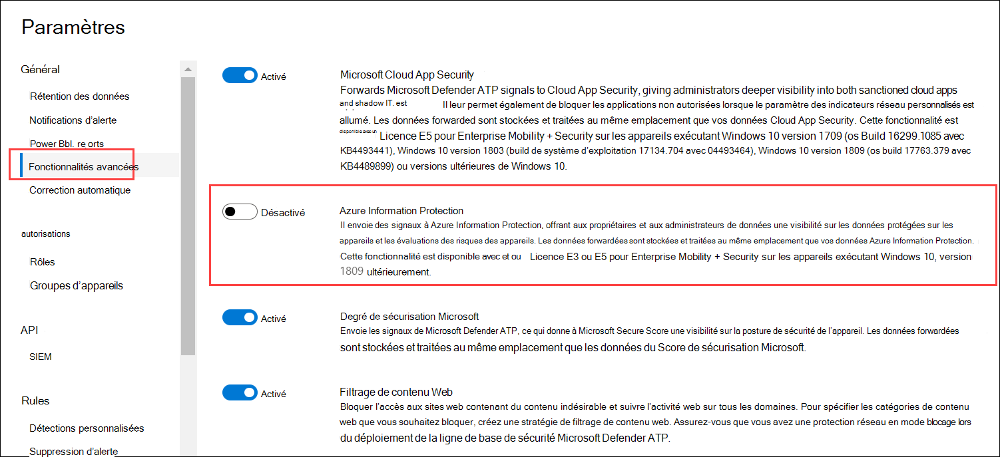

# <a name="information-protection-in-windows-overview"></a>Vue d’ensemble de la protection des informations dans Windows

[!INCLUDE [Microsoft 365 Defender rebranding](../../includes/microsoft-defender.md)]

**S’applique à :**

- [Microsoft Defender pour point de terminaison](https://go.microsoft.com/fwlink/p/?linkid=2154037)
- [Microsoft 365 Defender](https://go.microsoft.com/fwlink/?linkid=2118804)

> Vous souhaitez faire l’expérience de Defender pour point de terminaison ? [Inscrivez-vous pour bénéficier d’un essai gratuit.](https://www.microsoft.com/microsoft-365/windows/microsoft-defender-atp?ocid=docs-wdatp-exposedapis-abovefoldlink)


[!include[Prerelease information](../../includes/prerelease.md)]

La protection des informations fait partie intégrante de Microsoft 365 Entreprise suite, offrant une protection intelligente pour garantir la sécurité des données sensibles tout en permettant la productivité sur le lieu de travail.

>[!TIP]
> Lisez notre billet de blog sur la façon dont Microsoft Defender pour le point de terminaison s’intègre à Protection des données Microsoft pour découvrir, protéger et surveiller les données sensibles [sur Windows appareils.](https://cloudblogs.microsoft.com/microsoftsecure/2019/01/17/windows-defender-atp-integrates-with-microsoft-information-protection-to-discover-protect-and-monitor-sensitive-data-on-windows-devices/)

Defender pour le point de terminaison applique les méthodes suivantes pour découvrir, classifier et protéger les données :

- **Découverte de données** : identifier les données sensibles sur Windows les appareils à risque
- **Classification des** données : classifiez automatiquement les données en fonction des stratégies Protection des données Microsoft MIP (Common Office 365 Security & Compliance Center). La classification automatique vous permet de protéger les données sensibles même si l’utilisateur final ne les a pas classées manuellement.

## <a name="data-discovery-and-data-classification"></a>Découverte de données et classification des données

Defender pour le point de terminaison découvre automatiquement les fichiers avec des étiquettes de sensibilité et les fichiers qui contiennent des types d’informations sensibles.

Les étiquettes de sensibilité classent et aident à protéger le contenu sensible.

Les types d’informations sensibles dans Office 365'implémentation de la protection contre la perte de données (DLP) relèvent de deux catégories :

- Défaut
- Personnalisé

Les types d’informations sensibles par défaut incluent des informations telles que des numéros de compte bancaire, des numéros de sécurité sociale ou des ID nationaux. Pour plus d’informations, voir [ce que le type d’informations sensibles recherche.](/office365/securitycompliance/what-the-sensitive-information-types-look-for)

Les types personnalisés sont ceux que vous définissez et sont conçus pour protéger un type différent d’informations sensibles (par exemple, les ID d’employé ou les numéros de projet). Pour plus d’informations, [voir Créer un type d’informations sensibles personnalisé.](/office365/securitycompliance/create-a-custom-sensitive-information-type)

Lorsqu’un fichier est créé ou modifié sur un Windows, Defender for Endpoint analyse le contenu pour évaluer s’il contient des informations sensibles.

Activer l’intégration Azure Information Protection de sorte que lorsqu’un fichier contenant des informations sensibles est découvert par Defender for Endpoint à l’aide d’étiquettes ou de types d’informations, il est automatiquement transmis à Azure Information Protection à partir de l’appareil.



Les signaux signalés peuvent être vus dans le tableau de bord Azure Information Protection - Data Discovery.

## <a name="azure-information-protection---data-discovery-dashboard"></a>Azure Information Protection - Tableau de bord de découverte de données

Ce tableau de bord présente une synthèse des informations de découverte des données découvertes par Defender pour Endpoint et Azure Information Protection. Les données de Defender pour le point de terminaison sont marquées avec type d’emplacement - Point de terminaison.


Notez que la colonne Risque de l’appareil sur la droite, ce risque d’appareil est dérivé directement de Defender pour point de terminaison, indiquant le niveau de risque du périphérique de sécurité où le fichier a été découvert, en fonction des menaces de sécurité actives détectées par Defender pour le point de terminaison.

Cliquez sur un appareil pour afficher la liste des fichiers observés sur cet appareil, avec leurs étiquettes de niveau de sensibilité et leurs types d’informations.

> [!NOTE]
> Veuillez prévoir environ 15 à 20 minutes pour que la découverte du tableau de bord Azure Information Protection reflète les fichiers découverts.

## <a name="log-analytics"></a>Log Analytics

La découverte de données basée sur Defender pour le point de terminaison est également disponible dans [Azure Log Analytics,](/azure/log-analytics/log-analytics-overview)où vous pouvez effectuer des requêtes complexes sur les données brutes.

Pour plus d’informations sur l’analyse Azure Information Protection, consultez la fonctionnalité [Rapports centralisées pour Azure Information Protection.](/azure/information-protection/reports-aip)

Ouvrez Azure Log Analytics dans le portail Azure et ouvrez un générateur de requêtes (standard ou classique).

Pour afficher les données de Defender for Endpoint, effectuez une requête qui contient :

```text
InformationProtectionLogs_CL
| where Workload_s == "Windows Defender"
```

### <a name="prerequisites"></a>Conditions préalables

- Les clients doivent avoir un abonnement à Azure Information Protection.
- Activez l’intégration d’Azure Information Protection dans Centre de sécurité Microsoft Defender :
  - Go to **Paramètres** in Centre de sécurité Microsoft Defender, click on **Advanced Paramètres** under **General**.
