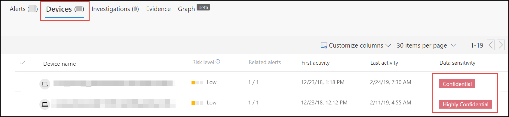

# Utiliser des étiquettes de confidentialité pour hiérarchiser les réponses aux incidents

[!INCLUDE [Microsoft 365 Defender rebranding](../../includes/microsoft-defender.md)]

**S’applique à :**
- [Microsoft Defender pour point de terminaison Plan 1](https://go.microsoft.com/fwlink/p/?linkid=2154037)
- [Microsoft Defender pour point de terminaison Plan 2](https://go.microsoft.com/fwlink/p/?linkid=2154037)
- [Microsoft 365 Defender](https://go.microsoft.com/fwlink/?linkid=2118804)

> Vous souhaitez faire l’expérience de Defender for Endpoint ? [Inscrivez-vous pour bénéficier d’un essai gratuit.](https://signup.microsoft.com/create-account/signup?products=7f379fee-c4f9-4278-b0a1-e4c8c2fcdf7e&ru=https://aka.ms/MDEp2OpenTrial?ocid=docs-wdatp-exposedapis-abovefoldlink)

Un cycle de vie classique des menaces avancées persistantes implique l’exfiltration des données. Dans un incident de sécurité, il est important de pouvoir hiérarchiser les enquêtes dans les cas où les fichiers sensibles peuvent être insécurisés afin que les données et les informations d’entreprise soient protégées.

Defender pour le point de terminaison facilite la hiérquisation des incidents de sécurité avec l’utilisation d’étiquettes de niveau de sensibilité. Les étiquettes de confidentialité identifient rapidement les incidents qui peuvent impliquer des appareils avec des informations sensibles telles que des informations confidentielles.

## Examiner les incidents impliquant des données sensibles

Découvrez comment utiliser des étiquettes de sensibilité aux données pour hiérarchiser l’examen des incidents.

> [!NOTE]
> Les étiquettes sont détectées pour Windows 10, version 1809 ou une Windows 11.

1. Dans Microsoft 365 Defender portail, **sélectionnez Incidents &** \> **alertes Incidents**.

2. Faites défiler vers la droite pour voir la colonne **Sensibilité aux** données. Cette colonne reflète les étiquettes de niveau de sensibilité observées sur les appareils liés aux incidents, ce qui indique si les fichiers sensibles peuvent être touchés par l’incident.

    

    Vous pouvez également filtrer en fonction du **niveau de sensibilité des données**

    

3. Ouvrez la page incident pour examiner plus en détail.

    

4. Sélectionnez **l’onglet Appareils** pour identifier les appareils stockant des fichiers avec des étiquettes de sensibilité.

    

5. Sélectionnez les appareils qui stockent des données sensibles et recherchez dans la chronologie pour identifier les fichiers qui peuvent être touchés, puis prenez les mesures appropriées pour vous assurer que les données sont protégées.

   Vous pouvez affiner les événements affichés sur la chronologie de l’appareil en recherchant des étiquettes de sensibilité aux données. Cela n’affichera que les événements associés aux fichiers qui ont ce nom d’étiquette.

    

> [!TIP]
> Ces points de données sont également exposés par le biais de « DeviceFileEvents » dans le repérage avancé, ce qui permet aux requêtes avancées et à la détection de planifier la détection de prendre en compte les étiquettes de sensibilité et l’état de protection des fichiers.
