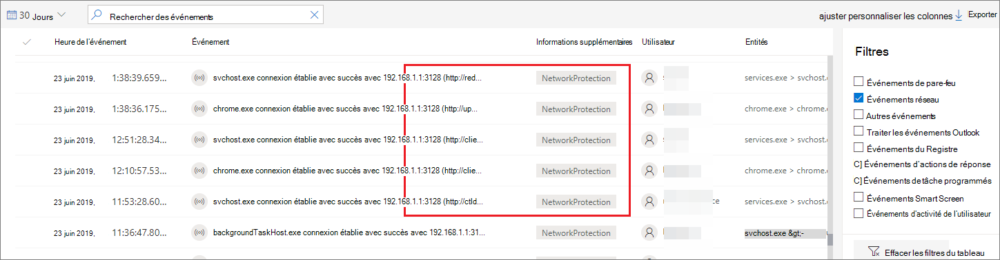
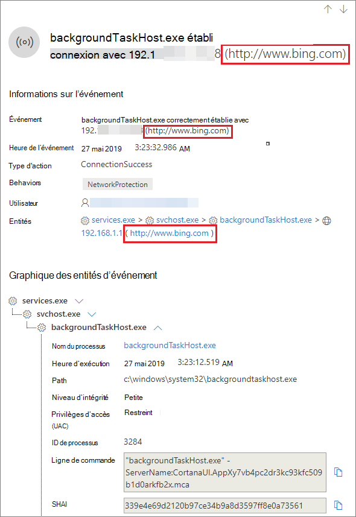
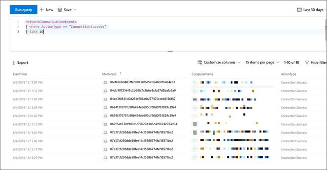

# <a name="investigate-connection-events-that-occur-behind-forward-proxies"></a>Examiner des événements de connexion qui se produisent d’arrière vers l’avant des proxys

[!INCLUDE [Microsoft 365 Defender rebranding](../../includes/microsoft-defender.md)]

**S’applique à :**
- [Microsoft Defender pour point de terminaison](https://go.microsoft.com/fwlink/p/?linkid=2154037)
- [Microsoft 365 Defender](https://go.microsoft.com/fwlink/?linkid=2118804)

> Vous souhaitez faire l’expérience de Defender pour point de terminaison ? [Inscrivez-vous pour bénéficier d’un essai gratuit.](https://signup.microsoft.com/create-account/signup?products=7f379fee-c4f9-4278-b0a1-e4c8c2fcdf7e&ru=https://aka.ms/MDEp2OpenTrial?ocid=docs-wdatp-investigatemachines-abovefoldlink)

Defender pour le point de terminaison prend en charge la surveillance des connexions réseau à partir de différents niveaux de la pile réseau. Un cas difficile est celui où le réseau utilise un proxy avant comme passerelle vers Internet.

Le proxy agit comme s’il s’agissait du point de terminaison cible.  Dans ce cas, les moniteurs de connexion réseau simples auditent les connexions avec le proxy, ce qui est correct mais qui a une valeur d’investigation inférieure. 

Defender pour le point de terminaison prend en charge la surveillance avancée au niveau HTTP via la protection réseau. Lorsqu’il est allumé, un nouveau type d’événement est exposé, qui expose les noms de domaine cibles réels.

## <a name="use-network-protection-to-monitor-network-connection-behind-a-firewall"></a>Utiliser la protection réseau pour surveiller la connexion réseau derrière un pare-feu
La surveillance de la connexion réseau derrière un proxy avant est possible en raison d’événements réseau supplémentaires qui proviennent de la protection du réseau. Pour les voir sur une chronologie d’appareil, activer la protection réseau (au minimum en mode audit). 

La protection réseau peut être contrôlée à l’aide des modes suivants :

- **Bloquer** <br> Les utilisateurs ou les applications ne pourront pas se connecter à des domaines dangereux. Vous pourrez voir cette activité dans Centre de sécurité Microsoft Defender.
- **Audit** <br> La connexion à des domaines dangereux ne sera pas bloquée pour les utilisateurs ou les applications. Toutefois, vous verrez toujours cette activité dans Centre de sécurité Microsoft Defender.


Si vous éte désactiver la protection réseau, les utilisateurs ou les applications ne seront pas bloqués pour se connecter à des domaines dangereux. Aucune activité réseau ne s’Centre de sécurité Microsoft Defender.

Si vous ne la configurez pas, le blocage du réseau est désactivé par défaut.

Pour plus d’informations, voir [Activer la protection réseau.](enable-network-protection.md)

## <a name="investigation-impact"></a>Impact de l’examen
Lorsque la protection réseau est allumée, vous verrez que, sur la chronologie d’un appareil, l’adresse IP continuera à représenter le proxy, tandis que l’adresse cible réelle s’affiche.



D’autres événements déclenchés par la couche de protection réseau sont désormais disponibles pour faire surface des noms de domaine réels, même derrière un proxy.

Informations sur l’événement :




## <a name="hunt-for-connection-events-using-advanced-hunting"></a>Recherche des événements de connexion à l’aide de la recherche avancée 
Tous les nouveaux événements de connexion sont également disponibles pour la recherche avancée. Étant donné que ces événements sont des événements de connexion, vous pouvez les trouver sous la table DeviceNetworkEvents sous le `ConnecionSuccess` type d’action.

L’utilisation de cette requête simple vous montre tous les événements pertinents :

```
DeviceNetworkEvents
| where ActionType == "ConnectionSuccess" 
| take 10
```



Vous pouvez également filtrer les événements liés à la connexion au proxy lui-même. 

Utilisez la requête suivante pour filtrer les connexions au proxy :

```
DeviceNetworkEvents
| where ActionType == "ConnectionSuccess" and RemoteIP != "ProxyIP"  
| take 10
```


## <a name="related-topics"></a>Voir aussi
- [Application de la protection réseau avec la stratégie de groupe - CSP de stratégie](/windows/client-management/mdm/policy-csp-defender#defender-enablenetworkprotection)
