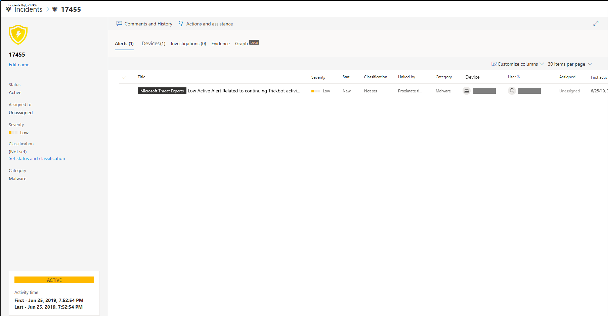
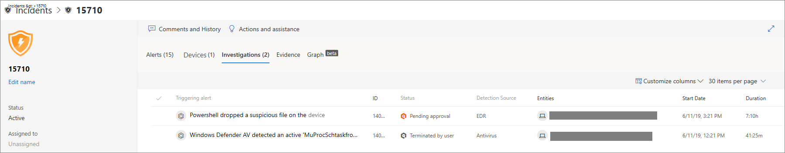

# Examiner les incidents dans Microsoft Defender pour point de terminaison

[!INCLUDE [Microsoft 365 Defender rebranding](../../includes/microsoft-defender.md)]

**S’applique à :**
- [Microsoft Defender pour point de terminaison](https://go.microsoft.com/fwlink/p/?linkid=2154037)
- [Microsoft 365 Defender](https://go.microsoft.com/fwlink/?linkid=2118804)

Examinez les incidents qui affectent votre réseau, comprenez ce qu’ils signifient et rassemblez des preuves pour les résoudre.

Lorsque vous examinez un incident, vous voyez :

- Détails de l’incident
- Commentaires et actions sur les incidents
- Onglets (alertes, appareils, enquêtes, preuves, graphique)

> [!VIDEO https://www.microsoft.com/videoplayer/embed/RE4qLUV]

## Analyser les détails de l’incident

Cliquez sur un incident pour voir le **volet Incident.** Sélectionnez **Ouvrir la page Incident** pour voir les détails de l’incident et les informations connexes (alertes, périphériques, enquêtes, preuves, graphique).

### Alertes

Vous pouvez examiner les alertes et voir comment elles ont été liées dans un incident. Les alertes sont regroupées en incidents pour les raisons suivantes :

- Examen automatisé : l’examen automatisé a déclenché l’alerte liée lors de l’examen de l’alerte d’origine
- Caractéristiques de fichier : les fichiers associés à l’alerte ont des caractéristiques similaires
- Association manuelle : un utilisateur a lié manuellement les alertes
- Durée immédiate : les alertes ont été déclenchées sur le même appareil au cours d’une certaine période
- Même fichier : les fichiers associés à l’alerte sont exactement les mêmes
- MÊME URL : l’URL qui a déclenché l’alerte est exactement la même

Vous pouvez également gérer une alerte et voir les métadonnées d’alerte ainsi que d’autres informations. Pour plus d’informations, voir [Examiner les alertes.](investigate-alerts.md)

### Appareils

Vous pouvez également examiner les appareils qui font partie d’un incident donné ou y sont liés. Pour plus d’informations, voir [Examiner les appareils.](investigate-machines.md)

### Enquêtes

Sélectionnez **Examens** pour voir toutes les enquêtes automatiques lancées par le système en réponse aux alertes d’incident.

## Passer en travers de la preuve

Microsoft Defender pour le point de terminaison examine automatiquement tous les événements pris en charge par les incidents et les entités suspectes dans les alertes, en vous fournissant des réponse automatiques et des informations sur les fichiers, processus, services et bien plus encore importants.

Chacune des entités analysées sera marquée comme infectée, corrigé ou suspect.

## Visualisation des menaces de cybersécurité associées

Microsoft Defender pour point de terminaison regroupe les informations sur les menaces dans un incident afin que vous pouvez voir les modèles et corrélations provenant de différents points de données. Vous pouvez afficher cette corrélation via le graphique d’incident.

### Graphique d’incident

Le **Graph** l’article sur les attaques de cybersécurité. Par exemple, il vous montre quel était le point d’entrée, quel indicateur de compromission ou d’activité a été observé sur quel appareil. etc.

Vous pouvez cliquer sur les cercles sur le graphique d’incident pour afficher les détails des fichiers malveillants, les détections de fichiers associées, le nombre d’instances dans le monde entier, si elle a été observée dans votre organisation, si c’est le cas, le nombre d’instances.

## Voir aussi

- [File d’attente des incidents](/microsoft-365/security/defender-endpoint/view-incidents-queue)
- [Examiner les incidents dans Microsoft Defender pour point de terminaison](/microsoft-365/security/defender-endpoint/investigate-incidents)
- [Gérer Microsoft Defender pour les incidents de point de terminaison](/microsoft-365/security/defender-endpoint/manage-incidents)
