# Examiner les appareils de la liste Microsoft Defender pour les appareils de point de terminaison

[!INCLUDE [Microsoft 365 Defender rebranding](../../includes/microsoft-defender.md)]

**S’applique à :**
- [Microsoft Defender pour point de terminaison](https://go.microsoft.com/fwlink/p/?linkid=2154037)
- [Microsoft 365 Defender](https://go.microsoft.com/fwlink/?linkid=2118804)

> Vous souhaitez faire l’expérience de Defender pour point de terminaison ? [Inscrivez-vous pour bénéficier d’un essai gratuit.](https://signup.microsoft.com/create-account/signup?products=7f379fee-c4f9-4278-b0a1-e4c8c2fcdf7e&ru=https://aka.ms/MDEp2OpenTrial?ocid=docs-wdatp-investigatemachines-abovefoldlink)

Examinez les détails d’une alerte sur un appareil spécifique pour identifier d’autres comportements ou événements qui peuvent être liés à l’alerte ou à l’étendue potentielle de la violation.

> [!NOTE]
> Dans le cadre du processus d’examen ou de réponse, vous pouvez collecter un package d’enquête à partir d’un appareil. Voici comment : Collecter un [package d’enquête à partir d’appareils.](/microsoft-365/security/defender-endpoint/respond-machine-alerts#collect-investigation-package-from-devices)

Vous pouvez cliquer sur les appareils concernés chaque fois que vous les voyez dans le portail pour ouvrir un rapport détaillé sur cet appareil. Les appareils concernés sont identifiés dans les zones suivantes :

- [Liste des appareils](investigate-machines.md)
- [File d’attente des alertes](alerts-queue.md)
- [Tableau de bord des opérations de sécurité](security-operations-dashboard.md)
- Toute alerte individuelle
- Affichage des détails d’un fichier individuel
- N’importe quelle adresse IP ou vue des détails de domaine

Lorsque vous examinez un appareil spécifique, vous voyez :

- Détails de l’appareil
- Actions de réponse
- Onglets (vue d’ensemble, alertes, chronologie, recommandations en matière de sécurité, inventaire logiciel, vulnérabilités découvertes, ko manquants)
- Cartes (alertes actives, utilisateurs connectés, évaluation de la sécurité)

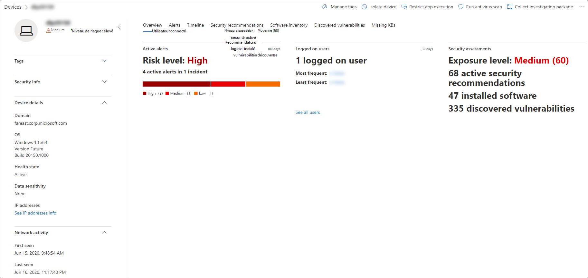

> [!NOTE]
> En raison des contraintes de produit, le profil d’appareil ne prend pas en compte toutes les cybermenaces lors de la détermination de la période « Dernière vue » (comme indiqué sur la page de l’appareil également).
> Par exemple, la valeur « Dernière vue » dans la page Appareil peut afficher une période plus ancienne, même si des alertes ou des données plus récentes sont disponibles dans la chronologie de l’ordinateur.

## Détails de l’appareil

La section Détails de l’appareil fournit des informations telles que le domaine, le système d’exploitation et l’état d’état de l’appareil. Si un package d’enquête est disponible sur l’appareil, vous verrez un lien qui vous permet de télécharger le package.

## Actions de réponse

Les actions de réponse s’exécutent le long de la partie supérieure d’une page d’appareil spécifique et incluent :

- Gérer des balises
- Isoler l’appareil
- Restreindre l’exécution des applications
- Exécuter une analyse antivirus
- Collecter un package d’examen
- Lancer une session de réponse en direct
- Lancer une enquête automatisée
- Consulter un spécialiste des menaces
- Centre de notifications

Vous pouvez prendre des mesures de réponse dans le centre de réponse, dans une page d’appareil spécifique ou dans une page de fichier spécifique.

Pour plus d’informations sur la façon d’agir sur un appareil, voir [Prendre une action de réponse sur un appareil.](respond-machine-alerts.md)

Pour plus d’informations, voir [Examiner les entités utilisateur.](investigate-user.md)

## Onglets

Les onglets fournissent des informations pertinentes sur la sécurité et la prévention des menaces relatives à l’appareil. Dans chaque onglet, vous pouvez personnaliser les  colonnes affichées en sélectionnant Personnaliser les colonnes dans la barre au-dessus des en-têtes de colonne.

### Présentation

**L’onglet** Vue d’ensemble affiche les [cartes](#cards) pour les alertes actives, les utilisateurs connectés et l’évaluation de la sécurité.

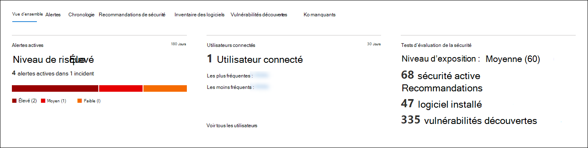

### Alertes

**L’onglet Alertes** fournit une liste des alertes associées à l’appareil. Cette liste est une version filtrée de la file d’attente des [alertes](alerts-queue.md)et affiche une brève description de l’alerte, de la gravité (élevée, moyenne, faible, informationnelle), de l’état dans la file d’attente (nouveau, en cours, résolu), de la classification (non définie, false alerte, alerte vraie), de l’état d’investigation, de la catégorie d’alerte, de la personne qui résout l’alerte et de la dernière activité. Vous pouvez également filtrer les alertes.

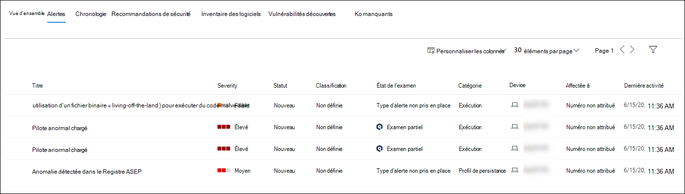

Lorsque l’icône de cercle à gauche d’une alerte est sélectionnée, un volant s’affiche. À partir de ce panneau, vous pouvez gérer l’alerte et afficher plus de détails, tels que le numéro d’incident et les appareils associés. Plusieurs alertes peuvent être sélectionnées à la fois.

Pour afficher une vue de page complète d’une alerte, y compris le graphique d’incident et l’arborescence de processus, sélectionnez le titre de l’alerte.

### Chronologie

**L’onglet** Chronologie fournit une vue chronologique des événements et des alertes associées qui ont été observés sur l’appareil. Cela peut vous aider à corréler tous les événements, fichiers et adresses IP par rapport à l’appareil.

La chronologie vous permet également d’aller de manière sélective dans les événements qui se sont produits au cours d’une période donnée. Vous pouvez afficher la séquence temporelle des événements qui se sont produits sur un appareil sur une période sélectionnée. Pour contrôler davantage votre affichage, vous pouvez filtrer par groupes d’événements ou personnaliser les colonnes.

> [!NOTE]
> Pour afficher les événements de pare-feu, vous devez activer la stratégie d’audit, voir Connexion à la plateforme de filtrage [d’audit.](/windows/security/threat-protection/auditing/audit-filtering-platform-connection)
>
> Le pare-feu couvre les événements suivants :
>
> - [5025](/windows/security/threat-protection/auditing/event-5025) : service de pare-feu arrêté
> - [5031](/windows/security/threat-protection/auditing/event-5031) : application bloquée pour accepter les connexions entrantes sur le réseau
> - [5157](/windows/security/threat-protection/auditing/event-5157) : connexion bloquée

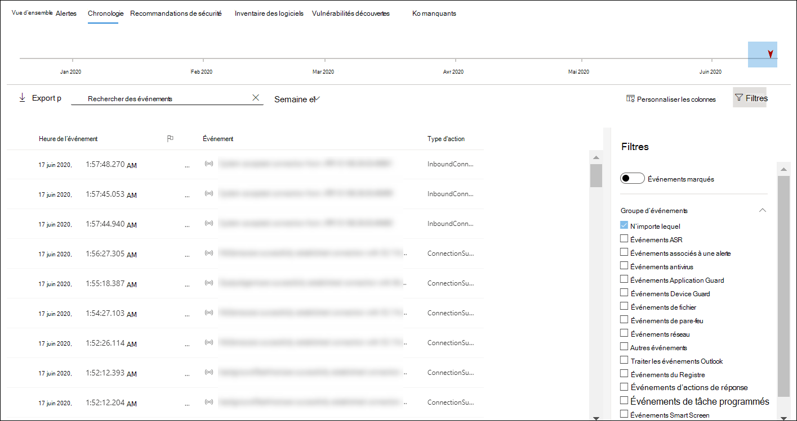

Voici quelques-unes des fonctionnalités :

- Rechercher des événements spécifiques
  - Utilisez la barre de recherche pour rechercher des événements de chronologie spécifiques.
- Filtrer les événements à partir d’une date spécifique
  - Sélectionnez l’icône de calendrier dans le coin supérieur gauche du tableau pour afficher les événements du dernier jour, semaine, 30 jours ou plage personnalisée. Par défaut, la chronologie de l’appareil est définie pour afficher les événements des 30 derniers jours.
  - Utilisez la chronologie pour passer à un moment spécifique dans le temps en mettant en surbrillance la section. Les flèches de la chronologie recherchent des investigations automatisées
- Exporter des événements de chronologie détaillés de l’appareil
  - Exportez la chronologie de l’appareil pour la date actuelle ou une plage de dates spécifiée jusqu’à sept jours.

Des informations supplémentaires sur certains événements sont fournies dans la section **Informations supplémentaires.** Ces détails varient en fonction du type d’événement, par exemple :

- Contenu par Application Guard : l’événement de navigateur web a été limité par un conteneur isolé
- Menace active détectée : la détection des menaces s’est produite pendant l’exécution de la menace
- Correction infructueuse : une tentative de correction de la menace détectée a été invoquée mais a échoué
- Correction réussie : la menace détectée a été arrêtée et nettoyée
- Avertissement contourné par l’utilisateur : l’avertissement Windows Defender SmartScreen a été rejeté et contourné par un utilisateur
- Script suspect détecté : un script potentiellement malveillant a été détecté en cours d’exécution
- Catégorie d’alerte : si l’événement a entraîné la génération d’une alerte, la catégorie d’alerte ( « Mouvement latéral », par exemple) est fournie.

#### Détails de l'événement

Sélectionnez un événement pour afficher les détails pertinents sur cet événement. Un panneau s’affiche pour afficher des informations générales sur les événements. Le cas échéant et si des données sont disponibles, un graphique montrant les entités associées et leurs relations est également affiché.

Pour inspecter plus en détail l’événement  et les événements connexes, vous pouvez rapidement exécuter une requête de recherche avancée en sélectionnant **Hunt pour les événements connexes.** La requête retourne l’événement sélectionné et la liste des autres événements qui se sont produits au même moment sur le même point de terminaison.

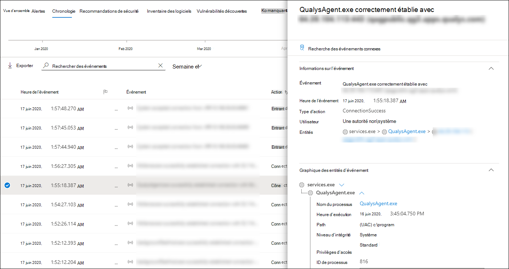

### Recommandations de sécurité

**Des recommandations en matière** de sécurité sont générées à partir de Microsoft Defender pour la fonctionnalité de gestion des menaces [& vulnérabilités du](tvm-dashboard-insights.md) point de terminaison. La sélection d’une recommandation affiche un panneau dans lequel vous pouvez afficher des détails pertinents, tels que la description de la recommandation et les risques potentiels associés à sa non-utilisation. Pour plus [d’informations, voir](tvm-security-recommendation.md) recommandations en matière de sécurité.

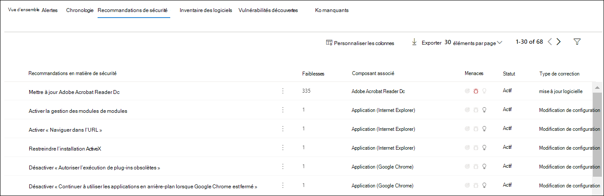

### Inventaire de logiciels

**L’onglet Inventaire** logiciel vous permet d’afficher le logiciel sur l’appareil, ainsi que les faiblesses ou menaces. La sélection du nom du logiciel vous permet d’afficher les recommandations de sécurité, les vulnérabilités découvertes, les appareils installés et la distribution des versions sur la page des détails du logiciel. Voir [l’inventaire logiciel](tvm-software-inventory.md) pour plus d’informations

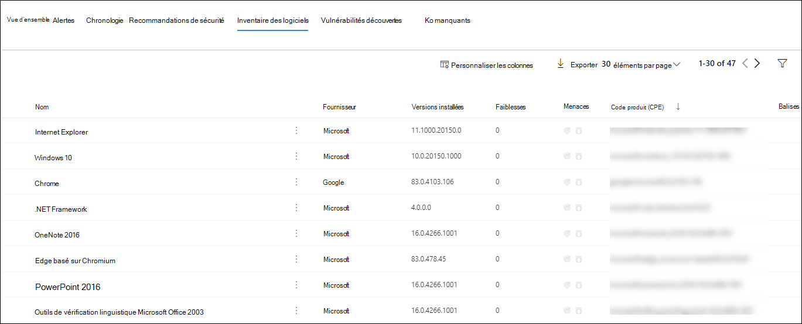

### Vulnérabilités découvertes

**L’onglet Vulnérabilités** découvertes affiche le nom, la gravité et les informations sur les menaces des vulnérabilités découvertes sur l’appareil. La sélection de vulnérabilités spécifiques affiche une description et des détails.

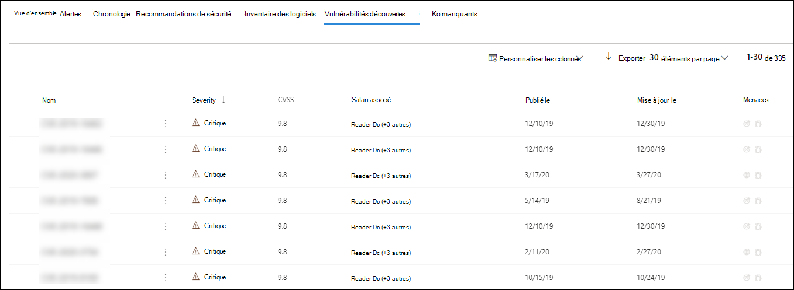

### Ko manquants
**L’onglet Ko manquant répertorie** les mises à jour de sécurité manquantes pour l’appareil.

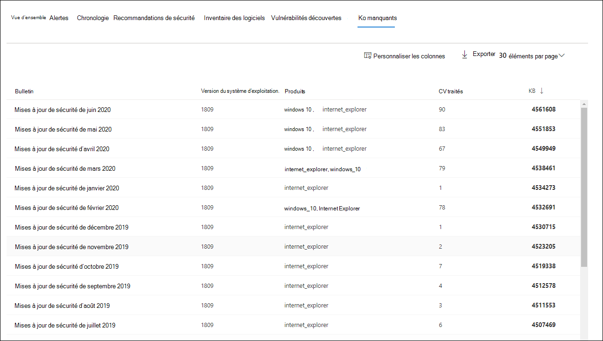

## Cartes

### Alertes actives

La carte **Azure Advanced Threat Protection** affiche une vue d’ensemble des alertes relatives à l’appareil et à son niveau de risque, si vous avez activé la fonctionnalité Microsoft Defender pour l’identité et qu’il existe des alertes actives. Plus d’informations sont disponibles dans l’exercice « Alertes ».

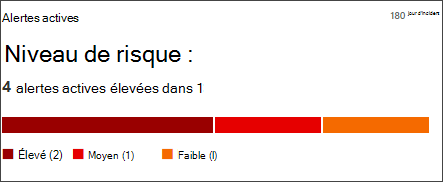

> [!NOTE]
> Vous devez activer l’intégration sur Microsoft Defender pour l’identité et Defender pour le point de terminaison pour utiliser cette fonctionnalité. Dans Defender pour point de terminaison, vous pouvez activer cette fonctionnalité dans les fonctionnalités avancées. Pour plus d’informations sur l’activer, voir [Activer les fonctionnalités avancées.](advanced-features.md)

### Utilisateurs connectés

La **carte Utilisateurs** connectés indique le nombre d’utilisateurs connectés au cours des 30 derniers jours, ainsi que les utilisateurs les plus fréquents et les moins fréquents. La sélection du lien « Afficher tous les utilisateurs » ouvre le volet d’informations, qui affiche des informations telles que le type d’utilisateur, le type de connexion et le moment où l’utilisateur a été vu pour la première fois et pour la dernière fois. Pour plus d’informations, voir [Examiner les entités utilisateur.](investigate-user.md)

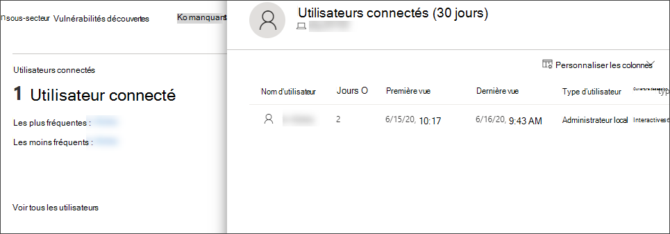

> [!NOTE]
> La valeur utilisateur « la plus fréquente » est calculée uniquement en fonction des preuves des utilisateurs qui ont ouvert une session interactive.
> Toutefois, le volet latéral « Tous les utilisateurs » calcule toutes sortes d’utilisateurs qui se connectent afin de voir des utilisateurs plus fréquents dans le volet latéral, étant donné que ces utilisateurs peuvent ne pas être interactifs.

### Tests d’évaluation de la sécurité

La **carte d’évaluation de** la sécurité indique le niveau d’exposition global, les recommandations en matière de sécurité, les logiciels installés et les vulnérabilités découvertes. Le niveau d’exposition d’un appareil est déterminé par l’impact cumulé de ses recommandations de sécurité en attente.

## Voir aussi

- [Afficher et organiser la file d’attente d’alertes Microsoft Defender pour point de terminaison](alerts-queue.md)
- [Gérer les alertes microsoft Defender pour les points de terminaison](manage-alerts.md)
- [Examiner microsoft Defender pour les alertes de point de terminaison](investigate-alerts.md)
- [Examiner un fichier associé à une alerte Defender for Endpoint](investigate-files.md)
- [Examiner une adresse IP associée à une alerte Defender for Endpoint](investigate-ip.md)
- [Examiner un domaine associé à une alerte Defender for Endpoint](investigate-domain.md)
- [Examiner un compte d’utilisateur dans Defender for Endpoint](investigate-user.md)
- [Recommandations en matière de sécurité](tvm-security-recommendation.md)
- [Inventaire des logiciels](tvm-software-inventory.md)
