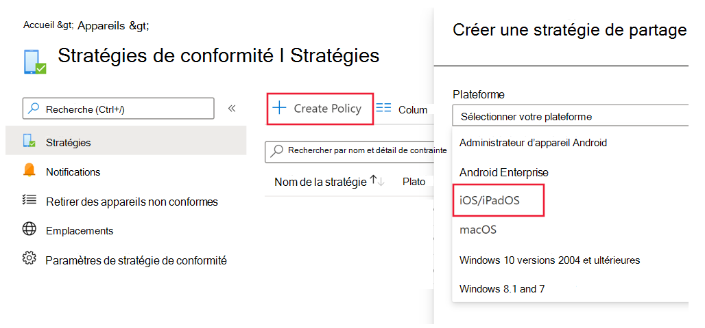
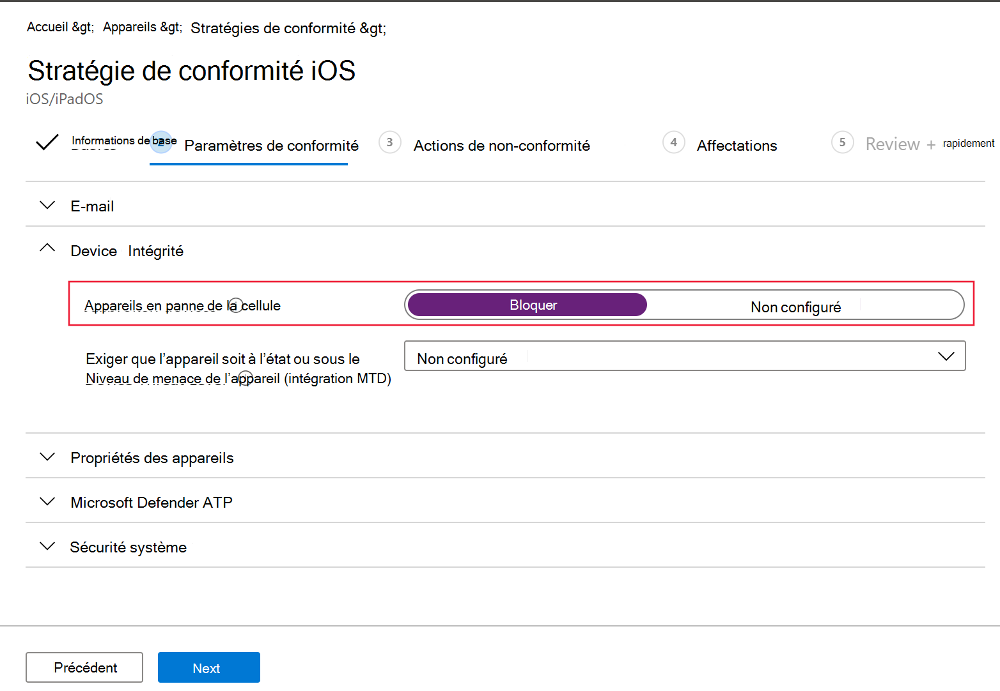
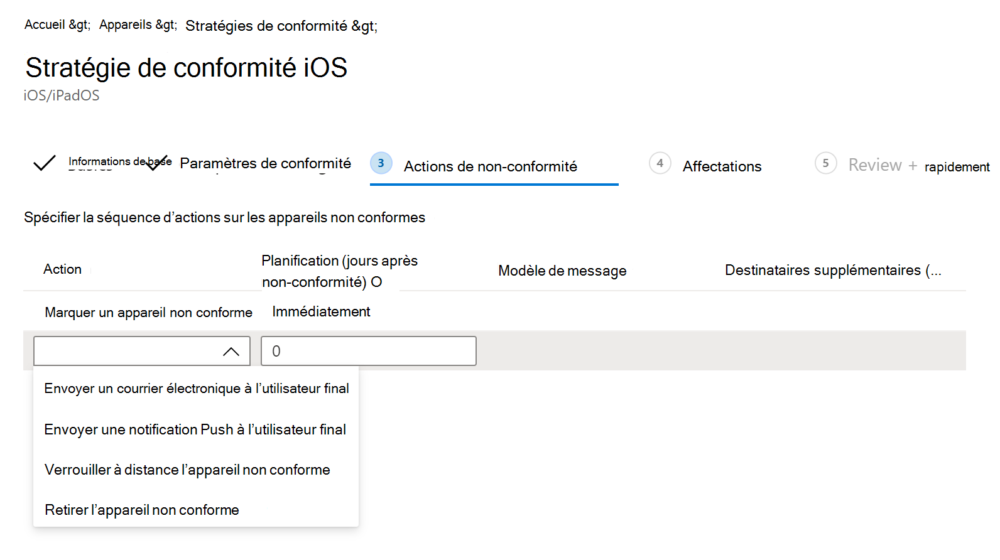

# Configurer Microsoft Defender pour endpoint sur les fonctionnalités iOS

[!INCLUDE [Microsoft 365 Defender rebranding](../../includes/microsoft-defender.md)]

**S’applique à :**
- [Microsoft Defender pour point de terminaison](https://go.microsoft.com/fwlink/p/?linkid=2154037)
- [Microsoft 365 Defender](https://go.microsoft.com/fwlink/?linkid=2118804)

> Vous souhaitez faire l’expérience de Defender for Endpoint ? [Inscrivez-vous à un essai gratuit.](https://www.microsoft.com/microsoft-365/windows/microsoft-defender-atp?ocid=docs-wdatp-exposedapis-abovefoldlink) 

> [!NOTE]
> Defender pour le point de terminaison sur iOS utiliserait un VPN pour fournir la fonctionnalité de protection web. Il ne s’agit pas d’un VPN normal et d’un VPN local/en boucle autonome qui ne prend pas le trafic en dehors de l’appareil.

## Accès conditionnel avec Defender pour point de terminaison sur iOS  
Microsoft Defender pour endpoint sur iOS, ainsi que Microsoft Intune et Azure Active Directory permet d’appliquer la conformité des appareils et les stratégies d’accès conditionnel en fonction du score de risque de l’appareil. Defender pour point de terminaison est une solution de défense contre les menaces mobiles (MTD) que vous pouvez déployer pour tirer parti de cette fonctionnalité via Intune.

Pour plus d’informations sur la façon de configurer l’accès conditionnel avec Defender pour Endpoint sur iOS, voir [Defender pour Endpoint et Intune.](/mem/intune/protect/advanced-threat-protection)

### Détection de jailbreak par Microsoft Defender pour le point de terminaison
Microsoft Defender pour le point de terminaison a la capacité de détecter les appareils non gérés et gérés qui sont jailbreakés. Si un appareil est détecté comme jailbreaké, une alerte à risque élevé est signalée au Centre de sécurité et si l’accès conditionnel est configuré en fonction du score de risque de l’appareil, l’appareil ne pourra pas accéder aux données d’entreprise. 

## Protection web et VPN

Par défaut, Defender pour le point de terminaison sur iOS inclut et active la fonctionnalité de protection web. [La protection web permet](web-protection-overview.md) de sécuriser les appareils contre les menaces web et de protéger les utilisateurs contre les attaques par hameçonnage. Defender pour le point de terminaison sur iOS utilise un VPN pour fournir cette protection. Notez qu’il s’agit d’un VPN local et, contrairement au VPN traditionnel, le trafic réseau n’est pas envoyé en dehors de l’appareil.

Bien qu’il soit activé par défaut, il se peut que vous de soyez dans certains cas dans l’obligation de désactiver le VPN. Par exemple, vous souhaitez exécuter certaines applications qui ne fonctionnent pas lorsqu’un VPN est configuré. Dans ce cas, vous pouvez choisir de désactiver le VPN de l’application sur l’appareil en suivant les étapes ci-dessous :

1. Sur votre appareil iOS, ouvrez **l’application Paramètres,** cliquez ou appuyez sur **Général,** puis **sur VPN.**
1. Cliquez ou appuyez sur le bouton « i » de Microsoft Defender pour le point de terminaison.
1. Désactivez la **Connecter à la demande** pour désactiver le VPN.

    > [!div class="mx-imgBorder"]
    > 

> [!NOTE]
> La protection web n’est pas disponible lorsque le VPN est désactivé. Pour activer à nouveau la Protection Web, ouvrez l’application Microsoft Defender pour point de terminaison sur l’appareil, puis cliquez ou appuyez sur **Démarrer le VPN.**

## Coexistence de plusieurs profils VPN

Apple iOS ne prend pas en charge plusieurs VPN à l’échelle de l’appareil pour être actifs simultanément. Même si plusieurs profils VPN peuvent exister sur l’appareil, un seul VPN peut être actif à la fois.

## Configurer la stratégie de conformité contre les appareils jailbreakés

Pour protéger les données d’entreprise contre l’accès sur les appareils iOS jailbreakés, nous vous recommandons de configurer la stratégie de conformité suivante sur Intune.

> [!NOTE]
> La détection de jailbreak est une fonctionnalité fournie par Microsoft Defender pour Endpoint sur iOS. Toutefois, nous vous recommandons de configurer cette stratégie en tant que couche supplémentaire de défense contre les scénarios de jailbreak.

Suivez les étapes ci-dessous pour créer une stratégie de conformité contre les appareils jailbreakés.

1. In [Microsoft Endpoint Manager admin center](https://go.microsoft.com/fwlink/?linkid=2109431), go to **Devices**  ->  **Compliance policies** Create  ->  **Policy**. Sélectionnez « iOS/iPadOS » comme plateforme, puis cliquez sur **Créer.**

    > [!div class="mx-imgBorder"]
    > 

2. Spécifiez un nom de stratégie, par exemple « Stratégie de conformité pour jailbreak ».
3. Dans la page paramètres de conformité, cliquez  pour développer la **section** État de l’appareil, puis cliquez sur Bloquer pour les **appareils jailbreakés.**

    > [!div class="mx-imgBorder"]
    > 

4. Dans la *section Action pour non-conformité,* sélectionnez les actions en conformité avec vos besoins, puis sélectionnez **Suivant**.

    > [!div class="mx-imgBorder"]
    > 

5. Dans la section *Affectations,* sélectionnez les groupes d’utilisateurs que vous souhaitez inclure pour cette stratégie, puis sélectionnez **Suivant.**
6. Dans la section **Révision+Créer,** vérifiez que toutes les informations entrées sont correctes, puis sélectionnez **Créer.**

## Configurer des indicateurs personnalisés

Defender pour le point de terminaison sur iOS permet aux administrateurs de configurer également des indicateurs personnalisés sur les appareils iOS. Pour plus d’informations sur la configuration des indicateurs personnalisés, voir [Gérer les indicateurs.](/microsoft-365/security/defender-endpoint/manage-indicators)

> [!NOTE]
> Defender pour le point de terminaison sur iOS prend en charge la création d’indicateurs personnalisés uniquement pour les adresses IP et les URL/domaines.

## Signaler un site non sécurisé

Les sites web de hameçonnage usurpent l’identité de sites web dignes de confiance dans le but d’obtenir vos informations personnelles ou financières. Consultez la page [Fournir des commentaires sur la protection](https://www.microsoft.com/wdsi/filesubmission/exploitguard/networkprotection) du réseau si vous souhaitez signaler un site web qui pourrait être un site de hameçonnage.

