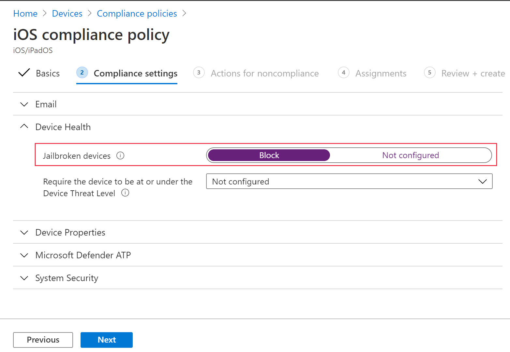

# Configurer Microsoft Defender pour le point de terminaison sur les fonctionnalités iOS

[!INCLUDE [Microsoft 365 Defender rebranding](../../includes/microsoft-defender.md)]

**S’applique à :**
- [Microsoft Defender pour point de terminaison Plan 2](https://go.microsoft.com/fwlink/p/?linkid=2154037)
- [Microsoft 365 Defender](https://go.microsoft.com/fwlink/?linkid=2118804)

> Vous souhaitez faire l’expérience de Defender for Endpoint ? [Inscrivez-vous pour bénéficier d’un essai gratuit.](https://signup.microsoft.com/create-account/signup?products=7f379fee-c4f9-4278-b0a1-e4c8c2fcdf7e&ru=https://aka.ms/MDEp2OpenTrial?ocid=docs-wdatp-exposedapis-abovefoldlink)

> [!NOTE]
> Defender pour le point de terminaison sur iOS utiliserait un VPN pour fournir la fonctionnalité de protection web. Il ne s’agit pas d’un VPN normal et d’un VPN local/en boucle autonome qui ne prend pas le trafic en dehors de l’appareil.

## Accès conditionnel avec Defender pour point de terminaison sur iOS

Microsoft Defender pour le point de terminaison sur iOS avec Microsoft Intune et Azure Active Directory permet d’appliquer la conformité des appareils et les stratégies d’accès conditionnel en fonction du score de risque de l’appareil. Defender pour point de terminaison est une solution de défense contre les menaces mobiles que vous pouvez déployer pour tirer parti de cette fonctionnalité via Intune.

Pour plus d’informations sur la façon de configurer l’accès conditionnel avec Defender pour Endpoint sur iOS, voir [Defender pour Endpoint et Intune](/mem/intune/protect/advanced-threat-protection).

### Détection de jailbreak par Microsoft Defender pour le point de terminaison

Microsoft Defender pour point de terminaison a la capacité de détecter les appareils non gérés et gérés qui sont jailbreakés. Si un appareil est détecté comme jailbreaké, une alerte à risque élevé est signalée au portail Microsoft 365 Defender et si l’accès conditionnel est configuré en fonction du score de risque de l’appareil, l’appareil ne pourra pas accéder aux données d’entreprise.

## Protection web et VPN

Par défaut, Defender pour le point de terminaison sur iOS inclut et active la fonctionnalité de protection web. La [protection web](web-protection-overview.md) permet de sécuriser les appareils contre les menaces web et de protéger les utilisateurs contre les attaques par hameçonnage. Notez que l’anti-hameçonnage et les indicateurs personnalisés (URL et adresses IP) sont pris en charge dans le cadre de la Protection Web. Le filtrage de contenu web n’est actuellement pas pris en charge sur iOS.

Defender pour le point de terminaison sur iOS utilise un VPN pour fournir cette fonctionnalité. Notez qu’il s’agit d’un VPN local et, contrairement au VPN traditionnel, le trafic réseau n’est pas envoyé à l’extérieur de l’appareil.

Bien qu’il soit activé par défaut, il se peut que vous de soyez dans certains cas dans l’obligation de désactiver le VPN. Par exemple, vous souhaitez exécuter certaines applications qui ne fonctionnent pas lorsqu’un VPN est configuré. Dans ce cas, vous pouvez choisir de désactiver le VPN de l’application sur l’appareil en suivant les étapes ci-dessous :

1. Sur votre appareil iOS, ouvrez **l’application Paramètres**, cliquez ou appuyez sur **Général**, puis **sur VPN**.
1. Cliquez ou appuyez sur le bouton « i » de Microsoft Defender pour le point de terminaison.
1. Désactivez la **Connecter à la demande** pour désactiver le VPN.

    > [!div class="mx-imgBorder"]
    > 

> [!NOTE]
> La protection web n’est pas disponible lorsque le VPN est désactivé. Pour activer à nouveau la Protection Web, ouvrez l’application Microsoft Defender pour point de terminaison sur l’appareil, puis cliquez ou appuyez sur **Démarrer le VPN**.

## Coexistence de plusieurs profils VPN

Apple iOS ne prend pas en charge plusieurs VPN à l’échelle de l’appareil pour être actifs simultanément. Alors que plusieurs profils VPN peuvent exister sur l’appareil, un seul VPN peut être actif à la fois.

## Configurer Microsoft Defender pour le signal de risque de point de terminaison dans la stratégie de protection des applications (MAM)

Microsoft Defender pour le point de terminaison peut être configuré pour envoyer des signaux de menace à utiliser dans les stratégies de protection des applications (APP, également appelée MAM) sur iOS/iPadOS. Avec cette fonctionnalité, vous pouvez également utiliser Microsoft Defender for Endpoint pour protéger l’accès aux données d’entreprise des appareils non inscrits.

Les étapes de configuration des stratégies de protection des applications avec Microsoft Defender for Endpoint sont les suivantes :

1. Configurer la connexion de votre client Microsoft Endpoint Manager microsoft Defender pour le point de terminaison. Dans le Centre d’administration [Microsoft Endpoint Manager](https://go.microsoft.com/fwlink/?linkid=2109431), sélectionnez **Connecteurs** \> **d’administration** \> des clients et jetons **Microsoft Defender** pour le point de terminaison (sous Plateforme croisée) \> ou Sécurité des points de terminaison **Microsoft Defender pour le** point de terminaison (sous Programme d’installation) et activer les boutons bascule sous App **Protection Policy Paramètres pour iOS**.
1. Sélectionnez Enregistrer. Vous devriez voir **que l’état de** la connexion est maintenant **activé**.
1. Créer une stratégie de protection des applications : une fois la configuration de votre connecteur Microsoft Defender pour point  de terminaison terminée, \> accédez aux stratégies De **protection** des applications (sous Stratégie) pour créer une stratégie ou mettre à jour une stratégie existante.
1. Sélectionnez les paramètres de plateforme, **d’applications, de protection des données et** d’accès requis par votre organisation pour votre stratégie.
1. Dans **les conditions de lancement conditionnel** \> de l’appareil, vous trouverez le paramètre **Niveau de menace maximum autorisé de l’appareil**. Il devra être configuré sur Faible, Moyen, Élevé ou Sécurisé. Les actions à votre disposition seront Bloquer **l’accès** ou **Effacer les données**. Vous pouvez voir une boîte de dialogue d’information pour vous assurer que votre connecteur est bien installé avant que ce paramètre prenne effet. Si votre connecteur est déjà installé, vous pouvez ignorer cette boîte de dialogue.
1. Terminez avec Affectations et enregistrez votre stratégie.

Pour plus d’informations sur la stratégie de protection des applications ou de gestion des applications, voir [les paramètres de stratégie de protection des applications iOS](/mem/intune/apps/app-protection-policy-settings-ios).

### Déploiement de Microsoft Defender pour le point de terminaison pour MAM ou sur des appareils non inscrits

Microsoft Defender pour le point de terminaison sur iOS active le scénario de stratégie de protection des applications et est disponible dans l’App Store d’Apple.

Les utilisateurs finaux doivent installer la dernière version de l’application directement à partir de l’App Store d’Apple.

## Contrôles de confidentialité

> [!IMPORTANT]
> Les contrôles de confidentialité pour Microsoft Defender pour point de terminaison sur iOS sont en prévisualisation. Les informations suivantes concernent les produits pré-publiés qui peuvent être considérablement modifiés avant leur commercialisation. Microsoft n’offre aucune garantie, explicite ou implicite, concernant les informations fournies ici.

### Configurer la confidentialité dans le rapport d’alerte d’hameçonnage

Les clients peuvent désormais activer le contrôle de confidentialité pour le rapport de hameçonnage envoyé par Microsoft Defender pour Endpoint sur iOS. Cela garantit que le nom de domaine n’est pas envoyé dans le cadre de l’alerte de hameçonnage chaque fois qu’un site web de hameçonnage est détecté et bloqué par Microsoft Defender pour le point de terminaison.

Utilisez les étapes suivantes pour activer la confidentialité et ne pas collecter le nom de domaine dans le cadre du rapport d’alerte de hameçonnage.

1. In [Microsoft Endpoint Manager admin center](https://go.microsoft.com/fwlink/?linkid=2109431) and go to **AppsApp** >  **configuration** **policiesAddManaged** >  >  **devices**.
1. Nommez la stratégie Platform **> iOS/iPadOS**, sélectionnez le type de profil.
1. **Sélectionnez Microsoft Defender pour le point de terminaison** comme application cible.
1. Dans Paramètres page, sélectionnez Utiliser le concepteur de **configuration** et ajoutez **DefenderExcludeURLInReport** comme clé et type de valeur **comme booléen**
   - Pour activer la confidentialité et ne pas collecter le nom de domaine, entrez la valeur en `true` tant que et affectez cette stratégie aux utilisateurs. Par défaut, cette valeur est définie sur `false`.
   - Pour les utilisateurs dont la clé est définie `true`comme étant , l’alerte de hameçonnage ne contient pas les informations de nom de domaine chaque fois qu’un site malveillant est détecté et bloqué par Defender for Endpoint.
1. Cliquez **sur Suivant** et affectez ce profil à des appareils/utilisateurs ciblés.

La mise en place ou la mise hors fonction des contrôles de confidentialité ci-dessus n’aura pas d’impact sur la vérification de la conformité de l’appareil ou l’accès conditionnel.

## Configurer la stratégie de conformité contre les appareils jailbreakés

Pour protéger les données d’entreprise contre l’accès sur les appareils iOS jailbreakés, nous vous recommandons de configurer la stratégie de conformité suivante sur Intune.

> [!NOTE]
> La détection de jailbreak est une fonctionnalité fournie par Microsoft Defender pour Endpoint sur iOS. Toutefois, nous vous recommandons de configurer cette stratégie en tant que couche supplémentaire de défense contre les scénarios de jailbreak.

Suivez les étapes ci-dessous pour créer une stratégie de conformité contre les appareils jailbreakés.

1. In [Microsoft Endpoint Manager admin center](https://go.microsoft.com/fwlink/?linkid=2109431), go to **DevicesCompliance** ->  **policiesCreate** ->  Policy. Sélectionnez « iOS/iPadOS » comme plateforme, puis cliquez sur **Créer**.

    > [!div class="mx-imgBorder"]
    > 

2. Spécifiez un nom de stratégie, par exemple « Stratégie de conformité pour jailbreak ».
3. Dans la page paramètres de conformité, cliquez pour développer **la section État** de  l’appareil, puis cliquez sur Bloquer pour les **appareils jailbreakés**.

    > [!div class="mx-imgBorder"]
    > 

4. Dans la **section Action pour non-conformité** , sélectionnez les actions selon vos besoins, puis sélectionnez **Suivant**.

    > [!div class="mx-imgBorder"]
    > 

5. Dans la section **Affectations** , sélectionnez les groupes d’utilisateurs à inclure pour cette stratégie, puis sélectionnez **Suivant**.
6. Dans la section **Révision+Créer** , vérifiez que toutes les informations entrées sont correctes, puis sélectionnez **Créer**.

## Configurer des indicateurs personnalisés

Defender pour le point de terminaison sur iOS permet aux administrateurs de configurer également des indicateurs personnalisés sur les appareils iOS. Pour plus d’informations sur la configuration des indicateurs personnalisés, voir [Gérer les indicateurs](/microsoft-365/security/defender-endpoint/manage-indicators).

> [!NOTE]
> Defender pour le point de terminaison sur iOS prend en charge la création d’indicateurs personnalisés uniquement pour les adresses IP et les URL/domaines.

## Configurer l’option pour envoyer des commentaires dans l’application 

Les clients ont désormais la possibilité de configurer la possibilité d’envoyer des données de commentaires à Microsoft dans l’application Defender for Endpoint. Les données de commentaires aident Microsoft à améliorer les produits et à résoudre les problèmes.

> [!NOTE]
> Pour les clients cloud du gouvernement des États-Unis, la collecte de données de commentaires **est désactivée** par défaut. 

Pour configurer l’option d’envoi de données de commentaires à Microsoft, utilisez les étapes suivantes :

1. In [Microsoft Endpoint Manager admin center](https://go.microsoft.com/fwlink/?linkid=2109431) and go to **AppsApp** >  **configuration** **policiesAddManaged** >  >  **devices**.
1. Nommez la stratégie Platform **> iOS/iPadOS**, sélectionnez le type de profil.
1. **Sélectionnez Microsoft Defender pour le point de terminaison** comme application cible.
1. Dans Paramètres page, sélectionnez Utiliser le concepteur de **configuration** et **ajoutez DefenderSendFeedback** comme clé et type de valeur en tant que **Boolean**
   - Pour supprimer la possibilité pour les utilisateurs finaux de fournir des commentaires, `false` définissez la valeur comme et affectez cette stratégie aux utilisateurs. Par défaut, cette valeur est définie sur `true`. Pour les clients du gouvernement américain, la valeur par défaut est définie sur « false ».
   - `true`Pour les utilisateurs dont la clé est définie comme , il existe une option pour envoyer des données de commentaires à Microsoft au sein de l’application (Menu > Aide & commentaires > envoyer des commentaires à Microsoft)
1. Cliquez **sur Suivant** et affectez ce profil à des appareils/utilisateurs ciblés.

## Signaler un site non sécurisé

Les sites web de hameçonnage usurpent l’identité de sites web dignes de confiance dans le but d’obtenir vos informations personnelles ou financières. Consultez [la page Fournir des commentaires sur la protection](https://www.microsoft.com/wdsi/filesubmission/exploitguard/networkprotection) du réseau si vous souhaitez signaler un site web qui pourrait être un site de hameçonnage.
