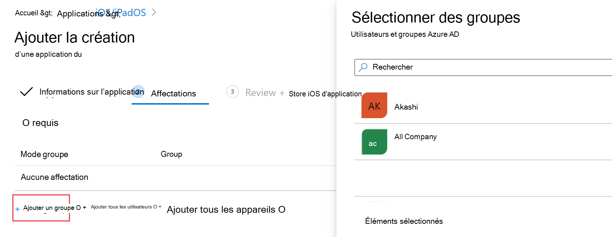
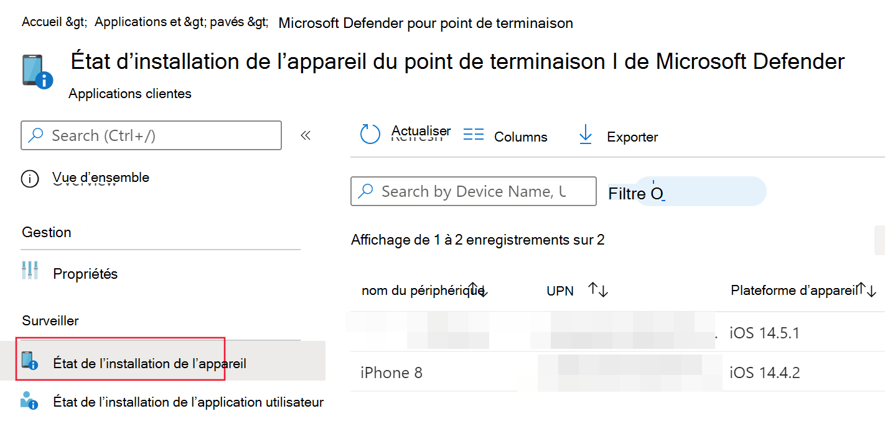
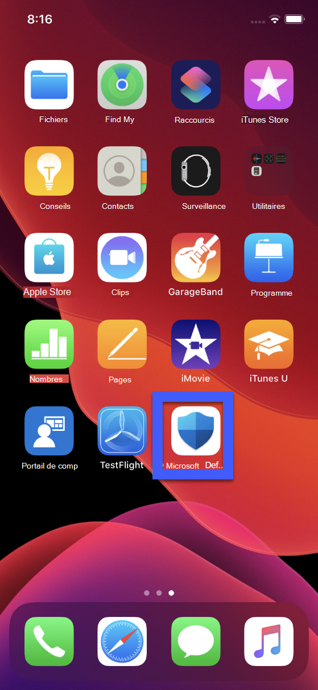

# Déployer Microsoft Defender pour le point de terminaison pour iOS

[!INCLUDE [Microsoft 365 Defender rebranding](../../includes/microsoft-defender.md)]

**S’applique à :**
- [Microsoft Defender pour point de terminaison](https://go.microsoft.com/fwlink/p/?linkid=2154037)
- [Microsoft 365 Defender](https://go.microsoft.com/fwlink/?linkid=2118804)

> Vous souhaitez faire l’expérience de Defender pour point de terminaison ? [Inscrivez-vous à un essai gratuit.](https://www.microsoft.com/microsoft-365/windows/microsoft-defender-atp?ocid=docs-wdatp-investigateip-abovefoldlink)

Cette rubrique décrit le déploiement de Defender pour endpoint pour iOS sur les appareils inscrits au portail d’entreprise Intune. Pour plus d’informations sur l’inscription d’appareils Intune, voir Inscrire des appareils [iOS/iPadOS dans Intune.](https://docs.microsoft.com/mem/intune/enrollment/ios-enroll)

## Avant de commencer

- Assurez-vous que vous avez accès au [Centre d’administration Microsoft Endpoint Manager.](https://go.microsoft.com/fwlink/?linkid=2109431)

- Assurez-vous que l’inscription iOS est effectuée pour vos utilisateurs. Une licence Defender pour point de terminaison doit être attribuée aux utilisateurs pour pouvoir utiliser Defender pour endpoint pour iOS. Reportez-vous [à Attribuer des licences aux](https://docs.microsoft.com/azure/active-directory/users-groups-roles/licensing-groups-assign) utilisateurs pour obtenir des instructions sur la façon d’attribuer des licences.

> [!NOTE]
> Microsoft Defender ATP (Microsoft Defender for Endpoint) pour iOS est désormais disponible dans [l’App Store d’Apple.](https://aka.ms/mdatpiosappstore)

## Étapes de déploiement

Déployez Defender pour le point de terminaison pour iOS via le portail d’entreprise Intune.

### Ajouter une application du Store iOS

1. Dans [le Centre d’administration Microsoft Endpoint Manager,](https://go.microsoft.com/fwlink/?linkid=2109431)allez à **Apps**  ->  **iOS/iPadOS** Ajouter une application de magasin  ->    ->  **iOS,** puis cliquez sur **Sélectionner.**

    > [!div class="mx-imgBorder"]
    > 

1. Dans la page Ajouter une application, cliquez sur Rechercher dans **l’App Store** et tapez **Microsoft Defender Endpoint** dans la barre de recherche. Dans la section des résultats de la recherche, cliquez sur Le point de terminaison *Microsoft Defender* et cliquez sur **Sélectionner.**

1. Sélectionnez **iOS 11.0 comme** système d’exploitation minimum. Consultez le reste des informations sur l’application et cliquez sur **Suivant.**

1. Dans la section *Affectations,* allez à la section **Obligatoire** et **sélectionnez Ajouter un groupe.** Vous pouvez ensuite choisir le ou les groupes d’utilisateurs que vous souhaitez cibler Defender pour le point de terminaison pour l’application iOS. Cliquez **sur Sélectionner,** puis **sur Suivant.**

    > [!NOTE]
    > Le groupe d’utilisateurs sélectionné doit être constitué d’utilisateurs inscrits à Intune.

    > [!div class="mx-imgBorder"]
    > 

1. Dans la section *Révision + Créer,* vérifiez que toutes les informations entrées sont correctes, puis sélectionnez **Créer.** Dans quelques instants, l’application Defender pour point de terminaison doit être créée correctement et une notification doit s’afficher dans le coin supérieur droit de la page.

1. Dans la page d’informations sur l’application  qui s’affiche, dans la **section** Moniteur, sélectionnez État de l’installation de l’appareil pour vérifier que l’installation de l’appareil s’est correctement terminée.

    > [!div class="mx-imgBorder"]
    > 

## Terminer l’intégration et vérifier l’état

1. Une fois Defender pour le point de terminaison pour iOS installé sur l’appareil, vous verrez l’icône de l’application.

    

2. Appuyez sur l’icône de l’application Defender for Endpoint et suivez les instructions à l’écran pour effectuer les étapes d’intégration. Les détails incluent l’acceptation par l’utilisateur final des autorisations iOS requises par Defender pour endpoint pour iOS.

3. Une fois l’intégration réussie, l’appareil commence à s’afficher dans la liste Appareils dans le Centre de sécurité Microsoft Defender.

    > [!div class="mx-imgBorder"]
    > 

## Configurer Microsoft Defender pour le point de terminaison pour le mode Supervisé

L’application Microsoft Defender pour endpoint pour iOS dispose d’une capacité spécialisée sur les appareils iOS/iPadOS supervisés, étant donné les fonctionnalités de gestion accrues fournies par la plateforme sur ces types d’appareils. Pour tirer parti de ces fonctionnalités, l’application Defender for Endpoint doit savoir si un appareil est en mode Supervisé.

### Configurer le mode Supervisé via Intune

Intune vous permet de configurer l’application Defender pour iOS via une stratégie de configuration d’application.

   > [!NOTE]
   > Cette stratégie de configuration d’application pour les appareils supervisés s’applique uniquement aux appareils gérés et doit être ciblée pour tous les appareils iOS gérés en tant que meilleure pratique.

1. Connectez-vous au Centre [d’administration Microsoft Endpoint Manager](https://go.microsoft.com/fwlink/?linkid=2109431) et allez aux stratégies de configuration des applications   >    >  **Ajouter.** Cliquez sur **Appareils gérés.**

    > [!div class="mx-imgBorder"]
    > 

1. Dans la page *Créer une stratégie de configuration d’application,* fournissez les informations suivantes :
    - Nom de la stratégie
    - Plateforme : sélectionner iOS/iPadOS
    - Application ciblée : sélectionnez **Microsoft Defender ATP** dans la liste

    > [!div class="mx-imgBorder"]
    > 

1. Dans l’écran suivant, sélectionnez Utiliser **le concepteur de configuration** comme format. Spécifiez la propriété suivante :
    - Clé de configuration : issupervised
    - Type de valeur : Chaîne
    - Valeur de configuration : {{issupervised}}
    
    > [!div class="mx-imgBorder"]
    > 

1. Cliquez **sur Suivant** pour ouvrir la page **Balises d’étendue.** Les balises d’étendue sont facultatives. Cliquez sur **Suivant** pour continuer.

1. Dans la page **Affectations,** sélectionnez les groupes qui recevront ce profil. Pour ce scénario, il est préférable de cibler **tous les appareils.** Pour plus d’informations sur l’attribution de profils, voir [Attribuer des profils utilisateur et d’appareil.](https://docs.microsoft.com/mem/intune/configuration/device-profile-assign)

   Lors du déploiement sur des groupes d’utilisateurs, un utilisateur doit se connecter à un appareil avant que la stratégie ne s’applique.

   Cliquez sur **Suivant**.

1. On the **Review + create** page, when you’re done, choose **Create**. Le nouveau profil s’affiche dans la liste des profils de configuration.

1. Ensuite, pour les fonctionnalités anti-hameçonnage améliorées, vous pouvez déployer un profil personnalisé sur les appareils iOS supervisés. Suivez les étapes ci-dessous :
    - Télécharger le profil de config à partir de [https://aka.ms/mdatpiossupervisedprofile](https://aka.ms/mdatpiossupervisedprofile)
    - Accéder aux **profils**  ->  **de configuration iOS/iPadOS** Des appareils  ->    ->  **créent un profil**

    > [!div class="mx-imgBorder"]
    > 

    - Fournissez le nom du profil. Lorsque vous avez été invité à importer un fichier de profil de configuration, sélectionnez celui téléchargé ci-dessus.
    - Dans la section **Affectation,** sélectionnez le groupe d’appareils auquel vous souhaitez appliquer ce profil. Il est préférable de l’appliquer à tous les appareils iOS gérés. Cliquez sur **Suivant**.
    - On the **Review + create** page, when you’re done, choose **Create**. Le nouveau profil s’affiche dans la liste des profils de configuration.

## Étapes suivantes

[Configurer Defender pour le point de terminaison pour les fonctionnalités iOS](ios-configure-features.md)
