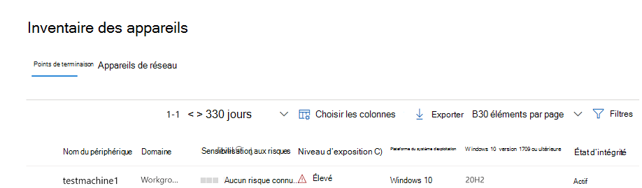

# Déployer Microsoft Defender pour le point de terminaison sur iOS

[!INCLUDE [Microsoft 365 Defender rebranding](../../includes/microsoft-defender.md)]

**S’applique à :**
- [Microsoft Defender pour point de terminaison Plan 1](https://go.microsoft.com/fwlink/p/?linkid=2154037)
- [Microsoft Defender pour point de terminaison Plan 2](https://go.microsoft.com/fwlink/p/?linkid=2154037)
- [Microsoft 365 Defender](https://go.microsoft.com/fwlink/?linkid=2118804)

> Vous souhaitez faire l’expérience de Defender for Endpoint ? [Inscrivez-vous pour bénéficier d’un essai gratuit.](https://signup.microsoft.com/create-account/signup?products=7f379fee-c4f9-4278-b0a1-e4c8c2fcdf7e&ru=https://aka.ms/MDEp2OpenTrial?ocid=docs-wdatp-investigateip-abovefoldlink)

Cette rubrique décrit le déploiement de Defender pour Endpoint sur iOS sur Portail d'entreprise Intune des appareils inscrits. Pour plus d’informations sur l’inscription d’appareils Intune, voir Inscrire des appareils [iOS/iPadOS dans Intune](/mem/intune/enrollment/ios-enroll).

## Avant de commencer

- Assurez-vous que vous avez accès au Centre [d’administration Microsoft Endpoint Manager](https://go.microsoft.com/fwlink/?linkid=2109431).

- Assurez-vous que l’inscription iOS est effectuée pour vos utilisateurs. Une licence Defender pour point de terminaison doit être attribuée aux utilisateurs pour pouvoir utiliser Defender pour Endpoint sur iOS. [Reportez-vous à Attribuer des licences aux](/azure/active-directory/users-groups-roles/licensing-groups-assign) utilisateurs pour obtenir des instructions sur la façon d’attribuer des licences.

> [!NOTE]
> Microsoft Defender pour le point de terminaison sur iOS est disponible dans [l’App Store d’Apple](https://aka.ms/mdatpiosappstore).

## Étapes de déploiement

Déployez Defender pour le point de terminaison sur iOS via Portail d'entreprise Intune.

### Ajouter une application du Store iOS

1. Dans [le Centre d’administration Microsoft Endpoint Manager](https://go.microsoft.com/fwlink/?linkid=2109431), allez à l’application du Magasin **AppsiOS** -> **/iPadOSAddiOS** ->  -> , puis cliquez sur **Sélectionner**.

    > [!div class="mx-imgBorder"]
    > 

1. Dans la page **Ajouter une** application, cliquez sur **Rechercher dans l’App Store** et tapez **Microsoft Defender pour le point** de terminaison dans la barre de recherche. Dans la section des résultats de la recherche, cliquez sur *Microsoft Defender pour le point de terminaison* et cliquez sur **Sélectionner**.

1. **Sélectionnez iOS 11.0 comme** système d’exploitation minimum. Consultez le reste des informations sur l’application et cliquez sur **Suivant**.

1. Dans la section **Affectations** , allez à la section **Obligatoire** et **sélectionnez Ajouter un groupe**. Vous pouvez ensuite choisir le ou les groupes d’utilisateurs que vous souhaitez cibler Defender pour le point de terminaison sur l’application iOS. Cliquez **sur Sélectionner** , puis **sur Suivant**.

    > [!NOTE]
    > Le groupe d’utilisateurs sélectionné doit être constitué d’utilisateurs inscrits à Intune.

    > [!div class="mx-imgBorder"]
    > 

1. Dans la section *Révision + Créer* , vérifiez que toutes les informations entrées sont correctes, puis sélectionnez **Créer**. Dans quelques instants, l’application Defender pour point de terminaison doit être créée correctement et une notification doit s’afficher dans le coin supérieur droit de la page.

1. Dans la page d’informations sur l’application qui s’affiche, dans  **la section Moniteur**, sélectionnez État de l’installation de l’appareil pour vérifier que l’installation de l’appareil s’est correctement terminée.

    > [!div class="mx-imgBorder"]
    > 

## Déploiement complet pour les appareils supervisés

Microsoft Defender pour le point de terminaison sur l’application iOS dispose d’une capacité spécialisée sur les appareils iOS/iPadOS supervisés, étant donné les fonctionnalités de gestion accrues fournies par la plateforme sur ces types d’appareils. Il peut également fournir une protection Web **sans configuration d’un VPN local sur l’appareil**. Cela offre aux utilisateurs finaux une expérience transparente tout en étant protégé contre le hameçonnage et d’autres attaques basées sur le web.

### Configurer le mode Supervisé via Intune

Ensuite, configurez le mode supervisé pour l’application Defender for Endpoint via une stratégie de configuration d’application.

   > [!NOTE]
   > Cette stratégie de configuration d’application pour les appareils supervisés s’applique uniquement aux appareils gérés et doit être ciblée pour tous les appareils iOS gérés en tant que meilleure pratique.

1. Connectez-vous au [centre Microsoft Endpoint Manager’administration](https://go.microsoft.com/fwlink/?linkid=2109431) et allez à **l’ajout** \> des stratégies **de configuration des applications**\>. Sélectionnez **Appareils gérés**.

    > [!div class="mx-imgBorder"]
    > 

1. Dans la page *Créer une stratégie de configuration d’application* , fournissez les informations suivantes :
    - Nom de la stratégie
    - Plateforme : sélectionner iOS/iPadOS
    - Application ciblée : sélectionnez **Microsoft Defender pour le point de terminaison** dans la liste

    > [!div class="mx-imgBorder"]
    > 

1. Dans l’écran suivant, sélectionnez Utiliser **le concepteur de configuration** comme format. Spécifiez la propriété suivante :
    - Clé de configuration : issupervised
    - Type de valeur : Chaîne
    - Valeur de configuration : {{issupervised}}

    > [!div class="mx-imgBorder"]
    > 

1. Sélectionnez **Suivant** pour ouvrir la page **Balises d’étendue**. Les balises d’étendue sont facultatives. Sélectionnez **Suivant** pour continuer.

1. Dans la page **Affectations**, sélectionnez les groupes qui recevront ce profil. Pour ce scénario, il est préférable de cibler **tous les appareils**. Pour plus d’informations sur l’affectation de profils, consultez [Affecter des profils d’utilisateur et d’appareil](/mem/intune/configuration/device-profile-assign).

   Lors du déploiement sur des groupes d’utilisateurs, un utilisateur doit se connecter à un appareil avant que la stratégie ne s’applique.

   Cliquez sur **Suivant**.

1. Dans la page **Vérifier + créer**, quand vous avez terminé, choisir **Créer**. Le nouveau profil s’affiche dans la liste des profils de configuration.

1. Ensuite, pour les fonctionnalités anti-hameçonnage améliorées, vous pouvez déployer un profil personnalisé sur les appareils iOS supervisés. Suivez les étapes ci-dessous :

    - Télécharger le profil de config à partir de [https://aka.ms/mdeiosprofilesupervised](https://aka.ms/mdeiosprofilesupervised)
    - Accéder à **DevicesiOS** -> **/iPadOSConfiguration** ->  **profilesCreate Profile** -> 

    > [!div class="mx-imgBorder"]
    > 
    
    - Fournissez le nom du profil. Lorsque vous avez été invité à importer un fichier de profil de configuration, sélectionnez celui téléchargé à l’étape précédente.
    - Dans la section **Affectation** , sélectionnez le groupe d’appareils auquel vous souhaitez appliquer ce profil. Il est préférable de l’appliquer à tous les appareils iOS gérés. Sélectionnez **Suivant**.
    - Dans la page **Vérifier + créer**, quand vous avez terminé, choisir **Créer**. Le nouveau profil s’affiche dans la liste des profils de configuration.

## Intégration automatique du profil VPN (intégration simplifiée)

Pour les appareils non pris en compte, un VPN est utilisé pour fournir la fonctionnalité de protection Web. Il ne s’agit pas d’un VPN normal et d’un VPN local/en boucle autonome qui ne prend pas le trafic en dehors de l’appareil.

>[!NOTE]
>Pour les appareils supervisés, un VPN n’est pas nécessaire pour la fonctionnalité de protection web et nécessite que les administrateurs configurer un profil de configuration sur les appareils supervisés. Pour configurer les appareils supervisés, suivez les étapes de la section Déploiement [complet des appareils supervisés](#complete-deployment-for-supervised-devices) .

Les administrateurs peuvent configurer la configuration automatique du profil VPN. Cela permet de configurer automatiquement le profil VPN Defender pour le point de terminaison sans que l’utilisateur le fait lors de l’intégration. 

Cette étape simplifie le processus d’intégration en mettant en place le profil VPN. Pour une expérience d’intégration sans contact ou sans écran, consultez la section suivante : [Intégration sans contact](#zero-touch-onboarding-of-microsoft-defender-for-endpoint-preview).

1. Dans [le Centre d’administration Microsoft Endpoint Manager](https://go.microsoft.com/fwlink/?linkid=2109431), sélectionnez **DevicesConfiguration** ->  **ProfilesCreate** ->  Profile.
1. Choisissez **Plateforme en** **tant que type iOS/iPadOS** et **Profil** **vpn**. Cliquez sur **Créer**.
1. Tapez un nom pour le profil, puis cliquez sur **Suivant**.
1. **Sélectionnez VPN personnalisé** pour le type de connexion et, dans la section **VPN de base**, entrez ce qui suit :
    - Nom de connexion = Microsoft Defender pour le point de terminaison
    - Adresse du serveur VPN = 127.0.0.1
    - Méthode Auth = « Nom d’utilisateur et mot de passe »
    - Tunneling fractionner = Désactiver
    - Identificateur VPN = com.microsoft.scmx
    - Dans les paires clé-valeur, entrez la clé **AutoOnboard** et définissez la valeur sur **True**.
    - Type de VPN automatique = VPN à la demande
    - Cliquez **sur** Ajouter pour **les règles à** la demande, puis sélectionnez Je veux faire ce qui suit **= Établir un VPN**, je souhaite me limiter **à = Tous les domaines**.

    

1. Cliquez sur Suivant et affectez le profil à des utilisateurs ciblés.
1. Dans la section *Révision + Créer* , vérifiez que toutes les informations entrées sont correctes, puis sélectionnez **Créer**.

## Intégration zero-touch de Microsoft Defender pour point de terminaison (prévisualisation)

> [!IMPORTANT]
> Certaines informations ont trait à un produit préalablement publié, qui peut être modifié de manière significative avant sa publication commerciale. Microsoft n’offre aucune garantie, explicite ou implicite, concernant les informations fournies ici.

> [!NOTE]
> La fonction Zero Touch ne peut pas être configurée sur les appareils iOS inscrits sans affinité utilisateur (appareils sans utilisateur ou appareils partagés).

Les administrateurs peuvent configurer Microsoft Defender pour le point de terminaison pour déployer et activer en mode silencieux. Dans ce flux, l’administrateur crée un profil de déploiement et l’utilisateur est simplement informé de l’installation. Defender pour le point de terminaison est installé automatiquement sans que l’utilisateur n’a besoin d’ouvrir l’application. Suivez les étapes ci-dessous pour configurer le déploiement zero-touch ou silencieux de Defender for Endpoint sur les appareils iOS inscrits :

1. Dans [le Centre d’administration Microsoft Endpoint Manager](https://go.microsoft.com/fwlink/?linkid=2109431), sélectionnez **DevicesConfiguration** >  **ProfilesCreate** >  Profile.
1. Choisissez **Plateforme en** **tant que type iOS/iPadOS** et **Profil** **vpn**. Sélectionnez **Créer**.
1. Tapez un nom pour le profil, puis sélectionnez **Suivant**.
1. **Sélectionnez VPN personnalisé** pour le type de connexion et, dans la section **VPN de base**, entrez ce qui suit :
    - Nom de connexion = Microsoft Defender pour le point de terminaison
    - Adresse du serveur VPN = 127.0.0.1
    - Méthode Auth = « Nom d’utilisateur et mot de passe »
    - Tunneling fractionner = Désactiver
    - Identificateur VPN = com.microsoft.scmx
    - Dans les paires clé-valeur, entrez la **clé SilentOnboard** et définissez la valeur sur **True**.
    - Type de VPN automatique = VPN à la demande
    - **Sélectionnez** Ajouter pour **les règles à** la demande et sélectionnez Je souhaite faire les choses suivantes **= Établir un VPN**, je souhaite me limiter **à = Tous les domaines**.

    

1. **Sélectionnez Suivant** et affectez le profil à des utilisateurs ciblés.
1. Dans la section *Révision + Créer* , vérifiez que toutes les informations entrées sont correctes, puis sélectionnez **Créer**.

Une fois la configuration ci-dessus effectuée et synchronisée avec l’appareil, les actions suivantes ont lieu sur les appareils iOS ciblés :
    - Microsoft Defender pour le point de terminaison sera déployé et intégré en mode silencieux, et l’appareil sera visible dans le portail Defender pour les points de terminaison.
    - Une notification provisoire sera envoyée à l’appareil de l’utilisateur.
    - La protection web et d’autres fonctionnalités seront activées.

   > [!NOTE]
   > Pour les appareils supervisés, bien qu’un profil VPN ne soit pas requis, les administrateurs peuvent toujours configurer l’intégration zero-touch en configurant le profil VPN Defender for Endpoint via Intune. Le profil VPN sera déployé sur l’appareil, mais il sera uniquement présent sur l’appareil en tant que profil pass-through et peut être supprimé après l’intégration initiale.

## Terminer l’intégration et vérifier l’état

1. Une fois Defender pour le point de terminaison sur iOS installé sur l’appareil, vous verrez l’icône de l’application.

    

2. Appuyez sur l’icône de l’application Defender for Endpoint (MSDefender) et suivez les instructions à l’écran pour effectuer les étapes d’intégration. Les détails incluent l’acceptation par l’utilisateur final des autorisations iOS requises par Defender pour endpoint sur iOS.

3. Une fois l’intégration réussie, l’appareil commence à s’afficher dans la liste Appareils du portail Microsoft 365 Defender web.

    > [!div class="mx-imgBorder"]
    > 

## Étapes suivantes

- [Configurer la stratégie de protection des applications pour inclure les signaux de risque defender pour les points de terminaison (MAM)](ios-install-unmanaged.md)
- [Configurer Defender pour endpoint sur les fonctionnalités iOS](ios-configure-features.md)
