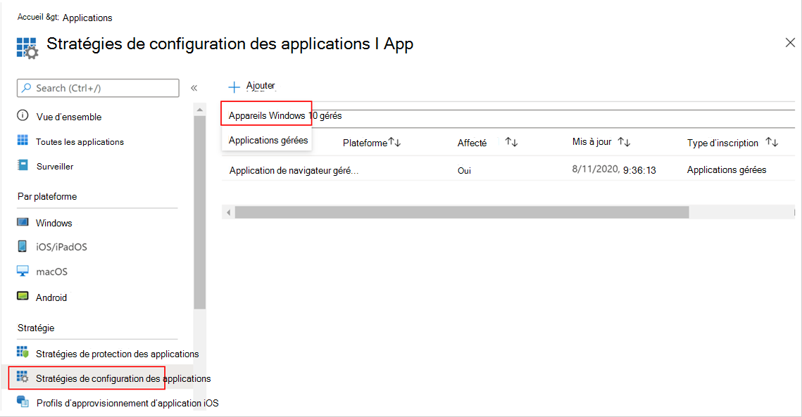
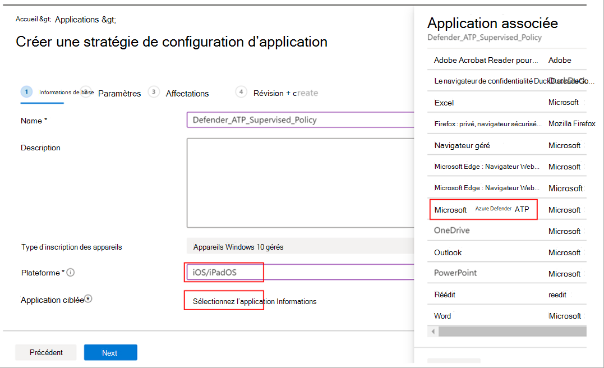
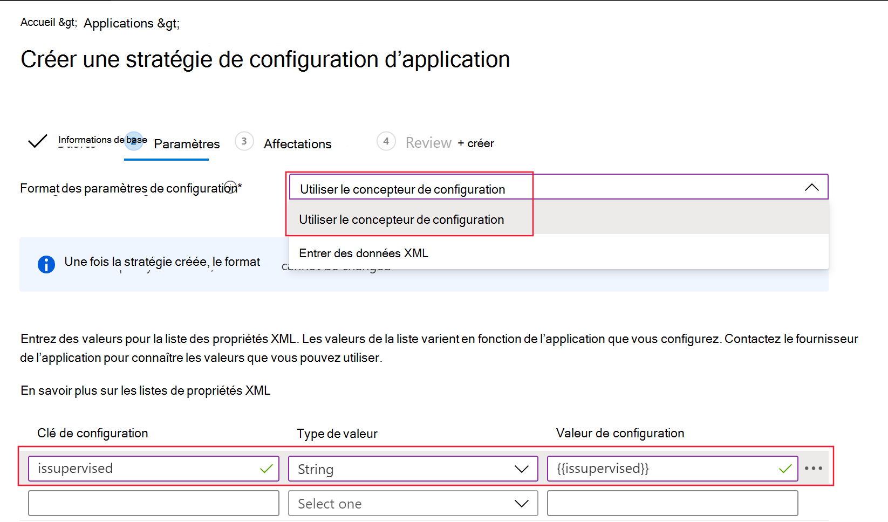

# Déployer Microsoft Defender pour point de terminaison sur iOS

[!INCLUDE [Microsoft 365 Defender rebranding](../../includes/microsoft-defender.md)]

**S’applique à :**
- [Microsoft Defender pour point de terminaison Plan 1](https://go.microsoft.com/fwlink/p/?linkid=2154037)
- [Microsoft Defender pour point de terminaison Plan 2](https://go.microsoft.com/fwlink/p/?linkid=2154037)
- [Microsoft 365 Defender](https://go.microsoft.com/fwlink/?linkid=2118804)

> Vous voulez découvrir Defender pour point de terminaison ? [Inscrivez-vous pour bénéficier d’un essai gratuit.](https://signup.microsoft.com/create-account/signup?products=7f379fee-c4f9-4278-b0a1-e4c8c2fcdf7e&ru=https://aka.ms/MDEp2OpenTrial?ocid=docs-wdatp-investigateip-abovefoldlink)

Cette rubrique décrit le déploiement de Defender pour point de terminaison sur iOS sur Portail d'entreprise Intune appareils inscrits. Pour plus d’informations sur Intune’inscription d’appareils, consultez [Inscrire des appareils iOS/iPadOS dans Intune](/mem/intune/enrollment/ios-enroll).

## Avant de commencer

- Vérifiez que vous avez accès au Centre d’administration [Microsoft Endpoint Manager](https://go.microsoft.com/fwlink/?linkid=2109431).

- Vérifiez que l’inscription iOS est effectuée pour vos utilisateurs. Les utilisateurs doivent disposer d’une licence Defender pour point de terminaison affectée afin d’utiliser Defender pour point de terminaison sur iOS. Reportez-vous à [Affecter des licences aux utilisateurs](/azure/active-directory/users-groups-roles/licensing-groups-assign) pour obtenir des instructions sur la façon d’attribuer des licences.

> [!NOTE]
> Microsoft Defender pour point de terminaison sur iOS est disponible dans le [App Store Apple](https://aka.ms/mdatpiosappstore).

## Étapes de déploiement

Déployez Defender pour point de terminaison sur iOS via Portail d'entreprise Intune.

### Ajouter une application du Store iOS

1. Dans le [Centre d’administration Microsoft Endpoint Manager](https://go.microsoft.com/fwlink/?linkid=2109431), accédez à **Apps** > **iOS/iPadOS** > **Add** > **iOS Store app** , puis cliquez sur **Sélectionner**.

    > :::image type="content" source="images/ios-deploy-1.png" alt-text="Onglet Ajouter des applications dans le Centre de Endpoint Manager Administration Microsoft" lightbox="images/ios-deploy-1.png":::

1. Dans la page **Ajouter une application**, cliquez sur **Rechercher dans le App Store** et tapez **Microsoft Defender** dans la barre de recherche. Dans la section résultats de la recherche, cliquez sur *Microsoft Defender*, puis sur **Sélectionner**.

1. Sélectionnez **iOS 11.0** comme système d’exploitation minimal. Passez en revue les autres informations sur l’application, puis cliquez sur **Suivant**.

1. Dans la section **Affectations** , accédez à la section **Obligatoire** et sélectionnez **Ajouter un groupe**. Vous pouvez ensuite choisir le ou les groupes d’utilisateurs que vous souhaitez cibler Defender pour point de terminaison sur l’application iOS. Cliquez sur **Sélectionner** , puis **sur Suivant**.

    > [!NOTE]
    > Le groupe d’utilisateurs sélectionné doit se composer de Intune utilisateurs inscrits.

   :::image type="content" source="images/ios-deploy-2.png" alt-text="Onglet Ajouter un groupe dans le Centre de Endpoint Manager Administration Microsoft" lightbox="images/ios-deploy-2.png":::

1. Dans la section *Vérifier + créer* , vérifiez que toutes les informations entrées sont correctes, puis sélectionnez **Créer**. Dans quelques instants, l’application Defender pour point de terminaison doit être créée correctement, et une notification doit s’afficher dans le coin supérieur droit de la page.

1. Dans la page d’informations de l’application qui s’affiche, dans la section **Moniteur** , sélectionnez **l’état d’installation** de l’appareil pour vérifier que l’installation de l’appareil s’est terminée correctement.

    > :::image type="content" source="images/ios-deploy-3.png" alt-text="Page État de l’installation de l’appareil" lightbox="images/ios-deploy-3.png":::

## Déploiement complet pour les appareils supervisés

Le Microsoft Defender pour point de terminaison sur l’application iOS dispose d’une capacité spécialisée sur les appareils iOS/iPadOS supervisés, compte tenu des fonctionnalités de gestion accrues fournies par la plateforme sur ces types d’appareils. Il peut également fournir une protection web **sans configurer de VPN local sur l’appareil**. Cela offre aux utilisateurs finaux une expérience transparente tout en étant protégés contre le hameçonnage et d’autres attaques basées sur le web.

Les administrateurs peuvent utiliser les étapes suivantes pour configurer des appareils supervisés.

### Configurer le mode supervisé via Intune

Configurez le mode supervisé pour l’application Defender pour point de terminaison via une stratégie de configuration d’application et un profil de configuration d’appareil.

#### Stratégie de configuration d’application

   > [!NOTE]
   > Cette stratégie de configuration d’application pour les appareils supervisés s’applique uniquement aux appareils gérés et doit être ciblée pour TOUS les appareils iOS gérés comme meilleure pratique.

1. Connectez-vous au Centre d’administration [Microsoft Endpoint Manager](https://go.microsoft.com/fwlink/?linkid=2109431) et accédez à **l’ajout** \> de stratégies \> de **configuration d’application** **d’applications**. Sélectionnez **Appareils gérés**.

    > [!div class="mx-imgBorder"]
    > 

1. Dans la page Créer une stratégie de *configuration d’application* , fournissez les informations suivantes :
    - Nom de la stratégie
    - Plateforme : Sélectionner iOS/iPadOS
    - Application ciblée : sélectionnez **Microsoft Defender pour point de terminaison** dans la liste

    > [!div class="mx-imgBorder"]
    > 

1. Dans l’écran suivant, **sélectionnez Utiliser le concepteur de configuration** comme format. Spécifiez la propriété suivante :
    - Clé de configuration : `issupervised`
    - Type de valeur : Chaîne
    - Valeur de configuration : `{{issupervised}}`

    > [!div class="mx-imgBorder"]
    > 

1. Sélectionnez **Suivant** pour ouvrir la page **Balises d’étendue**. Les balises d’étendue sont facultatives. Sélectionnez **Suivant** pour continuer.

1. Dans la page **Affectations**, sélectionnez les groupes qui recevront ce profil. Pour ce scénario, il est recommandé de cibler **tous les appareils**. Pour plus d’informations sur l’affectation de profils, consultez [Affecter des profils d’utilisateur et d’appareil](/mem/intune/configuration/device-profile-assign).

   Lors du déploiement sur des groupes d’utilisateurs, un utilisateur doit se connecter à un appareil avant que la stratégie ne s’applique.

   Cliquez sur **Suivant**.

1. Dans la page **Vérifier + créer**, quand vous avez terminé, choisir **Créer**. Le nouveau profil s’affiche dans la liste des profils de configuration.

#### Profil de configuration d’appareil

   > [!NOTE]
   > Pour les appareils qui exécutent iOS/iPadOS (en mode supervisé), il existe un profil **.mobileconfig** personnalisé, appelé profil **ControlFilter** disponible. Ce profil active la protection web **sans configurer le VPN de bouclage local sur l’appareil**. Cela offre aux utilisateurs finaux une expérience transparente tout en étant protégés contre le hameçonnage et d’autres attaques basées sur le web.

 Déployez un profil personnalisé sur des appareils iOS supervisés. Ceci est destiné aux fonctionnalités améliorées de lutte contre le hameçonnage. Suivez les étapes ci-dessous :

1. Télécharger le profil de configuration à partir de [https://aka.ms/mdeiosprofilesupervised](https://aka.ms/mdeiosprofilesupervised)
1. Accéder aux **appareils** > **iOS/iPadOS** > **Configuration profiles** > **Create Profile**
1. Sélectionner **les modèles** **de type de** >  profil et le **nom de modèle** > **personnalisés**

    > [!div class="mx-imgBorder"]
    > 

1. Indiquez le nom du profil. Lorsque vous êtes invité à importer un fichier de profil configuration, sélectionnez celui téléchargé à l’étape précédente.
1. Dans la section **Affectation** , sélectionnez le groupe d’appareils auquel vous souhaitez appliquer ce profil. Il est recommandé de l’appliquer à tous les appareils iOS gérés. Sélectionnez **Suivant**.
    > [!NOTE]
    > La création de groupes d’appareils est prise en charge dans Defender pour point de terminaison Plan 1 et Plan 2

1. Dans la page **Vérifier + créer**, quand vous avez terminé, choisir **Créer**. Le nouveau profil s’affiche dans la liste des profils de configuration.

## Intégration automatique du profil VPN (intégration simplifiée)

Pour les appareils non supervisés, un VPN est utilisé pour fournir la fonctionnalité de protection web. Il ne s’agit pas d’un VPN normal et d’un VPN local/auto-bouclage qui ne prend pas le trafic en dehors de l’appareil.

>[!NOTE]
>Pour les appareils supervisés, un VPN n’est pas nécessaire pour la fonctionnalité de protection web et exige que les administrateurs configurent un profil de configuration sur les appareils supervisés. Pour configurer les appareils supervisés, suivez les étapes décrites dans la section [Déploiement complet pour les appareils supervisés](#complete-deployment-for-supervised-devices) .

Les administrateurs peuvent configurer la configuration automatique du profil VPN. Cela configure automatiquement le profil VPN Defender pour point de terminaison sans que l’utilisateur le fasse lors de l’intégration.

Cette étape simplifie le processus d’intégration en configurant le profil VPN. Pour une expérience d’intégration sans contact ou sans assistance, consultez la section suivante : [Intégration sans contact](#zero-touch-onboarding-of-microsoft-defender-for-endpoint).

1. Dans le [Centre d’administration Microsoft Endpoint Manager](https://go.microsoft.com/fwlink/?linkid=2109431), accédez à **Profils** >  de configuration **des appareils** > **Créer un profil**.
1. Choisissez **Platform** as **iOS/iPadOS** et **Profile type** as **VPN**. Cliquez sur **Créer**.
1. Tapez un nom pour le profil, puis cliquez sur **Suivant**.
1. Sélectionnez **VPN personnalisé** pour le type de connexion et, dans la section **VPN de base** , entrez les éléments suivants :
    - Nom de la connexion = Microsoft Defender pour point de terminaison
    - Adresse du serveur VPN = 127.0.0.1
    - Méthode d’authentification = « Nom d’utilisateur et mot de passe »
    - Tunneling fractionné = Désactiver
    - Identificateur VPN = com.microsoft.scmx
    - Dans les paires clé-valeur, entrez la clé **AutoOnboard** et définissez la valeur **sur True**.
    - Type de VPN automatique = VPN à la demande
    - Sélectionnez **Ajouter** pour **les règles à la demande** , puis sélectionnez **Je souhaite effectuer les opérations suivantes : Connexion VPN**, **je souhaite limiter à = Tous les domaines**.

    :::image type="content" source="images/ios-deploy-8.png" alt-text="Onglet Paramètres de configuration du profil VPN" lightbox="images/ios-deploy-8.png":::
    - Pour imposer que le VPN ne peut pas être désactivé sur l’appareil des utilisateurs, les administrateurs peuvent sélectionner **Oui** pour **empêcher les utilisateurs de désactiver le VPN automatique**. Par défaut, il n’est pas configuré et les utilisateurs peuvent désactiver le VPN uniquement dans les paramètres.
    - Pour permettre aux utilisateurs de modifier le bouton bascule VPN à partir de l’application, ajoutez **EnableVPNToggleInApp = TRUE**, dans les paires clé-valeur. Par défaut, les utilisateurs ne peuvent pas modifier le bouton bascule à partir de l’application.

1. Cliquez sur Suivant et affectez le profil aux utilisateurs ciblés.
1. Dans la section *Vérifier + créer* , vérifiez que toutes les informations entrées sont correctes, puis sélectionnez **Créer**.

## Intégration sans contact de Microsoft Defender pour point de terminaison

> [!NOTE]
> Aucune interaction tactile ne peut être configurée sur les appareils iOS inscrits sans affinité utilisateur (appareils sans utilisateur ou appareils partagés).

Les administrateurs peuvent configurer Microsoft Defender pour point de terminaison pour déployer et s’activer en mode silencieux. Dans ce flux, l’administrateur crée un profil de déploiement et l’utilisateur est simplement informé de l’installation. Defender pour point de terminaison est automatiquement installé sans que l’utilisateur doive ouvrir l’application. Suivez les étapes ci-dessous pour configurer le déploiement sans contact ou silencieux de Defender pour point de terminaison sur les appareils iOS inscrits :

1. Dans le [Centre d’administration Microsoft Endpoint Manager](https://go.microsoft.com/fwlink/?linkid=2109431), accédez à **Profils** >  de configuration **des appareils** > **Créer un profil**.
1. Choisissez **Platform** as **iOS/iPadOS** et **Profile type** as **VPN**. Sélectionnez **Créer**.
1. Tapez un nom pour le profil, puis sélectionnez **Suivant**.
1. Sélectionnez **VPN personnalisé** pour le type de connexion et, dans la section **VPN de base** , entrez les éléments suivants :
    - Nom de la connexion = Microsoft Defender pour point de terminaison
    - Adresse du serveur VPN = 127.0.0.1
    - Méthode d’authentification = « Nom d’utilisateur et mot de passe »
    - Tunneling fractionné = Désactiver
    - Identificateur VPN = com.microsoft.scmx
    - Dans les paires clé-valeur, entrez la clé **SilentOnboard** et définissez la valeur sur **True**.
    - Type de VPN automatique = VPN à la demande
    - Sélectionnez **Ajouter** pour **les règles à la demande** , puis sélectionnez **Je souhaite effectuer les opérations suivantes : Connexion VPN**, **je souhaite limiter à = Tous les domaines**.

    :::image type="content" source="images/ios-deploy-9.png" alt-text="Page Configuration du profil VPN" lightbox="images/ios-deploy-9.png":::

    - Pour imposer que le VPN ne peut pas être désactivé sur l’appareil des utilisateurs, les administrateurs peuvent sélectionner **Oui** pour **empêcher les utilisateurs de désactiver le VPN automatique**. Par défaut, il n’est pas configuré et les utilisateurs peuvent désactiver le VPN uniquement dans les paramètres.
    - Pour permettre aux utilisateurs de modifier le bouton bascule VPN à partir de l’application, ajoutez **EnableVPNToggleInApp = TRUE**, dans les paires clé-valeur. Par défaut, les utilisateurs ne peuvent pas modifier le bouton bascule à partir de l’application.

1. Sélectionnez **Suivant** et affectez le profil aux utilisateurs ciblés.
1. Dans la section *Vérifier + créer* , vérifiez que toutes les informations entrées sont correctes, puis sélectionnez **Créer**.

Une fois la configuration ci-dessus effectuée et synchronisée avec l’appareil, les actions suivantes ont lieu sur le ou les appareils iOS ciblés :
    - Microsoft Defender pour point de terminaison sera déployé et intégré en mode silencieux et l’appareil sera affiché dans le portail Defender pour point de terminaison.
    - Une notification provisoire sera envoyée à l’appareil utilisateur.
    - La protection web et d’autres fonctionnalités seront activées.

   > [!NOTE]
   > Pour les appareils supervisés, bien qu’un profil VPN ne soit pas requis, les administrateurs peuvent toujours configurer l’intégration zero-touch en configurant le profil VPN Defender pour point de terminaison via Intune. Le profil VPN est déployé sur l’appareil, mais il est uniquement présent sur l’appareil en tant que profil direct et peut être supprimé après l’intégration initiale.

## Terminer l’intégration et vérifier l’état

1. Une fois defender pour point de terminaison sur iOS installé sur l’appareil, l’icône de l’application s’affiche.

    :::image type="content" source="images/41627a709700c324849bf7e13510c516.png" alt-text="Une description de téléphone intelligent générée automatiquement" lightbox="images/41627a709700c324849bf7e13510c516.png":::

2. Appuyez sur l’icône de l’application Defender pour point de terminaison (MSDefender) et suivez les instructions à l’écran pour effectuer les étapes d’intégration. Les détails incluent l’acceptation par l’utilisateur final des autorisations iOS requises par Defender pour point de terminaison sur iOS.

3. Une fois l’intégration réussie, l’appareil commence à s’afficher dans la liste Des appareils dans le portail Microsoft 365 Defender.

    > :::image type="content" source="images/device-inventory-screen.png" alt-text="Page Inventaire des appareils" lightbox="images/device-inventory-screen.png":::

## Configurer Microsoft Defender pour point de terminaison pour le mode supervisé

Le Microsoft Defender pour point de terminaison sur l’application iOS dispose d’une capacité spécialisée sur les appareils iOS/iPadOS supervisés, compte tenu des fonctionnalités de gestion accrues fournies par la plateforme sur ces types d’appareils. Pour tirer parti de ces fonctionnalités, l’application Defender pour point de terminaison doit savoir si un appareil est en mode supervisé.

### Configurer le mode supervisé via Intune

Intune vous permet de configurer l’application Defender pour iOS via une stratégie de App Configuration.

   > [!NOTE]
   > Cette stratégie de configuration d’application pour les appareils supervisés s’applique uniquement aux appareils gérés et doit être ciblée pour tous les appareils iOS gérés comme meilleure pratique.

1. Connectez-vous au Centre d’administration [Microsoft Endpoint Manager](https://go.microsoft.com/fwlink/?linkid=2109431) et accédez à **l’ajout** \> de stratégies \> de **configuration d’application** **d’applications**. Cliquez sur **Appareils gérés**.

    > :::image type="content" source="images/ios-deploy-4.png" alt-text="Option Appareils managés" lightbox="images/ios-deploy-4.png":::

1. Dans la page Créer une stratégie de *configuration d’application* , fournissez les informations suivantes :
    - Nom de la stratégie
    - Plateforme : Sélectionner iOS/iPadOS
    - Application ciblée : sélectionnez **Microsoft Defender pour point de terminaison** dans la liste

    > :::image type="content" source="images/ios-deploy-5.png" alt-text="Champs de base de la stratégie de configuration de l’application" lightbox="images/ios-deploy-5.png":::

1. Dans l’écran suivant, **sélectionnez Utiliser le concepteur de configuration** comme format. Spécifiez la propriété suivante :
    - Clé de configuration : `issupervised`
    - Type de valeur : Chaîne
    - Valeur de configuration : `{{issupervised}}`

    > :::image type="content" source="images/ios-deploy-6.png" alt-text="Page à partir de laquelle choisir le format des paramètres de la configuration de stratégie" lightbox="images/ios-deploy-6.png":::

1. Cliquez sur **Suivant** pour ouvrir la page **Balises d’étendue** . Les balises d’étendue sont facultatives. Cliquez sur **Suivant** pour continuer.

1. Dans la page **Affectations**, sélectionnez les groupes qui recevront ce profil. Pour ce scénario, il est recommandé de cibler **tous les appareils**. Pour plus d’informations sur l’affectation de profils, consultez [Affecter des profils d’utilisateur et d’appareil](/mem/intune/configuration/device-profile-assign).

   Lors du déploiement sur des groupes d’utilisateurs, un utilisateur doit se connecter à un appareil avant que la stratégie ne s’applique.

   Sélectionnez **Suivant**.

1. Dans la page **Vérifier + créer**, quand vous avez terminé, choisir **Créer**. Le nouveau profil s’affiche dans la liste des profils de configuration.

## Étapes suivantes

- [Configurer la stratégie de protection des applications pour inclure les signaux de risque defender pour point de terminaison (MAM)](ios-install-unmanaged.md)
- [Configurer Defender pour point de terminaison sur les fonctionnalités iOS](ios-configure-features.md)
