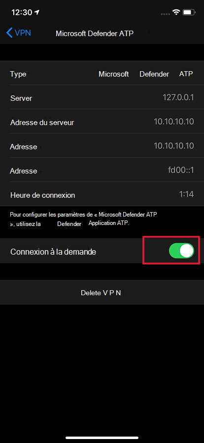

# Résoudre les problèmes et trouver des réponses aux questions fréquentes sur Microsoft Defender pour point de terminaison sur iOS

[!INCLUDE [Microsoft 365 Defender rebranding](../../includes/microsoft-defender.md)]

**S’applique à :**
- [Microsoft Defender pour point de terminaison](https://go.microsoft.com/fwlink/p/?linkid=2154037)
- [Microsoft 365 Defender](https://go.microsoft.com/fwlink/?linkid=2118804)

> Vous souhaitez faire l’expérience de Defender pour point de terminaison ? [Inscrivez-vous pour bénéficier d’un essai gratuit.](https://signup.microsoft.com/create-account/signup?products=7f379fee-c4f9-4278-b0a1-e4c8c2fcdf7e&ru=https://aka.ms/MDEp2OpenTrial?ocid=docs-wdatp-exposedapis-abovefoldlink)

Cette rubrique fournit des informations de dépannage pour vous aider à résoudre les problèmes qui peuvent survenir lorsque vous utilisez Microsoft Defender pour Endpoint sur iOS.

> [!NOTE]
> Defender pour le point de terminaison sur iOS utiliserait un VPN pour fournir la fonctionnalité de protection web. Il ne s’agit pas d’un VPN normal et d’un VPN local/en boucle autonome qui ne prend pas le trafic en dehors de l’appareil.

## Les applications ne fonctionnent pas lorsque le VPN est allumé
Certaines applications cessent de fonctionner lorsqu’un VPN actif est détecté. Vous pouvez désactiver le VPN pendant la durée d’utilisation de ces applications. 

Par défaut, Defender pour le point de terminaison sur iOS inclut et active la fonctionnalité de protection web. [La protection web permet](web-protection-overview.md) de sécuriser les appareils contre les menaces web et de protéger les utilisateurs contre les attaques par hameçonnage. Defender pour le point de terminaison sur iOS utilise un VPN pour fournir cette protection. Notez qu’il s’agit d’un VPN local et, contrairement au VPN traditionnel, le trafic réseau n’est pas envoyé en dehors de l’appareil.

Bien qu’il soit activé par défaut, il se peut que vous de soyez dans certains cas dans l’obligation de désactiver le VPN. Par exemple, vous souhaitez exécuter certaines applications qui ne fonctionnent pas lorsqu’un VPN est configuré. Dans ce cas, vous pouvez choisir de désactiver le VPN directement à partir de l’application Defender for Endpoint ou en suivant les étapes suivantes :

1. Sur votre appareil iOS, ouvrez **l’application Paramètres,** cliquez ou appuyez sur **Général,** puis **sur VPN.**
1. Cliquez ou appuyez sur le bouton « i » de Microsoft Defender pour le point de terminaison.
1. Désactivez la **Connecter à la demande** pour désactiver le VPN.

    > [!div class="mx-imgBorder"]
    > 

> [!NOTE]
> La protection web n’est pas disponible lorsque le VPN est désactivé. Pour ré-activer la Protection Web, ouvrez l’application Microsoft Defender pour point de terminaison sur l’appareil et activez la protection Web.

## Problèmes avec la carte d’état de l’appareil

Il existe un problème connu avec la carte d’état de l’appareil qui peut entraîner une notification incorrecte de mise à jour de la version iOS, même si l’utilisateur est sur la dernière version. Nous recommandons aux utilisateurs d’ignorer la notification de Defender for Endpoint. Cela n’a aucun impact sur la conformité des appareils. Nous travaillons pour résoudre ce problème et nous allons mettre à jour cet endroit une fois que nous avons une résolution.

## Coexistence avec plusieurs profils VPN

Apple iOS ne prend pas en **charge** plusieurs VPN à l’échelle de l’appareil pour être actifs simultanément. Même si plusieurs profils VPN peuvent exister sur l’appareil, un seul VPN peut être actif à la fois. Si vous devez utiliser un autre VPN sur l’appareil, vous pouvez désactiver Defender pour le VPN de point de terminaison lorsque vous utilisez l’autre VPN.

## Consommation de batterie

Pour vous fournir une protection en permanence contre les menaces basées sur le web, Microsoft Defender pour point de terminaison doit s’exécuter en arrière-plan en permanence. Cela peut entraîner une augmentation mineure de la consommation globale de la batterie de votre appareil.

En outre, dans l’Paramètres, iOS affiche uniquement l’utilisation de la batterie des applications visibles par l’utilisateur pendant une durée spécifique. L’utilisation de la batterie par les applications affichées à l’écran est uniquement pour cette durée et est calculée par iOS en fonction d’une multitude de facteurs, y compris l’utilisation du processeur et du réseau. Microsoft Defender pour le point de terminaison utilise un VPN local/de bouc-back en arrière-plan pour vérifier le trafic web des sites web ou connexions malveillants. Les paquets réseau de n’importe quelle application sont vérifiés et l’utilisation de la batterie de Microsoft Defender for Endpoint est calculée de manière incorrecte. La consommation réelle de batterie de Microsoft Defender pour le point de terminaison est inférieure à ce qui est affiché sur la page Paramètres batterie sur l’appareil.

En moyenne, l’utilisation quotidienne de la batterie par Microsoft Defender pour le point de terminaison s’exécutant en arrière-plan représente environ **8,81 %** de la batterie globale consommée au cours de ce jour. Cette mesure est signalée par Apple en fonction de l’utilisation réelle de Microsoft Defender pour Endpoint sur les appareils des utilisateurs finaux et, pour des raisons mentionnées ci-dessus, peut également être liée à d’autres applications qui ont une activité réseau.

En outre, le VPN utilisé est un VPN local et, contrairement à un VPN traditionnel, le trafic réseau n’est pas envoyé en dehors de l’appareil.

## Utilisation des données

Microsoft Defender pour le point de terminaison utilise un VPN local/loopback pour vérifier le trafic web des sites web ou connexions malveillants. Pour cette raison, l’utilisation des données de Microsoft Defender pour les points de terminaison peut être incorrectement expliquée. Nous avons également observé que si l’appareil est uniquement sur le réseau cellulaire, l’utilisation des données signalée par le fournisseur de services est très proche de la consommation réelle alors que dans l’application Paramètres, Apple affiche environ 1,5x à 2x de données réelles consommées.

Nous avons également des observations similaires avec d’autres services VPN et l’avons signalé à Apple.

En outre, il est essentiel que Microsoft Defender pour Point de terminaison soit à jour avec nos services de système principal afin de fournir une meilleure protection. Toutefois, nous travaillons sur l’optimisation de l’utilisation des données par Microsoft Defender pour endpoint.

## Signaler un site non sécurisé

Les sites web de hameçonnage usurpent l’identité de sites web dignes de confiance pour obtenir vos informations personnelles ou financières. Consultez la page [Fournir des commentaires sur la protection](https://www.microsoft.com/wdsi/support/report-unsafe-site) du réseau pour signaler un site web qui pourrait être un site de hameçonnage.

## Site malveillant détecté

Microsoft Defender pour le point de terminaison vous protège contre le hameçonnage ou d’autres attaques basées sur le web. Si un site malveillant est détecté, la connexion est bloquée et une alerte est envoyée au portail centre de sécurité de l’organisation. L’alerte inclut le nom de domaine de la connexion, l’adresse IP distante et les détails du périphérique.

En outre, une notification s’affiche sur l’appareil iOS. Appuyer sur la notification ouvre l’écran suivant pour que l’utilisateur examine les détails.

> [!div class="mx-imgBorder"]
> 

## Appareil non visible sur la console Defender for Endpoint après l’intégration.

Après l’intégration, l’appareil peut s’afficher dans l’inventaire des appareils dans la console de sécurité Defender for Endpoint. Assurez-vous également que l’appareil est correctement inscrit auprès Azure Active Directory et que l’appareil dispose d’une connectivité Internet. Pour que l’intégration réussisse, l’appareil doit être inscrit via Microsoft Authenticator ou Portail d'entreprise Intune et l’utilisateur doit se connecter à l’aide du même compte avec lequel l’appareil est inscrit auprès de Azure AD.

> [!NOTE]
> Parfois, le nom de l’appareil n’est pas cohérent avec celui de Microsoft Endpoint Manager console (Intune). Le nom de l’appareil dans la console Defender pour point de terminaison est au format <username_iPhone/iPad modèle>. Vous pouvez également utiliser Azure AD’ID d’appareil pour identifier l’appareil dans la console Defender for Endpoint.

## Données et confidentialité

Pour plus d’informations sur les données collectées et la confidentialité, voir Informations sur la confidentialité - Microsoft Defender pour point de [terminaison sur iOS](ios-privacy.md).

## Problèmes sur les appareils supervisés avec le profil de filtre de contenu installé

Un problème se produit sur les appareils supervisés avec le filtre de contenu Defender for Endpoint installé. Si vous observez une lenteur ou une latence dans la connectivité Internet sur ces appareils, désinstallez ou supprimez le profil de filtre de contenu de l’appareil. Nous travaillons pour résoudre ce problème et nous allons mettre à jour cet endroit une fois que nous avons une résolution. 

## Problèmes pendant les mises à jour de l’application à partir de l’App Store

Si vous observez des problèmes lors de la mise à jour de l’application via l’App Store (mises à jour automatiques ou manuelles), vous devrez peut-être redémarrer l’appareil. Si cela ne résout pas le problème, vous pouvez désactiver le VPN Defender et effectuer la mise à jour de l’application. Vous pouvez également fournir un commentaire dans l’application pour signaler ce problème.

## Envoyer des commentaires dans l’application

Si un utilisateur rencontre un problème qui n’est pas déjà résolu dans les sections ci-dessus ou n’est pas en mesure de résoudre à l’aide des étapes répertoriées, l’utilisateur peut fournir des commentaires dans l’application ainsi que des données de diagnostic. Notre équipe examine ensuite les journaux pour fournir la solution appropriée. Les utilisateurs peuvent utiliser les étapes suivantes pour envoyer des commentaires :

  - Ouvrez l’application MSDefender sur l’appareil iOS/iPadOS.
  - Appuyez sur Menu (icône de profil) dans le coin supérieur gauche.
  - Appuyez **sur Envoyer des commentaires.**
  - Choisissez parmi les options données. Pour signaler un problème, sélectionnez **« Je n’aime pas quelque chose**».
  - Fournissez des détails sur le problème auquel vous êtes confronté et vérifiez **envoyer les données de diagnostic.** Nous vous recommandons d’inclure votre adresse de messagerie afin que l’équipe puisse vous contacter pour obtenir une solution ou un suivi.
  - Appuyez **sur Envoyer** pour envoyer correctement les commentaires.

