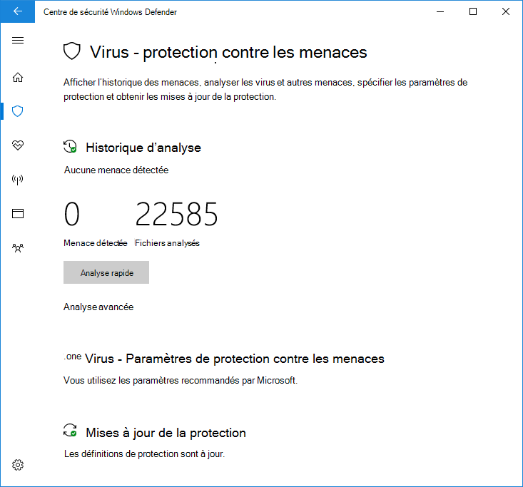

# Utilisez une analyse périodique limitée dans Antivirus Microsoft Defender

[!INCLUDE [Microsoft 365 Defender rebranding](../../includes/microsoft-defender.md)]

**S’applique à :**

- [Microsoft Defender pour point de terminaison](/microsoft-365/security/defender-endpoint/)

L’analyse périodique limitée est un type spécial de détection et de correction des menaces qui peut être activé lorsque vous avez installé un autre produit antivirus sur un Windows 10 périphérique.

Il ne peut être activé que dans certaines situations. Pour plus d’informations sur l’analyse périodique limitée et Antivirus Microsoft Defender avec d’autres produits antivirus, voir Antivirus Microsoft Defender [compatibilité.](microsoft-defender-antivirus-compatibility.md)

**Microsoft ne recommande pas l’utilisation de cette fonctionnalité dans les environnements d’entreprise. Il s’agit d’une fonctionnalité principalement destinée aux consommateurs.** Cette fonctionnalité utilise uniquement un sous-ensemble limité des fonctionnalités Antivirus Microsoft Defender pour détecter les programmes malveillants et ne peut pas détecter la plupart des programmes malveillants et des logiciels potentiellement indésirables. En outre, les fonctionnalités de gestion et de rapport seront limitées. Microsoft recommande aux entreprises de choisir leur solution antivirus principale et de l’utiliser exclusivement.

## Comment activer l’analyse périodique limitée

Par défaut, Antivirus Microsoft Defender s’active sur un appareil Windows 10 s’il n’existe aucun autre produit antivirus installé, ou si l’autre produit est périmé, expiré ou ne fonctionne pas correctement.

Si Antivirus Microsoft Defender est activé, les options habituelles s’affichent pour le configurer sur cet appareil :

Si un autre produit antivirus est installé et fonctionne correctement, Antivirus Microsoft Defender se désactive lui-même. L’application Sécurité Windows modifiera la section Protection contre les virus **&** contre les menaces pour afficher l’état du produit antivirus et fournira un lien vers les options de configuration du produit.

Sous les produits antivirus tiers, un nouveau lien s’affiche sous **la forme Antivirus Microsoft Defender options.** Cliquez sur ce lien pour afficher le bouton bascule qui permet une analyse périodique limitée. Notez que l’option périodique limitée est un basculement permettant d’activer ou de désactiver l’analyse périodique. 

Le fait de faire glisser le commutateur sur **On** affiche les options standard de l’Antivirus Microsoft Defender sous le produit antivirus tiers. L’option d’analyse périodique limitée s’affiche en bas de la page.

## Articles connexes

- [Configurer la protection comportementale, heuristique et en temps réel.](configure-protection-features-microsoft-defender-antivirus.md)
- [Antivirus Microsoft Defender dans Windows 10](microsoft-defender-antivirus-in-windows-10.md)