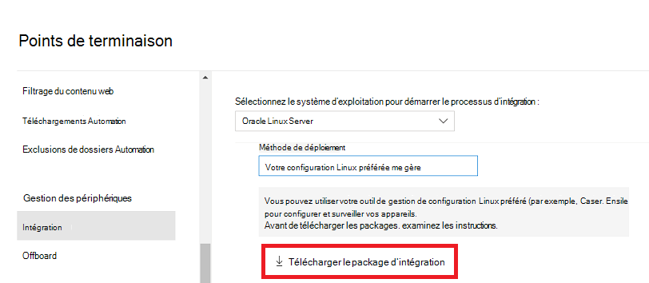

# <a name="deploy-microsoft-defender-for-endpoint-on-linux-with-ansible"></a>Déployer Microsoft Defender pour endpoint sur Linux avec Ansible

[!INCLUDE [Microsoft 365 Defender rebranding](../../includes/microsoft-defender.md)]


**S’applique à :**
- [Microsoft Defender pour point de terminaison](https://go.microsoft.com/fwlink/p/?linkid=2154037)
- [Microsoft 365 Defender](https://go.microsoft.com/fwlink/?linkid=2118804)

> Vous souhaitez faire l’expérience de Defender pour point de terminaison ? [Inscrivez-vous à un essai gratuit.](https://www.microsoft.com/microsoft-365/windows/microsoft-defender-atp?ocid=docs-wdatp-investigateip-abovefoldlink)

Cet article explique comment déployer Defender pour endpoint sur Linux à l’aide d’Ansible. Un déploiement réussi nécessite l’exécution de toutes les tâches suivantes :

- [Télécharger le package d’intégration](#download-the-onboarding-package)
- [Créer des fichiers YAML ansibles](#create-ansible-yaml-files)
- [Déploiement](#deployment)
- [Références](#references)

## <a name="prerequisites-and-system-requirements"></a>Conditions préalables et système requis

Avant de commencer, consultez la page principale de [Defender for Endpoint sur Linux](microsoft-defender-endpoint-linux.md) pour obtenir une description des conditions préalables et de la requise pour la version logicielle actuelle.

En outre, pour le déploiement Ansible, vous devez être familiarisé avec les tâches d’administration Ansible, configurer Ansible et savoir déployer des playbooks et des tâches. Ansible dispose de nombreuses façons d’effectuer la même tâche. Ces instructions supposent la disponibilité des modules Ansible pris en charge, tels que *apt* et *unarchive* pour vous aider à déployer le package. Votre organisation peut utiliser un flux de travail différent. Pour plus d’informations, voir la [documentation Ansible.](https://docs.ansible.com/)

- Ansible doit être installé sur au moins un ordinateur (Ansible l’appelle le nœud de contrôle).
- SSH doit être configuré pour un compte d’administrateur entre le nœud de contrôle et tous les nœuds gérés (sur les appareils sur qui Defender for Endpoint sera installé), et il est recommandé de le configurer avec l’authentification à clé publique.
- Les logiciels suivants doivent être installés sur tous les nodes gérés :
  - sous-président
  - python-apt

- Tous les nodes gérés doivent être répertoriés au format suivant dans le `/etc/ansible/hosts` fichier ou dans le fichier approprié :

    ```bash
    [servers]
    host1 ansible_ssh_host=10.171.134.39
    host2 ansible_ssh_host=51.143.50.51
    ```

- Test ping :

    ```bash
    ansible -m ping all
    ```

## <a name="download-the-onboarding-package"></a>Télécharger le package d’intégration

Téléchargez le package d’intégration à partir Microsoft 365 Defender portail :

1. Dans Microsoft 365 Defender portail, go to **Paramètres > Endpoints > Device management > Onboarding**.
2. Dans le premier menu déroulant, sélectionnez **Linux Server comme** système d’exploitation. Dans le deuxième menu déroulant, sélectionnez Votre outil de gestion de **configuration Linux préféré** comme méthode de déploiement.
3. Sélectionnez **Télécharger le package d’intégration.** Enregistrez le fichier sous WindowsDefenderATPOnboardingPackage.zip.

    

4. À partir d’une invite de commandes, vérifiez que vous avez le fichier. Extrayons le contenu de l’archive :

    ```bash
    ls -l
    ```
    ```Output
    total 8
    -rw-r--r-- 1 test  staff  4984 Feb 18 11:22 WindowsDefenderATPOnboardingPackage.zip
    ```
    ```bash
    unzip WindowsDefenderATPOnboardingPackage.zip
    ```
    ```Output
    Archive:  WindowsDefenderATPOnboardingPackage.zip
    inflating: mdatp_onboard.json
    ```

## <a name="create-ansible-yaml-files"></a>Créer des fichiers YAML ansibles

Créez une sous-tâche ou des fichiers de rôle qui contribuent à un manuel ou à une tâche.

- Créez la tâche d’intégration : `onboarding_setup.yml`

    ```bash
    - name: Create MDATP directories
      file:
        path: /etc/opt/microsoft/mdatp/
        recurse: true
        state: directory
        mode: 0755
        owner: root
        group: root

    - name: Register mdatp_onboard.json
      stat:
        path: /etc/opt/microsoft/mdatp/mdatp_onboard.json
      register: mdatp_onboard

    - name: Extract WindowsDefenderATPOnboardingPackage.zip into /etc/opt/microsoft/mdatp
      unarchive:
        src: WindowsDefenderATPOnboardingPackage.zip
        dest: /etc/opt/microsoft/mdatp
        mode: 0600
        owner: root
        group: root
      when: not mdatp_onboard.stat.exists
    ```

- Ajoutez la clé et le référentiel Defender pour points de terminaison : `add_apt_repo.yml`

    Defender for Endpoint sur Linux peut être déployé à partir de l’un des canaux suivants (indiqués ci-dessous sous le nom *[canal]*) : *insiders-fast,* *insiders-slow* ou *prod*. Chacun de ces canaux correspond à un référentiel de logiciels Linux.

    Le choix du canal détermine le type et la fréquence des mises à jour proposées à votre appareil. Les appareils *internes rapides* sont les premiers à recevoir des mises à jour et de nouvelles fonctionnalités, suivis ultérieurement par les *insiders-slow* et enfin par *prod*.

    Afin d’afficher un aperçu des nouvelles fonctionnalités et de fournir des commentaires préliminaires, il est recommandé de configurer certains appareils dans votre entreprise pour utiliser les *insiders-fast* ou *insider-slow*.

    > [!WARNING]
    > Le basculement du canal après l’installation initiale nécessite la réinstallation du produit. Pour basculer le canal de produit : désinstallez le package existant, configurez de nouveau votre appareil pour utiliser le nouveau canal et suivez les étapes de ce document pour installer le package à partir du nouvel emplacement.

    Notez votre distribution et version et identifiez l’entrée la plus proche sous `https://packages.microsoft.com/config/` .

    Dans les commandes suivantes, *remplacez [distro]* et *[version]* par les informations que vous avez identifiées.

    > [!NOTE]
    > Dans le cas d’Oracle Linux, *remplacez [distro]* par « rhel ».

  ```bash
  - name: Add Microsoft APT key
    apt_key:
      url: https://packages.microsoft.com/keys/microsoft.asc
      state: present
    when: ansible_os_family == "Debian"

  - name: Add Microsoft apt repository for MDATP
    apt_repository:
      repo: deb [arch=arm64,armhf,amd64] https://packages.microsoft.com/[distro]/[version]/prod [channel] main
      update_cache: yes
      state: present
      filename: microsoft-[channel]
    when: ansible_os_family == "Debian"

  - name: Add Microsoft DNF/YUM key
    rpm_key:
      state: present
      key: https://packages.microsoft.com/keys/microsoft.asc
    when: ansible_os_family == "RedHat"

  - name: Add  Microsoft yum repository for MDATP
    yum_repository:
      name: packages-microsoft-com-prod-[channel]
      description: Microsoft Defender for Endpoint
      file: microsoft-[channel]
      baseurl: https://packages.microsoft.com/[distro]/[version]/[channel]/
      gpgcheck: yes
      enabled: Yes
    when: ansible_os_family == "RedHat"
  ```

- Créez les fichiers YaML d’installation et de désinstallation Ansible.

    - Pour les distributions basées sur apt, utilisez le fichier YAML suivant :

        ```bash
        cat install_mdatp.yml
        ```
        ```Output
        - hosts: servers
          tasks:
            - include: ../roles/onboarding_setup.yml
            - include: ../roles/add_apt_repo.yml
            - name: Install MDATP
              apt:
                name: mdatp
                state: latest
                update_cache: yes
        ```

        ```bash
        cat uninstall_mdatp.yml
        ```
        ```Output
        - hosts: servers
          tasks:
            - name: Uninstall MDATP
              apt:
                name: mdatp
                state: absent
        ```

    - Pour les distributions basées sur dnf, utilisez le fichier YAML suivant :

        ```bash
        cat install_mdatp_dnf.yml
        ```
        ```Output
        - hosts: servers
          tasks:
            - include: ../roles/onboarding_setup.yml
            - include: ../roles/add_yum_repo.yml
            - name: Install MDATP
              dnf:
                name: mdatp
                state: latest
                enablerepo: packages-microsoft-com-prod-[channel]
        ```

        ```bash
        cat uninstall_mdatp_dnf.yml
        ```
        ```Output
        - hosts: servers
          tasks:
            - name: Uninstall MDATP
              dnf:
                name: mdatp
                state: absent
        ```

## <a name="deployment"></a>Déploiement

Exécutez maintenant les fichiers de tâches sous `/etc/ansible/playbooks/` ou dans le répertoire approprié.

- Installation :

    ```bash
    ansible-playbook /etc/ansible/playbooks/install_mdatp.yml -i /etc/ansible/hosts
    ```

> [!IMPORTANT]
> Lorsque le produit démarre pour la première fois, il télécharge les dernières définitions de logiciel anti-programme malveillant. Selon votre connexion Internet, cela peut prendre jusqu’à quelques minutes.

- Validation/configuration :

    ```bash
    ansible -m shell -a 'mdatp connectivity test' all
    ```
    ```bash
    ansible -m shell -a 'mdatp health' all
    ```

- Désinstallation :

    ```bash
    ansible-playbook /etc/ansible/playbooks/uninstall_mdatp.yml -i /etc/ansible/hosts
    ```

## <a name="log-installation-issues"></a>Journal des problèmes d’installation

Pour [plus d’informations](linux-resources.md#log-installation-issues) sur la recherche du journal généré automatiquement par le programme d’installation en cas d’erreur, voir problèmes d’installation des journaux.

## <a name="operating-system-upgrades"></a>Mises à niveau du système d’exploitation

Lors de la mise à niveau de votre système d’exploitation vers une nouvelle version majeure, vous devez d’abord désinstaller Defender pour Endpoint sur Linux, installer la mise à niveau, puis reconfigurer Defender pour Endpoint sur Linux sur votre appareil.

## <a name="references"></a>Références

- [Ajouter ou supprimer des référentiels YUM](https://docs.ansible.com/ansible/latest/collections/ansible/builtin/yum_repository_module.html)

- [Gérer les packages avec le gestionnaire de package dnf](https://docs.ansible.com/ansible/latest/collections/ansible/builtin/dnf_module.html)

- [Ajouter et supprimer des référentiels APT](https://docs.ansible.com/ansible/latest/collections/ansible/builtin/apt_repository_module.html)

- [Gérer les packages apt](https://docs.ansible.com/ansible/latest/collections/ansible/builtin/apt_module.html)

## <a name="see-also"></a>Voir aussi
- [Rechercher les problèmes d’état d’intégrité de l’agent](health-status.md)
