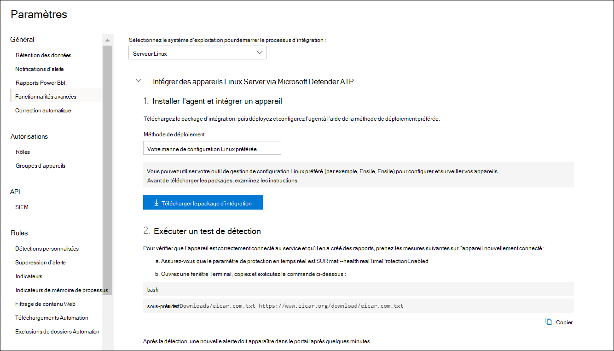

# <a name="deploy-microsoft-defender-for-endpoint-on-linux-with-ansible"></a>Déployer Microsoft Defender pour Endpoint sur Linux avec Ansible

[!INCLUDE [Microsoft 365 Defender rebranding](../../includes/microsoft-defender.md)]


**S’applique à :**
- [Microsoft Defender pour point de terminaison](https://go.microsoft.com/fwlink/p/?linkid=2154037)
- [Microsoft 365 Defender](https://go.microsoft.com/fwlink/?linkid=2118804)

> Vous voulez faire l’expérience de Defender for Endpoint ? [Inscrivez-vous à un essai gratuit.](https://www.microsoft.com/microsoft-365/windows/microsoft-defender-atp?ocid=docs-wdatp-investigateip-abovefoldlink)

Cet article décrit comment déployer Defender for Endpoint sur Linux à l’aide d’Ansible. Un déploiement réussi nécessite l’accomplissement de toutes les tâches suivantes :

- [Télécharger le paquet d’onboarding](#download-the-onboarding-package)
- [Créer des fichiers YAML Ansible](#create-ansible-yaml-files)
- [Déploiement](#deployment)
- [References](#references)

## <a name="prerequisites-and-system-requirements"></a>Conditions préalables et exigences du système

Avant de commencer, consultez le principal [Defender for Endpoint sur la page Linux pour une](microsoft-defender-endpoint-linux.md) description des conditions préalables et des exigences du système pour la version logicielle actuelle.

En outre, pour le déploiement Ansible, vous devez être familier avec les tâches d’administration Ansible, avoir Ansible configuré, et savoir comment déployer des playbooks et des tâches. Ansible a de nombreuses façons d’accomplir la même tâche. Ces instructions supposent la disponibilité de modules Ansible pris en charge, *tels que aptes* *et non architables pour* aider à déployer le paquet. Votre organisation peut utiliser un flux de travail différent. Consultez la [documentation Ansible pour plus](https://docs.ansible.com/) de détails.

- Ansible doit être installé sur au moins un ordinateur (Ansible appelle cela le nœud de contrôle).
- SSH doit être configuré pour un compte administrateur entre le nœud de contrôle et tous les nœuds gérés (périphériques qui auront Defender for Endpoint installé sur eux), et il est recommandé d’être configuré avec l’authentification de clé publique.
- Le logiciel suivant doit être installé sur tous les nœuds gérés :
  - friser
  - python-apt

- Tous les nœuds gérés doivent être répertoriés dans le format suivant dans `/etc/ansible/hosts` le fichier ou dans le fichier pertinent :

    ```bash
    [servers]
    host1 ansible_ssh_host=10.171.134.39
    host2 ansible_ssh_host=51.143.50.51
    ```

- Ping test:

    ```bash
    ansible -m ping all
    ```

## <a name="download-the-onboarding-package"></a>Télécharger le paquet d’onboarding

Téléchargez le paquet d’onboarding à partir Centre de sécurité Microsoft Defender :

1. Dans Centre de sécurité Microsoft Defender, allez à **la Paramètres > de l'> à bord**.
2. Dans le premier menu drop-down, sélectionnez **Linux Server comme** système d’exploitation. Dans le deuxième menu drop-down, sélectionnez **votre outil de gestion de configuration Linux préféré** comme méthode de déploiement.
3. Sélectionnez **Télécharger le paquet d’onboarding**. Enregistrez le fichier comme WindowsDefenderATPOnboardingPackage.zip.

    

4. À partir d’une invite de commande, vérifiez que vous avez le fichier. Extraire le contenu des archives :

    ```bash
    ls -l
    ```
    ```Output
    total 8
    -rw-r--r-- 1 test  staff  4984 Feb 18 11:22 WindowsDefenderATPOnboardingPackage.zip
    ```
    ```bash
    unzip WindowsDefenderATPOnboardingPackage.zip
    ```
    ```Output
    Archive:  WindowsDefenderATPOnboardingPackage.zip
    inflating: mdatp_onboard.json
    ```

## <a name="create-ansible-yaml-files"></a>Créer des fichiers YAML Ansible

Créez un sous-enregistrement ou des fichiers de rôle qui contribuent à un livre de jeux ou à une tâche.

- Créez la tâche d’onboarding, `onboarding_setup.yml` :

    ```bash
    - name: Create MDATP directories
      file:
        path: /etc/opt/microsoft/mdatp/
        recurse: true
        state: directory
        mode: 0755
        owner: root
        group: root

    - name: Register mdatp_onboard.json
      stat:
        path: /etc/opt/microsoft/mdatp/mdatp_onboard.json
      register: mdatp_onboard

    - name: Extract WindowsDefenderATPOnboardingPackage.zip into /etc/opt/microsoft/mdatp
      unarchive:
        src: WindowsDefenderATPOnboardingPackage.zip
        dest: /etc/opt/microsoft/mdatp
        mode: 0600
        owner: root
        group: root
      when: not mdatp_onboard.stat.exists
    ```

- Ajoutez le référentiel et la clé Defender for Endpoint `add_apt_repo.yml` :

    Defender for Endpoint sur Linux peut être déployé à partir de l’un des canaux suivants (indiqué ci-dessous *comme [canal]*: *initiés-rapide,* *initiés-lent,* *ou prod*. Chacun de ces canaux correspond à un référentiel logiciel Linux.

    Le choix du canal détermine le type et la fréquence des mises à jour qui sont offertes à votre appareil. Les appareils *en initiés-rapide sont* les premiers à recevoir des mises à jour et de nouvelles fonctionnalités, suivies plus tard *par les initiés lents* et enfin par *prod*.

    Afin de prévisualiser de nouvelles fonctionnalités et de fournir une rétroaction précoce, il est recommandé que vous configurez certains appareils de votre entreprise pour *utiliser soit insiders-fast* *ou insiders-slow*.

    > [!WARNING]
    > Changer le canal après l’installation initiale nécessite la réinstallation du produit. Pour changer le canal produit : désinstallez le paquet existant, reconfigurez votre appareil pour utiliser le nouveau canal et suivez les étapes de ce document pour installer le paquet à partir du nouvel emplacement.

    Notez votre distribution et votre version et identifiez l’entrée la plus proche pour elle sous `https://packages.microsoft.com/config/` .

    Dans les commandes suivantes, remplacez *[distro]* et *[version]* par les informations que vous avez identifiées.

    > [!NOTE]
    > Dans le cas d’Oracle Linux, *remplacer [distro]* par « rhel ».

  ```bash
  - name: Add Microsoft APT key
    apt_key:
      keyserver: https://packages.microsoft.com/
      id: BC528686B50D79E339D3721CEB3E94ADBE1229CF
    when: ansible_os_family == "Debian"

  - name: Add Microsoft apt repository for MDATP
    apt_repository:
      repo: deb [arch=arm64,armhf,amd64] https://packages.microsoft.com/[distro]/[version]/prod [channel] main
      update_cache: yes
      state: present
      filename: microsoft-[channel].list
    when: ansible_os_family == "Debian"

  - name: Add Microsoft DNF/YUM key
    rpm_key:
      state: present
      key: https://packages.microsoft.com/keys/microsoft.asc
    when: ansible_os_family == "RedHat"

  - name: Add  Microsoft yum repository for MDATP
    yum_repository:
      name: packages-microsoft-com-prod-[channel]
      description: Microsoft Defender for Endpoint
      file: microsoft-[channel]
      baseurl: https://packages.microsoft.com/[distro]/[version]/[channel]/
      gpgcheck: yes
      enabled: Yes
    when: ansible_os_family == "RedHat"
  ```

- Créez les fichiers Ansible installer et désinstaller YAML.

    - Pour les distributions basées sur les apts, utilisez le fichier YAML suivant :

        ```bash
        cat install_mdatp.yml
        ```
        ```Output
        - hosts: servers
          tasks:
            - include: ../roles/onboarding_setup.yml
            - include: ../roles/add_apt_repo.yml
            - name: Install MDATP
              apt:
                name: mdatp
                state: latest
                update_cache: yes
        ```

        ```bash
        cat uninstall_mdatp.yml
        ```
        ```Output
        - hosts: servers
          tasks:
            - name: Uninstall MDATP
              apt:
                name: mdatp
                state: absent
        ```

    - Pour les distributions basées sur dnf, utilisez le fichier YAML suivant :

        ```bash
        cat install_mdatp_dnf.yml
        ```
        ```Output
        - hosts: servers
          tasks:
            - include: ../roles/onboarding_setup.yml
            - include: ../roles/add_yum_repo.yml
            - name: Install MDATP
              dnf:
                name: mdatp
                state: latest
                enablerepo: packages-microsoft-com-prod-[channel]
        ```

        ```bash
        cat uninstall_mdatp_dnf.yml
        ```
        ```Output
        - hosts: servers
          tasks:
            - name: Uninstall MDATP
              dnf:
                name: mdatp
                state: absent
        ```

## <a name="deployment"></a>Déploiement

Exécutez maintenant les fichiers de tâches `/etc/ansible/playbooks/` sous ou répertoire pertinent.

- installation:

    ```bash
    ansible-playbook /etc/ansible/playbooks/install_mdatp.yml -i /etc/ansible/hosts
    ```

> [!IMPORTANT]
> Lorsque le produit démarre pour la première fois, il télécharge les dernières définitions antimalware. Selon votre connexion Internet, cela peut prendre jusqu’à quelques minutes.

- Validation/configuration :

    ```bash
    ansible -m shell -a 'mdatp connectivity test' all
    ```
    ```bash
    ansible -m shell -a 'mdatp health' all
    ```

- Désinstallation :

    ```bash
    ansible-playbook /etc/ansible/playbooks/uninstall_mdatp.yml -i /etc/ansible/hosts
    ```

## <a name="log-installation-issues"></a>Problèmes d’installation de journaux

Consultez [les problèmes d’installation du](linux-resources.md#log-installation-issues) journal pour plus d’informations sur la façon de trouver le journal généré automatiquement qui est créé par l’installateur lorsqu’une erreur se produit.

## <a name="operating-system-upgrades"></a>Mises à niveau du système d’exploitation

Lors de la mise à niveau de votre système d’exploitation vers une nouvelle version majeure, vous devez d’abord désinstaller Defender for Endpoint sur Linux, installer la mise à niveau, et enfin reconfigurer Defender pour Endpoint sur Linux sur votre appareil.

## <a name="references"></a>Références

- [Ajouter ou supprimer les référentiels YUM](https://docs.ansible.com/ansible/latest/collections/ansible/builtin/yum_repository_module.html)

- [Gérer les forfaits avec le gestionnaire de forfait dnf](https://docs.ansible.com/ansible/latest/collections/ansible/builtin/dnf_module.html)

- [Ajouter et supprimer les référentiels APT](https://docs.ansible.com/ansible/latest/collections/ansible/builtin/apt_repository_module.html)

- [Gérer les forfaits apt](https://docs.ansible.com/ansible/latest/collections/ansible/builtin/apt_module.html)

## <a name="see-also"></a>Voir aussi
- [Rechercher les problèmes d’état d’intégrité de l’agent](health-status.md)
