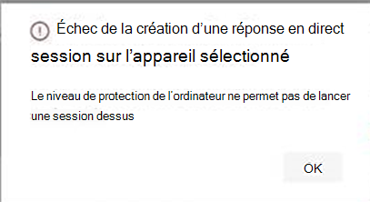

# <a name="investigate-entities-on-devices-using-live-response"></a>Examiner les entités sur les appareils à l’aide de la réponse en direct

[!INCLUDE [Microsoft 365 Defender rebranding](../../includes/microsoft-defender.md)]

**S’applique à :**
- [Microsoft Defender pour point de terminaison](https://go.microsoft.com/fwlink/p/?linkid=2146631)
- [Microsoft 365 Defender](https://go.microsoft.com/fwlink/?linkid=2118804)


> Vous souhaitez faire l’expérience de Defender for Endpoint ? [Inscrivez-vous à un essai gratuit.](https://www.microsoft.com/microsoft-365/windows/microsoft-defender-atp?ocid=docs-wdatp-investigateip-abovefoldlink)

La réponse en direct permet aux équipes d’opérations de sécurité d’accéder instantanément à un appareil (également appelé ordinateur) à l’aide d’une connexion Shell distante. Vous avez ainsi la puissance d’un travail d’examen approfondi et d’actions de réponse immédiates pour contenir rapidement des menaces identifiées, en temps réel. 

La réponse dynamique est conçue pour améliorer les enquêtes en permettant à votre équipe des opérations de sécurité de collecter des données d’investigation, d’exécuter des scripts, d’envoyer des entités suspectes pour analyse, de corriger les menaces et de chercher de manière proactive les menaces émergentes.<br/><br/>

> [!VIDEO https://www.microsoft.com/videoplayer/embed/RE4qLUW]

Avec la réponse en direct, les analystes peuvent effectuer toutes les tâches suivantes :
- Exécutez des commandes de base et avancées pour faire des investigations sur un appareil.
- Téléchargez des fichiers tels que des exemples de programmes malveillants et les résultats des scripts PowerShell.
- Téléchargez des fichiers en arrière-plan (nouveau !).
- Téléchargez un script PowerShell ou un exécutable dans la bibliothèque et exécutez-le sur un appareil à partir d’un niveau client.
- Prendre ou annuler des actions de correction.

## <a name="before-you-begin"></a>Avant de commencer

Avant de lancer une session sur un appareil, veillez à respecter les conditions suivantes :

- **Vérifiez que vous exécutez une version prise en charge de Windows.** <br/>
Les appareils doivent être en cours d’exécution dans l’une des versions suivantes de Windows.

  - **Windows 10**
    - [Version 1909 ou](https://docs.microsoft.com/windows/whats-new/whats-new-windows-10-version-1909) ultérieure  
    - [Version 1903 avec](https://docs.microsoft.com/windows/whats-new/whats-new-windows-10-version-1903) [KB4515384](https://support.microsoft.com/en-us/help/4515384/windows-10-update-kb4515384)
    - [Version 1809 (RS 5)](https://docs.microsoft.com/windows/whats-new/whats-new-windows-10-version-1809) avec [KB4537818](https://support.microsoft.com/help/4537818/windows-10-update-kb4537818)
    - [Version 1803 (RS 4)](https://docs.microsoft.com/windows/whats-new/whats-new-windows-10-version-1803) avec [KB4537795](https://support.microsoft.com/help/4537795/windows-10-update-kb4537795)
    - [Version 1709 (RS 3)](https://docs.microsoft.com/windows/whats-new/whats-new-windows-10-version-1709) avec [KB4537816](https://support.microsoft.com/help/4537816/windows-10-update-kb4537816)
  
  - **Windows Server 2019 : applicable uniquement pour la prévisualisation publique**
    - Version 1903 ou (avec [KB4515384)](https://support.microsoft.com/en-us/help/4515384/windows-10-update-kb4515384)ultérieure 
    - Version 1809 [(avec KB4537818)](https://support.microsoft.com/en-us/help/4537818/windows-10-update-kb4537818)

- **Activez la réponse en direct à partir de la page paramètres avancés.**<br>
Vous devez activer la fonctionnalité de réponse en direct dans la page [Paramètres des fonctionnalités avancées.](advanced-features.md)

    >[!NOTE]
    >Seuls les utilisateurs ayant des rôles d’administrateur global ou de sécurité peuvent modifier ces paramètres.

- **Activez la réponse en direct pour les serveurs à partir de la page paramètres avancés** (recommandé).<br>

    >[!NOTE]
    >Seuls les utilisateurs ayant des rôles d’administrateur global ou de sécurité peuvent modifier ces paramètres.
    
- **Assurez-vous que le niveau de correction Automation** est affecté à l’appareil.<br>
Vous devez activer, au moins, le niveau de correction minimal pour un groupe d’appareils donné. Sinon, vous ne pourrez pas établir une session Live Response à un membre de ce groupe.

    Vous recevrez l’erreur suivante :

    

- **Activer l’exécution de script non signé de réponse en** direct (facultatif). <br>

    >[!WARNING]
    >Autoriser l’utilisation de scripts non signés peut augmenter votre exposition aux menaces.
 
  L’exécution de scripts non signés n’est pas recommandée, car elle peut augmenter votre exposition aux menaces. Si vous devez toutefois les utiliser, vous devez activer le paramètre dans la page [Paramètres des fonctionnalités avancées.](advanced-features.md)
    
- **Assurez-vous que vous avez les autorisations appropriées.**<br>
    Seuls les utilisateurs qui ont été mis en service avec les autorisations appropriées peuvent lancer une session. Pour plus d’informations sur les attributions de rôles, voir [Créer et gérer des rôles.](user-roles.md) 

    > [!IMPORTANT]
    > L’option de téléchargement d’un fichier dans la bibliothèque est disponible uniquement pour les personnes ayant les autorisations RBAC appropriées. Le bouton est grisé pour les utilisateurs ayant uniquement des autorisations déléguées.

    Selon le rôle qui vous a été accordé, vous pouvez exécuter des commandes de réponse en direct de base ou avancées. Les autorisations des utilisateurs sont contrôlées par le rôle personnalisé RBAC. 

## <a name="live-response-dashboard-overview"></a>Vue d’ensemble du tableau de bord de réponse en direct
Lorsque vous lancez une session de réponse en direct sur un appareil, un tableau de bord s’ouvre. Le tableau de bord fournit des informations sur la session, telles que les suivantes : 

- Qui a créé la session
- Au début de la session
- Durée de la session

Le tableau de bord vous donne également accès à :
- Inscription de l’application dans Azure Active Directory
- Télécharger des fichiers dans la bibliothèque 
- Console de commande
- Journal des commandes


## <a name="initiate-a-live-response-session-on-a-device"></a>Lancer une session de réponse en direct sur un appareil 

1. Connectez-vous au Centre de sécurité Microsoft Defender.

2. Accédez à la page de liste des appareils et sélectionnez un appareil à examiner. La page appareils s’ouvre.

3. Lancez la session de réponse en direct en sélectionnant **Lancer la session de réponse en direct.** Une console de commande s’affiche. Patientez pendant que la session se connecte à l’appareil.

4. Utilisez les commandes intégrées pour faire des enquêtes. Pour plus d’informations, voir [commandes de réponse en direct.](#live-response-commands)

5. Après avoir terminé votre enquête, sélectionnez **Déconnecter la session,** puis sélectionnez **Confirmer**.

## <a name="live-response-commands"></a>Commandes de réponse en direct

Selon le rôle qui vous a été accordé, vous pouvez exécuter des commandes de réponse en direct de base ou avancées. Les autorisations utilisateur sont contrôlées par des rôles personnalisés RBAC. Pour plus d’informations sur les attributions de rôles, voir [Créer et gérer des rôles.](user-roles.md) 


>[!NOTE]
>La réponse en direct est un environnement de ligne de commande interactif basé sur le cloud, de ce fait, une expérience de commande spécifique peut varier en temps de réponse en fonction de la qualité du réseau et de la charge système entre l’utilisateur final et l’appareil cible.

### <a name="basic-commands"></a>Commandes de base

Les commandes suivantes sont disponibles pour les rôles  d’utilisateur qui ont la possibilité d’exécuter des commandes de réponse en direct de base. Pour plus d’informations sur les attributions de rôles, voir [Créer et gérer des rôles.](user-roles.md) 

| Command | Description |
|---|---|--- |
|`cd` | Modifie le répertoire actuel. | 
|`cls` | Cette commande permet d’effacer l’écran de la console.  |
|`connect` | Lance une session de réponse en direct sur l’appareil. |
|`connections` | Affiche toutes les connexions actives. |
|`dir` | Affiche une liste de fichiers et de sous-répertoires dans un répertoire. |
|`download <file_path> &` | Télécharge un fichier en arrière-plan. |
drivers |  Affiche tous les pilotes installés sur l’appareil. |
|`fg <command ID>` | Renvoie un téléchargement de fichier au premier plan. |
|`fileinfo` | Récupération d’informations sur un fichier. |
|`findfile` | Localise les fichiers sous un nom donné sur l’appareil. |
|`help` | Fournit des informations d’aide pour les commandes de réponse en direct. |
|`persistence` | Affiche toutes les méthodes de persistance connues sur l’appareil. |
|`processes` | Affiche tous les processus en cours d’exécution sur l’appareil. |
|`registry` | Affiche les valeurs du Registre. |
|`scheduledtasks` | Affiche toutes les tâches programmées sur l’appareil. |
|`services` | Affiche tous les services sur l’appareil. |
|`trace` | Définit le mode de journalisation du terminal pour le débogage. |

### <a name="advanced-commands"></a>Commandes avancées
Les commandes suivantes sont disponibles pour les rôles d’utilisateur qui ont la possibilité d’exécuter des **commandes** de réponse en direct avancées. Pour plus d’informations sur les attributions de rôles, voir [Créer et gérer des rôles.](user-roles.md) 

| Command | Description |
|---|---|
| `analyze` | Analyse l’entité avec différents moteurs d’incrimination pour parvenir à un verdict. |
| `getfile` | Obtient un fichier de l’appareil. <br> REMARQUE : cette commande est une commande prérequise. Vous pouvez utiliser la commande conjointement pour exécuter automatiquement la `-auto` `getfile` commande prérequise. |
| `run` | Exécute un script PowerShell à partir de la bibliothèque sur l’appareil. |
| `library` | Répertorie les fichiers qui ont été chargés dans la bibliothèque de réponses en direct. |
| `putfile` | Place un fichier de la bibliothèque sur l’appareil. Les fichiers sont enregistrés dans un dossier de travail et supprimés lorsque l’appareil redémarre par défaut. |
| `remediate` | Remédie à une entité sur l’appareil. L’action de correction varie en fonction du type d’entité :<br>- Fichier : supprimer<br>- Processus : arrêter, supprimer un fichier image<br>- Service : arrêter, supprimer un fichier image<br>- Entrée de Registre : supprimer<br>- Tâche programmée : supprimer<br>- Élément de dossier de démarrage : supprimer un fichier <br> REMARQUE : cette commande est une commande prérequise. Vous pouvez utiliser la commande conjointement pour exécuter automatiquement la `-auto` `remediate` commande prérequise. 
|`undo` | Restaure une entité qui a été corrigé. |


## <a name="use-live-response-commands"></a>Utiliser des commandes de réponse en direct

Les commandes que vous pouvez utiliser dans la console suivent les mêmes principes que les [commandes Windows.](https://docs.microsoft.com/windows-server/administration/windows-commands/windows-commands#BKMK_c)

Les commandes avancées offrent un ensemble plus robuste d’actions qui vous permettent d’exécuter des actions plus puissantes telles que télécharger et télécharger un fichier, exécuter des scripts sur l’appareil et prendre des mesures correctives sur une entité.

### <a name="get-a-file-from-the-device"></a>Obtenir un fichier à partir de l’appareil

Pour les scénarios où vous souhaitez obtenir un fichier à partir d’un appareil que vous examinez, vous pouvez utiliser la `getfile` commande. Cela vous permet d’enregistrer le fichier à partir de l’appareil pour une investigation plus approfondie.

>[!NOTE]
>Les limites de taille de fichier suivantes s’appliquent :
>- `getfile` limite : 3 Go
>- `fileinfo` limite : 10 Go
>- `library` limite : 250 Mo

### <a name="download-a-file-in-the-background"></a>Télécharger un fichier en arrière-plan

Pour permettre à votre équipe des opérations de sécurité de continuer à examiner un appareil touché, les fichiers peuvent désormais être téléchargés en arrière-plan.

- Pour télécharger un fichier en arrière-plan, dans la console de commande de réponse en direct, tapez `download <file_path> &` .
- Si vous attendez le téléchargement d’un fichier, vous pouvez le déplacer vers l’arrière-plan à l’aide de Ctrl + Z.
- Pour mettre un téléchargement de fichier au premier plan, dans la console de commande de réponse en direct, tapez `fg <command_id>` .

Voici quelques exemples :


|Commande  |Fonction  |
|---------|---------|
|`Download "C:\windows\some_file.exe" &`     |Commence à télécharger un fichier nommé *some_file.exe* en arrière-plan.         |
|`fg 1234`     |Renvoie un téléchargement avec l’ID de commande *1234* au premier plan.         |


### <a name="put-a-file-in-the-library"></a>Placer un fichier dans la bibliothèque

La réponse en direct dispose d’une bibliothèque dans laquelle vous pouvez placer des fichiers. La bibliothèque stocke les fichiers (tels que les scripts) qui peuvent être exécutés dans une session de réponse en direct au niveau du client.

La réponse en direct permet aux scripts PowerShell de s’exécuter, mais vous devez d’abord placer les fichiers dans la bibliothèque avant de pouvoir les exécuter. 

Vous pouvez avoir une collection de scripts PowerShell qui peuvent s’exécuter sur les appareils avec qui vous lancez des sessions de réponse en direct. 

#### <a name="to-upload-a-file-in-the-library"></a>Pour télécharger un fichier dans la bibliothèque

1. Cliquez **sur Télécharger le fichier dans la bibliothèque.** 

2. Cliquez **sur Parcourir** et sélectionnez le fichier.

3. Fournissez une brève description.

4. Spécifiez si vous souhaitez réécrire un fichier du même nom.

5. Si vous le souhaitez, connaissez les paramètres nécessaires pour le script, cochez la case des paramètres de script. Dans le champ de texte, entrez un exemple et une description.

6. Cliquez **sur Confirmer.** 

7. (Facultatif) Pour vérifier que le fichier a été chargé dans la bibliothèque, exécutez la `library` commande.


### <a name="cancel-a-command"></a>Annuler une commande
À tout moment pendant une session, vous pouvez annuler une commande en appuyant sur Ctrl + C.  

>[!WARNING]
>L’utilisation de ce raccourci n’arrête pas la commande côté agent. Il annule uniquement la commande dans le portail. Ainsi, la modification des opérations telles que la « correction » peut se poursuivre, pendant l’annulation de la commande. 

### <a name="automatically-run-prerequisite-commands"></a>Exécuter automatiquement les commandes prérequises

Certaines commandes ont des commandes prérequises à exécuter. Si vous n’exécutez pas la commande prérequise, vous obtenez une erreur. Par exemple, l’exécution `download` de la commande sans `fileinfo` renvoyer d’erreur.

Vous pouvez utiliser l’indicateur automatique pour exécuter automatiquement les commandes prérequises, par exemple :

```console
getfile c:\Users\user\Desktop\work.txt -auto
```

## <a name="run-a-powershell-script"></a>Exécuter un script PowerShell 

Avant de pouvoir exécuter un script PowerShell, vous devez d’abord le télécharger dans la bibliothèque. 

Après avoir téléchargé le script dans la bibliothèque, utilisez `run` la commande pour exécuter le script.

Si vous prévoyez d’utiliser un script non signé dans la session, vous devez activer le paramètre dans la page Paramètres des [fonctionnalités avancées.](advanced-features.md)

>[!WARNING]
>Autoriser l’utilisation de scripts non signés peut augmenter votre exposition aux menaces.

## <a name="apply-command-parameters"></a>Appliquer des paramètres de commande

- Consultez l’aide de la console pour en savoir plus sur les paramètres de commande. Pour en savoir plus sur une commande individuelle, exécutez :
 
    `help <command name>`

- Lorsque vous appliquez des paramètres à des commandes, notez que les paramètres sont gérés selon un ordre fixe :
 
    `<command name> param1 param2` 

- Lorsque vous spécifiez des paramètres en dehors de l’ordre fixe, spécifiez le nom du paramètre avec un tiret avant de fournir la valeur :
 
    `<command name> -param2_name param2`

- Lorsque vous utilisez des commandes qui ont des commandes prérequises, vous pouvez utiliser des indicateurs :

    `<command name> -type file -id <file path> - auto` ou `remediate file <file path> - auto`.

## <a name="supported-output-types"></a>Types de sortie pris en charge

La réponse en direct prend en charge les types de sortie de tableau et de format JSON. Pour chaque commande, il existe un comportement de sortie par défaut. Vous pouvez modifier la sortie dans votre format de sortie préféré à l’aide des commandes suivantes :

- `-output json`
- `-output table`

>[!NOTE]
>Moins de champs sont affichés au format tableau en raison de l’espace limité. Pour voir plus de détails dans la sortie, vous pouvez utiliser la commande de sortie JSON afin que d’autres détails soient affichés.

## <a name="supported-output-pipes"></a>Canaux de sortie pris en charge

La réponse en direct prend en charge le système de sortie vers l’CLI et le fichier. L’CLI est le comportement de sortie par défaut. Vous pouvez canaliser la sortie vers un fichier à l’aide de la commande suivante : [command] > [filename].txt.  

Exemple :

```console
processes > output.txt
```

## <a name="view-the-command-log"></a>Afficher le journal de commandes

Sélectionnez **l’onglet Journal** de commandes pour voir les commandes utilisées sur l’appareil au cours d’une session. Chaque commande est suivi avec des détails complets tels que :
- ID
- Ligne de commande
- Duration
- Barre côté état et entrée ou sortie

## <a name="limitations"></a>Limites

- Les sessions de réponse en direct sont limitées à 10 sessions de réponse en direct à la fois.
- L’exécution de commande à grande échelle n’est pas prise en charge.
- La valeur du délai d’inactivité de la session de réponse active est de 5 minutes. 
- Un utilisateur ne peut lancer qu’une seule session à la fois.
- Un appareil ne peut être connecté qu’à une seule session à la fois.
- Les limites de taille de fichier suivantes s’appliquent :
   - `getfile` limite : 3 Go
   - `fileinfo` limite : 10 Go
   - `library` limite : 250 Mo

## <a name="related-article"></a>Article connexe
- [Exemples de commandes de réponse en direct](live-response-command-examples.md)
