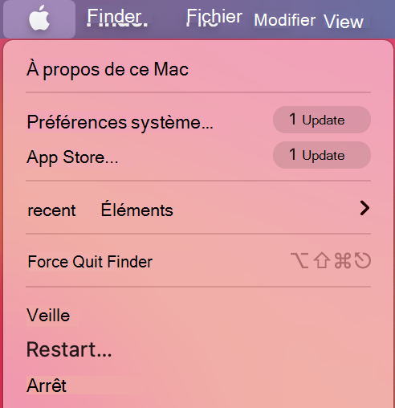

# <a name="device-control-for-macos"></a>Contrôle d’appareil pour macOS

[!INCLUDE [Microsoft 365 Defender rebranding](../../includes/microsoft-defender.md)]

**S’applique à :**
- [Microsoft Defender pour point de terminaison](https://go.microsoft.com/fwlink/p/?linkid=2154037)
- [Microsoft 365 Defender](https://go.microsoft.com/fwlink/?linkid=2118804)

> Vous voulez découvrir Microsoft Defender pour point de terminaison ? [Inscrivez-vous pour bénéficier d’un essai gratuit.](https://signup.microsoft.com/create-account/signup?products=7f379fee-c4f9-4278-b0a1-e4c8c2fcdf7e&ru=https://aka.ms/MDEp2OpenTrial?ocid=docs-wdatp-exposedapis-abovefoldlink)

## <a name="requirements"></a>Conditions requises

Le contrôle d’appareil pour macOS présente les conditions préalables suivantes :

> [!div class="checklist"]
>
> - Droit au point de terminaison Microsoft Defender (peut être une version d’évaluation)
> - Version minimale du système d’exploitation : macOS 11 ou version supérieure
> - Version minimale du produit : 101.34.20

## <a name="device-control-policy"></a>Stratégie de contrôle d’appareil

Pour configurer le contrôle d’appareil pour macOS, vous devez créer une stratégie qui décrit les restrictions que vous souhaitez mettre en place au sein de votre organisation.

La stratégie de contrôle d’appareil est incluse dans le profil de configuration utilisé pour configurer tous les autres paramètres du produit. Pour plus d’informations, voir [Structure de profil de configuration.](mac-preferences.md#configuration-profile-structure)

Dans le profil de configuration, la stratégie de contrôle d’appareil est définie dans la section suivante :

<br>

****

|Section|Valeur|
|---|---|
|**Domaine**|`com.microsoft.wdav`|
|**Clé**|deviceControl|
|**Type de données**|Dictionnaire (préférence imbriée)|
|**Comments**|Consultez les sections suivantes pour obtenir une description du contenu du dictionnaire.|
|

La stratégie de contrôle d’appareil peut être utilisée pour :

- [Personnaliser la cible d’URL pour les notifications dues au contrôle d’appareil](#customize-url-target-for-notifications-raised-by-device-control)
- [Autoriser ou bloquer les appareils amovibles](#allow-or-block-removable-devices)

### <a name="customize-url-target-for-notifications-raised-by-device-control"></a>Personnaliser la cible d’URL pour les notifications dues au contrôle d’appareil

Lorsque la stratégie de contrôle d’appareil que vous avez mise en place est appliquée sur un appareil (par exemple, l’accès à un périphérique multimédia amovible est restreint), une notification s’affiche pour l’utilisateur.


Lorsque les utilisateurs finaux cliquent sur cette notification, une page web s’ouvre dans le navigateur par défaut. Vous pouvez configurer l’URL qui est ouverte lorsque les utilisateurs finaux cliquent sur la notification.

<br>

****

|Section|Valeur|
|---|---|
|**Domaine**|`com.microsoft.wdav`|
|**Clé**|navigationTarget|
|**Type de données**|Chaîne|
|**Comments**|S’il n’est pas défini, le produit utilise une URL par défaut pointant vers une page générique expliquant l’action entreprise par le produit.|
|

### <a name="allow-or-block-removable-devices"></a>Autoriser ou bloquer les appareils amovibles

La section multimédia amovible de la stratégie de contrôle d’appareil est utilisée pour restreindre l’accès aux médias amovibles.

> [!NOTE]
> Les types de média amovible suivants sont actuellement pris en charge et peuvent être inclus dans la stratégie : les périphériques de stockage USB.

<br>

****

|Section|Valeur|
|---|---|
|**Domaine**|`com.microsoft.wdav`|
|**Clé**|removableMediaPolicy|
|**Type de données**|Dictionnaire (préférence imbriée)|
|**Comments**|Consultez les sections suivantes pour obtenir une description du contenu du dictionnaire.|
|

Cette section de la stratégie est hiérarchique, ce qui permet une flexibilité maximale et couvre un large éventail de cas d’utilisation. Au niveau supérieur, les fournisseurs sont identifiés par un ID de fournisseur. Pour chaque fournisseur, il existe des produits, identifiés par un ID de produit. Enfin, pour chaque produit, il existe des numéros de série qui notent des appareils spécifiques.

```text
|-- policy top level
    |-- vendor 1
        |-- product 1
            |-- serial number 1
            ...
            |-- serial number N
        ...
        |-- product N
    ...
    |-- vendor N
```

Pour plus d’informations sur la recherche des identificateurs d’appareil, voir [Rechercher des identificateurs d’appareil.](#look-up-device-identifiers)

La stratégie est évaluée de l’entrée la plus spécifique à la plus générale. Autrement dit, lorsqu’un appareil est branché, le produit tente de trouver la correspondance la plus spécifique dans la stratégie pour chaque périphérique multimédia amovible et applique les autorisations à ce niveau. En l’absence de correspondance, la meilleure correspondance suivante est appliquée, jusqu’à l’autorisation spécifiée au niveau supérieur, qui est la valeur par défaut lorsqu’un appareil ne correspond à aucune autre entrée de la stratégie.

#### <a name="policy-enforcement-level"></a>Niveau d’application de la stratégie

Sous la section Média amovible, il existe une option pour définir le niveau d’application, qui peut prendre l’une des valeurs suivantes :

- `audit` - Sous ce niveau d’application, si l’accès à un appareil est restreint, une notification s’affiche pour l’utilisateur, mais l’appareil peut toujours être utilisé. Ce niveau d’application peut être utile pour évaluer l’efficacité d’une stratégie.
- `block` - Sous ce niveau d’application, les opérations que l’utilisateur peut effectuer sur l’appareil sont limitées à ce qui est défini dans la stratégie. En outre, une notification est alors avertie à l’utilisateur.

> [!NOTE]
> Par défaut, le niveau d’application est définie sur `audit` .

<br>

****

|Section|Valeur|
|---|---|
|**Domaine**|`com.microsoft.wdav`|
|**Clé**|enforcementLevel|
|**Type de données**|Chaîne|
|**Valeurs possibles**|audit (par défaut) <p> block|
|

#### <a name="default-permission-level"></a>Niveau d’autorisation par défaut

Au niveau supérieur de la section Média amovible, vous pouvez configurer le niveau d’autorisation par défaut pour les appareils qui ne correspondent à rien d’autre dans la stratégie.

Ce paramètre peut être définie sur :

- `none` - Aucune opération ne peut être effectuée sur l’appareil
- Combinaison des valeurs suivantes :
  - `read` - Les opérations de lecture sont autorisées sur l’appareil
  - `write` - Les opérations d’écriture sont autorisées sur l’appareil
  - `execute` - Les opérations d’exécution sont autorisées sur l’appareil

> [!NOTE]
> `none`S’il est présent dans le niveau d’autorisation, toutes les autres autorisations ( ou ) sont `read` `write` `execute` ignorées.
>
> L’autorisation fait uniquement référence à l’exécution des binaires `execute` Mach-O. Il n’inclut pas l’exécution de scripts ou d’autres types de charges utiles.

<br>

****

|Section|Valeur|
|---|---|
|**Domaine**|`com.microsoft.wdav`|
|**Clé**|autorisation|
|**Type de données**|Tableau de chaînes|
|**Valeurs possibles**|none <p> read <p> write <p> execute|
|

#### <a name="restrict-removable-media-by-vendor-product-and-serial-number"></a>Restreindre les médias amovibles par fournisseur, produit et numéro de série

Comme décrit dans [Autoriser](#allow-or-block-removable-devices)ou bloquer les appareils amovibles, les supports amovibles tels que les périphériques USB peuvent être identifiés par l’ID du fournisseur, l’ID de produit et le numéro de série.

Au niveau supérieur de la stratégie de média amovible, vous pouvez éventuellement définir des restrictions plus précises au niveau du fournisseur.

Le `vendors` dictionnaire contient une ou plusieurs entrées, chaque entrée étant identifiée par l’ID du fournisseur.

<br>

****

|Section|Valeur|
|---|---|
|**Domaine**|`com.microsoft.wdav`|
|**Clé**|fournisseurs|
|**Type de données**|Dictionnaire (préférence imbriée)|
|

Pour chaque fournisseur, vous pouvez spécifier le niveau d’autorisation souhaité pour les appareils de ce fournisseur.

<br>

****

|Section|Valeur|
|---|---|
|**Domaine**|`com.microsoft.wdav`|
|**Clé**|autorisation|
|**Type de données**|Tableau de chaînes|
|**Valeurs possibles**|Identique au [niveau d’autorisation Par défaut](#default-permission-level)|
|

En outre, vous pouvez éventuellement spécifier l’ensemble des produits appartenant à ce fournisseur pour lesquels des autorisations plus précises sont définies. Le dictionnaire contient une ou plusieurs entrées, chaque entrée étant identifiée par `products` l’ID de produit.

<br>

****

|Section|Valeur|
|---|---|
|**Domaine**|`com.microsoft.wdav`|
|**Clé**|produits|
|**Type de données**|Dictionnaire (préférence imbriée)|
|

Pour chaque produit, vous pouvez spécifier le niveau d’autorisation souhaité pour ce produit.

<br>

****

|Section|Valeur|
|---|---|
|**Domaine**|`com.microsoft.wdav`|
|**Clé**|autorisation|
|**Type de données**|Tableau de chaînes|
|**Valeurs possibles**|Identique au [niveau d’autorisation Par défaut](#default-permission-level)|
|

En outre, vous pouvez spécifier un ensemble facultatif de numéros de série pour lesquels des autorisations plus granulaires sont définies.

Le `serialNumbers` dictionnaire contient une ou plusieurs entrées, chaque entrée étant identifiée par le numéro de série.

<br>

****

|Section|Valeur|
|---|---|
|**Domaine**|`com.microsoft.wdav`|
|**Clé**|serialNumbers|
|**Type de données**|Dictionnaire (préférence imbriée)|
|

Pour chaque numéro de série, vous pouvez spécifier le niveau d’autorisation souhaité.

<br>

****

|Section|Valeur|
|---|---|
|**Domaine**|`com.microsoft.wdav`|
|**Clé**|autorisation|
|**Type de données**|Tableau de chaînes|
|**Valeurs possibles**|Identique au [niveau d’autorisation Par défaut](#default-permission-level)|
|

#### <a name="example-device-control-policy"></a>Exemple de stratégie de contrôle d’appareil

L’exemple suivant montre comment tous les concepts ci-dessus peuvent être combinés en une stratégie de contrôle d’appareil. Dans l’exemple suivant, notez la nature hiérarchique de la stratégie de média amovible.

```xml
<?xml version="1.0" encoding="UTF-8"?>
<!DOCTYPE plist PUBLIC "-//Apple//DTD PLIST 1.0//EN" "http://www.apple.com/DTDs/PropertyList-1.0.dtd">
<plist version="1.0">
<dict>
    <key>deviceControl</key>
    <dict>
        <key>navigationTarget</key>
        <string>[custom URL for notifications]</string>
        <key>removableMediaPolicy</key>
        <dict>
            <key>enforcementLevel</key>
            <string>[enforcement level]</string> <!-- audit / block -->
            <key>permission</key>
            <array>
                <string>[permission]</string> <!-- none / read / write / execute -->
                <!-- other permissions -->
            </array>
            <key>vendors</key>
            <dict>
                <key>[vendor id]</key>
                <dict>
                    <key>permission</key>
                    <array>
                        <string>[permission]</string> <!-- none / read / write / execute -->
                        <!-- other permissions -->
                    </array>
                    <key>products</key>
                    <dict>
                        <key>[product id]</key>
                        <dict>
                            <key>permission</key>
                            <array>
                                <string>[permission]</string> <!-- none / read / write / execute -->
                                <!-- other permissions -->
                            </array>
                            <key>serialNumbers</key>
                            <dict>
                                <key>[serial-number]</key>
                                <array>
                                    <string>[permission]</string> <!-- none / read / write / execute -->
                                    <!-- other permissions -->
                                </array>
                                <!-- other serial numbers -->
                            </dict>
                        </dict>
                        <!-- other products -->
                    </dict>
                </dict>
                <!-- other vendors -->
            </dict>
        </dict>
    </dict>
</dict>
</plist>
```

Nous avons inclus d’autres exemples de stratégies de contrôle d’appareil dans les documents suivants :

- [Exemples de stratégies de contrôle d’appareil pour Intune](mac-device-control-intune.md)
- [Exemples de stratégies de contrôle d’appareil pour JAMF](mac-device-control-jamf.md)

#### <a name="look-up-device-identifiers"></a>Rechercher des identificateurs d’appareil

Pour rechercher l’ID du fournisseur, l’ID de produit et le numéro de série d’un périphérique USB :

1. Connectez-vous à un appareil Mac.
1. Branchez le périphérique USB pour lequel vous souhaitez rechercher les identificateurs.
1. Dans le menu de niveau supérieur de macOS, sélectionnez **À propos de ce Mac.**

    

1. Sélectionnez **Rapport système**.

    

1. Dans la colonne de gauche, sélectionnez **USB.**

    

1. Sous **Arborescence d’appareils USB,** accédez à l’appareil USB que vous avez branché.

    

1. L’ID du fournisseur, l’ID de produit et le numéro de série sont affichés. Lorsque vous ajoutez l’ID fournisseur et l’ID de produit à la stratégie de média amovible, vous devez uniquement ajouter la partie après `0x` . Par exemple, dans l’image ci-dessous, l’ID du fournisseur `1000` est et l’ID de produit est `090c` .

#### <a name="discover-usb-devices-in-your-organization"></a>Découvrir les périphériques USB de votre organisation

Vous pouvez afficher les événements de montage, de démontage et de modification de volume provenant de périphériques USB dans Microsoft Defender pour le recherche avancée de point de terminaison. Ces événements peuvent être utiles pour identifier une activité d’utilisation suspecte ou effectuer des enquêtes internes.

```bash
DeviceEvents
    | where ActionType == "UsbDriveMounted" or ActionType == "UsbDriveUnmounted" or ActionType == "UsbDriveDriveLetterChanged"
    | where DeviceId == "<device ID>"
```

## <a name="device-control-policy-deployment"></a>Déploiement de stratégie de contrôle d’appareil

La stratégie de contrôle d’appareil doit être incluse en plus des autres paramètres du produit, comme décrit dans Définir les préférences de [Microsoft Defender pour endpoint sur macOS.](mac-preferences.md)

Ce profil peut être déployé à l’aide des instructions répertoriées dans le déploiement de [profil de configuration.](mac-preferences.md#configuration-profile-deployment)

## <a name="troubleshooting-tips"></a>Conseils de dépannage

Après avoir lancé le profil de configuration via Intune ou JAMF, vous pouvez vérifier s’il a été correctement choisi par le produit en exécutant la commande suivante à partir du Terminal :

```bash
mdatp device-control removable-media policy list
```

Cette commande imprime en sortie standard la stratégie de contrôle d’appareil que le produit utilise. Dans le cas où cela imprime, assurez-vous (a) que le profil de configuration a bien été poussée sur votre appareil à partir de la console de gestion et (b) qu’il s’agit d’une stratégie de contrôle d’appareil valide, comme décrit dans ce `Policy is empty` document.

Sur un appareil sur lequel la stratégie a été correctement livrée et où un ou plusieurs appareils sont branchés, vous pouvez exécuter la commande suivante pour lister tous les appareils et les autorisations effectives qui leur sont appliquées.

```bash
mdatp device-control removable-media devices list
```

Exemple de sortie :

```Output
.Device(s)
|-o Name: Untitled 1, Permission ["read", "execute"]
| |-o Vendor: General "fff0"
| |-o Product: USB Flash Disk "1000"
| |-o Serial number: "04ZSSMHI2O7WBVOA"
| |-o Mount point: "/Volumes/TESTUSB"
```

Dans l’exemple ci-dessus, il n’existe qu’un seul périphérique multimédia amovible branché et il dispose d’autorisations et d’autorisations, conformément à la stratégie de contrôle d’appareil qui a été remis à `read` `execute` l’appareil.

## <a name="related-topics"></a>Rubriques connexes

- [Exemples de stratégies de contrôle d’appareil pour Intune](mac-device-control-intune.md)
- [Exemples de stratégies de contrôle d’appareil pour JAMF](mac-device-control-jamf.md)
