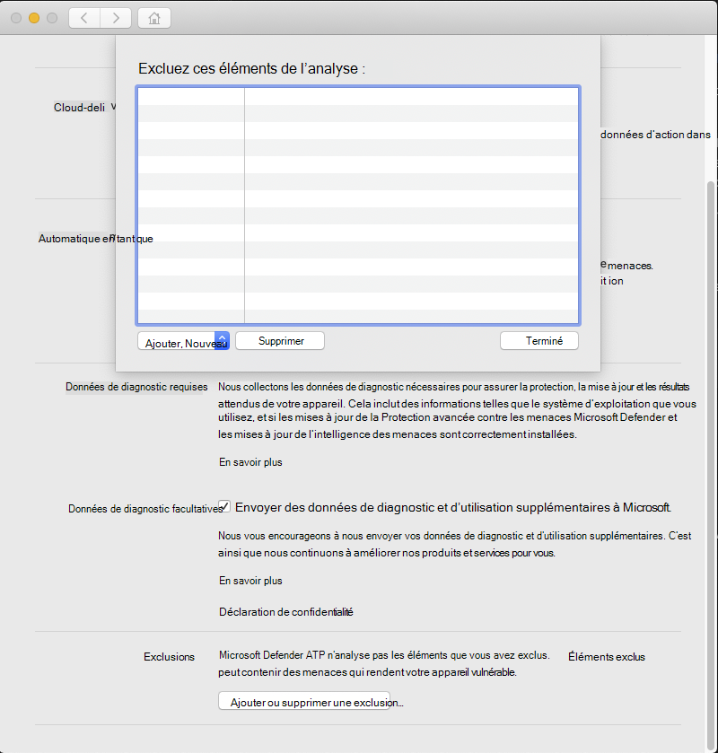

# <a name="configure-and-validate-exclusions-for-microsoft-defender-for-endpoint-on-macos"></a>Configurer et valider des exclusions pour Microsoft Defender pour le point de terminaison sur macOS

[!INCLUDE [Microsoft 365 Defender rebranding](../../includes/microsoft-defender.md)]


**S’applique à :**
- [Microsoft Defender pour point de terminaison](https://go.microsoft.com/fwlink/p/?linkid=2154037)
- [Microsoft 365 Defender](https://go.microsoft.com/fwlink/?linkid=2118804)

> Vous souhaitez faire l'expérience de Defender pour point de terminaison ? [Inscrivez-vous à un essai gratuit.](https://www.microsoft.com/microsoft-365/windows/microsoft-defender-atp?ocid=docs-wdatp-investigateip-abovefoldlink)

Cet article fournit des informations sur la définition d'exclusions qui s'appliquent aux analyses à la demande, ainsi que sur la protection et la surveillance en temps réel.

>[!IMPORTANT]
>Les exclusions décrites dans cet article ne s'appliquent pas aux autres fonctionnalités de Defender for Endpoint sur Mac, y compris la détection et la réponse des points de terminaison (EDR). Les fichiers que vous excluez à l'aide des méthodes décrites dans cet article peuvent toujours déclencher des alertes EDR et d'autres détections.

Vous pouvez exclure certains fichiers, dossiers, processus et fichiers ouverts par processus de Defender pour endpoint sur Mac.

Les exclusions peuvent être utiles pour éviter les détections incorrectes sur les fichiers ou les logiciels qui sont uniques ou personnalisés pour votre organisation. Ils peuvent également être utiles pour atténuer les problèmes de performances causés par Defender pour Endpoint sur Mac.

>[!WARNING]
>La définition d'exclusions réduit la protection offerte par Defender pour Endpoint sur Mac. Vous devez toujours évaluer les risques associés à l'implémentation d'exclusions, et vous devez exclure uniquement les fichiers dont vous êtes certain qu'ils ne sont pas malveillants.

## <a name="supported-exclusion-types"></a>Types d'exclusion pris en charge

Le tableau suivant indique les types d'exclusion pris en charge par Defender pour Endpoint sur Mac.

Exclusion | Définition | Exemples
---|---|---
Extension de fichier | Tous les fichiers avec l'extension, n'importe où sur l'ordinateur | `.test`
Fichier | Un fichier spécifique identifié par le chemin d'accès complet | `/var/log/test.log`<br/>`/var/log/*.log`<br/>`/var/log/install.?.log`
Folder | Tous les fichiers sous le dossier spécifié (de manière récursive) | `/var/log/`<br/>`/var/*/`
Processus | Un processus spécifique (spécifié par le chemin d'accès complet ou le nom de fichier) et tous les fichiers ouverts par celui-ci | `/bin/cat`<br/>`cat`<br/>`c?t`

Les exclusions de fichiers, de dossiers et de processus prisent en charge les caractères génériques suivants :

Caractère générique | Description | Exemple | Correspondances | Ne correspond pas
---|---|---|---|---
\* |    Correspond à n'importe quel nombre de caractères, y compris aucun (notez que lorsque ce caractère générique est utilisé à l'intérieur d'un chemin d'accès, il ne remplace qu'un seul dossier) | `/var/*/*.log` | `/var/log/system.log` | `/var/log/nested/system.log`
? | Correspond à n'importe quel caractère | `file?.log` | `file1.log`<br/>`file2.log` | `file123.log`

>[!NOTE]
>Le produit tente de résoudre les liens fermes lors de l'évaluation des exclusions. La résolution firmlink ne fonctionne pas lorsque l'exclusion contient des caractères génériques ou que le fichier cible (sur le `Data` volume) n'existe pas.

## <a name="how-to-configure-the-list-of-exclusions"></a>Comment configurer la liste des exclusions

### <a name="from-the-management-console"></a>À partir de la console de gestion

Pour plus d'informations sur la configuration des exclusions à partir de JAMF, Intune ou une autre console de gestion, voir Définir les préférences de [Defender pour Endpoint sur Mac.](mac-preferences.md)

### <a name="from-the-user-interface"></a>À partir de l'interface utilisateur

Ouvrez l'application Defender for Endpoint et accédez à Gérer les **paramètres** Ajouter ou supprimer une exclusion... , comme illustré  >  dans la capture d'écran suivante :



Sélectionnez le type d'exclusion que vous souhaitez ajouter et suivez les invites.

## <a name="validate-exclusions-lists-with-the-eicar-test-file"></a>Valider les listes d'exclusions avec le fichier de test EICAR

Vous pouvez vérifier que vos listes d'exclusions fonctionnent en téléchargeant `curl` un fichier de test.

Dans l'extrait de code Bash suivant, remplacez-le par un fichier conforme `test.txt` à vos règles d'exclusion. Par exemple, si vous avez exclu `.testing` l'extension, `test.txt` remplacez par `test.testing` . Si vous testez un chemin d'accès, veillez à exécuter la commande dans ce chemin d'accès.

```bash
curl -o test.txt https://www.eicar.org/download/eicar.com.txt
```

Si Defender pour point de terminaison sur Mac signale un programme malveillant, la règle ne fonctionne pas. Si aucun programme malveillant n'est détecté et que le fichier téléchargé existe, l'exclusion fonctionne. Vous pouvez ouvrir le fichier pour vérifier que le contenu est identique à ce qui est décrit sur le site web du fichier [de test EICAR.](http://2016.eicar.org/86-0-Intended-use.html)

Si vous n'avez pas accès à Internet, vous pouvez créer votre propre fichier de test EICAR. Écrivez la chaîne EICAR dans un nouveau fichier texte avec la commande Bash suivante :

```bash
echo 'X5O!P%@AP[4\PZX54(P^)7CC)7}$EICAR-STANDARD-ANTIVIRUS-TEST-FILE!$H+H*' > test.txt
```

Vous pouvez également copier la chaîne dans un fichier texte vierge et essayer de l'enregistrer avec le nom de fichier ou dans le dossier que vous tentez d'exclure.

## <a name="allow-threats"></a>Autoriser les menaces

En plus d'exclure certains contenus de l'analyse, vous pouvez également configurer le produit pour qu'il ne détecte pas certaines classes de menaces (identifiées par le nom de la menace). Vous devez faire preuve de prudence lors de l'utilisation de cette fonctionnalité, car elle peut laisser votre appareil non protégé.

Pour ajouter un nom de menace à la liste autorisée, exécutez la commande suivante :

```bash
mdatp threat allowed add --name [threat-name]
```

Le nom de la menace associé à une détection sur votre appareil peut être obtenu à l'aide de la commande suivante :

```bash
mdatp threat list
```

Par exemple, pour ajouter (le nom de menace associé à la détection EICAR) à la liste `EICAR-Test-File (not a virus)` autorisée, exécutez la commande suivante :

```bash
mdatp threat allowed add --name "EICAR-Test-File (not a virus)"
```
