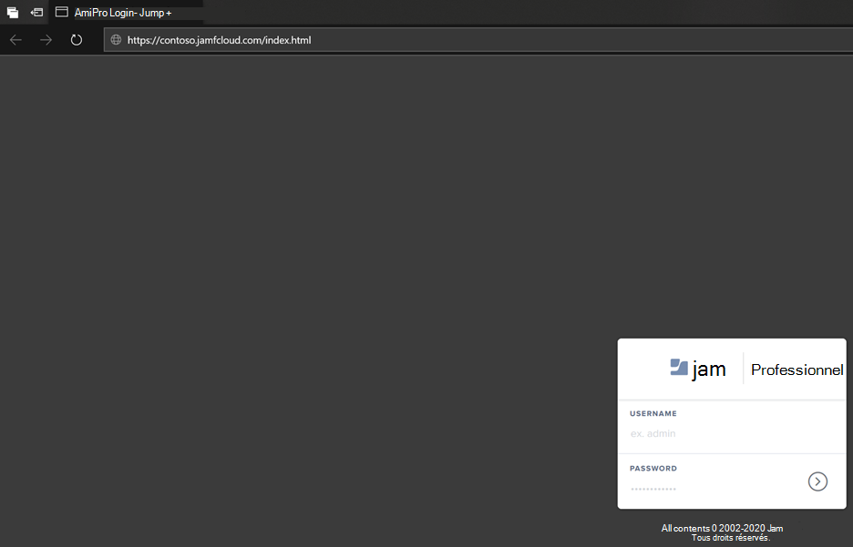
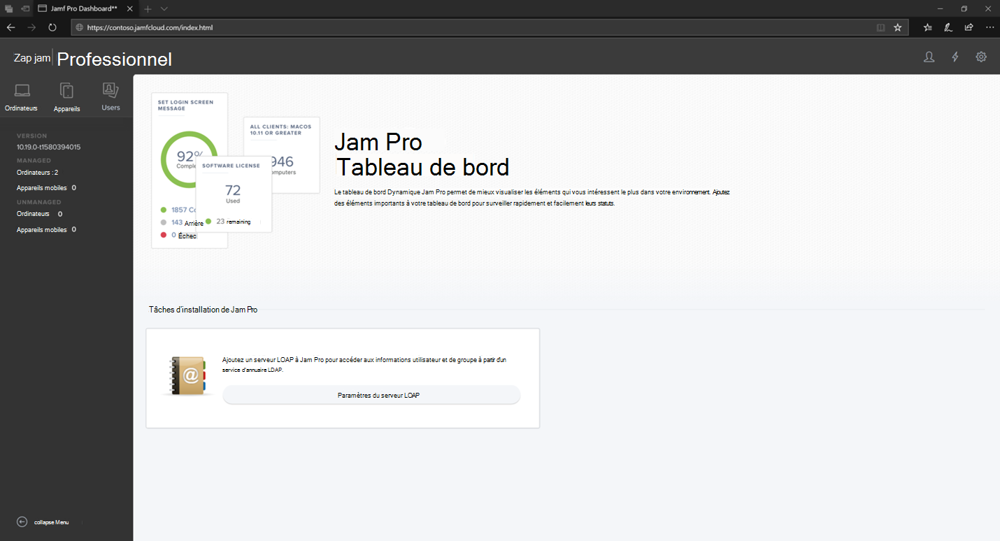
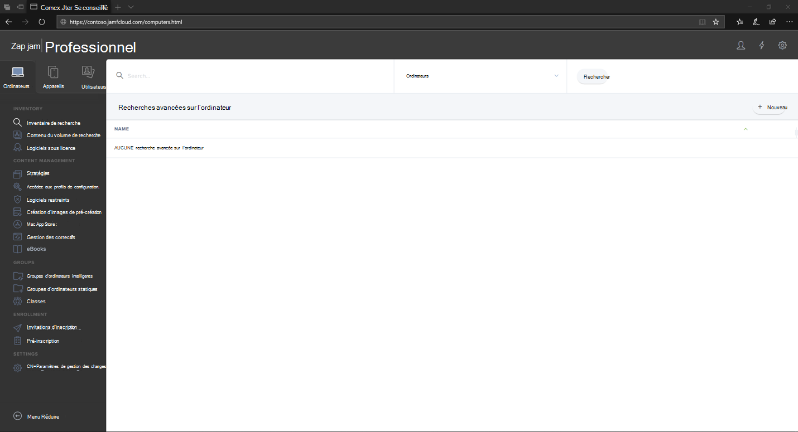

# Connectez-vous à Jamf Pro

[!INCLUDE [Microsoft 365 Defender rebranding](../../includes/microsoft-defender.md)]

**S’applique à :**
- [Microsoft Defender pour point de terminaison](https://go.microsoft.com/fwlink/p/?linkid=2154037)
- [Microsoft 365 Defender](https://go.microsoft.com/fwlink/?linkid=2118804)

> Vous souhaitez faire l'expérience de Defender pour point de terminaison ? [Inscrivez-vous à un essai gratuit.](https://www.microsoft.com/microsoft-365/windows/microsoft-defender-atp?ocid=docs-wdatp-investigateip-abovefoldlink)

1. Entrez vos informations d’identification.

    

2. Sélectionnez **Ordinateurs**.

    

3. Vous verrez les paramètres disponibles.

     

## Étape suivante
[Configurer les groupes d'appareils dans Jamf Pro](mac-jamfpro-device-groups.md)

