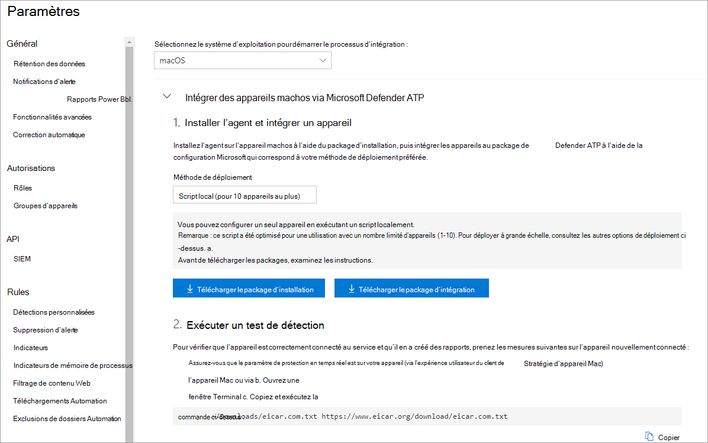
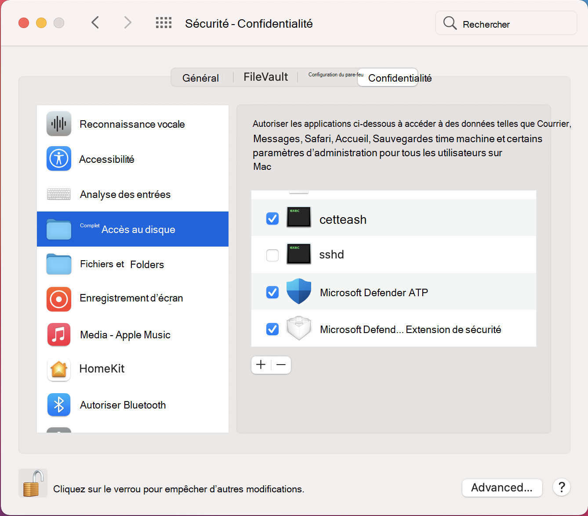

# <a name="manual-deployment-for-microsoft-defender-for-endpoint-for-macos"></a>Déploiement manuel de Microsoft Defender pour endpoint pour macOS

[!INCLUDE [Microsoft 365 Defender rebranding](../../includes/microsoft-defender.md)]

**S’applique à :**
- [Microsoft Defender pour point de terminaison](https://go.microsoft.com/fwlink/p/?linkid=2154037)
- [Microsoft 365 Defender](https://go.microsoft.com/fwlink/?linkid=2118804)

> Vous souhaitez faire l’expérience de Defender for Endpoint ? [Inscrivez-vous à un essai gratuit.](https://www.microsoft.com/microsoft-365/windows/microsoft-defender-atp?ocid=docs-wdatp-investigateip-abovefoldlink)

Cette rubrique décrit comment déployer Microsoft Defender pour endpoint pour macOS manuellement. Un déploiement réussi nécessite la réalisation de toutes les étapes suivantes :
- [Télécharger les packages d’installation et d’intégration](#download-installation-and-onboarding-packages)
- [Installation d’applications (macOS 10.15 et versions antérieures)](#application-installation-macos-1015-and-older-versions)
- [Installation d’applications (macOS 11 et versions plus récentes)](#application-installation-macos-11-and-newer-versions)
- [Configuration du client](#client-configuration)

## <a name="prerequisites-and-system-requirements"></a>Conditions préalables et système requis

Avant de commencer, consultez la page principale de Microsoft Defender pour point de terminaison [pour macOS](microsoft-defender-endpoint-mac.md) pour obtenir une description des conditions préalables et de la requise pour la version logicielle actuelle.

## <a name="download-installation-and-onboarding-packages"></a>Télécharger les packages d’installation et d’intégration

Téléchargez les packages d’installation et d’intégration à partir du Centre de sécurité Microsoft Defender :

1. Dans le Centre de sécurité Microsoft Defender, go to **Settings > Device Management > Onboarding**.
2. Dans la section 1 de la page, définissez le système d’exploitation sur **macOS** et la méthode de déploiement sur **le script local.**
3. Dans la section 2 de la page, sélectionnez **Télécharger le package d’installation.** Enregistrez-le sous wdav.pkg dans un répertoire local.
4. Dans la section 2 de la page, **sélectionnez Télécharger le package d’intégration.** Enregistrez-le WindowsDefenderATPOnboardingPackage.zip dans le même répertoire.

    

5. À partir d’une invite de commandes, vérifiez que vous avez les deux fichiers.
    
## <a name="application-installation-macos-1015-and-older-versions"></a>Installation d’applications (macOS 10.15 et versions antérieures)

Pour effectuer ce processus, vous devez avoir des privilèges d’administrateur sur l’appareil.

1. Accédez au wdav.pkg téléchargé dans Finder et ouvrez-le.

    

2. Sélectionnez **Continuer,** acceptez les termes du contrat de licence, puis entrez le mot de passe lorsque vous y invitez.

    

   > [!IMPORTANT]
   > Vous serez invité à autoriser l’installation d’un pilote microsoft (« Extension système bloquée » ou « L’installation est en attente » ou les deux. Le pilote doit être autorisé à être installé.

   

3. Sélectionnez **Ouvrir les préférences de sécurité** ou Ouvrir les préférences système > sécurité & **confidentialité.** Sélectionnez **Autoriser**:

    

   L’installation se poursuit.

   > [!CAUTION]
   > Si vous ne sélectionnez pas **Autoriser,** l’installation se poursuit au bout de 5 minutes. Microsoft Defender pour le point de terminaison sera chargé, mais certaines fonctionnalités, telles que la protection en temps réel, seront désactivées. Pour [plus d’informations](mac-support-kext.md) sur la résolution de ce problème, voir Résoudre les problèmes d’extension du noyau.

> [!NOTE]
> MacOS peut demander à redémarrer l’appareil lors de la première installation de Microsoft Defender pour Endpoint. La protection en temps réel n’est pas disponible tant que l’appareil n’est pas redémarrage.

## <a name="application-installation-macos-11-and-newer-versions"></a>Installation d’applications (macOS 11 et versions plus récentes)

Pour effectuer ce processus, vous devez avoir des privilèges d’administrateur sur l’appareil.

1. Accédez au wdav.pkg téléchargé dans Finder et ouvrez-le.

    

2. Sélectionnez **Continuer,** acceptez les termes du contrat de licence, puis entrez le mot de passe lorsque vous y invitez.

3. À la fin du processus d’installation, vous êtes promu pour approuver les extensions système utilisées par le produit. Sélectionnez **Ouvrir les préférences de sécurité.**

    

4. Dans la **fenêtre Sécurité & confidentialité,** sélectionnez **Autoriser.**

    

5. Répétez les étapes 3 & 4 pour toutes les extensions système distribuées avec Microsoft Defender pour Endpoint pour Mac.

6. Dans le cadre des fonctionnalités de détection et de réponse des points de terminaison, Microsoft Defender pour Endpoint pour Mac inspecte le trafic de socket et signale ces informations au portail centre de sécurité Microsoft Defender. Lorsque vous avez été invité à accorder à Microsoft Defender pour les autorisations de point de terminaison pour filtrer le trafic réseau, sélectionnez **Autoriser**.

    

7. Ouvrez La sécurité **des** préférences système & confidentialité et accédez à l’onglet Confidentialité. Accordez l’autorisation d’accès disque total à Microsoft Defender  >   **ATP** et Microsoft **Defender ATP Endpoint Security Extension**.  

    

## <a name="client-configuration"></a>Configuration du client

1. Copiez wdav.pkg et MicrosoftDefenderATPOnboardingMacOs.py sur l’appareil où vous déployez Microsoft Defender pour endpoint pour macOS.

    L’appareil client n’est pas associé à orgId. Notez que *l’attribut orgId* est vide.

    ```bash
    mdatp health --field org_id
    ```

2. Exécutez le script Python pour installer le fichier de configuration :

    ```bash
    /usr/bin/python MicrosoftDefenderATPOnboardingMacOs.py
    ```

3. Vérifiez que l’appareil est désormais associé à votre organisation et signale un *orgId valide*:

    ```bash
    mdatp health --field org_id
    ```

Après l’installation, vous verrez l’icône Microsoft Defender dans la barre d’état macOS dans le coin supérieur droit.

   
   

## <a name="how-to-allow-full-disk-access"></a>Comment autoriser l’accès disque total

> [!CAUTION]
> macOS 10.15 (Contrôle) contient de nouvelles améliorations en matière de sécurité et de confidentialité. À partir de cette version, par défaut, les applications ne peuvent pas accéder à certains emplacements sur disque (par exemple, Documents, Téléchargements, Bureau, etc.) sans consentement explicite. En l’absence de ce consentement, Microsoft Defender pour le point de terminaison n’est pas en mesure de protéger entièrement votre appareil.

Pour accorder le consentement, ouvrez Préférences système -> sécurité & confidentialité -> confidentialité -> accès disque total. Cliquez sur l’icône de verrouillage pour apporter des modifications (en bas de la boîte de dialogue). Sélectionnez Microsoft Defender pour le point de terminaison.

## <a name="logging-installation-issues"></a>Journalisation des problèmes d’installation

Pour [plus d’informations](mac-resources.md#logging-installation-issues) sur la recherche du journal généré automatiquement par le programme d’installation en cas d’erreur, voir problèmes d’installation de journalisation.

## <a name="uninstallation"></a>Désinstallation

Voir [Désinstallation](mac-resources.md#uninstalling) pour plus d’informations sur la suppression de Microsoft Defender pour endpoint pour macOS des appareils clients.
