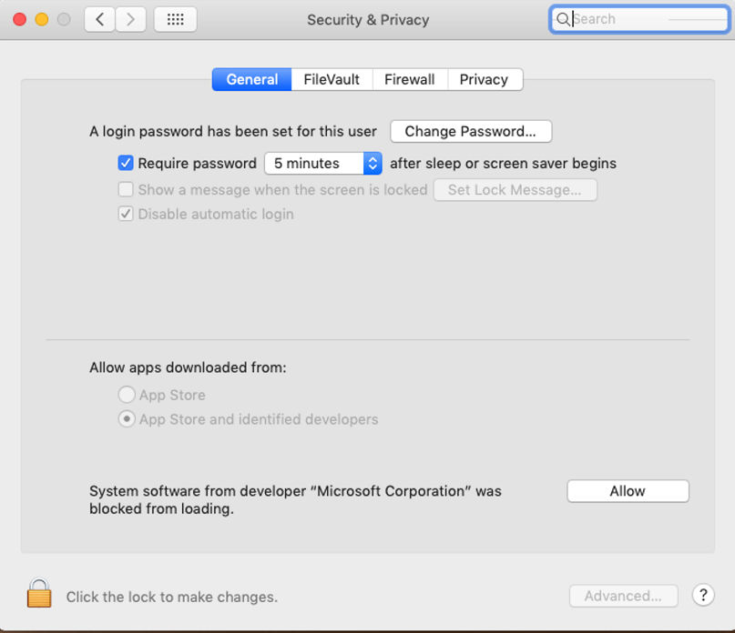

# <a name="manual-deployment-for-microsoft-defender-for-endpoint-on-macos"></a>Déploiement manuel de Microsoft Defender pour endpoint sur macOS

[!INCLUDE [Microsoft 365 Defender rebranding](../../includes/microsoft-defender.md)]

**S’applique à :**
- [Microsoft Defender pour point de terminaison](https://go.microsoft.com/fwlink/p/?linkid=2154037)
- [Microsoft 365 Defender](https://go.microsoft.com/fwlink/?linkid=2118804)

> Vous souhaitez faire l’expérience de Defender for Endpoint ? [Inscrivez-vous à une version d’essai gratuite.](https://signup.microsoft.com/create-account/signup?products=7f379fee-c4f9-4278-b0a1-e4c8c2fcdf7e&ru=https://aka.ms/MDEp2OpenTrial?ocid=docs-wdatp-investigateip-abovefoldlink)

Cette rubrique décrit comment déployer Manuellement Microsoft Defender pour Endpoint sur macOS. Un déploiement réussi nécessite la réalisation de toutes les étapes suivantes :

- [Télécharger les packages d’installation et d’intégration](#download-installation-and-onboarding-packages)
- [Installation d’applications (macOS 10.15 et versions antérieures)](#application-installation-macos-1015-and-older-versions)
- [Installation d’applications (macOS 11 et versions plus récentes)](#application-installation-macos-11-and-newer-versions)
- [Configuration du client](#client-configuration)

## <a name="prerequisites-and-system-requirements"></a>Conditions préalables et système requis

Avant de commencer, consultez la page principale de Microsoft Defender pour point de terminaison sur [macOS](microsoft-defender-endpoint-mac.md) pour obtenir une description des conditions préalables et de la requise pour la version logicielle actuelle.

## <a name="download-installation-and-onboarding-packages"></a>Télécharger les packages d’installation et d’intégration

Téléchargez les packages d’installation et d’intégration à partir Microsoft 365 Defender portail :

1. Dans <a href="https://go.microsoft.com/fwlink/p/?linkid=2077139" target="_blank">Microsoft 365 Defender portail,</a>go to **Paramètres > Endpoints > Device management > Onboarding**.
2. Dans la section 1 de la page, définissez le système d’exploitation sur **macOS** et la méthode deployment sur **le script local.**
3. Dans la section 2 de la page, sélectionnez **Télécharger le package d’installation.** Enregistrez-le sous wdav.pkg dans un répertoire local.
4. Dans la section 2 de la page, **sélectionnez Télécharger le package d’intégration.** Enregistrez-le WindowsDefenderATPOnboardingPackage.zip dans le même répertoire.

    

5. À partir d’une invite de commandes, vérifiez que vous avez les deux fichiers.

## <a name="application-installation-macos-1015-and-older-versions"></a>Installation d’applications (macOS 10.15 et versions antérieures)

Pour effectuer ce processus, vous devez avoir des privilèges d’administrateur sur l’appareil.

1. Accédez au wdav.pkg téléchargé dans Finder et ouvrez-le.

    

2. Sélectionnez **Continuer,** acceptez les termes du contrat de licence, puis entrez le mot de passe lorsque vous y invitez.

    

   > [!IMPORTANT]
   > Vous serez invité à autoriser l’installation d’un pilote microsoft (« Extension système bloquée » ou « L’installation est en attente » ou les deux. Le pilote doit être autorisé à être installé.

   

3. Sélectionnez **Ouvrir les préférences de sécurité** ou Ouvrir les préférences système > sécurité & **confidentialité.** Sélectionnez **Autoriser**:

    

   L’installation se poursuit.

   > [!CAUTION]
   > Si vous ne sélectionnez pas **Autoriser,** l’installation se poursuit au bout de 5 minutes. Microsoft Defender pour le point de terminaison sera chargé, mais certaines fonctionnalités, telles que la protection en temps réel, seront désactivées. Pour [plus d’informations sur](mac-support-kext.md) la résolution de ce problème, voir Résoudre les problèmes d’extension du noyau.

> [!NOTE]
> MacOS peut demander à redémarrer l’appareil lors de la première installation de Microsoft Defender pour Endpoint. La protection en temps réel ne sera pas disponible tant que l’appareil n’aura pas redémarrage.

## <a name="application-installation-macos-11-and-newer-versions"></a>Installation d’applications (macOS 11 et versions plus récentes)

Pour effectuer ce processus, vous devez avoir des privilèges d’administrateur sur l’appareil.

1. Accédez au wdav.pkg téléchargé dans Finder et ouvrez-le.

    

2. Sélectionnez **Continuer,** acceptez les termes du contrat de licence, puis entrez le mot de passe lorsque vous y invitez.

3. À la fin du processus d’installation, vous serez promu pour approuver les extensions système utilisées par le produit. Sélectionnez **Ouvrir les préférences de sécurité.**

    

4. Dans la **fenêtre Sécurité & confidentialité,** sélectionnez **Autoriser.**

    

5. Répétez les étapes 3 & 4 pour toutes les extensions système distribuées avec Microsoft Defender pour Endpoint sur Mac.

6. Dans le cadre des fonctionnalités de détection et de réponse des points de terminaison, Microsoft Defender pour Endpoint sur Mac inspecte le trafic de socket et signale ces informations au portail Microsoft 365 Defender. Lorsque vous avez été invité à accorder à Microsoft Defender pour les autorisations de point de terminaison pour filtrer le trafic réseau, sélectionnez **Autoriser**.

    

7. Ouvrez La sécurité **des** préférences système & confidentialité et accédez à l’onglet Confidentialité. Accordez l’autorisation d’accès disque total à Microsoft Defender \>  **ATP** et Microsoft **Defender ATP Endpoint Security Extension**.  

    

## <a name="client-configuration"></a>Configuration du client

1. Copiez wdav.pkg et MicrosoftDefenderATPOnboardingMacOs.py sur l’appareil où vous déployez Microsoft Defender pour endpoint sur macOS.

    L’appareil client n’est pas associé à org_id. Notez que *l’org_id* est vide.

    ```bash
    mdatp health --field org_id
    ```

2. Exécutez le script Python pour installer le fichier de configuration :

    ```bash
    /usr/bin/python MicrosoftDefenderATPOnboardingMacOs.py
    ```

3. Vérifiez que l’appareil est désormais associé à votre organisation et signale un ID d’organisation valide :

    ```bash
    mdatp health --field org_id
    ```

    Après l’installation, vous verrez l’icône Microsoft Defender dans la barre d’état macOS dans le coin supérieur droit.

    > [!div class="mx-imgBorder"]
    > 

## <a name="how-to-allow-full-disk-access"></a>Comment autoriser l’accès disque total

> [!CAUTION]
> macOS 10.15 (Contrôle) contient de nouvelles améliorations en matière de sécurité et de confidentialité. À partir de cette version, par défaut, les applications ne peuvent pas accéder à certains emplacements sur disque (par exemple, Documents, Téléchargements, Bureau, etc.) sans consentement explicite. En l’absence de ce consentement, Microsoft Defender pour le point de terminaison n’est pas en mesure de protéger entièrement votre appareil.

1. Pour accorder le consentement, **ouvrez La** sécurité des préférences \> **système &** \> **confidentialité** \> **confidentialité accès disque total**. Cliquez sur l’icône de verrouillage pour apporter des modifications (en bas de la boîte de dialogue). Sélectionnez Microsoft Defender pour le point de terminaison.

2. Exécutez un test de détection antivirus pour vérifier que l’appareil est correctement intégré et signaler au service. Effectuez les étapes suivantes sur l’appareil nouvellement intégré :

    1. Assurez-vous que la protection en temps réel est activée (notée par un résultat de 1 à partir de l’exécution de la commande suivante) :

        ```bash
        mdatp health --field real_time_protection_enabled
        ```

    1. Ouvrez une fenêtre Terminal. Copiez et exécutez la commande suivante :

        ```bash
        curl -o ~/Downloads/eicar.com.txt https://www.eicar.org/download/eicar.com.txt
        ```

    1. Le fichier doit avoir été mis en quarantaine par Defender pour point de terminaison sur Mac. Utilisez la commande suivante pour lister toutes les menaces détectées :

        ```bash
        mdatp threat list
        ```

3. Exécutez un test PEPT de détection pour vérifier que l’appareil est correctement intégré et signaler au service. Effectuez les étapes suivantes sur l’appareil nouvellement intégré :

   1. Dans votre navigateur, tel que Microsoft Edge pour Mac ou Safari.

   1. Téléchargez les fichiers MacOS MDATP DIY.zip https://aka.ms/mdatpmacosdiy et extrayez.

      Vous pouvez être invité à :

      > Voulez-vous autoriser les téléchargements sur « mdatpclientanalyzer.blob.core.windows.net » ?<br/>
      > Vous pouvez modifier les sites web qui peuvent télécharger des fichiers dans Préférences de sites Web.

4. Cliquez sur **Autoriser.**

5. Open **Downloads**.

6. Vous devriez voir **MDATP MacOS 2013.**

   > [!TIP]
   > Si vous double-cliquez, vous recevez le message suivant :
   >
   > > **« MDATP MacOS VERIFIE » ne peut pas être ouvert, car le développeur ne peut pas être vérifié.**<br/>
   > > macOS ne peut pas vérifier que cette application est exempt de programmes malveillants.<br/>
   > > **\[ Déplacer vers \] annuler la corbeille** **\[ \]**

7. Cliquez sur **Annuler**.

8. Cliquez avec le bouton **droit de la souris sur MDATP MacOS(2013),** puis cliquez sur **Ouvrir**.

    Le système doit afficher le message suivant :

    > **macOS ne peut pas vérifier le développeur de MDATP MacOSMUT. Voulez-vous vraiment l’ouvrir ?**<br/>
    > En ouvrant cette application, vous allez remplacement de la sécurité système qui peut exposer votre ordinateur et vos informations personnelles à des programmes malveillants qui peuvent nuire à votre Mac ou compromettre votre confidentialité.

9. Cliquez sur **Ouvrir**. 

    Le système doit afficher le message suivant :

    > Microsoft Defender pour le point de terminaison - fichier de test PEPT MACOS<br/>
    > L’alerte correspondante sera disponible dans le portail MDATP.

10. Cliquez sur **Ouvrir**. 

    Dans quelques minutes, une alerte nommée « macOS PEPT Test Alert » doit être appelée.

11. Go to Microsoft 365 Defender portal ( https://security.microsoft.com/) .

12. Go to the Alert Queue.

    :::image type="content" source="images/b8db76c2-c368-49ad-970f-dcb87534d9be.png" alt-text="Exemple d’alerte de test PEPT macOS qui affiche la gravité, la catégorie, la source de détection et un menu d’actions réduire.":::

    Regardez les détails de l’alerte et la chronologie de l’appareil, puis effectuez les étapes d’examen normales.

## <a name="logging-installation-issues"></a>Journalisation des problèmes d’installation

Pour [plus d’informations](mac-resources.md#logging-installation-issues) sur la recherche du journal généré automatiquement par le programme d’installation en cas d’erreur, voir problèmes d’installation de journalisation.

## <a name="uninstallation"></a>Désinstallation

Voir [Désinstallation](mac-resources.md#uninstalling) pour plus d’informations sur la suppression de Microsoft Defender pour endpoint sur macOS des appareils clients.
