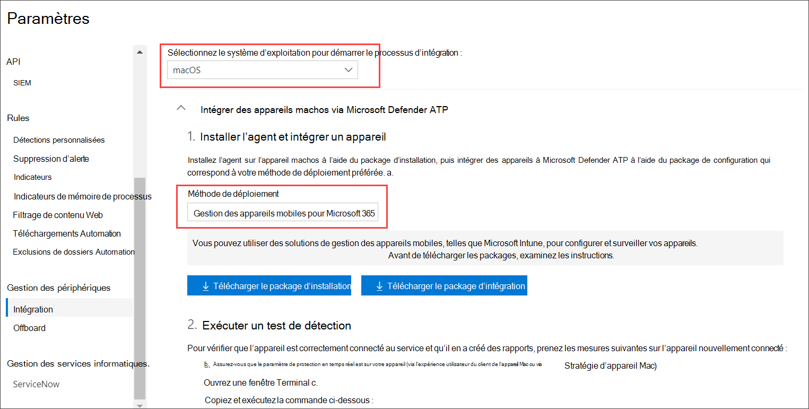

# <a name="intune-based-deployment-for-microsoft-defender-for-endpoint-for-mac"></a>Déploiement basé sur Intune pour Microsoft Defender pour Endpoint pour Mac

[!INCLUDE [Microsoft 365 Defender rebranding](../../includes/microsoft-defender.md)]


> [!NOTE]
> Cette documentation explique la méthode héritée pour déployer et configurer Microsoft Defender pour endpoint sur les appareils macOS. L’expérience native est désormais disponible dans la console MEM. La version de l’interface utilisateur native dans la console MEM offre aux administrateurs un moyen beaucoup plus simple de configurer et de déployer l’application et de l’envoyer aux appareils macOS. <br> <br>
>Le billet de blog mem simplifie le déploiement [de Microsoft Defender pour endpoint pour macOS](https://techcommunity.microsoft.com/t5/microsoft-endpoint-manager-blog/microsoft-endpoint-manager-simplifies-deployment-of-microsoft/ba-p/1322995) explique les nouvelles fonctionnalités. Pour configurer l’application, go to [Settings for Microsoft Defender for Endpoint for Mac in Microsoft InTune](https://docs.microsoft.com/mem/intune/protect/antivirus-microsoft-defender-settings-macos). Pour déployer l’application, go to [Add Microsoft Defender for Endpoint to macOS devices using Microsoft Intune](https://docs.microsoft.com/mem/intune/apps/apps-advanced-threat-protection-macos).

**S’applique à :**

- [Microsoft Defender pour point de terminaison pour Mac](microsoft-defender-endpoint-mac.md)

Cette rubrique décrit comment déployer Microsoft Defender pour Endpoint pour Mac via Intune. Un déploiement réussi nécessite la réalisation de toutes les étapes suivantes :

1. [Télécharger les packages d’installation et d’intégration](#download-installation-and-onboarding-packages)
1. [Configuration de l’appareil client](#client-device-setup)
1. [Approuver les extensions système](#approve-system-extensions)
1. [Créer des profils de configuration système](#create-system-configuration-profiles)
1. [Publier l'application](#publish-application)

## <a name="prerequisites-and-system-requirements"></a>Conditions préalables et système requis

Avant de commencer, consultez la page principale de [Microsoft Defender pour Endpoint pour Mac](microsoft-defender-endpoint-mac.md) pour obtenir une description des conditions préalables et de la requise pour la version logicielle actuelle.

## <a name="overview"></a>Vue d’ensemble

Le tableau suivant récapitule les étapes à suivre pour déployer et gérer Microsoft Defender pour Endpoint pour Mac, via Intune. Des étapes plus détaillées sont disponibles ci-dessous.

| Étape | Exemples de noms de fichiers | BundleIdentifier |
|-|-|-|
| [Télécharger les packages d’installation et d’intégration](#download-installation-and-onboarding-packages) | WindowsDefenderATPOnboarding__MDATP_wdav.atp.xml | com.microsoft.wdav.atp |
| [Approuver l’extension système pour Microsoft Defender pour le point de terminaison](#approve-system-extensions) | MDATP_SysExt.xml | S/O |
| [Approuver l’extension du noyau pour Microsoft Defender pour le point de terminaison](#download-installation-and-onboarding-packages) | MDATP_KExt.xml | S/O |
| [Accorder un accès disque complet à Microsoft Defender pour le point de terminaison](#create-system-configuration-profiles-step-8) | MDATP_tcc_Catalina_or_newer.xml | com.microsoft.wdav.tcc |
| [Stratégie d’extension réseau](#create-system-configuration-profiles-step-9) | MDATP_NetExt.xml | S/O |
| [Configurer la mise à jour automatique Microsoft (AutoUpdate)](https://docs.microsoft.com/microsoft-365/security/defender-endpoint/mac-updates#intune) | MDATP_Microsoft_AutoUpdate.xml | com.microsoft.autoupdate2 |
| [Paramètres de configuration de Microsoft Defender for Endpoint](https://docs.microsoft.com/microsoft-365/security/defender-endpoint/mac-preferences#intune-profile-1)<br/><br/> **Remarque :** Si vous envisagez d’exécuter un antivirus tiers pour macOS, définissez sur `passiveMode` `true` . | MDATP_WDAV_and_exclusion_settings_Preferences.xml | com.microsoft.wdav |
| [Configurer Microsoft Defender pour les notifications de point de terminaison et de mise à jour automatique MS (MAU)](#create-system-configuration-profiles-step-10) | MDATP_MDAV_Tray_and_AutoUpdate2.mobileconfig | com.microsoft.autoupdate2 ou com.microsoft.wdav.tray |

## <a name="download-installation-and-onboarding-packages"></a>Télécharger les packages d’installation et d’intégration

Téléchargez les packages d’installation et d’intégration à partir du Centre de sécurité Microsoft Defender :

1. Dans le Centre de sécurité Microsoft Defender, go to **Settings**  >  **Device Management**  >  **Onboarding**.

2. Définissez le système d’exploitation **sur macOS** et la méthode de déploiement sur Gestion des périphériques **mobiles /Microsoft Intune**.

    

3. Sélectionnez **Télécharger le package d’installation.** Enregistrez-le _sous wdav.pkg_ dans un répertoire local.

4. Sélectionnez **Télécharger le package d’intégration.** Enregistrez-le _WindowsDefenderATPOnboardingPackage.zip_ dans le même répertoire.

5. Téléchargez **IntuneAppUtil à** partir [https://docs.microsoft.com/intune/lob-apps-macos](https://docs.microsoft.com/intune/lob-apps-macos) de .

6. À partir d’une invite de commandes, vérifiez que vous avez les trois fichiers.
  

    ```bash
    ls -l
    ```

    ```Output
    total 721688
    -rw-r--r--  1 test  staff     269280 Mar 15 11:25 IntuneAppUtil
    -rw-r--r--  1 test  staff      11821 Mar 15 09:23 WindowsDefenderATPOnboardingPackage.zip
    -rw-r--r--  1 test  staff  354531845 Mar 13 08:57 wdav.pkg
    ```
7. Extrayer le contenu des fichiers .zip :

    ```bash
    unzip WindowsDefenderATPOnboardingPackage.zip
    ```
    ```Output
    Archive:  WindowsDefenderATPOnboardingPackage.zip
    warning:  WindowsDefenderATPOnboardingPackage.zip appears to use backslashes as path separators
      inflating: intune/kext.xml
      inflating: intune/WindowsDefenderATPOnboarding.xml
      inflating: jamf/WindowsDefenderATPOnboarding.plist
    ```

8. Faites d’IntuneAppUtil un exécutable :

    ```bash
    chmod +x IntuneAppUtil
    ```

9. Créez le package wdav.pkg.intunemac à partir de wdav.pkg :

    ```bash
    ./IntuneAppUtil -c wdav.pkg -o . -i "com.microsoft.wdav" -n "1.0.0"
    ```
    ```Output
    Microsoft Intune Application Utility for Mac OS X
    Version: 1.0.0.0
    Copyright 2018 Microsoft Corporation

    Creating intunemac file for /Users/test/Downloads/wdav.pkg
    Composing the intunemac file output
    Output written to ./wdav.pkg.intunemac.

    IntuneAppUtil successfully processed "wdav.pkg",
    to deploy refer to the product documentation.
    ```

## <a name="client-device-setup"></a>Configuration de l’appareil client

Vous n’avez pas besoin d’une mise en service spéciale pour un appareil Mac au-delà d’une installation standard [du portail d’entreprise.](https://docs.microsoft.com/intune-user-help/enroll-your-device-in-intune-macos-cp)

1. Confirmez la gestion des appareils.

    Sélectionnez **Ouvrir les préférences système,** recherchez **Profil** de gestion dans la liste, puis sélectionnez **Approuver...**. Votre profil de gestion s’affiche comme **vérifié**:

    

2. Sélectionnez **Continuer** et terminez l’inscription.

   Vous pouvez maintenant inscrire davantage d’appareils. Vous pouvez également les inscrire ultérieurement, une fois que vous avez terminé l’approvisionnement de la configuration système et des packages d’application.

3. Dans Intune, ouvrez **Gérer**  >  **tous les**  >  **appareils.** Ici, vous pouvez voir votre appareil parmi ceux répertoriés :

   > [!div class="mx-imgBorder"]
   > 

## <a name="approve-system-extensions"></a>Approuver les extensions système

Pour approuver les extensions système :

1. Dans Intune, ouvrez **Gérer la** configuration  >  **de l’appareil.** Sélectionnez **Gérer**  >  **les profils**  >  **créer un profil.**

2. Choisissez un nom pour le profil. Change **Platform=macOS** to **Profile type=Extensions**. Sélectionnez **Créer**.

3. Dans **l’onglet Éléments de** base, nommez ce nouveau profil.

4. Dans **l’onglet Paramètres de configuration,** ajoutez les entrées suivantes dans la section **Extensions système autorisées** :

    Identificateur d’ensemble         | Identificateur d’équipe
    --------------------------|----------------
    com.microsoft.wdav.epsext | UBF8T346G9
    com.microsoft.wdav.netext | UBF8T346G9

    > [!div class="mx-imgBorder"]
    > 

5. Dans **l’onglet Affectations,** affectez ce profil à tous les **utilisateurs & tous les appareils.**

6. Examinez et créez ce profil de configuration.

## <a name="create-system-configuration-profiles"></a>Créer des profils de configuration système

1. Dans Intune, ouvrez **Gérer la** configuration  >  **de l’appareil.** Sélectionnez **Gérer**  >  **les profils**  >  **créer un profil.**

2. Choisissez un nom pour le profil. Change **Platform=macOS** to **Profile type=Custom**. Sélectionnez **Configurer**.

3. Ouvrez le profil de configuration et téléchargez intune/kext.xml. Ce fichier a été créé dans l’une des sections précédentes.

4. Sélectionnez **OK**.

    

5. Sélectionnez   >  **Gérer les affectations.** Dans **l’onglet** Inclure, sélectionnez Affecter à tous **les utilisateurs & tous les appareils.**

6. Répétez les étapes 1 à 5 pour plus de profils.

7. Créez un autre profil, donnez-lui un nom et téléchargez le fichier intune/WindowsDefenderATPOnboarding.xml.

8. Téléchargez **fulldisk.mobileconfig à partir** de notre référentiel [GitHub](https://raw.githubusercontent.com/microsoft/mdatp-xplat/master/macos/mobileconfig/profiles/fulldisk.mobileconfig) et enregistrez-le sous **tcc.xml**. Créez un autre profil, nommez-le et téléchargez-le dans celui-ci.<a name="create-system-configuration-profiles-step-8" id = "create-system-configuration-profiles-step-8"></a>

   > [!CAUTION]
   > macOS 10.15 (Contrôle) contient de nouvelles améliorations en matière de sécurité et de confidentialité. À partir de cette version, par défaut, les applications ne peuvent pas accéder à certains emplacements sur disque (par exemple, Documents, Téléchargements, Bureau, etc.) sans consentement explicite. En l’absence de ce consentement, Microsoft Defender pour le point de terminaison n’est pas en mesure de protéger entièrement votre appareil.
   >
   > Ce profil de configuration accorde un accès disque total à Microsoft Defender pour le point de terminaison. Si vous avez précédemment configuré Microsoft Defender pour endpoint via Intune, nous vous recommandons de mettre à jour le déploiement avec ce profil de configuration.

9. Dans le cadre des fonctionnalités de détection et de réponse des points de terminaison, Microsoft Defender pour Endpoint pour Mac inspecte le trafic de socket et signale ces informations au portail centre de sécurité Microsoft Defender. La stratégie suivante permet à l’extension réseau d’effectuer cette fonctionnalité. Téléchargez **netfilter.mobileconfig** à partir de notre référentiel [GitHub,](https://raw.githubusercontent.com/microsoft/mdatp-xplat/master/macos/mobileconfig/profiles/netfilter.mobileconfig)enregistrez-le sous netext.xml et déployez-le en utilisant les mêmes étapes que dans les sections précédentes. <a name = "create-system-configuration-profiles-step-9" id = "create-system-configuration-profiles-step-9"></a>

10. Pour permettre à Microsoft Defender pour point de terminaison pour Mac et Microsoft Auto Update d’afficher des notifications dans l’interface utilisateur sur macOS 10.15 (Île), téléchargez-le à partir de notre référentiel GitHub et importez-le en tant que charge utile `notif.mobileconfig` personnalisée. [](https://raw.githubusercontent.com/microsoft/mdatp-xplat/master/macos/mobileconfig/profiles/notif.mobileconfig) <a name = "create-system-configuration-profiles-step-10" id = "create-system-configuration-profiles-step-10"></a>

11. Sélectionnez **Gérer > affectations.**  Dans **l’onglet** Inclure, sélectionnez Affecter à tous **les utilisateurs & tous les appareils.**

Une fois que les modifications Intune sont propagées aux appareils inscrits, vous pouvez les voir répertoriées sous État de  >  **l’appareil de surveillance**:

> [!div class="mx-imgBorder"]
> 

## <a name="publish-application"></a>Publier l'application

1. Dans Intune, ouvrez le lame **Gérer > applications clientes.** Select **Apps > Add**.

2. Select **App type=Other/Line-of-business app**.

3. Select **file=wdav.pkg.intunemac**. Sélectionnez **OK** pour télécharger.

4. Sélectionnez **Configurer et** ajouter les informations requises.

5. Utilisez **macOS High Sierra 10.14 comme** système d’exploitation minimal.

6. Définissez *Ignorer la version de l’application* sur **Oui.** D’autres paramètres peuvent être n’importe quelle valeur arbitraire.

    > [!CAUTION]
    > La définition *de l’paramètre Ignorer la version* de l’application sur Non a une incidence sur la capacité de l’application à recevoir des mises à jour via La mise à jour automatique Microsoft.  Pour [plus d’informations](mac-updates.md) sur la façon dont le produit est mis à jour, voir Déployer les mises à jour de Microsoft Defender pour Endpoint pour Mac.
    >
    > Si la version téléchargée par Intune est inférieure à la version sur l’appareil, la version inférieure est installée, ce qui a pour effet de dégrader Microsoft Defender pour Endpoint. Cela peut entraîner le non-fonctionnement d’une application. Pour [plus d’informations](mac-updates.md) sur la façon dont le produit est mis à jour, voir Déployer les mises à jour de Microsoft Defender pour Endpoint pour Mac. Si vous avez déployé Microsoft Defender pour le point de terminaison avec ignorer *la version de* l’application définie sur **Non,** changez-la en **Oui.** Si Microsoft Defender pour le point de terminaison ne peut toujours pas être installé sur un appareil client, désinstallez Microsoft Defender pour le point de terminaison et appuyez sur la stratégie mise à jour.
     
    > [!div class="mx-imgBorder"]
    > 

7. Sélectionnez **OK** et **Ajoutez**.

    > [!div class="mx-imgBorder"]
    > 

8. Le chargement du package peut prendre quelques instants. Une fois que vous avez terminé, sélectionnez le package dans la liste et allez à **Affectations** et **ajouter un groupe.**

    > [!div class="mx-imgBorder"]
    > 

9. Change **Assignment type** to **Required**.

10. Sélectionnez **Groupes inclus.** Sélectionnez **Rendre cette application requise pour tous les appareils= Oui**. Sélectionnez **Sélectionner un groupe à inclure et** ajoutez un groupe qui contient les utilisateurs que vous souhaitez cibler. Sélectionnez **OK** et **Enregistrez.**

    > [!div class="mx-imgBorder"]
    > 

11. Après un certain temps, l’application sera publiée sur tous les appareils inscrits. Vous pouvez le voir dans surveiller  >  **l’appareil,** sous **État de l’installation de l’appareil**:

    > [!div class="mx-imgBorder"]
    > 

## <a name="verify-client-device-state"></a>Vérifier l’état de l’appareil client

1. Une fois les profils de configuration déployés sur vos appareils, ouvrez les **profils** de préférences  >  **système** sur votre appareil Mac.

    <br/>
    

2. Vérifiez que les profils de configuration suivants sont présents et installés. Le **profil de** gestion doit être le profil système Intune. _Wdav-config_ et _wdav-kext_ sont des profils de configuration système qui ont été ajoutés dans Intune : Capture d’écran 

3. Vous devez également voir l’icône Microsoft Defender dans le coin supérieur droit :

    > [!div class="mx-imgBorder"]
    > 

## <a name="troubleshooting"></a>Résolution des problèmes

Problème : aucune licence trouvée

Solution : suivez les étapes ci-dessus pour créer un profil d’appareil à l’aide WindowsDefenderATPOnboarding.xml

## <a name="logging-installation-issues"></a>Journalisation des problèmes d’installation

Pour plus d’informations sur la recherche du journal généré automatiquement par le programme d’installation en cas d’erreur, voir [Problèmes d’installation de journalisation.](mac-resources.md#logging-installation-issues)

## <a name="uninstallation"></a>Désinstallation

Voir [Désinstallation](mac-resources.md#uninstalling) pour plus d’informations sur la suppression de Microsoft Defender pour Endpoint pour Mac des appareils clients.
