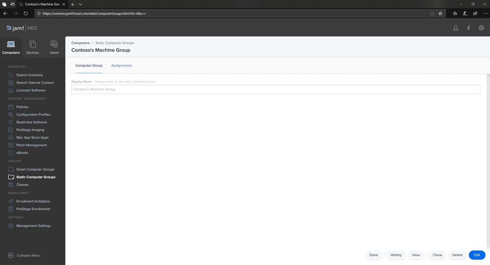

# Configurer Microsoft Defender pour endpoint sur les groupes d’appareils macOS dans Jamf Pro

[!INCLUDE [Microsoft 365 Defender rebranding](../../includes/microsoft-defender.md)]

**S’applique à :**
- [Microsoft Defender pour point de terminaison](https://go.microsoft.com/fwlink/p/?linkid=2154037)
- [Microsoft 365 Defender](https://go.microsoft.com/fwlink/?linkid=2118804)

> Vous souhaitez faire l’expérience de Defender pour point de terminaison ? [Inscrivez-vous pour bénéficier d’un essai gratuit.](https://signup.microsoft.com/create-account/signup?products=7f379fee-c4f9-4278-b0a1-e4c8c2fcdf7e&ru=https://aka.ms/MDEp2OpenTrial?ocid=docs-wdatp-investigateip-abovefoldlink)

Configurer les groupes d’appareils similaires aux groupes d’organisation de stratégie de groupe, à Microsoft Endpoint Configuration Manager collection d’appareils et aux groupes d’appareils d’Intune.

1. Accédez à **Groupes d’ordinateurs statiques.**

2. Sélectionnez **Nouveau**. 

    

3. Fournissez un nom d’affichage et sélectionnez **Enregistrer.**

    

4. Vous verrez maintenant le groupe **d’ordinateurs de Contoso** sous **Groupes d’ordinateurs statiques.**

    

## Étape suivante
- [Configurer Microsoft Defender pour endpoint sur les stratégies macOS dans Jamf Pro](mac-jamfpro-policies.md)
