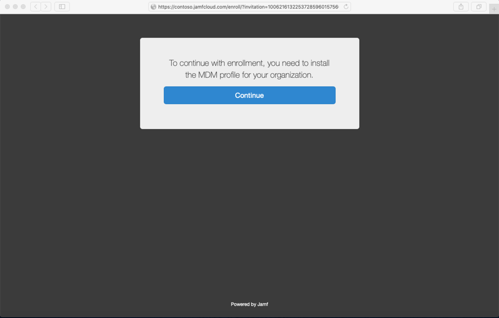

# Inscrire Microsoft Defender pour endpoint sur les appareils macOS dans Jamf Pro

[!INCLUDE [Microsoft 365 Defender rebranding](../../includes/microsoft-defender.md)]

**S’applique à :**
- [Microsoft Defender pour point de terminaison](https://go.microsoft.com/fwlink/p/?linkid=2154037)
- [Microsoft 365 Defender](https://go.microsoft.com/fwlink/?linkid=2118804)

> Vous souhaitez faire l’expérience de Defender pour point de terminaison ? [Inscrivez-vous pour bénéficier d’un essai gratuit.](https://signup.microsoft.com/create-account/signup?products=7f379fee-c4f9-4278-b0a1-e4c8c2fcdf7e&ru=https://aka.ms/MDEp2OpenTrial?ocid=docs-wdatp-investigateip-abovefoldlink)

## Inscrire des appareils macOS

Il existe plusieurs méthodes pour être inscrit à JamF.

Cet article vous guide sur deux méthodes :

- [Méthode 1 : Invitations à l’inscription](#enrollment-method-1-enrollment-invitations)
- [Méthode 2 : Pré-étape des inscriptions](#enrollment-method-2-prestage-enrollments)

Pour obtenir la liste complète, voir [à propos de l’inscription de l’ordinateur.](https://docs.jamf.com/9.9/casper-suite/administrator-guide/About_Computer_Enrollment.html)

## Méthode d’inscription 1 : invitations à l’inscription

1. Dans le tableau de bord Pro Jamf, accédez aux **invitations d’inscription.**

    

2. Sélectionnez **+ Nouveau**.

    

3. Dans **Spécifier les destinataires de l'>** sous **Adresses** de messagerie, entrez l’adresse de messagerie des destinataires.

    

    

    Par exemple : janedoe@contoso.com

    

4. Configurez le message pour l’invitation.

    

    

    

    

## Enrollment Method 2: Prestage Enrollments

1. Dans le tableau de bord Pro Jamf, accédez à **Pré-étapes d’inscription.**

    

2. Suivez les instructions dans [Computer PreStage Enrollments](https://docs.jamf.com/9.9/casper-suite/administrator-guide/Computer_PreStage_Enrollments.html).

## Inscrire un appareil macOS

1. Sélectionnez **Continuer** et installez le certificat d’ac à partir d’une **fenêtre Préférences système.**

    

2. Une fois le certificat d’ac installé, revenir à la fenêtre du navigateur, puis **sélectionnez Continuer** et installer le profil MDM.

    

3. Sélectionnez **Autoriser** les téléchargements à partir de JAMF.

    

4. Sélectionnez **Continuer** pour poursuivre l’installation du profil MDM.

    

5. Sélectionnez **Continuer** à installer le profil MDM.

    

6. Sélectionnez **Continuer**  pour terminer la configuration.

    
