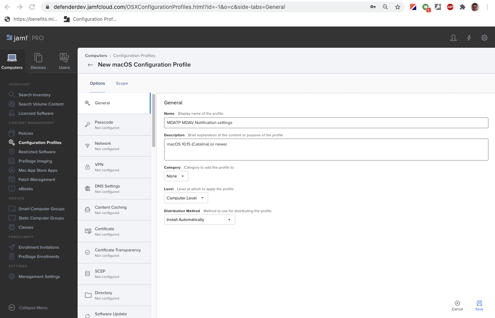
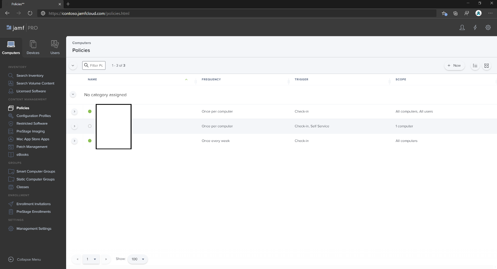

# <a name="set-up-the-microsoft-defender-for-endpoint-on-macos-policies-in-jamf-pro"></a>Configurer microsoft Defender pour le point de terminaison sur les stratégies macOS dans Jamf Pro

[!INCLUDE [Microsoft 365 Defender rebranding](../../includes/microsoft-defender.md)]


**S’applique à :**

- [Defender pour point de terminaison sur Mac](microsoft-defender-endpoint-mac.md)

Cette page vous guide à travers les étapes à suivre pour configurer des stratégies macOS dans Jamf Pro.

Vous devez suivre les étapes suivantes :

1. [Obtenir le package d’intégration De Microsoft Defender pour point de terminaison](#step-1-get-the-microsoft-defender-for-endpoint-onboarding-package)
2. [Créer un profil de configuration dans Jamf Pro à l’aide du package d’intégration](#step-2-create-a-configuration-profile-in-jamf-pro-using-the-onboarding-package)
3. [Configurer les paramètres de Microsoft Defender pour les points de terminaison](#step-3-configure-microsoft-defender-for-endpoint-settings)
4. [Configurer microsoft Defender pour les paramètres de notification de point de terminaison](#step-4-configure-notifications-settings)
5. [Configurer la mise à jour automatique Microsoft (AutoUpdate)](#step-5-configure-microsoft-autoupdate-mau)
6. [Accorder un accès disque complet à Microsoft Defender pour le point de terminaison](#step-6-grant-full-disk-access-to-microsoft-defender-for-endpoint)
7. [Approuver l’extension de noyau pour Microsoft Defender pour le point de terminaison](#step-7-approve-kernel-extension-for-microsoft-defender-for-endpoint)
8. [Approuver les extensions système pour Microsoft Defender pour le point de terminaison](#step-8-approve-system-extensions-for-microsoft-defender-for-endpoint)
9. [Configurer l’extension réseau](#step-9-configure-network-extension)
10. [Planifier des analyses avec Microsoft Defender pour endpoint sur macOS](/windows/security/threat-protection/microsoft-defender-atp/mac-schedule-scan-atp)
11. [Déployer Microsoft Defender pour le point de terminaison sur macOS](#step-11-deploy-microsoft-defender-for-endpoint-on-macos)

## <a name="step-1-get-the-microsoft-defender-for-endpoint-onboarding-package"></a>Étape 1 : Obtenir le package d’intégration De Microsoft Defender pour point de terminaison

1. In [Centre de sécurité Microsoft Defender](https://securitycenter.microsoft.com), navigate to **Paramètres > Onboarding**.

2. Sélectionnez macOS comme système d’exploitation et Gestion des périphériques mobiles/Microsoft Intune comme méthode de déploiement.

    

3. Sélectionnez **Télécharger le package d’intégration** (WindowsDefenderATPOnboardingPackage.zip).

4. Extraire `WindowsDefenderATPOnboardingPackage.zip` .

5. Copiez le fichier à votre emplacement préféré. Par exemple, `C:\Users\JaneDoe_or_JohnDoe.contoso\Downloads\WindowsDefenderATPOnboardingPackage_macOS_MDM_contoso\jamf\WindowsDefenderATPOnboarding.plist`.

## <a name="step-2-create-a-configuration-profile-in-jamf-pro-using-the-onboarding-package"></a>Étape 2 : Créer un profil de configuration dans Jamf Pro à l’aide du package d’intégration

1. Recherchez le `WindowsDefenderATPOnboarding.plist` fichier dans la section précédente.

   

2. Dans le tableau de bord Pro Jamf, sélectionnez **Nouveau**.

    

3. Entrez les détails suivants :

   **Général**:

   - Nom : intégration MDATP pour macOS
   - Description : intégration PEPT MDATP pour macOS
   - Catégorie : Aucun
   - Méthode de distribution : installer automatiquement
   - Niveau : niveau ordinateur

4. In **Application & Custom Paramètres** select **Configure**.

    

5. Sélectionnez **Télécharger fichier (fichier PLIST),** puis dans **Domaine** de préférence, entrez `com.microsoft.wdav.atp` :

    

    

6. Sélectionnez **Ouvrir** et sélectionnez le fichier d’intégration.

    

7. Sélectionnez **Télécharger**.

    

8. Sélectionnez **l’onglet** Étendue.

    

9. Sélectionnez les ordinateurs cibles.

    

    

10. Sélectionnez **Enregistrer**.

    

    

11. Sélectionnez **Terminé**.

    

    

## <a name="step-3-configure-microsoft-defender-for-endpoint-settings"></a>Étape 3 : Configurer Microsoft Defender pour les paramètres de point de terminaison

Vous pouvez utiliser jamf Pro GUI pour modifier les paramètres individuels de la configuration Microsoft Defender ou utiliser la méthode héritée en créant un Plist de configuration dans un éditeur de texte et en le téléchargeant dans jamf Pro.

Notez que vous devez utiliser exact comme domaine de préférence , Microsoft Defender utilise uniquement ce nom et pour `com.microsoft.wdav` charger ses  `com.microsoft.wdav.ext` paramètres gérés !

(La version peut être utilisée dans de rares cas lorsque vous préférez utiliser la méthode GUI, mais que vous devez également configurer un paramètre qui n’a pas encore été ajouté au `com.microsoft.wdav.ext` schéma.)

### <a name="gui-method"></a>Méthode GUI

1. Téléchargez le fichier schema.json à partir du référentiel [GitHub](https://github.com/microsoft/mdatp-xplat/tree/master/macos/schema) defender et enregistrez-le dans un fichier local :

    ```bash
    curl -o ~/Documents/schema.json https://raw.githubusercontent.com/microsoft/mdatp-xplat/master/macos/schema/schema.json
    ```

2. Créez un profil de configuration sous Ordinateurs -> profils de configuration, entrez les détails suivants sous **l’onglet Général** :

    

    - Nom : paramètres de configuration MDAV MDATP
    - Description :\<blank\>
    - Catégorie : Aucun (par défaut)
    - Niveau : niveau ordinateur (par défaut)
    - Méthode de distribution : installer automatiquement (par défaut)

3. Faites défiler vers le bas jusqu’à l’onglet Application &  Custom  **Paramètres,** sélectionnez **Applications** externes, cliquez sur Ajouter et utiliser le schéma personnalisé comme source à utiliser pour le domaine de préférence.

    

4. Entrez comme domaine de préférence, cliquez sur Ajouter un schéma et Télécharger fichier `com.microsoft.wdav` schema.json téléchargé à l’étape 1.   Cliquez sur **Enregistrer**.

    

5. Vous pouvez voir tous les paramètres de configuration de Microsoft Defender pris en charge ci-dessous, sous **Propriétés de domaine de préférence.** Cliquez **sur Ajouter/Supprimer des propriétés** pour sélectionner les paramètres à gérer, puis cliquez sur **OK** pour enregistrer vos modifications. (Paramètres non sélectionné ne sera pas inclus dans la configuration gérée, un utilisateur final pourra configurer ces paramètres sur ses ordinateurs.)

    

6. Modifiez les valeurs des paramètres en valeurs souhaitées. Vous pouvez cliquer **sur Plus d’informations** pour obtenir la documentation d’un paramètre particulier. (Vous pouvez cliquer sur **aperçu Plist** pour inspecter l’apparence de la liste de configuration. Cliquez **sur Éditeur de formulaire** pour revenir à l’éditeur visuel.)

    

7. Sélectionnez **l’onglet** Étendue.

    

8. Sélectionnez **Le groupe d’ordinateurs de Contoso.**

9. Sélectionnez **Ajouter,** puis **Enregistrer.**

    

    

10. Sélectionnez **Terminé**. Vous verrez le nouveau profil **de configuration.**

    

Microsoft Defender ajoute de nouveaux paramètres au fil du temps. Ces nouveaux paramètres seront ajoutés au schéma et une nouvelle version sera publiée sur Github.
Il vous suffit de télécharger un schéma mis à jour, de modifier  le profil de configuration existant et de modifier le schéma sous l’onglet Application **& Custom Paramètres.**

### <a name="legacy-method"></a>Méthode héritée

1. Utilisez les paramètres de configuration de Microsoft Defender pour les points de terminaison suivants :

    - enableRealTimeProtection
    - passiveMode

    > [!NOTE]
    > Non désactivé par défaut, si vous envisagez d’exécuter un antivirus tiers pour macOS, définissez-le sur `true` .

    - exclusions
    - excludedPath
    - excludedFileExtension
    - excludedFileName
    - exclusionsMergePolicy
    - allowedThreats

    > [!NOTE]
    > EICAR est sur l’exemple, si vous êtes en train de passer par une preuve de concept, supprimez-le en particulier si vous testez EICAR.

    - disallowedThreatActions
    - potentially_unwanted_application
    - archive_bomb
    - cloudService
    - automaticSampleSubmission
    - étiquettes
    - hideStatusMenuIcon

     Pour plus d’informations, [voir Liste des propriétés pour le profil de configuration complet JAMF.](mac-preferences.md#property-list-for-jamf-full-configuration-profile)

     ```XML
     <?xml version="1.0" encoding="UTF-8"?>
     <!DOCTYPE plist PUBLIC "-//Apple//DTD PLIST 1.0//EN" "http://www.apple.com/DTDs/PropertyList-1.0.dtd">
     <plist version="1.0">
     <dict>
         <key>antivirusEngine</key>
         <dict>
             <key>enableRealTimeProtection</key>
             <true/>
             <key>passiveMode</key>
             <false/>
             <key>exclusions</key>
             <array>
                 <dict>
                     <key>$type</key>
                     <string>excludedPath</string>
                     <key>isDirectory</key>
                     <false/>
                     <key>path</key>
                     <string>/var/log/system.log</string>
                 </dict>
                 <dict>
                     <key>$type</key>
                     <string>excludedPath</string>
                     <key>isDirectory</key>
                     <true/>
                     <key>path</key>
                     <string>/home</string>
                 </dict>
                 <dict>
                     <key>$type</key>
                     <string>excludedFileExtension</string>
                     <key>extension</key>
                     <string>pdf</string>
                 </dict>
                 <dict>
                     <key>$type</key>
                     <string>excludedFileName</string>
                     <key>name</key>
                     <string>cat</string>
                 </dict>
             </array>
             <key>exclusionsMergePolicy</key>
             <string>merge</string>
             <key>allowedThreats</key>
             <array>
                 <string>EICAR-Test-File (not a virus)</string>
             </array>
             <key>disallowedThreatActions</key>
             <array>
                 <string>allow</string>
                 <string>restore</string>
             </array>
             <key>threatTypeSettings</key>
             <array>
                 <dict>
                     <key>key</key>
                     <string>potentially_unwanted_application</string>
                     <key>value</key>
                     <string>block</string>
                 </dict>
                 <dict>
                     <key>key</key>
                     <string>archive_bomb</string>
                     <key>value</key>
                     <string>audit</string>
                 </dict>
             </array>
             <key>threatTypeSettingsMergePolicy</key>
             <string>merge</string>
         </dict>
         <key>cloudService</key>
         <dict>
             <key>enabled</key>
             <true/>
             <key>diagnosticLevel</key>
             <string>optional</string>
             <key>automaticSampleSubmission</key>
             <true/>
         </dict>
         <key>edr</key>
         <dict>
             <key>tags</key>
             <array>
                 <dict>
                     <key>key</key>
                     <string>GROUP</string>
                     <key>value</key>
                     <string>ExampleTag</string>
                 </dict>
             </array>
         </dict>
         <key>userInterface</key>
         <dict>
             <key>hideStatusMenuIcon</key>
             <false/>
         </dict>
     </dict>
     </plist>
     ```

2. Enregistrez le fichier sous `MDATP_MDAV_configuration_settings.plist` .

3. Dans le tableau de bord Jamf Pro, ouvrez **Ordinateurs,** et il y a des **profils de configuration.** Cliquez sur **Nouveau (* et basculez vers **l’onglet** Général.

    

4. Entrez les détails suivants :

    **Général**

    - Nom : paramètres de configuration MDAV MDATP
    - Description :\<blank\>
    - Catégorie : Aucun (par défaut)
    - Méthode de distribution : installer automatiquement (par défaut)
    - Niveau : Niveau ordinateur (par défaut)

    

5. In **Application & Custom Paramètres** select **Configure**.

    

6. Sélectionnez **Télécharger fichier (fichier PLIST).**

    

7. In **Preferences Domain**, enter `com.microsoft.wdav` , then select Télécharger **PLIST File**.

    

8. Sélectionnez **Choisir un fichier.**

    

9. Sélectionnez **le MDATP_MDAV_configuration_settings.plist,** puis sélectionnez **Ouvrir.**

    

10. Sélectionnez **Télécharger**.

    

    

    > [!NOTE]
    > Si vous téléchargez le fichier Intune, vous obtenez l’erreur suivante :
    >
    >

11. Sélectionnez **Enregistrer**.

    

12. Le fichier est téléchargé.

    

    

13. Sélectionnez **l’onglet** Étendue.

    

14. Sélectionnez **Le groupe d’ordinateurs de Contoso.**

15. Sélectionnez **Ajouter,** puis **Enregistrer.**

    

    

16. Sélectionnez **Terminé**. Vous verrez le nouveau profil **de configuration.**

    

## <a name="step-4-configure-notifications-settings"></a>Étape 4 : Configurer les paramètres de notification

Ces étapes s’appliquent à macOS 10.15 (Genre), ou une nouveauté.

1. Dans le tableau de bord Jamf Pro, **sélectionnez Ordinateurs,** puis **Profils de configuration.**

2. Cliquez **sur** Nouveau, puis entrez les détails suivants pour **options**:

    - Onglet **Général**:
        - **Name**: Paramètres de notification MDAV MDATP
        - **Description**: macOS 10.15 (Contrôle) ou une nouveauté
        - **Catégorie**: Aucun *(par défaut)*
        - **Méthode de distribution**: installer automatiquement *(par défaut)*
        - **Niveau**: niveau ordinateur *(par défaut)*

        

    - Tab **Notifications,** click **Add**, and enter the following values:
        - **ID d’offre groupée**: `com.microsoft.wdav.tray`
        - **Alertes critiques**: cliquez sur **Désactiver**
        - **Notifications :** cliquez sur **Activer**
        - **Type d’alerte bannière**: sélectionner **Inclure** **et temporaire** *(par défaut)*
        - **Notifications sur l’écran de verrouillage**: cliquez sur **Masquer**
        - **Notifications dans le Centre de notifications**: cliquez sur **Afficher**
        - **Icône d’application de badge**: cliquez sur **Afficher**

        

    - Tab **Notifications**, click **Add** one more time, scroll down to **New Notifications Paramètres**
        - **ID d’offre groupée**: `com.microsoft.autoupdate2`
        - Configurer le reste des paramètres sur les mêmes valeurs que ci-dessus

        

        Notez que vous avez maintenant deux « tables » avec des configurations de notification, une pour l’ID d’offre groupée : **com.microsoft.wdav.tray** et une autre pour l’ID d’offre groupée : **com.microsoft.autoupdate2**. Bien que vous pouvez configurer les paramètres d’alerte en fonction de vos  besoins,  les ID d’offre groupée doivent être exactement les mêmes que ceux décrits précédemment, et le commutateur Inclure doit être en cours pour les **notifications.**

3. Sélectionnez **l’onglet** Étendue, puis **sélectionnez Ajouter.**

    

4. Sélectionnez **Le groupe d’ordinateurs de Contoso.**

5. Sélectionnez **Ajouter,** puis **Enregistrer.**

    

    

6. Sélectionnez **Terminé**. Vous verrez le nouveau profil **de configuration.**

    

## <a name="step-5-configure-microsoft-autoupdate-mau"></a>Étape 5 : Configurer la mise à jour automatique Microsoft (AutoUpdate)

1. Utilisez les paramètres de configuration de Microsoft Defender pour les points de terminaison suivants :

      ```XML
   <?xml version="1.0" encoding="UTF-8"?>
   <!DOCTYPE plist PUBLIC "-//Apple//DTD PLIST 1.0//EN" "http://www.apple.com/DTDs/PropertyList-1.0.dtd">
   <plist version="1.0">
   <dict>
    <key>ChannelName</key>
    <string>Current</string>
    <key>HowToCheck</key>
    <string>AutomaticDownload</string>
    <key>EnableCheckForUpdatesButton</key>
    <true/>
    <key>DisableInsiderCheckbox</key>
    <false/>
    <key>SendAllTelemetryEnabled</key>
    <true/>
   </dict>
   </plist>
   ```

2. Enregistrez-le sous `MDATP_MDAV_MAU_settings.plist` .

3. Dans le tableau de bord Pro Jamf, sélectionnez **Général**.

    

4. Entrez les détails suivants :

    **Général**

    - Name: MDATP MDAV MAU settings
    - Description : Paramètres de mise à jour automatique Microsoft pour MDATP pour macOS
    - Catégorie : Aucun (par défaut)
    - Méthode de distribution : installer automatiquement (par défaut)
    - Niveau : Niveau ordinateur (par défaut)

5. In **Application & Custom Paramètres** select **Configure**.

    

6. Sélectionnez **Télécharger fichier (fichier PLIST).**

    

7. In **Preference Domain** enter: , then select Télécharger `com.microsoft.autoupdate2` **PLIST File**.

    

8. Sélectionnez **Choisir un fichier.**

    

9. Sélectionnez **MDATP_MDAV_MAU_settings.plist.**

    

10. Sélectionnez **Télécharger**.
    

    

11. Sélectionnez **Enregistrer**.

    

12. Sélectionnez **l’onglet** Étendue.

     

13. Sélectionnez **Ajouter**.

    

    

    

14. Sélectionnez **Terminé**.

    

## <a name="step-6-grant-full-disk-access-to-microsoft-defender-for-endpoint"></a>Étape 6 : Accorder un accès disque complet à Microsoft Defender pour le point de terminaison

1. Dans le tableau de bord Jamf Pro, sélectionnez **Profils de configuration.**

    

2. Sélectionnez **+ Nouveau**.

3. Entrez les détails suivants :

    **Général**
    - Nom : MDATP MDAV - accorder un accès disque total à PEPT et antivirus
    - Description : sur macOS Ou une nouveauté, le nouveau contrôle de stratégie des préférences de confidentialité
    - Catégorie : Aucun
    - Méthode de distribution : installer automatiquement
    - Niveau : niveau ordinateur

    

4. In **Configure Privacy Preferences Policy Control** select **Configure**.

    

5. Dans **le contrôle de stratégie des préférences de confidentialité,** entrez les détails suivants :

    - Identificateur : `com.microsoft.wdav`
    - Type d’identificateur : ID d’offre groupée
    - Conditions requises pour le code : `identifier "com.microsoft.wdav" and anchor apple generic and certificate 1[field.1.2.840.113635.100.6.2.6] /* exists */ and certificate leaf[field.1.2.840.113635.100.6.1.13] /* exists */ and certificate leaf[subject.OU] = UBF8T346G9`

    

6. Sélectionnez **+ Ajouter**.

    

    - Sous Application ou service : définir sur **SystemPolicyAllFiles**

    - Sous « accès » : définir sur **Autoriser**

7. Sélectionnez **Enregistrer** (et non celui en bas à droite).

    

8. Cliquez sur le `+` signe en de côté **d’App Access** pour ajouter une nouvelle entrée.

    

9. Entrez les détails suivants :

    - Identificateur : `com.microsoft.wdav.epsext`
    - Type d’identificateur : ID d’offre groupée
    - Conditions requises pour le code : `identifier "com.microsoft.wdav.epsext" and anchor apple generic and certificate 1[field.1.2.840.113635.100.6.2.6] /* exists */ and certificate leaf[field.1.2.840.113635.100.6.1.13] /* exists */ and certificate leaf[subject.OU] = UBF8T346G9`

10. Sélectionnez **+ Ajouter**.

    

    - Sous Application ou service : définir sur **SystemPolicyAllFiles**

    - Sous « accès » : définir sur **Autoriser**

11. Sélectionnez **Enregistrer** (et non celui en bas à droite).

    

12. Sélectionnez **l’onglet** Étendue.

    

13. Sélectionnez **+ Ajouter**.

    

14. Sélectionnez **Groupes d’ordinateurs** > **sous Nom** de groupe > sélectionnez Groupe MachineGroup de **Contoso.**

    

15. Sélectionnez **Ajouter**.

16. Sélectionnez **Enregistrer**.

17. Sélectionnez **Terminé**.

    

    

Vous pouvez également télécharger [fulldisk.mobileconfig](https://github.com/microsoft/mdatp-xplat/blob/master/macos/mobileconfig/profiles/fulldisk.mobileconfig) et le télécharger dans les profils de configuration JAMF, comme décrit dans [Deploying Custom Configuration Profiles using Jamf Pro| Méthode 2 : Télécharger profil de configuration à Jamf Pro](https://www.jamf.com/jamf-nation/articles/648/deploying-custom-configuration-profiles-using-jamf-pro).

## <a name="step-7-approve-kernel-extension-for-microsoft-defender-for-endpoint"></a>Étape 7 : Approuver l’extension de noyau pour Microsoft Defender pour le point de terminaison

> [!CAUTION]
> Les appareils Apple Silicon (M1) ne supportent pas KEXT. L’installation d’un profil de configuration constitué de stratégies KEXT échoue sur ces appareils.

1. Dans les **profils de configuration,** **sélectionnez + Nouveau**.

    

2. Entrez les détails suivants :

    **Général**

    - Name: MDATP MDAV Kernel Extension
    - Description : extension de noyau MDATP (kext)
    - Catégorie : Aucun
    - Méthode de distribution : installer automatiquement
    - Niveau : niveau ordinateur

    

3. In **Configure Approved Kernel Extensions** select **Configure**.

    

4. Dans **Extensions de noyau approuvées,** entrez les détails suivants :

    - Nom complet : Microsoft Corp.
    - ID d’équipe : UBF8T346G9

    

5. Sélectionnez **l’onglet** Étendue.

    

6. Sélectionnez **+ Ajouter**.

7. Sélectionnez **Groupes d’ordinateurs** > **sous Nom du** > sélectionnez Groupe ordinateur de **Contoso.**

8. Sélectionnez **+ Ajouter**.

    

9. Sélectionnez **Enregistrer**.

    

10. Sélectionnez **Terminé**.

    

Vous pouvez également télécharger [kext.mobileconfig](https://github.com/microsoft/mdatp-xplat/blob/master/macos/mobileconfig/profiles/kext.mobileconfig) et le télécharger dans les profils de configuration JAMF, comme décrit dans [Deploying Custom Configuration Profiles using Jamf Pro| Méthode 2 : Télécharger profil de configuration à Jamf Pro](https://www.jamf.com/jamf-nation/articles/648/deploying-custom-configuration-profiles-using-jamf-pro).

## <a name="step-8-approve-system-extensions-for-microsoft-defender-for-endpoint"></a>Étape 8 : Approuver les extensions système pour Microsoft Defender pour le point de terminaison

1. Dans les **profils de configuration,** **sélectionnez + Nouveau**.

    

2. Entrez les détails suivants :

    **Général**

    - Name: MDATP MDAV System Extensions
    - Description : extensions système MDATP
    - Catégorie : Aucun
    - Méthode de distribution : installer automatiquement
    - Niveau : niveau ordinateur

    

3. Dans **les extensions système,** **sélectionnez Configurer.**

   

4. Dans **les extensions système,** entrez les détails suivants :

   - Nom complet : Microsoft Corp. System Extensions
   - Types d’extension système : extensions système autorisées
   - Identificateur d’équipe : UBF8T346G9
   - Extensions système autorisées :
     - **com.microsoft.wdav.epsext**
     - **com.microsoft.wdav.netext**

    

5. Sélectionnez **l’onglet** Étendue.

    

6. Sélectionnez **+ Ajouter**.

7. Sélectionnez **Groupes d’ordinateurs** > **sous Nom du** > sélectionnez Groupe ordinateur de **Contoso.**

8. Sélectionnez **+ Ajouter**.

   

9. Sélectionnez **Enregistrer**.

   

10. Sélectionnez **Terminé**.

    

## <a name="step-9-configure-network-extension"></a>Étape 9 : Configurer l’extension réseau

Dans le cadre des fonctionnalités de détection et de réponse des points de terminaison, Microsoft Defender for Endpoint sur macOS inspecte le trafic de socket et signale ces informations au portail Centre de sécurité Microsoft Defender. La stratégie suivante permet à l’extension réseau d’effectuer cette fonctionnalité.

Ces étapes s’appliquent à macOS 10.15 (Genre), ou une nouveauté.

1. Dans le tableau de bord Jamf Pro, **sélectionnez Ordinateurs,** puis **Profils de configuration.**

2. Cliquez **sur** Nouveau, puis entrez les détails suivants pour **options**:

    - Onglet **Général**:
        - **Nom**: Extension réseau Microsoft Defender ATP
        - **Description**: macOS 10.15 (Contrôle) ou une nouveauté
        - **Catégorie**: Aucun *(par défaut)*
        - **Méthode de distribution**: installer automatiquement *(par défaut)*
        - **Niveau**: niveau ordinateur *(par défaut)*

    - Filtre **de contenu d’onglet**:
        - **Nom du** filtre : filtre de contenu Microsoft Defender ATP
        - **Identificateur**: `com.microsoft.wdav`
        - Laisser **l’adresse du service,** **l’organisation,** **le nom d’utilisateur,** le mot de **passe,** **le certificat** vide (**Inclure** *n’est pas* sélectionné)
        - **Filter Order**: Inspector
        - **Filtre de socket**: `com.microsoft.wdav.netext`
        - **Exigence désignée par le filtre de socket**: `identifier "com.microsoft.wdav.netext" and anchor apple generic and certificate 1[field.1.2.840.113635.100.6.2.6] /* exists */ and certificate leaf[field.1.2.840.113635.100.6.1.13] /* exists */ and certificate leaf[subject.OU] = UBF8T346G9`
        - Laisser **les champs Filtre réseau** vides **(Inclure** *n’est pas* sélectionné)

        Notez que **l’identificateur,** le filtre de **socket** et le **filtre de socket désignent** les valeurs exactes requises comme spécifié ci-dessus.

        

3. Sélectionnez **l’onglet** Étendue.

   

4. Sélectionnez **+ Ajouter**.

5. Sélectionnez **Groupes d’ordinateurs** > **sous Nom du** > sélectionnez Groupe ordinateur de **Contoso.**

6. Sélectionnez **+ Ajouter**.

    

7. Sélectionnez **Enregistrer**.

    

8. Sélectionnez **Terminé**.

    

Vous pouvez également télécharger [netfilter.mobileconfig](https://github.com/microsoft/mdatp-xplat/blob/master/macos/mobileconfig/profiles/netfilter.mobileconfig) et le télécharger dans les profils de configuration JAMF, comme décrit dans [Deploying Custom Configuration Profiles using Jamf Pro| Méthode 2 : Télécharger profil de configuration à Jamf Pro](https://www.jamf.com/jamf-nation/articles/648/deploying-custom-configuration-profiles-using-jamf-pro).

## <a name="step-10-schedule-scans-with-microsoft-defender-for-endpoint-on-macos"></a>Étape 10 : Planifier des analyses avec Microsoft Defender pour Endpoint sur macOS

Suivez les instructions des [analyses de planification avec Microsoft Defender for Endpoint sur macOS.](/windows/security/threat-protection/microsoft-defender-atp/mac-schedule-scan-atp)

## <a name="step-11-deploy-microsoft-defender-for-endpoint-on-macos"></a>Étape 11 : Déployer Microsoft Defender pour endpoint sur macOS

1. Accédez à l’endroit où vous avez `wdav.pkg` enregistré.

    

2. Renommons-le `wdav_MDM_Contoso_200329.pkg` .

    

3. Ouvrez le tableau de bord Pro Jamf.

    

4. Sélectionnez votre ordinateur et cliquez sur l’icône d’engrenage en haut, puis sélectionnez **Gestion de l’ordinateur.**

    

5. Dans **les packages,** **sélectionnez + Nouveau**.
    

6. Dans **le nouveau package,** entrez les détails suivants :

    **Onglet Général**
    - Nom complet : laissez-le vide pour le moment. Parce qu’il sera réinitialisé lorsque vous choisirez votre pkg.
    - Catégorie : Aucun (par défaut)
    - Filename: Choose File

    

    Ouvrez le fichier et pointer vers `wdav.pkg` ou `wdav_MDM_Contoso_200329.pkg` .

    

7. Sélectionnez **Ouvrir**. Définissez **le nom complet sur** Microsoft Defender - Protection avancée contre les **menaces et Antivirus Microsoft Defender**.

    **Le fichier manifeste n’est** pas requis. Microsoft Defender pour le point de terminaison fonctionne sans fichier manifeste.

    **Onglet Options**: conserver les valeurs par défaut.

    **Onglet Limitations :** conserver les valeurs par défaut.

     

8. Sélectionnez **Enregistrer**. Le package est téléchargé vers Jamf Pro.

   

   Le déploiement du package peut prendre quelques minutes.

   

9. Accédez à la page **Stratégies.**

    

10. Sélectionnez **+ Nouveau** pour créer une stratégie.

    


11. En **général,** entrez les détails suivants :

    - Nom complet : MDATP Onboarding Contoso 200329 v100.86.92 ou ultérieur

    

12. Sélectionnez **l’enregistrement périodique.**

    

13. Sélectionnez **Enregistrer**.

14. Sélectionnez **packages > configurer**.

    

15. Sélectionnez **le bouton** Ajouter en haut de Microsoft Defender - Protection avancée contre les **menaces et Antivirus Microsoft Defender**.

    

16. Sélectionnez **Enregistrer**.

    

17. Sélectionnez **l’onglet** Étendue.

    

18. Sélectionnez les ordinateurs cibles.

    

    **Scope**

    Sélectionnez **Ajouter**.

    

    

    **Libre-service**

    

19. Sélectionnez **Terminé**.

    

    
