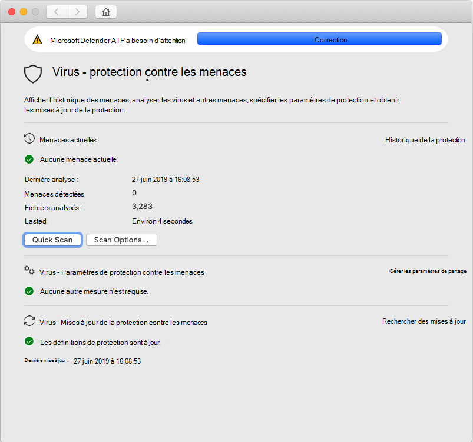
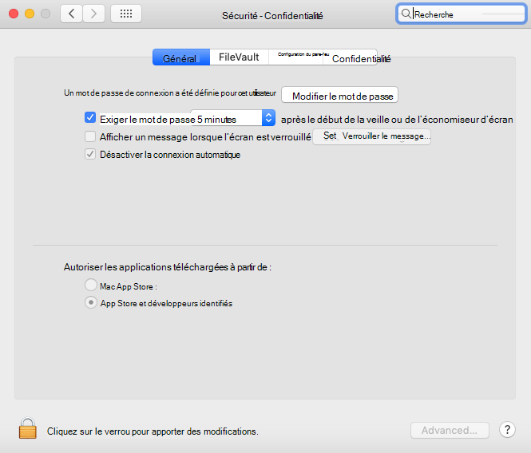

# <a name="troubleshoot-kernel-extension-issues-in-microsoft-defender-for-endpoint-on-macos"></a>Résoudre les problèmes d’extension du noyau dans Microsoft Defender pour point de terminaison sur macOS

[!INCLUDE [Microsoft 365 Defender rebranding](../../includes/microsoft-defender.md)]


**S’applique à :**

- [Microsoft Defender pour point de terminaison macOS](microsoft-defender-endpoint-mac.md)
- [Microsoft Defender pour point de terminaison](https://go.microsoft.com/fwlink/p/?linkid=2154037)
- [Microsoft 365 Defender](https://go.microsoft.com/fwlink/?linkid=2118804)

> Vous voulez découvrir Microsoft Defender pour point de terminaison ? [Inscrivez-vous pour bénéficier d’un essai gratuit.](https://signup.microsoft.com/create-account/signup?products=7f379fee-c4f9-4278-b0a1-e4c8c2fcdf7e&ru=https://aka.ms/MDEp2OpenTrial?ocid=docs-wdatp-exposedapis-abovefoldlink)

Cet article fournit des informations sur la résolution des problèmes avec l’extension de noyau installée dans le cadre de Microsoft Defender for Endpoint sur macOS.

À partir de macOS High Sierra (10.13), macOS exige que toutes les extensions de noyau soient approuvées explicitement avant d’être autorisées à s’exécuter sur l’appareil.

Si vous n’avez pas approuvé l’extension du noyau pendant le déploiement/l’installation de Microsoft Defender pour Endpoint sur macOS, l’application affiche une bannière vous invite à l’activer :

   

Vous pouvez également exécuter ```mdatp health``` . Il indique si la protection en temps réel est activée mais non disponible. Cela indique que l’extension du noyau n’est pas approuvée pour s’exécuter sur votre appareil.

```bash
mdatp health
```
```Output
...
real_time_protection_enabled                : false
real_time_protection_available              : true
...
```

Les sections suivantes fournissent des instructions sur la façon de résoudre ce problème, en fonction de la méthode que vous avez utilisée pour déployer Microsoft Defender pour Endpoint sur macOS.

## <a name="managed-deployment"></a>Déploiement géré

Consultez les instructions correspondant à l’outil de gestion que vous avez utilisé pour déployer le produit :

- [Déploiement basé sur JAMF](mac-install-with-jamf.md)
- [Déploiement basé sur Microsoft Intune](mac-install-with-intune.md#create-system-configuration-profiles)

## <a name="manual-deployment"></a>Déploiement manuel

Si moins de 30 minutes se sont écoulées depuis l’installation du produit, accédez à La sécurité des préférences système & Confidentialité , où vous devez autoriser les **logiciels** système des développeurs  >  « Microsoft Corporation ». 

Si vous ne voyez pas cette invite, cela signifie que 30 minutes ou plus se sont écoulées et que l’extension du noyau n’a toujours pas été approuvée pour s’exécuter sur votre appareil :



Dans ce cas, vous devez effectuer les étapes suivantes pour déclencher à nouveau le flux d’approbation.

1. Dans Terminal, essayez d’installer le pilote. L’opération suivante échoue, car l’extension du noyau n’a pas été approuvée pour s’exécuter sur l’appareil. Toutefois, il déclenche à nouveau le flux d’approbation.

    ```bash
    sudo kextutil /Library/Extensions/wdavkext.kext
    ```
    
    ```Output
    Kext rejected due to system policy: <OSKext 0x7fc34d528390 [0x7fffa74aa8e0]> { URL = "file:///Library/StagedExtensions/Library/Extensions/wdavkext.kext/", ID = "com.microsoft.wdavkext" }
    Kext rejected due to system policy: <OSKext 0x7fc34d528390 [0x7fffa74aa8e0]> { URL = "file:///Library/StagedExtensions/Library/Extensions/wdavkext.kext/", ID = "com.microsoft.wdavkext" }
    Diagnostics for /Library/Extensions/wdavkext.kext:
    ```

2. Ouvrez **La sécurité des préférences** système &  >  **confidentialité** dans le menu. (Fermez-le d’abord, s’il est ouvert.)

3. **Autoriser les** logiciels système des développeurs « Microsoft Corporation »

4. Dans Terminal, installez à nouveau le pilote. Cette fois, l’opération réussit :

    ```bash
    sudo kextutil /Library/Extensions/wdavkext.kext
    ```

    La bannière doit disparaître de l’application Defender et doit maintenant signaler que la protection en temps réel est à la fois ```mdatp health``` activée et disponible :

    ```bash
    mdatp health
    ```

    ```Output
    ...
    real_time_protection_enabled                : true
    real_time_protection_available              : true
    ...
    ```
