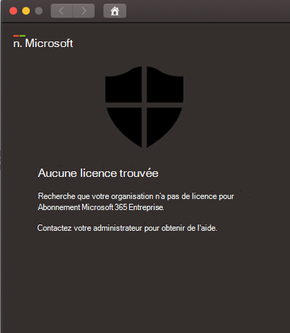

# Résoudre les problèmes de licence pour Microsoft Defender pour Endpoint pour Mac

[!INCLUDE [Microsoft 365 Defender rebranding](../../includes/microsoft-defender.md)]

**S’applique à :**

- [Microsoft Defender pour point de terminaison pour Mac](microsoft-defender-endpoint-mac.md)
- [Microsoft Defender pour point de terminaison](https://go.microsoft.com/fwlink/p/?linkid=2146631)
- [Microsoft 365 Defender](https://go.microsoft.com/fwlink/?linkid=2118804)

> Vous souhaitez découvrir Microsoft Defender pour le point de terminaison ? [Inscrivez-vous à un essai gratuit.](https://www.microsoft.com/microsoft-365/windows/microsoft-defender-atp?ocid=docs-wdatp-exposedapis-abovefoldlink)

Pendant que vous êtes en cours d’utilisation de [Microsoft Defender pour Endpoint pour Mac](microsoft-defender-endpoint-mac.md) et de tests de déploiement manuel ou d’une preuve de concept, vous pouvez obtenir l’erreur suivante : 

**Message:** 

Aucune licence trouvée

Il semble que votre organisation n’a pas de licence pour l’abonnement Microsoft 365 Entreprise.

Contactez votre administrateur pour obtenir de l'aide.

**Cause :** 

Vous avez déployé et/ou installé le package Microsoft Defender for Endpoint pour macOS (« Télécharger le package d’installation ») mais vous avez peut-être exécuté le script de configuration (« Télécharger le package d’intégration »).

**Solution :**

Suivez les instructions MicrosoftDefenderATPOnboardingMacOs.py documentées ici : [Configuration du client](mac-install-manually.md#client-configuration)

