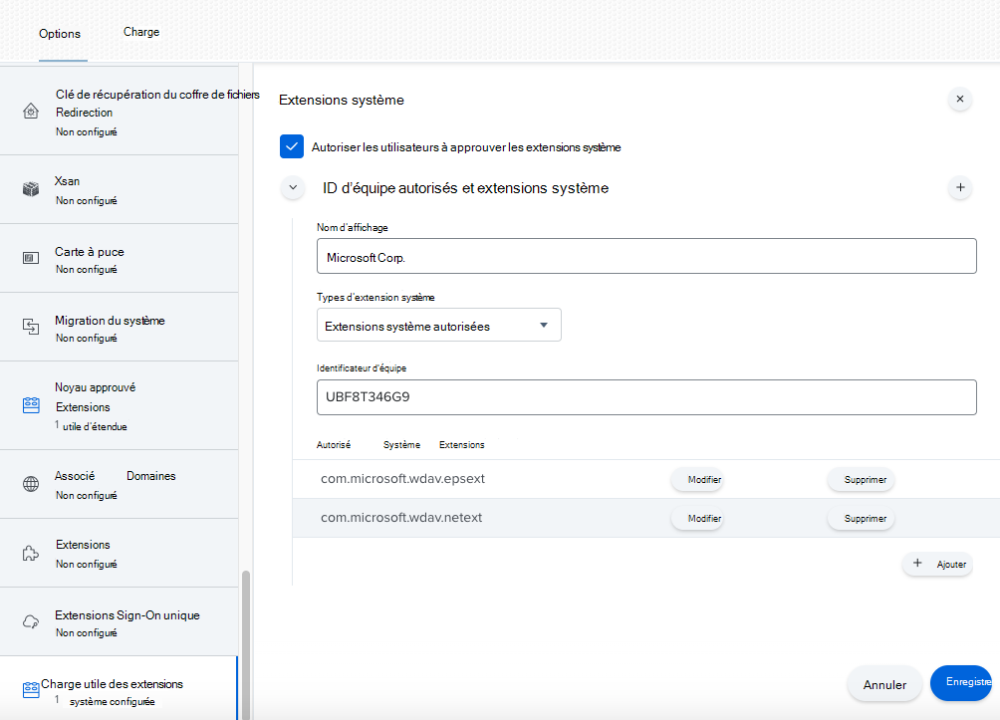
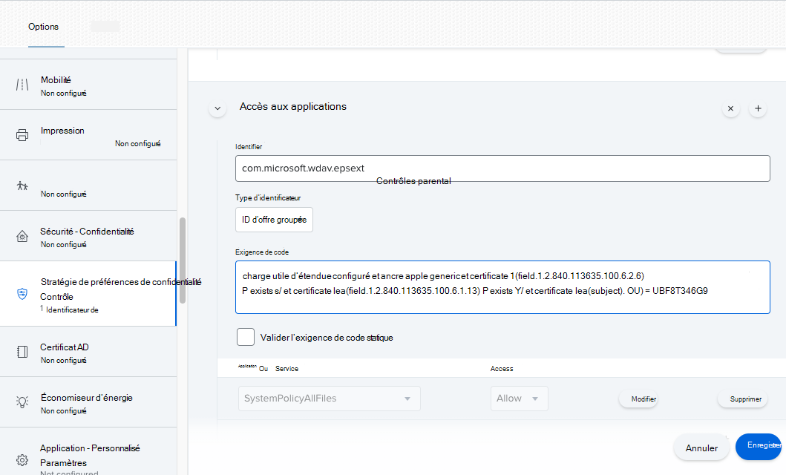
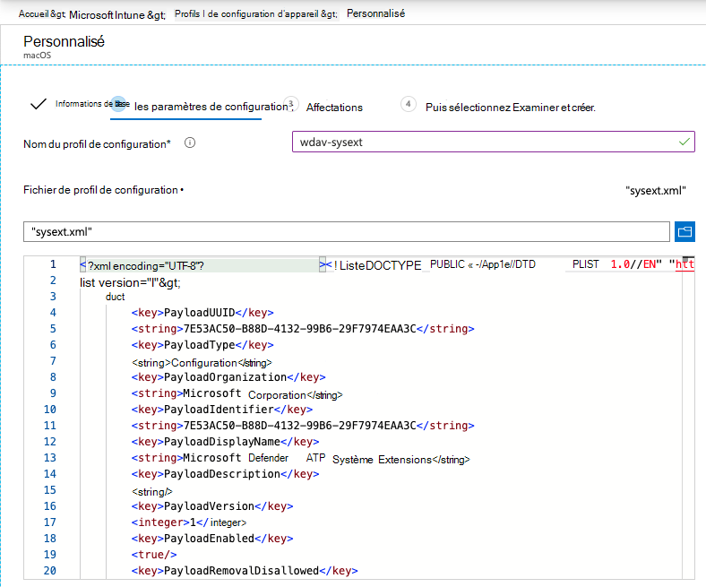

# <a name="new-configuration-profiles-for-macos-catalina-and-newer-versions-of-macos"></a>Nouveaux profils de configuration pour macOS Et les versions plus récentes de macOS

[!INCLUDE [Microsoft 365 Defender rebranding](../../includes/microsoft-defender.md)]

**S’applique à :**
- [Microsoft Defender pour point de terminaison](https://go.microsoft.com/fwlink/p/?linkid=2154037)
- [Microsoft 365 Defender](https://go.microsoft.com/fwlink/?linkid=2118804)

> Vous voulez découvrir Microsoft Defender pour point de terminaison ? [Inscrivez-vous pour bénéficier d’un essai gratuit.](https://www.microsoft.com/microsoft-365/windows/microsoft-defender-atp?ocid=docs-wdatp-exposedapis-abovefoldlink)

En adéquation avec l’évolution de macOS, nous préparons une mise à jour Microsoft Defender pour Endpoint sur macOS qui tire parti des extensions système au lieu des extensions de noyau. Cette mise à jour s’applique uniquement à macOS Fonctionnalité (10.15.4) et aux versions plus récentes de macOS.

Si vous avez déployé Microsoft Defender pour Endpoint sur macOS dans un environnement géré (via JAMF, Intune ou une autre solution MDM), vous devez déployer de nouveaux profils de configuration. Si vous n’exécutez pas ces étapes, les utilisateurs auront accès à des invites d’approbation pour exécuter ces nouveaux composants.

## <a name="jamf"></a>JAMF

### <a name="jamf-system-extensions-policy"></a>Stratégie d’extensions système JAMF

Pour approuver les extensions système, créez la charge utile suivante :

1. In **Computers > Configuration Profiles** select Options > System **Extensions**.
2. Sélectionnez **Extensions système autorisées dans** la liste de listes listes des **types** d’extensions système.
3. Utilisez **UBF8T346G9** pour l’ID d’équipe.
4. Ajoutez les identificateurs d’ensemble suivants à la **liste Extensions système autorisées** :

    - **com.microsoft.wdav.epsext**
    - **com.microsoft.wdav.netext**

    

### <a name="privacy-preferences-policy-control"></a>Contrôle de stratégie des préférences de confidentialité

Ajoutez la charge utile JAMF suivante pour accorder un accès disque total à l’extension de sécurité du point de terminaison Microsoft Defender pour endpoint. Cette stratégie est une condition préalable pour l’exécution de l’extension sur votre appareil.

1. Select **Options**  >  **Privacy Preferences Policy Control**.
2. À `com.microsoft.wdav.epsext` utiliser comme **identificateur** et `Bundle ID` comme type **d’offre groupée.**
3. Définir l’exigence de code sur `identifier "com.microsoft.wdav.epsext" and anchor apple generic and certificate 1[field.1.2.840.113635.100.6.2.6] /* exists */ and certificate leaf[field.1.2.840.113635.100.6.1.13] /* exists */ and certificate leaf[subject.OU] = UBF8T346G9`
4. Définissez **l’application ou le service** **sur SystemPolicyAllFiles et** l’accès à **Autoriser**.

    

### <a name="network-extension-policy"></a>Stratégie d’extension réseau

Dans le cadre des fonctionnalités de détection et de réponse des points de terminaison, Microsoft Defender for Endpoint sur macOS inspecte le trafic de socket et signale ces informations au portail Microsoft 365 Defender. La stratégie suivante permet à l’extension réseau d’effectuer cette fonctionnalité.

>[!NOTE]
>JAMF ne prend pas en charge les stratégies de filtrage de contenu, ce qui est une condition préalable à l’activation des extensions réseau installées par Microsoft Defender pour Endpoint sur macOS sur l’appareil. De plus, JAMF modifie parfois le contenu des stratégies déployées.
>En tant que tel, les étapes suivantes fournissent une solution de contournement qui implique la signature du profil de configuration.

1. Enregistrez le contenu suivant sur votre appareil à `com.microsoft.network-extension.mobileconfig` l’aide d’un éditeur de texte :

    ```xml
    <?xml version="1.0" encoding="UTF-8"?><!DOCTYPE plist PUBLIC "-//Apple//DTD PLIST 1.0//EN" "http://www.apple.com/DTDs/PropertyList-1.0.dtd">
    <plist version="1">
        <dict>
            <key>PayloadUUID</key>
            <string>DA2CC794-488B-4AFF-89F7-6686A7E7B8AB</string>
            <key>PayloadType</key>
            <string>Configuration</string>
            <key>PayloadOrganization</key>
            <string>Microsoft Corporation</string>
            <key>PayloadIdentifier</key>
            <string>DA2CC794-488B-4AFF-89F7-6686A7E7B8AB</string>
            <key>PayloadDisplayName</key>
            <string>Microsoft Defender ATP Network Extension</string>
            <key>PayloadDescription</key>
            <string/>
            <key>PayloadVersion</key>
            <integer>1</integer>
            <key>PayloadEnabled</key>
            <true/>
            <key>PayloadRemovalDisallowed</key>
            <true/>
            <key>PayloadScope</key>
            <string>System</string>
            <key>PayloadContent</key>
            <array>
                <dict>
                    <key>PayloadUUID</key>
                    <string>2BA070D9-2233-4827-AFC1-1F44C8C8E527</string>
                    <key>PayloadType</key>
                    <string>com.apple.webcontent-filter</string>
                    <key>PayloadOrganization</key>
                    <string>Microsoft Corporation</string>
                    <key>PayloadIdentifier</key>
                    <string>CEBF7A71-D9A1-48BD-8CCF-BD9D18EC155A</string>
                    <key>PayloadDisplayName</key>
                    <string>Approved Network Extension</string>
                    <key>PayloadDescription</key>
                    <string/>
                    <key>PayloadVersion</key>
                    <integer>1</integer>
                    <key>PayloadEnabled</key>
                    <true/>
                    <key>FilterType</key>
                    <string>Plugin</string>
                    <key>UserDefinedName</key>
                    <string>Microsoft Defender ATP Network Extension</string>
                    <key>PluginBundleID</key>
                    <string>com.microsoft.wdav</string>
                    <key>FilterSockets</key>
                    <true/>
                    <key>FilterDataProviderBundleIdentifier</key>
                    <string>com.microsoft.wdav.netext</string>
                    <key>FilterDataProviderDesignatedRequirement</key>
                    <string>identifier "com.microsoft.wdav.netext" and anchor apple generic and certificate 1[field.1.2.840.113635.100.6.2.6] /* exists */ and certificate leaf[field.1.2.840.113635.100.6.1.13] /* exists */ and certificate leaf[subject.OU] = UBF8T346G9</string>
                </dict>
            </array>
        </dict>
    </plist>
    ```

2. Vérifiez que le fichier ci-dessus a été copié correctement en exécutant `plutil` l’utilitaire dans le Terminal :

    ```bash
    $ plutil -lint <PathToFile>/com.microsoft.network-extension.mobileconfig
    ```

    Par exemple, si le fichier a été stocké dans documents :

    ```bash
    $ plutil -lint ~/Documents/com.microsoft.network-extension.mobileconfig
    ```

    Vérifiez que la commande est en `OK` sortie.

    ```bash
    <PathToFile>/com.microsoft.network-extension.mobileconfig: OK
    ```

3. Suivez les instructions de cette [page](https://www.jamf.com/jamf-nation/articles/649/creating-a-signing-certificate-using-jamf-pro-s-built-in-certificate-authority) pour créer un certificat de signature à l’aide de l’autorité de certification intégrée de JAMF.

4. Une fois le certificat créé et installé sur votre appareil, exécutez la commande suivante à partir du Terminal pour signer le fichier :

    ```bash
    $ security cms -S -N "<CertificateName>" -i <PathToFile>/com.microsoft.network-extension.mobileconfig -o <PathToSignedFile>/com.microsoft.network-extension.signed.mobileconfig
    ```

    Par exemple, si le nom du certificat est **SigningCertificate** et que le fichier signé va être stocké dans documents :

    ```bash
    $ security cms -S -N "SigningCertificate" -i ~/Documents/com.microsoft.network-extension.mobileconfig -o ~/Documents/com.microsoft.network-extension.signed.mobileconfig
    ```

5. À partir du portail JAMF, accédez à **Profils** de configuration et cliquez sur **Télécharger** bouton. Sélectionnez `com.microsoft.network-extension.signed.mobileconfig` le fichier lorsque vous y avez été invité.

## <a name="intune"></a>Intune

### <a name="intune-system-extensions-policy"></a>Stratégie d’extensions système Intune

Pour approuver les extensions système :

1. Dans Intune, ouvrez **Gérer la** configuration  >  **de l’appareil.** Sélectionnez **Gérer**  >  **les profils**  >  **créer un profil.**
2. Choisissez un nom pour le profil. Change **Platform=macOS** to **Profile type=Extensions**. Sélectionnez **Créer**.
3. Dans `Basics` l’onglet, nommez ce nouveau profil.
4. Dans `Configuration settings` l’onglet, ajoutez les entrées suivantes dans la `Allowed system extensions` section :

    Identificateur d’ensemble         | Identificateur d’équipe
    --------------------------|----------------
    com.microsoft.wdav.epsext | UBF8T346G9
    com.microsoft.wdav.netext | UBF8T346G9

    

5. Dans `Assignments` l’onglet, affectez ce profil à tous les **utilisateurs & tous les appareils.**
6. Examinez et créez ce profil de configuration.

### <a name="create-and-deploy-the-custom-configuration-profile"></a>Créer et déployer le profil de configuration personnalisé

Le profil de configuration suivant active l’extension réseau et accorde un accès disque total à l’extension système de sécurité des points de terminaison.

Enregistrez le contenu suivant dans un fichier nommé **sysext.xml**:

```xml
<?xml version="1.0" encoding="UTF-8"?><!DOCTYPE plist PUBLIC "-//Apple//DTD PLIST 1.0//EN" "http://www.apple.com/DTDs/PropertyList-1.0.dtd">
<plist version="1">
    <dict>
        <key>PayloadUUID</key>
        <string>7E53AC50-B88D-4132-99B6-29F7974EAA3C</string>
        <key>PayloadType</key>
        <string>Configuration</string>
        <key>PayloadOrganization</key>
        <string>Microsoft Corporation</string>
        <key>PayloadIdentifier</key>
        <string>7E53AC50-B88D-4132-99B6-29F7974EAA3C</string>
        <key>PayloadDisplayName</key>
        <string>Microsoft Defender ATP System Extensions</string>
        <key>PayloadDescription</key>
        <string/>
        <key>PayloadVersion</key>
        <integer>1</integer>
        <key>PayloadEnabled</key>
        <true/>
        <key>PayloadRemovalDisallowed</key>
        <true/>
        <key>PayloadScope</key>
        <string>System</string>
        <key>PayloadContent</key>
        <array>
            <dict>
                <key>PayloadUUID</key>
                <string>2BA070D9-2233-4827-AFC1-1F44C8C8E527</string>
                <key>PayloadType</key>
                <string>com.apple.webcontent-filter</string>
                <key>PayloadOrganization</key>
                <string>Microsoft Corporation</string>
                <key>PayloadIdentifier</key>
                <string>CEBF7A71-D9A1-48BD-8CCF-BD9D18EC155A</string>
                <key>PayloadDisplayName</key>
                <string>Approved Network Extension</string>
                <key>PayloadDescription</key>
                <string/>
                <key>PayloadVersion</key>
                <integer>1</integer>
                <key>PayloadEnabled</key>
                <true/>
                <key>FilterType</key>
                <string>Plugin</string>
                <key>UserDefinedName</key>
                <string>Microsoft Defender ATP Network Extension</string>
                <key>PluginBundleID</key>
                <string>com.microsoft.wdav</string>
                <key>FilterSockets</key>
                <true/>
                <key>FilterDataProviderBundleIdentifier</key>
                <string>com.microsoft.wdav.netext</string>
                <key>FilterDataProviderDesignatedRequirement</key>
                <string>identifier &quot;com.microsoft.wdav.netext&quot; and anchor apple generic and certificate 1[field.1.2.840.113635.100.6.2.6] /* exists */ and certificate leaf[field.1.2.840.113635.100.6.1.13] /* exists */ and certificate leaf[subject.OU] = UBF8T346G9</string>
            </dict>
            <dict>
                <key>PayloadUUID</key>
                <string>56105E89-C7C8-4A95-AEE6-E11B8BEA0366</string>
                <key>PayloadType</key>
                <string>com.apple.TCC.configuration-profile-policy</string>
                <key>PayloadOrganization</key>
                <string>Microsoft Corporation</string>
                <key>PayloadIdentifier</key>
                <string>56105E89-C7C8-4A95-AEE6-E11B8BEA0366</string>
                <key>PayloadDisplayName</key>
                <string>Privacy Preferences Policy Control</string>
                <key>PayloadDescription</key>
                <string/>
                <key>PayloadVersion</key>
                <integer>1</integer>
                <key>PayloadEnabled</key>
                <true/>
                <key>Services</key>
                <dict>
                    <key>SystemPolicyAllFiles</key>
                    <array>
                        <dict>
                            <key>Identifier</key>
                            <string>com.microsoft.wdav.epsext</string>
                            <key>CodeRequirement</key>
                            <string>identifier "com.microsoft.wdav.epsext" and anchor apple generic and certificate 1[field.1.2.840.113635.100.6.2.6] /* exists */ and certificate leaf[field.1.2.840.113635.100.6.1.13] /* exists */ and certificate leaf[subject.OU] = UBF8T346G9</string>
                            <key>IdentifierType</key>
                            <string>bundleID</string>
                            <key>StaticCode</key>
                            <integer>0</integer>
                            <key>Allowed</key>
                            <integer>1</integer>
                        </dict>
                    </array>
                </dict>
            </dict>
        </array>
    </dict>
</plist>
```

Vérifiez que le fichier ci-dessus a été correctement copié. À partir du Terminal, exécutez la commande suivante et vérifiez qu’elle est sortie `OK` :

```bash
$ plutil -lint sysext.xml
sysext.xml: OK
```

Pour déployer ce profil de configuration personnalisé :

1. Dans Intune, ouvrez **Gérer la** configuration  >  **de l’appareil.** Sélectionnez **Gérer**  >  **les profils**  >  **Créer un profil.**
2. Choisissez un nom pour le profil. Change **Platform=macOS** and **Profile type=Custom**. Sélectionnez **Configurer**.
3. Ouvrez le profil de configuration et **téléchargezsysext.xml**. Ce fichier a été créé à l’étape précédente.
4. Sélectionnez **OK**.

    

5. Dans `Assignments` l’onglet, affectez ce profil à tous les **utilisateurs & tous les appareils.**
6. Examinez et créez ce profil de configuration.
