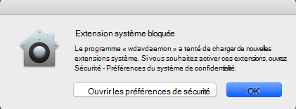
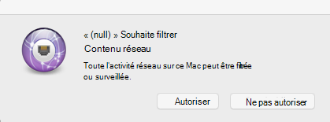
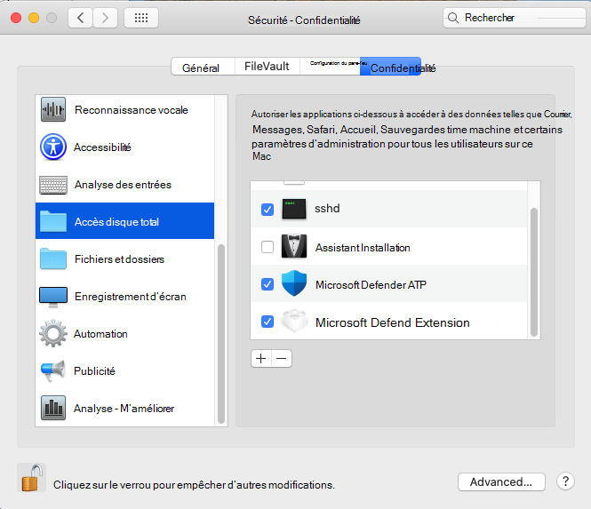

# <a name="microsoft-defender-for-endpoint-on-macos---system-extensions-public-preview"></a>Microsoft Defender pour point de terminaison sur macOS : version d'évaluation publique des extensions système)

**S’applique à :**
- [Microsoft Defender pour point de terminaison](https://go.microsoft.com/fwlink/p/?linkid=2154037)
- [Microsoft 365 Defender](https://go.microsoft.com/fwlink/?linkid=2118804)

> Vous souhaitez découvrir Microsoft Defender pour le point de terminaison ? [Inscrivez-vous à un essai gratuit.](https://www.microsoft.com/microsoft-365/windows/microsoft-defender-atp?ocid=docs-wdatp-exposedapis-abovefoldlink)

En adéquation avec l'évolution de macOS, nous préparons une mise à jour defender pour point de terminaison sur Mac qui tire parti des extensions système au lieu des extensions de noyau. Cette mise à jour s'applique uniquement à macOS Genrer (10.15.4) et aux versions ultérieures de macOS.

Cette fonctionnalité est actuellement en prévisualisation publique. Cet article explique comment activer cette fonctionnalité sur votre appareil. Vous pouvez tester cette fonctionnalité localement sur votre propre appareil ou la configurer à distance via un outil de gestion.

Ces étapes supposent que Defender for Endpoint est déjà en cours d'exécution sur votre appareil. Pour plus d'informations, voir [cette page](microsoft-defender-endpoint-mac.md).

## <a name="known-issues"></a>Problèmes connus

- Nous avons reçu des rapports sur l'extension réseau qui interfère avec l'extension Kerberos d' cesso Apple.
- La version actuelle du produit installe toujours une extension de noyau. L'extension de noyau est uniquement utilisée comme mécanisme de retour et sera supprimée avant que cette fonctionnalité n'atteigne la prévisualisation publique.
- Nous travaillons toujours sur une version de produit qui se déploie et fonctionne correctement sur macOS 11 Big Sur.

## <a name="deployment-prerequisites"></a>Conditions préalables au déploiement

- Version minimale du système d'exploitation macOS **: 10.15.4**
- Version minimale du produit **: 101.03.73**
- Votre appareil doit se trouver dans le canal de mise à jour **rapide Insider.** Vous pouvez vérifier le canal de mise à jour à l'aide de la commande suivante :

  ```bash
  mdatp health --field release_ring
  ```

  Si votre appareil n'est pas déjà dans le canal Insider Fast Update, exécutez la commande suivante à partir du Terminal. La mise à jour du canal prend effet au prochain démarrage du produit (lors de l'installation de la prochaine mise à jour du produit ou lors du redémarrage de l'appareil).

  ```bash
  defaults write com.microsoft.autoupdate2 ChannelName -string Beta
  ```

  Par ailleurs, si vous êtes dans un environnement géré (JAMF ou Intune), vous pouvez configurer le canal de mise à jour à distance. Pour plus d'informations, voir [Déployer les mises à jour de Microsoft Defender pour Endpoint sur Mac : définissez le nom du canal.](mac-updates.md#set-the-channel-name)

## <a name="deployment-steps"></a>Étapes de déploiement

Suivez les étapes de déploiement qui correspondent à votre environnement et à votre méthode préférée pour essayer cette fonctionnalité.

### <a name="manual-deployment"></a>Déploiement manuel

#### <a name="approve-the-system-extensions-and-enable-the-network-extension"></a>Approuver les extensions système et activer l'extension réseau

1. Une fois toutes les conditions préalables au déploiement remplies, redémarrez votre appareil pour lancer le processus d'approbation et d'activation de l'extension système.

   Vous verrez une série d'invites système pour approuver les extensions système Defender for Endpoint. Vous devez approuver toutes **les** invites de la série, car macOS nécessite une approbation explicite pour chaque extension installée par Defender for Endpoint sur Mac sur l'appareil.
   
   Pour chaque approbation, sélectionnez Ouvrir les préférences **de sécurité,** puis **autorisez** l'extension système à s'exécuter.

   > [!IMPORTANT]
   > Vous devez fermer et rouvrir la **fenêtre** Sécurité des préférences système  >  **& confidentialité** entre les approbations suivantes. Sinon, macOS n'affichera pas l'approbation suivante.

   > [!IMPORTANT]
   > Il y a un délai d'une minute avant que le produit ne revenir à l'extension du noyau. Cela garantit que l'appareil est protégé.
   >
   > Si plus d'une minute s'écoule, redémarrez le daemon en redémarré l'appareil ou en utilisant pour déclencher à nouveau le flux `sudo killall -9 wdavdaemon` d'approbation.

   

   

1. Une fois les extensions système approuvées, macOS demande une approbation pour autoriser le filtrage du trafic réseau. Cliquez sur **Autoriser**.

   

#### <a name="grant-full-disk-access-to-the-endpoint-security-system-extension"></a>Accorder un accès disque total à l'extension du système de sécurité des points de terminaison

Ouvrez **l'onglet** Sécurité des préférences système & confidentialité et accordez un accès disque total à l'extension de sécurité du point de  >    >   **terminaison Microsoft Defender.** 



#### <a name="reboot-your-device"></a>Redémarrer votre appareil

Pour que les modifications prennent effet, vous devez redémarrer votre appareil.

#### <a name="verify-that-the-system-extensions-are-running"></a>Vérifier que les extensions système sont en cours d'exécution

À partir du Terminal, exécutez la commande suivante :

```bash
mdatp health --field real_time_protection_subsystem
```

La sortie `endpoint_security_extension` terminal indique que le produit utilise la fonctionnalité d'extensions système.

### <a name="managed-deployment"></a>Déploiement géré

Reportez-vous aux nouveaux profils de [configuration pour macOS Fonctionnalité et](mac-sysext-policies.md#jamf) versions plus récentes de macOS : JAMF pour les nouveaux profils de configuration que vous devez déployer pour cette nouvelle fonctionnalité.

En plus de ces profils, veillez à configurer les appareils cibles pour qu'ils soient dans le canal insider de mise à jour rapide, comme décrit dans les conditions [préalables au déploiement.](#deployment-prerequisites)

Sur un appareil où toutes les conditions préalables sont remplies et où les nouveaux profils de configuration ont été déployés, exécutez la commande suivante :

```bash
$ mdatp health --field real_time_protection_subsystem
```

Si cette commande est `endpoint_security_extension` imprimée, le produit utilise la fonctionnalité d'extensions système.

## <a name="validate-basic-scenarios"></a>Valider les scénarios de base

1. Testez la détection EICAR (Computer Antivirus Research) de l'European Institute for Computer Antivirus Research. À partir d'une fenêtre Terminal, exécutez la commande suivante :

   ```bash
   curl -o eicar.txt https://secure.eicar.org/eicar.com.txt
   ```

   Vérifiez que le fichier EICAR est mis en quarantaine. Vous pouvez vérifier l'état du fichier dans la page Historique de la protection dans l'interface utilisateur ou à partir d'une ligne de commande à l'aide de la commande suivante :

    ```bash
    mdatp threat list
    ```

2. Testez le scénario EDR (Endpoint Detection and Response). À partir d'une fenêtre terminal, exécutez la commande suivante :

   ```bash
   curl -o "MDATP MacOS DIY.zip" https://aka.ms/mdatpmacosdiy
   ```

   Validez que deux alertes ont été ouvertes dans le portail sur la page de l'ordinateur pour les scénarios EICAR et EDR PORTAL.

## <a name="frequently-asked-questions"></a>Foire aux questions

- Q : Pourquoi est-ce que je le vois `kernel_extension` encore lorsque j'exécute `mdatp health --field real_time_protection_subsystem` ?

    R : Reportez-vous à la section [Conditions préalables au](#deployment-prerequisites) déploiement et vérifiez que toutes les conditions préalables sont remplies. Si toutes les conditions préalables sont remplies, redémarrez votre appareil et vérifiez à nouveau.

- Q : Quand macOS 11 Big Sur sera-t-il pris en charge ?

    R : Nous travaillons activement à l'ajout de la prise en charge de macOS 11. Nous publierons plus [d'informations](mac-whatsnew.md) sur la page Nouveautés.
