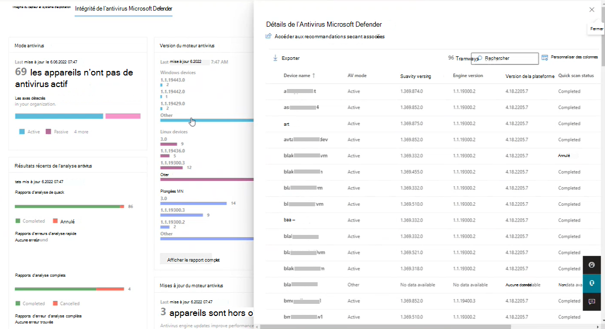

# Rapport d’intégrité et de conformité des appareils dans Microsoft Defender pour point de terminaison

**S’applique à :**

- [Microsoft Defender pour point de terminaison](https://go.microsoft.com/fwlink/p/?linkid=2154037)
- [Microsoft 365 Defender](https://go.microsoft.com/fwlink/?linkid=2118804)

> Vous voulez découvrir Microsoft Defender pour point de terminaison ? [Inscrivez-vous pour bénéficier d’un essai gratuit.](https://signup.microsoft.com/create-account/signup?products=7f379fee-c4f9-4278-b0a1-e4c8c2fcdf7e&ru=https://aka.ms/MDEp2OpenTrial?ocid=docs-wdatp-exposedapis-abovefoldlink)

> [!IMPORTANT]
> Certaines informations ont trait à un produit préalablement publié, qui peut être modifié de manière significative avant sa publication commerciale. Microsoft n’offre aucune garantie, explicite ou implicite, concernant les informations fournies ici.
> Les informations sur les fonctionnalités _qui sont publiées commercialement_ suivent les informations préliminaires de la section intitulée [Public-released: Device Health and compliance report in Microsoft Defender pour point de terminaison](#publicly-released-device-health-and-compliance-report-in-microsoft-defender-for-endpoint).

## Préversion publique - Rapport de conformité de l’intégrité des appareils et des antivirus dans Microsoft Defender pour point de terminaison

Le rapport d’état des appareils fournit des informations générales sur les appareils de votre organisation. Le rapport inclut des informations de tendance indiquant l’état d’intégrité du capteur, l’état antivirus, les plateformes de système d’exploitation et les versions Windows 10.

> [!IMPORTANT]
> Pour que Windows&nbsp;Server&nbsp;2012&nbsp;R2 et Windows&nbsp;Server&nbsp;2016 apparaissent dans les rapports d’intégrité des appareils, ces appareils doivent être intégrés à l’aide du package de solution unifié moderne. Pour plus d’informations, consultez [Nouvelles fonctionnalités de la solution unifiée moderne pour Windows Server 2012 R2 et 2016](/microsoft-365/security/defender-endpoint/configure-server-endpoints#new-windows-server-2012-r2-and-2016-functionality-in-the-modern-unified-solution).

Dans le panneau de navigation du tableau de bord Sécurité Microsoft 365, sélectionnez **Rapports**, puis ouvrez **Intégrité et conformité de l’appareil**.
Le tableau de bord Intégrité et conformité de l’appareil est structuré sous deux onglets :

- [L’onglet **Intégrité du capteur & système d’exploitation**](#sensor-health--os-tab) fournit des informations générales sur le système d’exploitation, divisées en trois cartes qui affichent les attributs d’appareil suivants :
  - [Carte d’intégrité du capteur](#sensor-health-card)
  - [Carte des systèmes d’exploitation et des plateformes](#operating-systems-and-platforms-card)
  - [carte de versions Windows 10](#windows-10-versions-card)

- [L’onglet **Intégrité de l’Antivirus Microsoft Defender**](#microsoft-defender-antivirus-health-tab) comporte huit cartes qui signalent les aspects de l’Antivirus Microsoft Defender :
  - [Carte en mode Antivirus](#antivirus-mode-card)
  - [Carte de version du moteur antivirus](#antivirus-engine-version-card)
  - [Carte de version du renseignement de sécurité antivirus](#antivirus-security-intelligence-version-card)
  - [Carte de version de la plateforme antivirus](#antivirus-platform-version-card)
  - [Carte des résultats de l’analyse antivirus récente](#recent-antivirus-scan-results-card)
  - [Carte des mises à jour du moteur antivirus](#antivirus-engine-updates-card)
  - [Carte des mises à jour du renseignement de sécurité](#security-intelligence-updates-card)
  - [Carte des mises à jour de la plateforme antivirus](#antivirus-platform-updates-card)

### Autorisations d’accès aux rapports

Pour accéder au rapport de conformité de l’intégrité des appareils et des antivirus dans le tableau de bord Sécurité Microsoft 365, les autorisations suivantes sont requises :

| Nom de l’autorisation | Type d’autorisation |
|:---|:---|
| Afficher les données | Gestion des menaces et des vulnérabilités (TVM) |

Pour attribuer ces autorisations :

1. Connectez-vous à <a href="https://go.microsoft.com/fwlink/p/?linkid=2077139" target="_blank">Microsoft 365 Defender à l’aide d’un</a> compte avec l’administrateur de sécurité ou le rôle Administrateur général attribué.
1. Dans le volet de navigation, sélectionnez **Paramètres des rôles** \> **de points de terminaison** \> (sous **Autorisations**).
1. Sélectionnez le rôle que vous souhaitez modifier.
1. Cliquez sur **Modifier**.
1. Dans **Modifier le rôle**, sous l’onglet **Général** , dans **le nom** du rôle, tapez un nom pour le rôle.
1. Dans **Description** , tapez un bref résumé du rôle.
1. Dans **Autorisations**, sélectionnez **Afficher les données**, puis sous **Afficher les données** , sélectionnez **Gestion des menaces et des vulnérabilités** (TVM).

Pour plus d’informations sur la gestion des rôles d’utilisateur, consultez [Créer et gérer des rôles pour le contrôle d’accès en fonction du rôle](user-roles.md).

### Onglet Intégrité du capteur & système d’exploitation

L’intégrité des capteurs et les cartes de système d’exploitation indiquent l’intégrité générale du système d’exploitation, ce qui inclut l’intégrité du capteur de détection, les systèmes d’exploitation à jour et les systèmes d’exploitation obsolètes et les versions Windows 10.

> [!div class="mx-imgBorder"]
> 

Chacune des trois cartes de l’onglet **Intégrité du capteur** comporte deux sections de création de rapports, _l’état actuel_ et _les tendances des appareils_, présentées sous forme de graphiques :

#### Graphique d’état actuel

Dans chaque carte, l’état actuel (référencé dans une documentation sous le nom _de Résumé de l’appareil_) est le graphique à barres horizontales supérieur. L’état actuel est un instantané qui affiche les informations collectées sur les appareils de votre organisation, limitées au jour actuel. Ce graphique représente la distribution des appareils dans votre organisation qui signalent l’état ou qui sont détectés comme étant dans un état spécifique.

> [!div class="mx-imgBorder"]
> 

#### Graphique des tendances des appareils

Le graphique inférieur de chacune des trois cartes n’est pas nommé, mais il est communément appelé _tendances des appareils_. Le graphique des tendances des appareils représente la collection d’appareils au sein de votre organisation, tout au long de l’intervalle de temps indiqué directement au-dessus du graphique.
Par défaut, le graphique des tendances des appareils affiche les informations de l’appareil de la période de 30 jours, se terminant par la dernière journée complète. Pour obtenir une meilleure perspective des tendances qui se produisent dans votre organisation, vous pouvez affiner la période de rapport en ajustant la période indiquée. Pour ajuster la période, ouvrez le filtre et sélectionnez un jour de début et de fin.

> [!div class="mx-imgBorder"]
> 

#### Filtrage des données

Utilisez les filtres fournis pour inclure ou exclure des appareils avec certains attributs. Vous pouvez sélectionner plusieurs filtres à appliquer à partir des attributs de l’appareil. Lorsqu’ils sont appliqués, les filtres s’appliquent aux trois cartes du rapport.

Par exemple, pour afficher des données sur Windows 10 appareils avec l’état d’intégrité du capteur actif :

1. Sous **Filtres** > **État d’intégrité** >  du capteur **Actif**.
2. Sélectionnez ensuite **les plateformes** >  **de système d’exploitation Windows 10**.
3. Sélectionnez **Appliquer**.

#### Carte d’intégrité du capteur

La carte d’intégrité du capteur affiche des informations sur l’état du capteur sur les appareils. L’intégrité du capteur fournit une vue d’ensemble des appareils qui sont les suivants :

- Active
- Inactif
- des communications altérées;
- ou où aucune donnée de capteur n’est signalée

Les appareils qui connaissent des communications altérées ou les appareils à partir desquels aucune donnée de capteur n’est détectée peuvent exposer votre organisation à des risques et justifier une enquête. De même, les appareils inactifs pendant de longues périodes peuvent exposer votre organisation à des menaces en raison de logiciels obsolètes. Les appareils inactifs pendant de longues périodes justifient également une enquête.

#### Carte des systèmes d’exploitation et des plateformes

Cette carte affiche la distribution des systèmes d’exploitation et des plateformes qui existent au sein de votre organisation.
_Les systèmes et plateformes_ de système d’exploitation peuvent fournir des insights utiles sur l’exécution des systèmes d’exploitation actuels ou obsolètes dans votre organisation. Lorsque de nouveaux systèmes d’exploitation sont introduits, des améliorations de sécurité sont fréquemment incluses qui améliorent la posture de votre organisation face aux menaces de sécurité.

Par exemple, le démarrage sécurisé, introduit dans Windows 8, a pratiquement éliminé la menace de certains des types de programmes malveillants les plus dangereux. Les améliorations apportées à Windows 10 offrent aux fabricants de PC la possibilité d’empêcher les utilisateurs de désactiver la fonctionnalité Démarrage sécurisé. Empêcher les utilisateurs de désactiver la fonctionnalité Démarrage sécurisé supprime presque toutes les chances que des rootkits malveillants ou d’autres programmes malveillants de bas niveau infectent le processus de démarrage.
Dans l’idéal, le graphique « État actuel » montre que le nombre de systèmes d’exploitation est pondéré en faveur d’un système d’exploitation plus actuel que les versions antérieures.  Dans le cas contraire, le graphique des tendances indique que de nouveaux systèmes sont adoptés et/ou des systèmes plus anciens sont mis à jour ou remplacés.

#### carte de versions Windows 10

La carte affiche la distribution des appareils Windows et de leurs versions dans votre organisation.
De la même façon qu’une mise à niveau de Windows 8 vers Windows 10 améliore la sécurité dans votre organisation, passer des versions antérieures de Windows à des versions plus récentes améliore votre posture face aux menaces possibles.

Le graphique de tendance des versions de Windows peut vous aider à déterminer rapidement si votre organisation est à jour en mettant à jour vers les versions les plus récentes et les plus sécurisées de Windows 10.

### Onglet Intégrité de l’Antivirus Microsoft Defender  

L’onglet Intégrité de l’Antivirus Microsoft Defender contient huit cartes qui signalent plusieurs aspects de l’Antivirus Microsoft Defender dans votre organisation :

Deux cartes, [carte en mode Antivirus](#antivirus-mode-card) et carte de [résultats d’analyse antivirus récents](#recent-antivirus-scan-results-card), rapport sur les fonctions antivirus Microsoft Defender.

Les six cartes restantes indiquent l’état de l’Antivirus Microsoft Defender pour les appareils de votre organisation :

| _cartes de version_ : | _cartes de mise à jour_ {<a id="fn1">1</a>} |
|:---|:---|
| [Carte de version du moteur antivirus](#antivirus-engine-version-card)   [Carte de version du renseignement de sécurité antivirus](#antivirus-security-intelligence-version-card)   [Carte de version de la plateforme antivirus](#antivirus-platform-version-card) | [Carte des mises à jour du moteur antivirus](#antivirus-engine-updates-card)   [Carte des mises à jour du renseignement de sécurité](#security-intelligence-updates-card)   [Carte des mises à jour de la plateforme antivirus](#antivirus-platform-updates-card) |
| Les trois cartes de mise à jour fournissent des liens vers des ressources supplémentaires pour en savoir plus. | Les trois cartes de version fournissent des rapports volants qui fournissent des informations supplémentaires et permettent une exploration plus approfondie. |

{[1](#fn1)} Pour les trois cartes _de mise à jour_ , « **Aucune donnée disponible** » indique les appareils qui ne signalent pas l’état des mises à jour. Les appareils qui ne signalent pas l’état des mises à jour peuvent être dus à différentes raisons, telles que :

- L’ordinateur est déconnecté du réseau
- L’ordinateur est sous tension ou en veille prolongée
- L’antivirus Microsoft Defender est désactivé
- L’appareil est un appareil non Windows (Mac ou Linux)
- La protection cloud n’est pas activée

> [!NOTE]
> Actuellement, les rapports « à jour » sont disponibles uniquement pour les appareils Windows.  Les rapports à jour génèrent des informations sur les appareils Windows avec la protection cloud activée et la version du moteur : 1.1.19300.2 et versions ultérieures. Les appareils multiplateformes, tels que Mac et Linux, sont répertoriés sous « aucune donnée disponible ».

> [!div class="mx-imgBorder"]
> 

#### Fonctionnalités de carte

La fonctionnalité est essentiellement la même pour toutes les cartes. En cliquant sur une barre numérotée dans l’une des cartes, le menu volant **détails de l’Antivirus Microsoft Defender** s’ouvre, ce qui vous permet de passer en revue les informations sur tous les appareils configurés avec le numéro de version d’un aspect de cette carte.

> [!div class="mx-imgBorder"]
> 

Si le numéro de version sur lequel vous avez cliqué est :

- Une version actuelle, puis **la correction requise** et la **recommandation de sécurité** ne sont pas présentes
- Une version obsolète, une notification en haut du rapport est présente, indiquant la **correction requise**, et un lien **de recommandation de sécurité** est présent. Sélectionnez le lien de recommandation de sécurité pour accéder à la console Gestion des menaces et des vulnérabilités, qui peut recommander des mises à jour antivirus appropriées.

Pour ajouter ou supprimer des types d’informations spécifiques dans le menu volant **des détails de l’Antivirus Microsoft Defender** , cliquez sur **Personnaliser les colonnes**. Dans **Personnaliser les colonnes**, sélectionnez ou désactivez les éléments pour spécifier ce que vous voulez inclure dans le rapport de détails de l’Antivirus Microsoft Defender.

> [!div class="mx-imgBorder"]
> 

Dans le menu volant : en cliquant sur le nom de l’appareil, vous êtes redirigé vers la « page Appareil » de cet appareil, où vous pouvez accéder aux rapports détaillés.

Vous pouvez utiliser le bouton **Exporter** dans le menu volant _des détails de l’Antivirus Microsoft Defender_ pour exporter un rapport vers une feuille de calcul Excel. Les rapports exportés capturent des informations en fonction de votre point d’entrée dans le rapport de détails et des filtres ou des colonnes personnalisées que vous avez définis.

Pour plus d’informations sur l’exportation à l’aide de l’API, consultez les articles suivants :

- [Exportation du rapport de santé antivirus de l'appareil](device-health-export-antivirus-health-report-api.md)
- [Exporter les méthodes et propriétés de l’API des détails d’intégrité de l’antivirus de l’appareil](device-health-api-methods-properties.md)

#### Fonctionnalités des cartes de mise à jour et de version de l’Antivirus Microsoft Defender

Voici les descriptions des six cartes qui signalent la _version_ et les informations de _mise à jour_ du moteur antivirus Microsoft Defender, du renseignement de sécurité et des composants de plateforme :

##### Rapport complet

Dans l’une des trois cartes de _version_ , cliquez sur **Afficher le rapport complet** pour afficher les neuf derniers rapports de _version_ de l’Antivirus Microsoft Defender pour chacun des trois types d’appareils : Windows, Mac et Linux; s’il en existe moins de neuf, ils sont tous affichés. Une **autre** catégorie capture les versions récentes du moteur antivirus classées dixièmes et inférieures, si détectées.

> [!div class="mx-imgBorder"]
> 

L’un des principaux avantages des trois cartes de _version_ est qu’elles fournissent des indicateurs rapides pour déterminer si les versions les plus récentes des moteurs antivirus, des plateformes et des services de sécurité sont utilisées. Couplées aux informations détaillées liées à la carte, les cartes de versions deviennent un outil puissant pour vérifier si les versions sont à jour et pour collecter des informations sur des ordinateurs individuels ou des groupes d’ordinateurs.
Dans l’idéal, lorsque vous exécutez ces rapports, ils indiquent que les versions antivirus les plus récentes sont installées, par opposition aux versions antérieures.
Utilisez ces rapports pour déterminer si votre organisation tire pleinement parti des versions les plus récentes.

> [!div class="mx-imgBorder"]
> 

Pour vous assurer que votre solution anti-programme malveillant détecte les menaces les plus récentes, obtenez les mises à jour automatiquement dans le cadre de Windows Update.

Pour plus d’informations sur les versions actuelles et la mise à jour des différents composants de l’Antivirus Microsoft Defender, consultez la prise en charge de la [plateforme antivirus Microsoft Defender](manage-updates-baselines-microsoft-defender-antivirus.md).

#### Descriptions de carte

Voici de brefs résumés des informations collectées signalées dans chacune des cartes de _version_ antivirus :

##### Carte en mode Antivirus

Les rapports sur le nombre d’appareils de votre organisation , à la date indiquée sur la carte, se trouvent dans l’un des modes antivirus Microsoft Defender suivants :

| valeur | mode |
|---|---|
| 0 | Actif |
| 1 | Passif |
| 2 | Désactivé (désinstallé, désactivé ou SideBySidePassive {également appelé analyse périodique faible}) |
| 3 | Autres (Non en cours d’exécution, Inconnu) |
| 4 | EDRBlocked |

> [!div class="mx-imgBorder"]
> 

Voici des descriptions pour chaque mode :

- **Mode actif** : en mode actif, l’Antivirus Microsoft Defender est utilisé comme application antivirus principale sur l’appareil. Les fichiers sont analysés, les menaces corrigées et les menaces détectées sont répertoriées dans les rapports de sécurité de votre organisation et dans votre application Sécurité Windows.
- **Mode passif** : en mode passif, l’Antivirus Microsoft Defender n’est pas utilisé comme application antivirus principale sur l’appareil. Les fichiers sont analysés et les menaces détectées sont signalées, mais les menaces ne sont pas corrigées par l’Antivirus Microsoft Defender. IMPORTANT : Microsoft Defender Antivirus peut fonctionner en mode passif uniquement sur les points d'extrémité qui sont intégrés à Microsoft Defender pour point de terminaison. Voir [Configuration requise pour que Microsoft Defender Antivirus fonctionne en mode passif ](microsoft-defender-antivirus-compatibility.md#requirements-for-microsoft-defender-antivirus-to-run-in-passive-mode).
- **Mode désactivé** : synonyme de : désinstallé, désactivé, sideBySidePassive et Analyse périodique faible. Lorsqu’il est désactivé, l’Antivirus Microsoft Defender n’est pas utilisé. Les fichiers ne sont pas analysés et les menaces ne sont pas corrigées. En général, Microsoft ne recommande pas la désactivation ou la désinstallation de l’antivirus Microsoft Defender.
- **Mode Autres** - Non en cours d’exécution, Inconnu
- **EDR en mode bloc** : en mode bloqué de détection et de réponse de point de terminaison (EDR). Afficher [la détection et la réponse des points de terminaison en mode bloc](edr-in-block-mode.md)

Les appareils qui sont passifs, LPS ou désactivés présentent un risque de sécurité potentiel et doivent faire l’objet d’une enquête.

Pour plus d’informations sur le protocole LPS, consultez [Utiliser l’analyse périodique limitée dans l’antivirus Microsoft Defender](limited-periodic-scanning-microsoft-defender-antivirus.md).

##### Carte des résultats de l’analyse antivirus récente

Cette carte comporte deux graphiques en barres affichant des résultats complets pour les analyses rapides et complètes. Dans les deux graphiques, la première barre indique le taux d’achèvement des analyses et indique **Terminé**, **Annulé** ou **Échec**. La deuxième barre de chaque section fournit les codes d’erreur pour les analyses ayant échoué.
En analysant les colonnes **Mode** et **Résultats de l’analyse récente** , vous pouvez identifier rapidement les appareils qui ne sont pas en mode d’analyse antivirus actif et les appareils qui ont échoué ou annulé des analyses antivirus récentes. Vous pouvez revenir au rapport avec ces informations et recueillir plus de détails et de recommandations de sécurité. Si des codes d’erreur sont signalés dans cette carte, vous trouverez un lien pour en savoir plus sur les codes d’erreur.

Pour plus d’informations sur les versions actuelles de l’Antivirus Microsoft Defender et sur la façon de mettre à jour les différents composants de l’Antivirus Microsoft Defender, consultez [Gérer les mises à jour de l’Antivirus Microsoft Defender et appliquez des lignes de base](manage-updates-baselines-microsoft-defender-antivirus.md).

##### Carte de version du moteur antivirus

Affiche les résultats en temps réel des versions les plus récentes du moteur antivirus Microsoft Defender installées sur les appareils Windows, les appareils Mac et les appareils Linux de votre organisation. Le moteur antivirus Microsoft Defender est mis à jour tous les mois.
Pour plus d’informations sur les versions actuelles et la mise à jour des différents composants de l’Antivirus Microsoft Defender, consultez la prise en charge de la [plateforme antivirus Microsoft Defender](manage-updates-baselines-microsoft-defender-antivirus.md).

##### Carte de version du renseignement de sécurité antivirus

Répertorie les versions _d’intelligence de sécurité antivirus Microsoft Defender_ les plus courantes installées sur les appareils de votre réseau.
Microsoft met continuellement à jour le renseignement de sécurité Microsoft Defender pour répondre aux dernières menaces et affiner la logique de détection. Ces améliorations apportées au renseignement de sécurité améliorent la capacité de l’Antivirus Microsoft Defender (et d’autres solutions anti-programme malveillant Microsoft) à identifier avec précision les menaces potentielles. Cette intelligence de sécurité fonctionne directement avec la protection basée sur le cloud pour fournir une protection de nouvelle génération améliorée par l’IA, rapide et puissante.

##### Carte de version de la plateforme antivirus

Affiche les résultats en temps réel des versions les plus récentes de la plateforme antivirus Microsoft Defender installées sur les versions des appareils Windows, Mac et Linux de votre organisation. La plateforme antivirus Microsoft Defender est mise à jour tous les mois.
Pour plus d’informations sur les versions actuelles et la mise à jour des différents composants de l’Antivirus Microsoft Defender, consultez la prise en charge de la [plateforme antivirus Microsoft Defender](manage-updates-baselines-microsoft-defender-antivirus.md)

##### Carte des mises à jour du moteur antivirus

Cette carte identifie les appareils dont les versions du moteur antivirus sont à jour ou obsolètes.
La définition générale de « _À jour_ » : la version du moteur sur l’appareil est la version la plus récente du moteur {le moteur est généralement publié tous les mois, via Windows Update (WU)}.  Il existe une période de grâce de trois jours à partir du jour où WU est libéré.

| Microsoft prend en compte les appareils avec **des mises à jour du moteur antivirus** qui ont :  |  pour être :  |
|:----|:----|
| Communiqué à Defender au cours des 7 derniers jours avec l’heure de publication des signatures au cours des 7 derniers jours _et dont la_ version du moteur ou de la plateforme a été générée _au cours des_ 60 derniers jours   | Mise à jour  |
| Communiqué à Defender au cours des 7 derniers jours avec l’heure de publication des signatures au cours des 7 derniers jours, mais le temps de génération de la version du moteur ou de la plateforme _est antérieur_ à 60 jours | Obsolète  |
| Communiqué à Defender au cours des 7 derniers jours avec une durée de publication _de signature supérieure_  à celle des jours  | Aucune donnée disponible  |
| Non communiqué à Defender au cours des 7 derniers jours et dont le dernier état était « À jour »  | Aucune donnée disponible  |
| Non communiqué à Defender au cours des 7 derniers jours et dont le dernier état était « Obsolète »  | Aucune donnée disponible |

##### Carte des mises à jour du renseignement de sécurité

Cette carte identifie les appareils qui ont des versions de renseignement de sécurité à jour ou obsolètes.
La définition générale de « **À jour** » : la version du renseignement de sécurité sur l’appareil a été écrite au cours des 7 derniers jours.

| Microsoft prend en compte les appareils avec **des mises à jour Security Intelligence** qui ont :  | pour être :  |
|:----|:----|
|  Une version du renseignement de sécurité écrite au cours des 7 derniers jours | Mise à jour  |
| Communiqué à Defender au cours des 7 derniers jours avec l’heure de publication de signature au cours des 7 derniers jours | Mise à jour  |
| Communiqué à Defender au cours des 7 derniers jours avec une heure de publication de signature supérieure aux 7 derniers jours | Obsolète |
| Non communiqué à Defender au cours des 7 derniers jours et dont le dernier état était « À jour »  |  Aucune donnée disponible  |
| Non communiqué à Defender au cours des 7 derniers jours et dont le dernier état était obsolète  | Obsolète |

##### Carte des mises à jour de la plateforme antivirus

Cette carte identifie les appareils qui ont des versions de plateforme antivirus à jour ou obsolètes.
La définition générale de « _À jour_ » : la version de la plateforme sur l’appareil est la version de plateforme la plus récente (la plateforme est généralement publiée tous les mois, via Windows Update).  Il existe une période de grâce de trois jours à partir du jour où WU est libéré.

| Microsoft prend en compte les appareils avec **des mises à jour de plateforme antivirus** qui ont :  |  pour être :  |
|:----|:----|
| Communiqué à Defender au cours des 7 derniers jours avec l’heure de publication des signatures au cours des 7 derniers jours _et dont la_ version du moteur ou de la plateforme a été générée _au cours des_ 60 derniers jours   | Mise à jour  |
| Communiqué à Defender au cours des 7 derniers jours avec l’heure de publication des signatures au cours des 7 derniers jours, mais le temps de génération de la version du moteur ou de la plateforme _est antérieur_ à 60 jours | Obsolète  |
| Communiqué à Defender au cours des 7 derniers jours avec une durée de publication _de signature supérieure_  à celle des jours  | Aucune donnée disponible  |
| Non communiqué à Defender au cours des 7 derniers jours et dont le dernier état était « À jour »  | Aucune donnée disponible  |
| Non communiqué à Defender au cours des 7 derniers jours et dont le dernier état était « Obsolète »  | Aucune donnée disponible |

Pour plus d’informations sur la gestion des versions de mise à jour de l’antivirus Microsoft Defender, consultez : Versions [de moteur et de plateforme mensuelles](manage-updates-baselines-microsoft-defender-antivirus.md#monthly-platform-and-engine-versions)

### Voir aussi

- [Exporter les méthodes et propriétés de l’API des détails d’intégrité de l’antivirus de l’appareil](device-health-api-methods-properties.md)
- [Device-health-export-antivirus-health-report-api.md](device-health-api-methods-properties.md)
- [Rapport de protection contre les menaces](threat-protection-reports.md)

## Publication publique : Rapport sur l’intégrité et la conformité des appareils dans Microsoft Defender pour point de terminaison

Le rapport d’état de l’appareil fournit des informations générales sur les appareils de votre organisation. Le rapport inclut des informations de tendance indiquant l’état d’intégrité du capteur, l’état antivirus, les plateformes de système d’exploitation et les versions Windows 10.

Le tableau de bord est structuré en deux sections :

|Section|Description|
|---|---|
|1|Tendances des appareils|
|2|Résumé de l’appareil (jour actuel)|

### Tendances des appareils

Par défaut, le graphique des tendances des appareils affiche les informations sur les appareils de la période de 30 jours se terminant par la dernière journée complète. Pour obtenir une meilleure perspective des tendances qui se produisent dans votre organisation, vous pouvez affiner la période de rapport en ajustant la période indiquée. Pour ajuster la période, sélectionnez un intervalle de temps dans les options de liste déroulante :

- 30 jours
- Trois mois
- Six mois
- Personnalisé

> [!NOTE]
> Ces filtres sont appliqués uniquement à la section Tendances des appareils. Cela n’affecte pas la section récapitulative de l’appareil.

### Récapitulatif de l’appareil

Contrairement au graphique des tendances des appareils, le graphique récapitulatif de l’appareil affiche les informations de l’appareil limitées au jour actuel.

> [!NOTE]
> Les données reflétées dans la section récapitulative sont limitées à 180 jours avant la date actuelle. Par exemple, si la date du jour est le 27 mars 2019, les données de la section récapitulative reflètent les nombres entre le 28 septembre 2018 et le 27 mars 2019.
> Le filtre appliqué à la section Tendances n’est pas appliqué à la section récapitulative.

La section Tendances des appareils vous permet d’explorer la liste des appareils avec le filtre correspondant qui lui est appliqué. Par exemple, si vous cliquez sur la barre Inactive dans la carte d’état d’intégrité du capteur, la liste des appareils affiche uniquement les appareils dont l’état du capteur est inactif.

### Attributs de l’appareil

Le rapport est constitué de cartes qui affichent les attributs d’appareil suivants :

- **État d’intégrité** : affiche des informations sur l’état du capteur sur les appareils. Ce graphique fournit une vue d’ensemble des appareils actifs, confrontés à des communications altérées, inactifs ou où aucune donnée de capteur n’est visible.
- **État de l’antivirus pour les appareils Windows 10 actifs** : indique le nombre d’appareils et l’état de l’antivirus Microsoft Defender.
- **Plateformes** de système d’exploitation : affiche la distribution des plateformes de système d’exploitation qui existent au sein de votre organisation.
- **Windows 10 versions** : affiche la distribution des appareils Windows 10 et de leurs versions dans votre organisation.

### Filtrer les données

Utilisez les filtres fournis pour inclure ou exclure des appareils avec certains attributs.

Vous pouvez sélectionner plusieurs filtres à appliquer à partir des attributs de l’appareil.

> [!NOTE]
> Ces filtres s’appliquent à **toutes les** cartes du rapport.

Par exemple, pour afficher des données sur Windows 10 appareils avec l’état d’intégrité du capteur actif :

1. Sous **Filtres > l’état d’intégrité du capteur > Actif**.
2. Sélectionnez ensuite **les plateformes de système d’exploitation > Windows 10**.
3. Sélectionnez **Appliquer**.

### Articles connexes

- [Rapport de protection contre les menaces](threat-protection-reports.md)

> [!TIP]
> Si vous recherchez des informations relatives à l’antivirus pour d’autres plateformes, consultez :
> - [Définir les préférences pour Microsoft Defender pour point de terminaison sur macOS](mac-preferences.md)
> - [Microsoft Defender pour point de terminaison sur Mac](microsoft-defender-endpoint-mac.md)
> - [Paramètres de stratégie antivirus macOS pour Antivirus Microsoft Defender pour Intune](/mem/intune/protect/antivirus-microsoft-defender-settings-macos)
> - [Définir les préférences pour Microsoft Defender pour point de terminaison sur Linux](linux-preferences.md)
> - [Microsoft Defender pour point de terminaison Linux](microsoft-defender-endpoint-linux.md)
> - [Configurer Defender pour point de terminaison pour des fonctionnalités Android](android-configure.md)
> - [configurer Microsoft Defender pour point de terminaison sur les fonctionnalités iOS](ios-configure-features.md)
