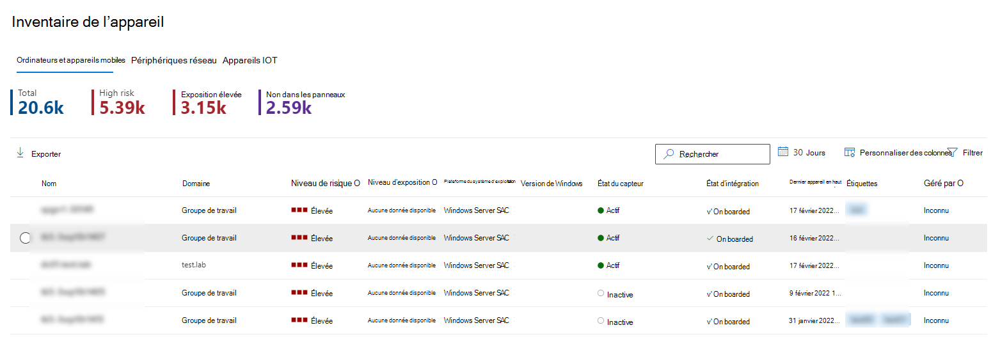
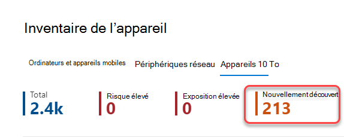
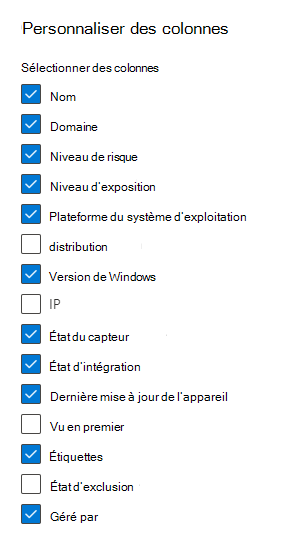
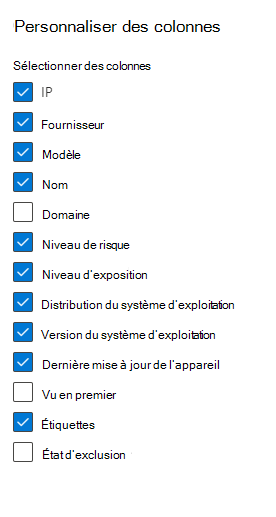
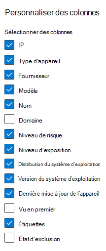

# Inventaire des appareils

[!INCLUDE [Microsoft 365 Defender rebranding](../../includes/microsoft-defender.md)]

**S’applique à :**

- [Microsoft Defender pour point de terminaison Plan 1](https://go.microsoft.com/fwlink/p/?linkid=2154037)
- [Microsoft Defender pour point de terminaison Plan 2](https://go.microsoft.com/fwlink/p/?linkid=2154037)
- [Gestion des vulnérabilités de Microsoft Defender](../defender-vulnerability-management/index.yml)
- [Microsoft 365 Defender](https://go.microsoft.com/fwlink/?linkid=2118804)

> Vous voulez découvrir Defender pour point de terminaison ? [Inscrivez-vous pour bénéficier d’un essai gratuit.](https://signup.microsoft.com/create-account/signup?products=7f379fee-c4f9-4278-b0a1-e4c8c2fcdf7e&ru=https://aka.ms/MDEp2OpenTrial?ocid=docs-wdatp-machinesview-abovefoldlink)

**L’inventaire des** appareils affiche une liste des appareils de votre réseau où des alertes ont été générées. Par défaut, la file d’attente affiche les appareils affichés au cours des 30 derniers jours.

En un coup d’œil, vous verrez des informations telles que le domaine, le niveau de risque, la plateforme du système d’exploitation et d’autres détails pour faciliter l’identification des appareils les plus à risque.

> [!NOTE]
> L’inventaire des appareils est disponible dans différents services Microsoft 365 Defender. Les informations disponibles varient en fonction de votre licence. Vous obtiendrez l’ensemble de fonctionnalités le plus complet lors de l’utilisation [de Microsoft Defender pour point de terminaison Plan 2](https://go.microsoft.com/fwlink/p/?linkid=2154037).

Vous pouvez choisir parmi plusieurs options pour personnaliser l’affichage de liste des appareils. En haut de la navigation, vous pouvez :

- Ajouter ou supprimer des colonnes
- Exporter la liste entière au format CSV
- Sélectionner le nombre d’éléments à afficher par page
- Appliquer des filtres

Pendant le processus d’intégration, la **liste des appareils** est progressivement remplie avec les appareils lorsqu’ils commencent à signaler des données de capteur. Utilisez cette vue pour suivre vos points de terminaison intégrés à mesure qu’ils sont en ligne, ou téléchargez la liste complète des points de terminaison en tant que fichier CSV à des fins d’analyse hors connexion.

> [!NOTE]
> Si vous exportez la liste des appareils, elle contiendra tous les appareils de votre organisation. Le téléchargement peut prendre beaucoup de temps, selon la taille de votre organisation. L’exportation de la liste au format CSV affiche les données de manière non filtrée. Le fichier CSV inclut tous les appareils de l’organisation, quel que soit le filtrage appliqué dans la vue elle-même.

:::image type="content" source="images/device-inventory.png" alt-text="Liste des appareils" lightbox="images/device-inventory.png":::

## Trier et filtrer la liste des appareils

Vous pouvez appliquer les filtres suivants pour limiter la liste des alertes et obtenir une vue plus ciblée.

### Nom du périphérique

Pendant le processus d’intégration Microsoft Defender pour point de terminaison, les appareils intégrés à MDE sont progressivement renseignés dans l’inventaire des appareils à mesure qu’ils commencent à signaler des données de capteur. Par la suite, l’inventaire des appareils est rempli par les appareils découverts dans votre réseau par le biais du processus de découverte des appareils. L’inventaire des appareils comporte trois onglets qui répertorient les appareils par :

- **Ordinateurs et appareils mobiles** : points de terminaison d’entreprise (stations de travail, serveurs et appareils mobiles)
- **Appareils réseau** : appareils tels que les routeurs et les commutateurs
- **Appareils IoT** : appareils tels que les imprimantes et les caméras

## Accéder à la page Inventaire des appareils

Accédez à la page d’inventaire des appareils en sélectionnant **Inventaire des appareils** dans le menu de navigation **Points** de terminaison du [portail Microsoft 365 Defender](/microsoft-365/security/defender-business/mdb-get-started).

## Vue d’ensemble de l’inventaire des appareils

L’inventaire des appareils s’ouvre sous l’onglet **Ordinateurs et appareils mobiles** . En un coup d’œil, vous verrez des informations telles que le nom de l’appareil, le domaine, le niveau de risque, le niveau d’exposition, la plateforme du système d’exploitation, l’état d’intégration, l’état d’intégrité du capteur et d’autres détails pour faciliter l’identification des appareils les plus à risque.

Utilisez la colonne **État de l’intégration** pour trier et filtrer en fonction des appareils découverts et de ceux déjà intégrés à Microsoft Defender pour point de terminaison.

Dans les onglets **Appareils réseau** et **Appareils IoT** , vous verrez également des informations telles que le fournisseur, le modèle et le type d’appareil :

> [!NOTE]
> Les intégrations de découverte d’appareils à [Microsoft Defender pour IoT](/azure/defender-for-iot/organizations/) et [Corelight](https://corelight.com/integrations/iot-security) sont disponibles pour vous aider à localiser, identifier et sécuriser votre inventaire complet des ressources OT/IOT. Les appareils découverts avec ces intégrations s’affichent sous l’onglet **Appareils IoT** . Pour plus d’informations, consultez [Intégrations de découverte d’appareils](device-discovery.md#device-discovery-integrations).
>
> Lorsque Defender pour IoT est configuré, vous pouvez également y afficher les appareils. Consultez [Gérer vos appareils IoT avec l’inventaire des appareils pour les organisations](/azure/defender-for-iot/organizations/how-to-manage-device-inventory-for-organizations).

En haut de chaque onglet inventaire des appareils, vous pouvez voir le nombre total d’appareils, le nombre d’appareils qui ne sont pas encore intégrés et le nombre d’appareils identifiés comme étant un risque plus élevé pour votre organisation. Vous pouvez utiliser ces informations pour vous aider à hiérarchiser les appareils pour améliorer la posture de sécurité.

Le nombre **d’appareils récemment découverts** pour les appareils réseau et les onglets des appareils IoT affiche le nombre de nouveaux appareils découverts, au cours des 7 derniers jours, répertoriés dans l’affichage actuel.

## Explorer l’inventaire des appareils

Vous pouvez choisir parmi plusieurs options pour personnaliser la vue d’inventaire des appareils. Dans la barre de navigation supérieure de chaque onglet, vous pouvez :

- Rechercher un appareil par nom
- Rechercher un appareil en fonction de l’adresse IP ou du préfixe d’adresse IP le plus récemment utilisé
- Ajouter ou supprimer des colonnes
- Exporter la liste entière au format CSV pour l’analyse hors connexion
- Sélectionner la plage de dates à afficher
- Appliquer des filtres

> [!NOTE]
> Si vous exportez la liste des appareils, elle contiendra tous les appareils de votre organisation. Le téléchargement peut prendre beaucoup de temps, selon la taille de votre organisation. L’exportation de la liste au format CSV affiche les données de manière non filtrée. Le fichier CSV inclut tous les appareils de l’organisation, quel que soit le filtrage appliqué dans la vue elle-même.

Vous pouvez utiliser les fonctionnalités de tri et de filtre disponibles sur chaque onglet inventaire des appareils pour obtenir une vue plus ciblée et vous aider à évaluer et gérer les appareils de votre organisation.

Les nombres en haut de chaque onglet seront mis à jour en fonction de l’affichage actuel.

## Utiliser des filtres pour personnaliser les vues d’inventaire des appareils

Filtre | Description
:---|:---
**Niveau de risque**   | Le niveau de risque reflète l’évaluation globale des risques de l’appareil en fonction d’une combinaison de facteurs, notamment les types et la gravité des alertes actives sur l’appareil. La résolution des alertes actives, l’approbation des activités de correction et la suppression des alertes suivantes peuvent réduire le niveau de risque.
**Niveau d’exposition**   | Le niveau d’exposition reflète l’exposition actuelle de l’appareil en fonction de l’impact cumulé de ses recommandations de sécurité en attente. Les niveaux possibles sont faibles, moyens et élevés. Une faible exposition signifie que vos appareils sont moins vulnérables à l’exploitation.     Si le niveau d’exposition indique « Aucune donnée disponible », il existe quelques raisons pour lesquelles cela peut être le cas : - L’appareil a arrêté la création de rapports pendant plus de 30 jours. Dans ce cas, elle est considérée comme inactive et l’exposition n’est pas calculée. - Système d’exploitation de l’appareil non pris en charge : consultez [la configuration minimale requise pour Microsoft Defender pour point de terminaison](/microsoft-365/security/defender-endpoint/minimum-requirements). - Appareil avec agent obsolète (peu probable).
**Tags**   | Filtrez la liste en fonction du regroupement et du balisage que vous avez ajoutés à des appareils individuels. Consultez [Créer et gérer des balises d’appareil](machine-tags.md).
**Valeur de l’appareil**  | Filtrez la liste selon que l’appareil a été marqué comme valeur élevée ou basse.
**État d’exclusion**   | Filtrez la liste selon que l’appareil a été exclu ou non. Pour plus d’informations, consultez [Exclure les appareils](exclude-devices.md).
**Plateforme de système d’exploitation**  | Filtrer en fonction des plateformes de système d’exploitation que vous souhaitez examiner   (_Ordinateurs et appareils mobiles et IoT uniquement_)
**Vu pour la première fois**   | Filtrez votre vue en fonction du moment où l’appareil a été vu pour la première fois dans le réseau ou du moment où il a été signalé pour la première fois par le capteur Microsoft Defender pour point de terminaison.  (_Ordinateurs et appareils mobiles et IoT uniquement_)
**Version de Windows**   | Filtrez en fonction des versions de Windows que vous souhaitez examiner.   (_Ordinateurs et appareils mobiles uniquement_)
**État d’intégrité du capteur**   | Filtrez selon les états d’intégrité du capteur suivants, pour les appareils intégrés à Microsoft Defender pour point de terminaison :  - **Actif** : appareils qui signalent activement des données de capteur au service.  - **Inactif** : appareils qui ont cessé d’envoyer des signaux pendant plus de 7 jours.   - **Mal configuré** : appareils qui ont altéré les communications avec le service ou qui ne peuvent pas envoyer de données de capteur.   Les appareils mal configurés peuvent être classés dans les catégories suivantes :    - Aucune donnée de capteur    - Communications altérées    Pour plus d’informations sur la façon de résoudre les problèmes sur les appareils mal configurés, consultez [La section Corriger les capteurs défectueux](/microsoft-365/security/defender-endpoint/fix-unhealthy-sensors).   (_Ordinateurs et appareils mobiles uniquement_)
**État de l’intégration**   | L’état d’intégration indique si l’appareil est actuellement intégré à Microsoft Defender pour point de terminaison ou non. Vous pouvez filtrer selon les états suivants :   - **Intégré** : le point de terminaison est intégré à Microsoft Defender pour point de terminaison.    - **Peut être intégré** : le point de terminaison a été découvert dans le réseau en tant qu’appareil pris en charge, mais il n’est pas actuellement intégré. Microsoft recommande vivement l’intégration de ces appareils.   - **Non pris en charge** : le point de terminaison a été découvert dans le réseau, mais n’est pas pris en charge par Microsoft Defender pour point de terminaison.   - **Informations insuffisantes** : le système n’a pas pu déterminer la prise en charge de l’appareil.   (_Ordinateurs et appareils mobiles uniquement_)
**État de l’antivirus**   | Filtrez la vue en fonction de l’état de l’antivirus désactivé, non mis à jour ou inconnu.   (_Ordinateurs et appareils mobiles uniquement_)
**Group**   | Filtrez la liste en fonction du groupe qui vous intéresse.    (_Ordinateurs et appareils mobiles uniquement_)
**Géré par**   | Géré par indique comment l’appareil est géré. Vous pouvez filtrer par :  - Microsoft Defender pour point de terminaison  - Microsoft Endpoint Manager (MEM), y compris la cogestion avec Microsoft Configuration Manager via l’attachement de locataire - Microsoft Configuration Manager (ConfigMgr)  - Inconnu : cela peut être dû à l’exécution d’une version obsolète de Windows, de la gestion des objets de stratégie de groupe ou d’un autre GPM tiers.   (_Ordinateurs et appareils mobiles uniquement_)
**Type d’appareil**   | Filtrez par type d’appareil que vous souhaitez examiner.   (_Appareils IoT uniquement_)

## Utiliser des colonnes pour personnaliser les vues d’inventaire des appareils

Vous pouvez ajouter ou supprimer des colonnes de la vue et trier les entrées en cliquant sur un en-tête de colonne disponible.

Sous l’onglet **Ordinateur et Mobiles** , sélectionnez **Personnaliser les colonnes** pour afficher les colonnes disponibles. Les valeurs par défaut sont vérifiées dans l’image ci-dessous :

Sous l’onglet **Appareils réseau** , sélectionnez **Personnaliser les colonnes** pour afficher les colonnes disponibles. Les valeurs par défaut sont vérifiées dans l’image ci-dessous :

Sous l’onglet **Appareils IoT** , sélectionnez **Personnaliser les colonnes** pour afficher les colonnes disponibles. Les valeurs par défaut sont vérifiées dans l’image ci-dessous :

## Articles connexes

[Examiner les appareils dans la liste des appareils Microsoft Defender pour point de terminaison](investigate-machines.md)
