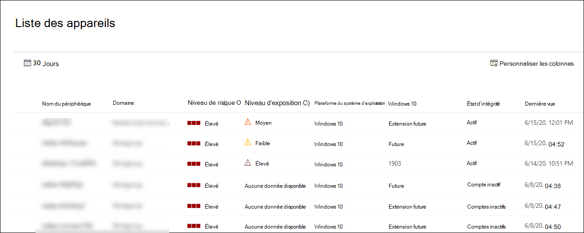

# Afficher et organiser la liste Microsoft Defender pour les appareils de point de terminaison

[!INCLUDE [Microsoft 365 Defender rebranding](../../includes/microsoft-defender.md)]

**S’applique à :**
- [Microsoft Defender pour point de terminaison](https://go.microsoft.com/fwlink/p/?linkid=2154037)
- [Microsoft 365 Defender](https://go.microsoft.com/fwlink/?linkid=2118804)

> Vous souhaitez faire l’expérience de Defender pour point de terminaison ? [Inscrivez-vous à un essai gratuit.](https://www.microsoft.com/microsoft-365/windows/microsoft-defender-atp?ocid=docs-wdatp-machinesview-abovefoldlink)

La **liste Appareils affiche** la liste des appareils de votre réseau sur lequel des alertes ont été générées. Par défaut, la file d’attente affiche les appareils visibles au cours des 30 derniers jours.  

En un coup d’œil, vous verrez des informations telles que le domaine, le niveau de risque, la plateforme du système d’exploitation et d’autres détails pour faciliter l’identification des appareils les plus exposés.

Vous pouvez choisir parmi plusieurs options pour personnaliser l’affichage liste des appareils. Dans la barre de navigation supérieure, vous pouvez :

- Ajouter ou supprimer des colonnes
- Exporter la liste entière au format CSV
- Sélectionner le nombre d’éléments à afficher par page
- Appliquer des filtres

Pendant le processus d’intégration, la liste **Appareils** est progressivement remplie avec les appareils qui commencent à signaler les données de capteur. Utilisez cette vue pour suivre vos points de terminaison intégrés lors de leur mise en ligne ou téléchargez la liste complète des points de terminaison en tant que fichier CSV pour l’analyse hors connexion.

>[!NOTE]
> Si vous exportez la liste des appareils, elle contiendra tous les appareils de votre organisation. Le téléchargement peut prendre beaucoup de temps, en fonction de la taille de votre organisation. L’exportation de la liste au format CSV affiche les données de manière non filtrée. Le fichier CSV inclut tous les appareils de l’organisation, quel que soit le filtrage appliqué dans l’affichage lui-même.

## Trier et filtrer la liste des appareils

Vous pouvez appliquer les filtres suivants pour limiter la liste des alertes et obtenir une vue plus centrée.

### Niveau de risque

Le niveau de risque reflète l’évaluation globale des risques de l’appareil en fonction d’une combinaison de facteurs, notamment les types et la gravité des alertes actives sur l’appareil. La résolution des alertes actives, l’approbation des activités de correction et la suppression des alertes suivantes peuvent réduire le niveau de risque.

### Niveau d’exposition

Le niveau d’exposition reflète l’exposition actuelle de l’appareil en fonction de l’impact cumulé de ses recommandations de sécurité en attente. Les niveaux possibles sont faibles, moyens et élevés. Une faible exposition signifie que vos appareils sont moins vulnérables à l’exploitation.

Si le niveau d’exposition indique « Aucune donnée disponible », il existe plusieurs raisons pour lesquelles cela peut être le cas :

- L’appareil a cessé de signaler pendant plus de 30 jours. Dans ce cas, il est considéré comme inactif et l’exposition n’est pas calculée
- Le système d’exploitation de l’appareil n’est [pas pris en charge : voir les conditions minimales requises pour Microsoft Defender pour endpoint](minimum-requirements.md)
- Appareil avec agent obsolète (très peu probable)

### Plateforme du système d’exploitation

Sélectionnez uniquement les plateformes de système d’exploitation qui vous intéressent.

### État d’intégrité

Filtrez selon les états d’état d’état d’appareil suivants :

- **Actif** : appareils qui rapportent activement des données de capteur au service.
- **Inactif** : appareils qui ont complètement cessé d’envoyer des signaux pendant plus de 7 jours.
- **Mal configuré : périphériques** dont les communications avec le service sont réduites ou qui ne peuvent pas envoyer de données de capteur. Les appareils mal configurés peuvent également être classés sur :
  - Aucune donnée de capteur
  - Communications compromises

  Pour plus d’informations sur la façon de résoudre les problèmes sur les appareils mal configurés, voir corriger les [capteurs défectueux.](fix-unhealthy-sensors.md)

### État de l’antivirus

Filtrez les appareils par état antivirus. S’applique uniquement aux Windows 10 actifs.

- **Désactivé :** la protection contre & virus est désactivée.
- **Not reporting** : la protection contre & contre les virus n’est pas un rapport.
- **Non mis à jour** : la protection & contre les virus n’est pas à jour.

Pour plus d’informations, consultez le tableau de [bord gestion & des menaces et des vulnérabilités.](tvm-dashboard-insights.md)

### État de l’atténuation des menaces

Pour afficher les appareils qui peuvent être affectés par une certaine menace, sélectionnez-la dans le menu déroulant, puis sélectionnez les aspects de vulnérabilité à atténuer.

Pour en savoir plus sur certaines menaces, consultez [l’analyse des menaces.](threat-analytics.md) Pour plus d’informations sur l’atténuation, [voir Threat & Vulnerability Management](next-gen-threat-and-vuln-mgt.md).

### Windows 10 version

Sélectionnez uniquement les Windows 10 versions que vous souhaitez examiner.

### Balises & groupes

Filtrez la liste en fonction du regroupement et du marquage que vous avez ajoutés à des appareils individuels. Voir [Créer et gérer des balises d’appareil](machine-tags.md) et créer et gérer des groupes [d’appareils.](machine-groups.md)

## Voir aussi

- [Examiner les appareils de la liste Microsoft Defender pour les appareils de point de terminaison](investigate-machines.md)
