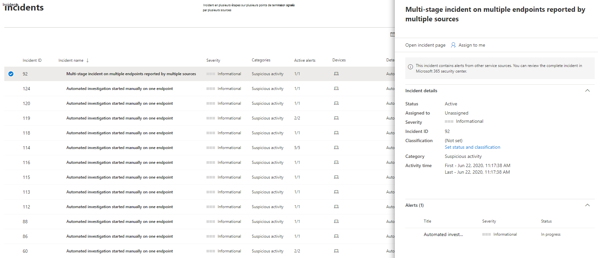
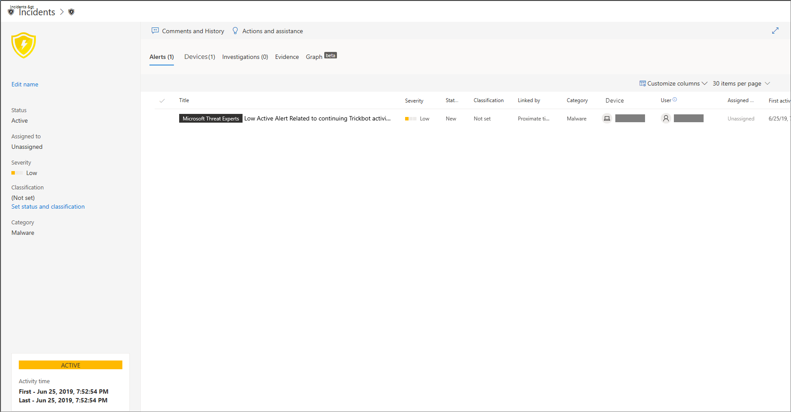

# Gérer Microsoft Defender pour les incidents de point de terminaison

[!INCLUDE [Microsoft 365 Defender rebranding](../../includes/microsoft-defender.md)]

**S’applique à :**
- [Microsoft Defender pour point de terminaison](https://go.microsoft.com/fwlink/p/?linkid=2154037)
- [Microsoft 365 Defender](https://go.microsoft.com/fwlink/?linkid=2118804)

> Vous voulez découvrir Microsoft Defender pour point de terminaison ? [Inscrivez-vous pour bénéficier d’un essai gratuit.](https://signup.microsoft.com/create-account/signup?products=7f379fee-c4f9-4278-b0a1-e4c8c2fcdf7e&ru=https://aka.ms/MDEp2OpenTrial?ocid=docs-wdatp-exposedapis-abovefoldlink)

La gestion des incidents est une partie importante de chaque opération de cybersécurité. Vous pouvez gérer les incidents en sélectionnant un incident dans la file **d’attente Incidents** ou dans le volet de **gestion Incidents.** 

La sélection d’un incident dans la  file **d’attente Incidents** ouvre le volet Gestion des incidents dans lequel vous pouvez ouvrir la page incident pour plus d’informations.

Vous pouvez affecter des incidents à vous-même, modifier l’état et la classification, les renommer ou commenter pour suivre leur progression.

> [!TIP]
> Pour une visibilité supplémentaire en un coup d’œil, les noms des incidents sont générés automatiquement en fonction des attributs d’alerte tels que le nombre de points de terminaison affectés, les utilisateurs affectés, les sources de détection ou les catégories. Cela vous permet de comprendre rapidement l’étendue de l’incident.
>
> Par exemple : *incident en plusieurs étapes sur plusieurs points de terminaison signalés par plusieurs sources.*
>
> Les incidents qui existaient avant le déploiement de la dénomination automatique des incidents conserveront leurs noms.
>

## Attribuer des incidents
Si aucun incident n’a encore  été affecté, vous pouvez sélectionner Affecter à moi pour vous attribuer l’incident. Cette action suppose l’appropriation non seulement de l’incident, mais aussi de toutes les alertes associées.

## Définir l’état et la classification
### État de l’incident
Vous pouvez classer les incidents (comme **actifs** ou **résolus**) en modifiant leur état au fur et à mesure de l’avancement de votre enquête. Cela vous permet d’organiser et de gérer la manière dont votre équipe peut réagir aux incidents.

Par exemple, votre analyste SoC peut examiner les incidents **actifs** urgents de la journée et décider de les affecter à lui-même pour examen.

Sinon, votre analyste SoC peut  définir l’incident comme résolu si l’incident a été corrigé. 

### Classification
Vous pouvez choisir de ne pas définir de classification ou décider de spécifier si un incident est vrai ou faux. Cette opération permet à l’équipe de voir les modèles et d’en apprendre davantage.

### Ajouter des commentaires
Vous pouvez ajouter des commentaires et afficher les événements historiques relatifs à un incident afin de voir les modifications précédentes apportées à ce dernier.

Chaque fois qu’une modification ou un commentaire est apporté à une alerte, cet élément est enregistré dans la section Commentaires et historique.

Les commentaires ajoutés apparaissent instantanément dans le volet.

## Voir aussi
- [File d’attente des incidents](/microsoft-365/security/defender-endpoint/view-incidents-queue)
- [Afficher et organiser la file d’attente des incidents](view-incidents-queue.md)
- [Examiner des incidents](investigate-incidents.md)
