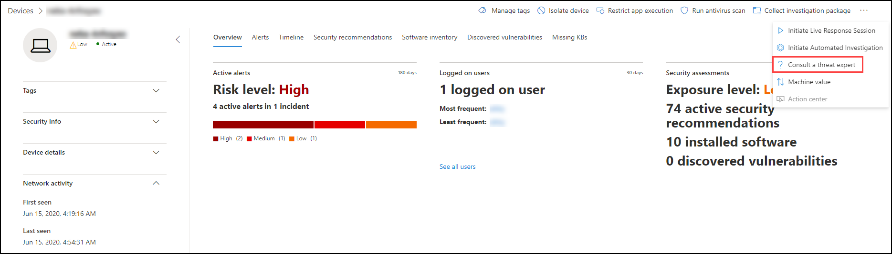

# Spécialistes des menaces Microsoft

[!INCLUDE [Microsoft 365 Defender rebranding](../../includes/microsoft-defender.md)]

**S’applique à :**
- [Microsoft Defender pour point de terminaison Plan 2](https://go.microsoft.com/fwlink/p/?linkid=2154037)
- [Microsoft 365 Defender](https://go.microsoft.com/fwlink/?linkid=2118804)

> Vous voulez découvrir Microsoft Defender pour point de terminaison ? [Inscrivez-vous pour bénéficier d’un essai gratuit.](https://signup.microsoft.com/create-account/signup?products=7f379fee-c4f9-4278-b0a1-e4c8c2fcdf7e&ru=https://aka.ms/MDEp2OpenTrial?ocid=docs-wdatp-exposedapis-abovefoldlink)

Spécialistes des menaces Microsoft est un service de recherche de menace géré qui fournit à vos centres d’opérations de sécurité (SOC) une analyse et une surveillance de niveau expert pour les aider à s’assurer que les menaces critiques dans vos environnements uniques ne sont pas manquées.

Ce service de recherche de menace gérée fournit des informations et des données pilotées par des experts par le biais de ces deux fonctionnalités : la notification d’attaque ciblée et l’accès aux experts à la demande.

## Avant de commencer

> [!NOTE]
> Discutez des conditions d’éligibilité avec votre fournisseur de services techniques Microsoft et votre équipe de compte avant de vous appliquer au service de recherche de menaces gérées.

Si vous êtes un client Microsoft Defender pour points de terminaison, vous devez demander des notifications d’attaque **ciblées Spécialistes des menaces Microsoft** pour obtenir des informations et une analyse spéciales qui vous aident à identifier les menaces les plus critiques dans votre environnement afin de pouvoir y répondre rapidement.

Pour vous inscrire à Spécialistes des menaces Microsoft - Avantages des notifications d’attaques ciblées, Paramètres points de terminaison  \> **Fonctionnalités générales** avancées \>  \>  \> **Spécialistes des menaces Microsoft - Notifications** d’attaque ciblée à appliquer. Une fois accepté, vous bénéficiez des avantages des notifications d’attaque ciblée.

Contactez votre équipe de compte ou votre représentant Microsoft pour vous abonner à **Spécialistes des menaces Microsoft - Experts** à la demande pour consulter nos experts en matière de menaces sur les détections et les adversaires pertinents auxquels votre organisation est confrontée.

Pour [plus d’informations, Spécialistes des menaces Microsoft configurer les](/microsoft-365/security/defender-endpoint/configure-microsoft-threat-experts#before-you-begin) fonctionnalités d’analyse.

## Spécialistes des menaces Microsoft - Notification d’attaque ciblée

Spécialistes des menaces Microsoft - La notification d’attaque ciblée permet de cibler de manière proactive les menaces les plus importantes pour votre réseau, y compris les intrusions de l’adversaire humain, les attaques par clavier ou les attaques avancées telles que le cyber-espionnage. Ces notifications s’affiche sous la forme d’une nouvelle alerte. Le service de recherche géré inclut :

- Analyse et analyse des menaces, ce qui réduit le temps d’activité et les risques pour l’entreprise
- Intelligence artificielle entraînée pour découvrir et hiérarchiser les attaques connues et inconnues
- Identification des risques les plus importants, aider les SOC à optimiser le temps et l’énergie
- Étendue de compromission et autant de contexte qu’il est possible de fournir rapidement pour permettre une réponse SOC rapide.

## Spécialistes des menaces Microsoft - Experts à la demande

Les clients peuvent faire appel à nos experts en matière de sécurité directement Microsoft 365 Defender pour obtenir une réponse précise et opportune. Les experts fournissent des informations nécessaires pour mieux comprendre les menaces complexes qui affectent votre organisation, depuis les demandes d’alerte, les appareils potentiellement compromis, la cause première d’une connexion réseau suspecte, jusqu’à des informations supplémentaires sur les menaces concernant les campagnes avancées persistantes en cours sur les menaces. Avec cette fonctionnalité, vous pouvez :

- Obtenir une clarification supplémentaire sur les alertes, y compris la cause racine ou l’étendue de l’incident
- Clarifier le comportement suspect de l’appareil et les étapes suivantes en cas d’attaque avancée
- Déterminer les risques et la protection concernant les acteurs des menaces, les campagnes ou les techniques malveillantes émergentes

L’option de **consulter un expert en** menaces est disponible à plusieurs endroits dans le portail afin que vous pouvez interagir avec des experts dans le cadre de votre enquête :

- ***Menu Aide et support***

  

- ***Menu Actions de page d’appareil***

  

- ***Menu Actions de la page Alertes***

  

- ***Menu Actions de la page de fichiers***

  

> [!NOTE]
> Si vous souhaitez suivre l’état de vos cas d’experts à la demande via le Microsoft Services Hub, faites-en le suivi.

Regardez cette vidéo pour obtenir une vue d’ensemble rapide du Microsoft Services Hub.

> [!VIDEO https://www.microsoft.com/videoplayer/embed/RE4pk9f]

## Rubrique connexe

- [Configurer les fonctionnalités Spécialistes des menaces Microsoft de gestion](configure-microsoft-threat-experts.md)
