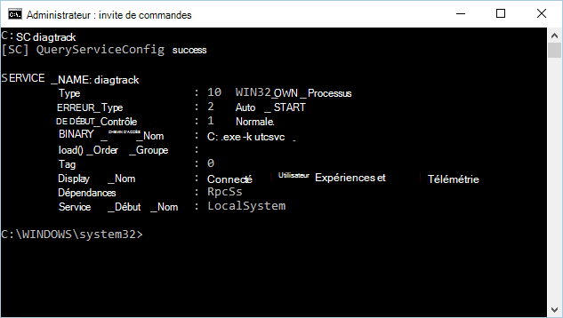

# <a name="minimum-requirements-for-microsoft-defender-for-endpoint"></a>Conditions minimales requises pour Microsoft Defender pour le point de terminaison

[!INCLUDE [Microsoft 365 Defender rebranding](../../includes/microsoft-defender.md)]

**S’applique à :**

- [Microsoft Defender pour point de terminaison](https://go.microsoft.com/fwlink/p/?linkid=2154037)
- [Microsoft 365 Defender](https://go.microsoft.com/fwlink/?linkid=2118804)

> Vous voulez découvrir Microsoft Defender pour point de terminaison ? [Inscrivez-vous pour bénéficier d’un essai gratuit.](https://signup.microsoft.com/create-account/signup?products=7f379fee-c4f9-4278-b0a1-e4c8c2fcdf7e&ru=https://aka.ms/MDEp2OpenTrial?ocid=docs-wdatp-minreqs-abovefoldlink)


Certaines conditions minimales sont requises pour l’intégration d’appareils au service. Découvrez les licences, la configuration matérielle et logicielle requise et d’autres paramètres de configuration pour intégrer des appareils au service.

> [!TIP]
> - Découvrez les dernières améliorations apportées à Defender for Endpoint : [Defender for Endpoint Tech Community](https://techcommunity.microsoft.com/t5/Windows-Defender-Advanced-Threat/ct-p/WindowsDefenderAdvanced).
> - Defender pour le point de terminaison a démontré les fonctionnalités d’optique et de détection de pointe du secteur dans l’évaluation MITRE récente. Lire : [Informations tirées de l’évaluation de MITRE basée sur ATT&CK](https://cloudblogs.microsoft.com/microsoftsecure/2018/12/03/insights-from-the-mitre-attack-based-evaluation-of-windows-defender-atp/).

## <a name="licensing-requirements"></a>Conditions d'octroi de licence

Microsoft Defender pour le point de terminaison nécessite l’une des offres de licence en volume Microsoft suivantes :

- Windows 10 Entreprise E5
- Windows 10 Éducation A5
- Microsoft 365 E5 (M365 E5) qui inclut Windows 10 Entreprise E5
- Microsoft 365 A5 (M365 A5)
- Microsoft 365 E5 Sécurité
- Sécurité Microsoft 365 A5
- Microsoft Defender pour point de terminaison

> [!NOTE]
> Les utilisateurs titulaires d’une licence éligible peuvent utiliser Microsoft Defender pour endpoint sur cinq appareils simultanés au plus.
> Microsoft Defender for Endpoint est également disponible à l’achat auprès d’un fournisseur de solutions Cloud (CSP).
> Les VM RDSH ne nécessitent pas de licence Defender for Endpoint distincte.

Microsoft Defender pour le point de terminaison pour les serveurs nécessite l’une des options de licence suivantes :

- [Centre de sécurité Azure avec Azure Defender activé](/azure/security-center/security-center-pricing)
- Microsoft Defender for Endpoint for Server (un par serveur couvert)

> [!NOTE]
> Les clients peuvent acquérir des licences serveur (une par environnement de système d’exploitation de serveur couvert) pour Microsoft Defender pour Endpoint for Servers s’ils ont un minimum combiné de 50 licences pour une ou plusieurs des licences utilisateur suivantes :
>
> * Microsoft Defender pour point de terminaison
> * Windows E5/A5
> * Microsoft 365 E5/A5
> * Microsoft 365 E5/A5

Pour obtenir des informations détaillées sur les licences, consultez le [site](https://www.microsoft.com/licensing/terms/) Termes du produit et travaillez avec votre équipe de compte pour en savoir plus sur les conditions générales.

Pour plus d’informations sur le tableau des fonctionnalités Windows 10 éditions, voir [Comparer Windows 10 éditions.](https://www.microsoft.com/windowsforbusiness/compare)


## <a name="browser-requirements"></a>Configuration requise pour le navigateur

L’accès à Defender pour le point de terminaison s’fait par le biais d’un navigateur, qui permet de prendre en charge les navigateurs suivants :

- Microsoft Edge
- Google Chrome

> [!NOTE]
> Bien que d’autres navigateurs fonctionnent, les navigateurs mentionnés sont pris en charge.


## <a name="hardware-and-software-requirements"></a>Configuration matérielle et logicielle requise

### <a name="supported-windows-versions"></a>Versions de Windows prises en charge

- Windows 7 SP1 Enterprise ([Nécessite ESU pour la prise en charge.)](/troubleshoot/windows-client/windows-7-eos-faq/windows-7-extended-security-updates-faq)
- Windows 7 SP1 Pro ([Nécessite ESU pour la prise en charge.)](/troubleshoot/windows-client/windows-7-eos-faq/windows-7-extended-security-updates-faq)
- Windows 8.1 Entreprise
- Windows 8.1 Professionnel
- Windows 10 Entreprise
- [Windows 10 Entreprise LTSC 2016 (ou une ultérieure)](/windows/whats-new/ltsc/)
- Windows 10 Éducation
- Windows 10 Professionnel
- Windows 10 Professionnel Éducation
- Windows serveur
  - Windows Server 2008 R2 SP1
  - Windows Server 2012 R2
  - Windows Server 2016
  - Windows Serveur, version 1803 ou ultérieure
  - Windows Server 2019
- Windows Virtual Desktop

Les appareils de votre réseau doivent être en cours d’exécution dans l’une de ces éditions.

La configuration matérielle requise pour Defender pour Endpoint sur les appareils est la même pour les éditions pris en charge.

> [!NOTE]
> Les ordinateurs exécutant des versions mobiles Windows (tels que Windows CE et Windows 10 Mobile) ne sont pas pris en charge.
>
> Les ordinateurs virtuels Windows 10 Entreprise 2016 LTSB peuvent rencontrer des problèmes de performances s’ils sont exécutés sur des plateformes de virtualisation autres que Microsoft.
>
> Pour les environnements virtuels, nous vous recommandons Windows 10 Entreprise LTSC 2019 ou une ultérieure.


### <a name="other-supported-operating-systems"></a>Autres systèmes d’exploitation pris en charge

- [Android](microsoft-defender-endpoint-android.md)
- [iOS](microsoft-defender-endpoint-ios.md)
- [Linux](microsoft-defender-endpoint-linux.md)
- [MacOS](microsoft-defender-endpoint-mac.md)

> [!NOTE]
> Vous devez vérifier que les distributions linux et les versions d’Android, iOS et macOS sont compatibles avec Defender for Endpoint pour que l’intégration fonctionne.


### <a name="network-and-data-storage-and-configuration-requirements"></a>Configuration requise pour le stockage réseau et les données

Lorsque vous exécutez l’Assistant d’intégration pour la première fois, vous devez choisir l’endroit où sont stockées vos informations relatives aux points de terminaison Microsoft Defender : dans l’Union européenne, le Royaume-Uni ou le centre de données des États-Unis.

> [!NOTE]
> - Vous ne pouvez pas modifier votre emplacement de stockage de données après la première installation.
> - Pour plus d’informations sur l’endroit et la façon dont Microsoft stocke vos données, voir Microsoft Defender for [Endpoint data storage and privacy.](data-storage-privacy.md)


### <a name="diagnostic-data-settings"></a>Paramètres de données de diagnostic

> [!NOTE]
> Microsoft Defender pour point de terminaison ne nécessite aucun niveau de diagnostic spécifique tant qu’il est activé.

Assurez-vous que le service de données de diagnostic est activé sur tous les appareils de votre organisation.
Par défaut, ce service est activé. Il est bon de vérifier que vous obtenez des données de capteur à partir de ces données.

**Utilisez la ligne de commande pour vérifier le type** Windows 10 de démarrage du service de données de diagnostic :

1. Ouvrez une invite de ligne de commande avec élévation de niveaux sur l’appareil :

   1.  Accéder à **Démarrer** et taper **cmd**.

   1.  Cliquez avec le bouton droit sur **Invite de commandes** et sélectionnez **Exécuter en tant qu'administrateur**.

2. Entrez la commande suivante, puis appuyez sur **Entrée**:

   ```console
   sc qc diagtrack
   ```

   Si le service est activé, le résultat doit ressembler à la capture d’écran suivante :

   


Vous devez configurer le service pour qu’il démarre automatiquement si la START_TYPE n’est pas définie sur **AUTO_START**. 


**Utilisez la ligne de commande pour configurer Windows 10 service de données de diagnostic pour démarrer automatiquement :**

1.  Ouvrez une invite de ligne de commande avec élévation de niveaux sur le point de terminaison :

    1. Accéder à **Démarrer** et taper **cmd**.

    1. Cliquez avec le bouton droit sur **Invite de commandes** et sélectionnez **Exécuter en tant qu'administrateur**.

2.  Entrez la commande suivante, puis appuyez sur **Entrée**:

    ```console
    sc config diagtrack start=auto
    ```

3.  Un message de réussite s’affiche. Vérifiez la modification en entrant la commande suivante, puis appuyez sur **Entrée**:

    ```console
    sc qc diagtrack
    ```


#### <a name="internet-connectivity"></a>Connexion à Internet

La connectivité Internet sur les appareils est requise directement ou par proxy.

Le capteur Defender pour point de terminaison peut utiliser une bande passante moyenne quotidienne de 5 Mo pour communiquer avec le service cloud Defender for Endpoint et signaler les cyber-données. Les activités non limitées, telles que les téléchargements de fichiers et la collecte de packages d’enquête, ne sont pas incluses dans cette bande passante moyenne quotidienne.

Pour plus d’informations sur les paramètres de configuration proxy supplémentaires, voir Configurer les [paramètres de proxy d’appareil](configure-proxy-internet.md)et de connectivité Internet.

Avant d’intégrer des appareils, le service de données de diagnostic doit être activé. Le service est activé par défaut dans Windows 10.


## <a name="microsoft-defender-antivirus-configuration-requirement"></a>Antivirus Microsoft Defender configuration requise

L’agent Defender for Endpoint dépend de la capacité des Antivirus Microsoft Defender à analyser des fichiers et à fournir des informations les concernant.

Configurez les mises à jour d’intelligence de sécurité sur les appareils Defender for Endpoint, Antivirus Microsoft Defender est le logiciel anti-programme malveillant actif ou non. Pour plus d’informations, [voir Gérer Antivirus Microsoft Defender mises à jour et appliquer les lignes de base.](/windows/security/threat-protection/microsoft-defender-antivirus/manage-updates-baselines-microsoft-defender-antivirus)

Lorsque Antivirus Microsoft Defender n’est pas le logiciel anti-programme malveillant actif dans votre organisation et que vous utilisez le service Defender pour point de terminaison, Antivirus Microsoft Defender passe en mode passif.

Si votre organisation a désactivé la Antivirus Microsoft Defender par le biais d’une stratégie de groupe ou d’autres méthodes, les appareils intégrés doivent être exclus de cette stratégie de groupe.

Si vous intégrer des serveurs et que Antivirus Microsoft Defender n’est pas le logiciel anti-programme malveillant actif sur vos serveurs, Antivirus Microsoft Defender doit être configuré pour passer en mode passif ou désinstallé. La configuration dépend de la version du serveur. Pour plus d’informations, [voir Antivirus Microsoft Defender compatibilité.](microsoft-defender-antivirus-compatibility.md)

> [!NOTE]
> Votre stratégie de groupe normale ne s’applique pas à la protection contre les falsifications et les modifications apportées aux paramètres Antivirus Microsoft Defender sont ignorées lorsque la protection contre la falsification est en cours d’utilisation.


## <a name="microsoft-defender-antivirus-early-launch-antimalware-elam-driver-is-enabled"></a>Antivirus Microsoft Defender Le pilote ELAM (Anti-programme malveillant à lancement précoce) est activé

Si vous exécutez Antivirus Microsoft Defender en tant que produit anti-programme malveillant principal sur vos appareils, l’agent Defender pour Endpoint est correctement intégré.

Si vous exécutez un client anti-programme malveillant tiers et que vous utilisez des solutions de gestion des périphériques mobiles ou des Microsoft Endpoint Manager (branche actuelle), vous devez vous assurer que le pilote ELAM Antivirus Microsoft Defender est activé. Pour plus d’informations, [voir s’assurer Antivirus Microsoft Defender n’est pas désactivé par la stratégie.](troubleshoot-onboarding.md#ensure-that-microsoft-defender-antivirus-is-not-disabled-by-a-policy)


## <a name="related-topics"></a>Rubriques connexes

- [Configurer Microsoft Defender pour le déploiement de point de terminaison](production-deployment.md)
- [Intégration des appareils](onboard-configure.md)
