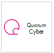

# Fournisseurs de services de sécurité gérés pris en charge

**S’applique à :**
- [Microsoft Defender pour point de terminaison Plan 1](https://go.microsoft.com/fwlink/p/?linkid=2154037)
- [Microsoft Defender pour point de terminaison Plan 2](https://go.microsoft.com/fwlink/p/?linkid=2154037)
- [Microsoft 365 Defender](https://go.microsoft.com/fwlink/?linkid=2118804)

> Vous voulez découvrir Microsoft Defender pour point de terminaison ? [Inscrivez-vous pour bénéficier d’un essai gratuit.](https://signup.microsoft.com/create-account/signup?products=7f379fee-c4f9-4278-b0a1-e4c8c2fcdf7e&ru=https://aka.ms/MDEp2OpenTrial?ocid=docs-wdatp-exposedapis-abovefoldlink)

Les fournisseurs de services de sécurité managés suivants sont accessibles via le portail. 

Logo |Nom du partenaire   | Description 
:---|:---|:---
|[Accenture Managed Detection & Response (MDR)](https://go.microsoft.com/fwlink/?linkid=2164353) | Gérez, gérez et améliorez les opérations mondiales de cybersécurité avec des fonctionnalités étendues qui détectent, recherchent et répondent de manière proactive aux cyberattaques avancées dans les environnements informatiques et ot situés dans le cloud et localement.
 | [Service MDE géré par Aujas](https://go.microsoft.com/fwlink/?linkid=2162429) | La cybersécurité Aujas fournit 24*7 services de sécurité managés sur l’ensemble du spectre de l’entreprise, en utilisant Microsoft Defender pour point de terminaison par le biais de ses centres de cyberdéfense.
| [BDO Digital](/openspecs/ie_standards/ms-html401/ad459f6f-5219-4f68-829c-a58f7397a11f) | La défense managée de BDO Digital utilise des outils de meilleures pratiques, l’IA et des experts en sécurité internes pour la protection des identités 24/7/365
| [BlueVoyant](https://go.microsoft.com/fwlink/?linkid=2121401) | MDR pour Microsoft Defender pour point de terminaison fournit une prise en charge de la surveillance, de l’examen et de l’atténuation des attaques avancées sur les points de terminaison
:::image type="content" source="images/bt-logo.png" alt-text="! Image du logo BT.":::|[Point de terminaison managé Microsoft à partir de BT](https://www.globalservices.bt.com/en/solutions/solution/endpoint-security-and-protection-solutions)| Nous nous défendons depuis de nombreuses années, cette expertise nous a permis de développer des métiers uniques que nous utilisons pour protéger les clients Microsoft. Nous fournirons une surveillance 24 x 7 x 365 de votre patrimoine Microsoft Defender pour point de terminaison dans nos centres d’opérations de sécurité mondiaux.
| [Defender pour le cloud cloud](https://go.microsoft.com/fwlink/?linkid=2099315) | Le Defender pour le cloud cloud d’InSpark est un service managé 24 h/24 et 7 j/7 qui fournit des fonctionnalités de protection, de détection & de réponse
| [Cloud SOC](https://go.microsoft.com/fwlink/?linkid=2104265) | Cloud SOC fournit des services de surveillance de la sécurité 24h/24 et 7 j/7 basés sur le cloud Microsoft et vous aide à améliorer en permanence votre posture de sécurité
| [Réponse & de détection managée du SCRS](https://go.microsoft.com/fwlink/?linkid=2091005) | Surveillance et analyse 24h/24 et 7 j/7 des alertes de sécurité donnant aux entreprises des insights exploitables sur ce qui, quand et comment les incidents de sécurité ont eu lieu
 |[CyberProof Managed Detection & Response (MDR)](https://go.microsoft.com/fwlink/?linkid=2163964) | Services de détection et de réponse aux menaces managées 24 h/24 et 7 j/7 entièrement intégrés à Microsoft Sentinel et Defender pour point de terminaison.
| [Dell Technologies Advanced Threat Protection](https://go.microsoft.com/fwlink/?linkid=2091004) | Professional service de surveillance des comportements malveillants et des anomalies avec la fonctionnalité 24h/24 et 7 j/7
| [Détection et réponse des menaces de point de terminaison managé dXC](https://go.microsoft.com/fwlink/?linkid=2090395) | Identifier les menaces de point de terminaison qui échappent aux défenses de sécurité traditionnelles et les contenir en heures ou en minutes, et non en jours
 | [ESentire Managed Detection and Response](https://go.microsoft.com/fwlink/?linkid=2154970) | Investigations et réponses sur les menaces 24 h/24 et 7 j/7 via Microsoft Defender pour point de terminaison.
| [Renvoyer la détection managée et la réponse pour Microsoft Defender pour point de terminaison](https://go.microsoft.com/fwlink/?linkid=2162430) | Expel vous aide à maintenir votre sécurité en détectant les risques de sécurité dans Microsoft Defender pour point de terminaison.
 | [Mandiant Managed Defense (MDR) pour Microsoft Defender pour point de terminaison](https://go.microsoft.com/fwlink/?linkid=2164352) | Fortifiez votre defender pour point de terminaison avec l’intelligence MDR de première ligne 24 heures sur 24 et 7 jours sur 7 et l’expertise de Mandiant.
| [Sécurité NTT](https://go.microsoft.com/fwlink/?linkid=2095320) | Le service PEPT de NTT fournit une surveillance de la sécurité 24h/24 et 7 j/7 & réponse sur votre point de terminaison et votre réseau
 | [Onevinn MDR](https://go.microsoft.com/fwlink/?linkid=2155203)| Détection et réponse managées 24/7 basées sur Microsoft 365 Defender et Microsoft Sentinel, enrichies de l’intelligence contre les menaces de Onevinn.
 | [Quorum Cyber](https://go.microsoft.com/fwlink/?linkid=2155202)| Un service d’ingénierie de la sécurité & threat hunting de pointe.
| [Red Canary](https://go.microsoft.com/fwlink/?linkid=2103852) | Red Canary est un partenaire des opérations de sécurité pour les équipes modernes, MDR déployé en quelques minutes
| [Détection et réponse managées SecureWorks optimisées par Red Cape](https://go.microsoft.com/fwlink/?linkid=2133634) | Secureworks combine le renseignement sur les menaces et plus de 20 ans d’expérience dans SaaS et les solutions de sécurité managées
| [sepagoSOC](https://go.microsoft.com/fwlink/?linkid=2090491) | Garantir une sécurité holistique grâce à des workflows automatisés sophistiqués dans votre environnement Confiance nulle
| [Trustwave Threat Detection & Response Services](https://go.microsoft.com/fwlink/?linkid=2127542) | Services de détection et de réponse aux menaces pour Azure à l’aide d’intégrations avec Sentinel et Defender pour point de terminaison
| [Services de sécurité gérés par le requin blanc](https://go.microsoft.com/fwlink/?linkid=2154210) |Véritable approche experte de la cybersécurité avec des tarifs transparents sur chaque plateforme, mobile inclus.
| [SoC cloud de Wortell](https://go.microsoft.com/fwlink/?linkid=2108415) | Service Defender pour point de terminaison géré 24 h/24 et 7 j/7 pour la surveillance & réponse
| [Confiance nulle Analytics Platform (ZTAP)](https://go.microsoft.com/fwlink/?linkid=2090971) | Réduisez vos alertes de 99 % et accédez à une gamme complète de fonctionnalités de sécurité à partir d’appareils mobiles

## Rubriques connexes
- [Configurer l’intégration du fournisseur de sécurité de service managé](configure-mssp-support.md)
