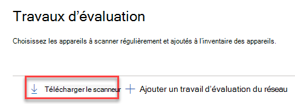
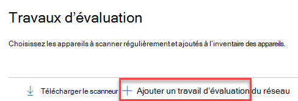
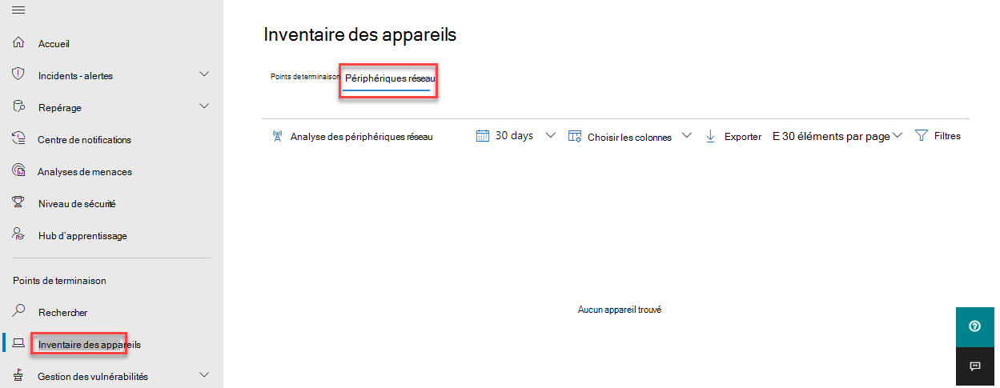

# Découverte et découverte de périphériques réseau gestion des vulnérabilités

[!INCLUDE [Microsoft 365 Defender rebranding](../../includes/microsoft-defender.md)]

**S’applique à :**

- [Microsoft Defender pour point de terminaison](https://go.microsoft.com/fwlink/?linkid=2154037)
- [Menaces et gestion des vulnérabilités](next-gen-threat-and-vuln-mgt.md)
- [Microsoft 365 Defender](https://go.microsoft.com/fwlink/?linkid=2118804)

> [!IMPORTANT]
> **L’analyse et la gestion des périphériques réseau sont actuellement en prévisualisation publique** 
> Cette version d’aperçu est fournie sans contrat de niveau de service et n’est pas recommandée pour les charges de travail de production. Certaines fonctionnalités peuvent ne pas être pris en charge ou avoir des fonctionnalités contraintes.
> Pour plus d’informations, [voir Microsoft Defender pour les fonctionnalités d’aperçu de point de terminaison.](preview.md)

>Vous souhaitez découvrir Microsoft Defender pour le point de terminaison ? [Inscrivez-vous à un essai gratuit.](https://www.microsoft.com/microsoft-365/windows/microsoft-defender-atp?ocid=docs-wdatp-portaloverview-abovefoldlink)

> [!NOTE]  
> Le  blog sur les évaluations de la vulnérabilité et de la découverte des périphériques réseau publié le \( 13/04/2021 fournit des informations sur les nouvelles fonctionnalités de découverte d’appareils réseau dans \) Defender pour endpoint.  Cet article fournit une vue  d’ensemble du défi que la découverte de périphériques réseau est conçue pour résoudre, ainsi que des informations détaillées sur la façon de commencer à utiliser ces nouvelles fonctionnalités.

Les fonctionnalités de découverte de réseau sont disponibles dans la **section** Inventaire des appareils du centre de sécurité Microsoft 365 et des consoles Centre de sécurité Microsoft Defender réseau.  

Un appareil Microsoft Defender for Endpoint désigné sera utilisé sur chaque segment réseau pour effectuer des analyses authentifiées périodiques des périphériques réseau préconfigurés. Une fois découvertes, les fonctionnalités Gestion des menaces et des vulnérabilités de Defender for Endpoint fournissent des flux de travail intégrés pour sécuriser les commutateurs découverts, les routeurs, les contrôleurs WLAN, les pare-feu et les passerelles VPN.  

Une fois que les périphériques réseau ont été découverts et classés, les administrateurs de sécurité pourront recevoir les dernières recommandations de sécurité et passer en revue les vulnérabilités récemment découvertes sur les périphériques réseau déployés au sein de leur organisation.

## Approche

Les périphériques réseau ne sont pas gérés en tant que points de terminaison standard, car Defender pour point de terminaison ne comprend pas de capteur intégré aux périphériques réseau eux-mêmes. Ces types d’appareils nécessitent une approche sans agent dans laquelle une analyse à distance obtient les informations nécessaires des appareils. Selon la topologie et les caractéristiques du réseau, un ou plusieurs appareils intégrés à Microsoft Defender pour le point de terminaison effectueront des analyses authentifiées des périphériques réseau à l’aide de SNMP (lecture seule).

Il y aura deux types d’appareils à garder à l’esprit :

- **Périphérique d’évaluation**: appareil déjà intégré que vous utiliserez pour analyser les périphériques réseau.
- **Périphériques réseau**: périphériques réseau que vous prévoyez d’analyser et d’intégrer.

### Gestion des vulnérabilités pour les périphériques réseau 

Une fois que les périphériques réseau ont été découverts et classés, les administrateurs de sécurité pourront recevoir les dernières recommandations de sécurité et passer en revue les vulnérabilités récemment découvertes sur les périphériques réseau déployés au sein de leur organisation.  

## Systèmes d’exploitation pris en charge

Les systèmes d’exploitation suivants sont actuellement pris en charge :

- Cisco IOS, IOS-XE, NX-OS
- Juniper JUNIPERS
- HPE ArubaOS, Procurve Switch Software
- Palo Alto Networks PAN-OS

D’autres fournisseurs de réseaux et systèmes d’exploitation seront ajoutés au fil du temps, en fonction des données recueillies à partir de l’utilisation des clients. Par conséquent, vous êtes encouragé à configurer tous vos périphériques réseau, même s’ils ne sont pas spécifiés dans cette liste.

## Prise en main

La première étape consiste à sélectionner un appareil qui effectuera les analyses réseau authentifiées.

1. Décidez d’un appareil intégré Defender for Endpoint (client ou serveur) qui dispose d’une connexion réseau au port de gestion pour les périphériques réseau que vous prévoyez d’analyser. 

2. Le trafic SNMP entre le périphérique d’évaluation Defender for Endpoint et les périphériques réseau ciblés doit être autorisé (par exemple, par le pare-feu).

3. Déterminez les périphériques réseau à évaluer pour les vulnérabilités (par exemple, un commutateur Cisco ou un pare-feu Palo Alto Networks).  

4. Assurez-vous que le SNMP en lecture seule est activé sur tous les périphériques réseau configurés pour permettre au périphérique d’évaluation Defender for Endpoint d’interroger les périphériques réseau configurés. « Écriture SNMP » n’est pas nécessaire pour la fonctionnalité appropriée de cette fonctionnalité.

5. Obtenez les adresses IP des périphériques réseau à scanner (ou les sous-réseaux où ces périphériques sont déployés).

6. Obtenez les informations d’identification SNMP des périphériques réseau (par exemple : Community String, noAuthNoPriv, authNoPriv, authPriv). Vous devez fournir les informations d’identification lors de la configuration d’un nouveau travail d’évaluation.  

7. Configuration du client proxy : aucune configuration supplémentaire n’est requise autre que la configuration requise pour le proxy d’appareil Defender for Endpoint.

8. Pour permettre à l’analyseur réseau d’être authentifié et de fonctionner correctement, il est essentiel d’ajouter les domaines/URL suivants :

    - login.windows.net  
    - *.securitycenter.windows.com
    - login.microsoftonline.com
    - *.blob.core.windows.net/networkscannerstable/ *

    > [!NOTE]
    > Toutes les URL ne sont pas spécifiées dans la liste documentée defender pour point de terminaison de collecte de données autorisées.

## Autorisations

Pour configurer les travaux d’évaluation, l’option d’autorisation utilisateur suivante est requise : Gérer les **paramètres de sécurité dans le Centre de sécurité.** Vous pouvez trouver l’autorisation en allant à **Paramètres**  >  **rôles**. Pour plus d’informations, voir [Créer et gérer des rôles pour le contrôle d’accès basé sur les rôles.](user-roles.md)

## Installer le scanneur réseau

1. Go to **Microsoft 365 security**  >  **Paramètres**  >  **Endpoints**  >  **Assessment jobs** (under Network **assessments**).
    1. Dans la Centre de sécurité Microsoft Defender, allez à la page Paramètres > travaux d’évaluation.

2. Téléchargez le scanneur réseau et installez-le sur le périphérique d’évaluation Defender for Endpoint désigné.

    > [!div class="mx-imgBorder"]
    > 

## Inscription de l’installation du scanneur & réseau

Le processus de signature peut être effectué sur l’appareil d’évaluation désigné lui-même ou sur tout autre appareil (par exemple, votre appareil client personnel).

Pour terminer le processus d’inscription du scanneur réseau :

1. Copiez et suivez l’URL qui apparaît sur la ligne de commande et utilisez le code d’installation fourni pour terminer le processus d’inscription.

    > [!NOTE]
    > Vous devrez peut-être modifier les paramètres d’invite de commandes pour pouvoir copier l’URL.

2. Entrez le code et connectez-vous à l’aide d’un compte Microsoft qui dispose de l’autorisation Defender pour le point de terminaison appelée « Gérer les paramètres de sécurité dans le Centre de sécurité ».

3. Lorsque vous avez terminé, vous devriez voir un message vous confirmant que vous vous êtes déjà inscrit.

## Configurer un nouveau travail d’évaluation  

Dans la page Travaux d’évaluation **Paramètres**, **sélectionnez Ajouter un travail d’évaluation réseau.** Suivez le processus de mise en place pour choisir les périphériques réseau à scanner régulièrement et ajoutés à l’inventaire des appareils.

Pour éviter la duplication des appareils dans l’inventaire des périphériques réseau, assurez-vous que chaque adresse IP n’est configurée qu’une seule fois sur plusieurs périphériques d’évaluation.

> [!div class="mx-imgBorder"]
> 

Ajout des étapes d’un travail d’évaluation réseau :

1. Choisissez un nom de « travail d’évaluation » et le « périphérique d’évaluation » sur lequel le scanneur réseau a été installé. Cet appareil effectue les analyses authentifiées périodiques.

2. Ajoutez les adresses IP des périphériques réseau cibles à scanner (ou les sous-réseaux où ces périphériques sont déployés). 

3. Ajoutez les informations d’identification SNMP requises des périphériques réseau cibles. 

4. Enregistrez le travail d’évaluation réseau nouvellement configuré pour démarrer l’analyse réseau périodique. 

### Analyser et ajouter des périphériques réseau

Pendant le processus de mise en place, vous pouvez effectuer une analyse de test à une seule fois pour vérifier que :

- Il existe une connectivité entre le périphérique d’évaluation Defender for Endpoint et les périphériques réseau cibles configurés.
- Les informations d’identification SNMP configurées sont correctes.

Chaque périphérique d’évaluation peut prendre en charge jusqu’à 1 500 adresses IP réussies. Par exemple, si vous analysez 10 sous-réseaux différents où seules 100 adresses IP retournent des résultats positifs, vous pourrez analyser 1 400 adresses IP supplémentaires à partir d’autres sous-réseaux sur le même périphérique d’évaluation.  

S’il existe plusieurs plages d’adresses IP/sous-réseaux à analyser, les résultats de l’analyse de test prennent plusieurs minutes pour s’afficher. Une analyse de test sera disponible pour 1 024 adresses au plus.

Une fois les résultats obtenus, vous pouvez choisir les appareils qui seront inclus dans l’analyse périodique. Si vous ignorez l’affichage des résultats de l’analyse, toutes les adresses IP configurées sont ajoutées au travail d’évaluation réseau (quelle que soit la réponse de l’appareil). Les résultats de l’analyse peuvent également être exportés.

## Inventaire des appareils

Les appareils nouvellement découverts s’afficheront sous le nouvel onglet **Périphériques** réseau dans la page **Inventaire des** appareils. L’ajout d’un travail d’évaluation peut prendre jusqu’à deux heures jusqu’à ce que les appareils soient mis à jour.

> [!div class="mx-imgBorder"]
> 

## Résolution des problèmes

### Échec de l’installation du scanneur réseau

Vérifiez que les URL requises sont ajoutées aux domaines autorisés dans vos paramètres de pare-feu. Assurez-vous également que les paramètres de proxy sont configurés comme décrit dans Configurer les [paramètres de proxy](configure-proxy-internet.md)d’appareil et de connectivité Internet.

### La page Microsoft.com/devicelogin web de l’application n’a pas été

Vérifiez que les URL requises sont ajoutées aux domaines autorisés dans votre pare-feu. Assurez-vous également que les paramètres de proxy sont configurés comme décrit dans Configurer les [paramètres de proxy](configure-proxy-internet.md)d’appareil et de connectivité Internet.

### Les périphériques réseau ne sont pas affichés dans l’inventaire des appareils après plusieurs heures

Les résultats de l’analyse doivent être mis à jour quelques heures après l’analyse initiale qui a eu lieu après la fin de la configuration du travail d’évaluation.

Si les appareils ne sont toujours pas affichés, vérifiez que le service « MdatpNetworkScanService » est en cours d’exécution sur vos appareils d’évaluation, sur lesquels vous avez installé le scanneur réseau, et effectuez une « analyse d’exécution » dans la configuration du travail d’évaluation approprié.  

Si vous n’obtenez toujours pas de résultats après 5 minutes, redémarrez le service.  

### La durée de la dernière vue des appareils est de plus de 24 heures

Vérifier que le scanneur s’exécute correctement. Ensuite, allez à la définition d’analyse et sélectionnez « Exécuter le test ». Vérifiez quels messages d’erreur sont retournés à partir des adresses IP pertinentes.

### Autorisation utilisateur Gestion des menaces et des vulnérabilités requise

L’inscription s’est terminée par une erreur : « Il semble que vous n’avez pas les autorisations suffisantes pour ajouter un nouvel agent. L’autorisation requise est « Gérer les paramètres de sécurité dans le Centre de sécurité ». »

Appuyez sur n’importe quelle touche pour quitter.

Demandez à votre administrateur système de vous attribuer les autorisations requises. Vous pouvez également demander à un autre membre approprié de vous aider dans le processus de connexion en lui fournissant le code de connexion et le lien.

### Échec du processus d’inscription à l’aide du lien fourni dans la ligne de commande du processus d’inscription

Essayez un autre navigateur ou copiez le lien de connexion et le code sur un autre appareil.

### Texte trop petit ou ne peut pas copier le texte à partir d’une ligne de commande

Modifiez les paramètres de ligne de commande sur votre appareil pour autoriser la copie et modifier la taille du texte.

## Articles connexes

- [Inventaire des appareils](machines-view-overview.md)
- [Configurer des fonctionnalités avancées](advanced-features.md)
