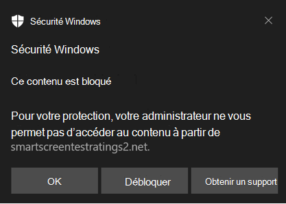
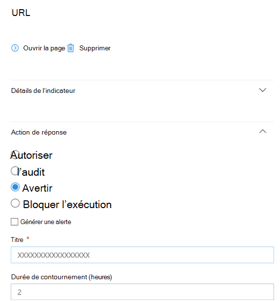

# <a name="protect-your-network"></a>Protéger votre réseau

[!INCLUDE [Microsoft 365 Defender rebranding](../../includes/microsoft-defender.md)]

**S’applique à :**

- [Microsoft Defender pour point de terminaison Plan 2](https://go.microsoft.com/fwlink/p/?linkid=2154037)
- [Microsoft 365 Defender](https://go.microsoft.com/fwlink/?linkid=2118804)
- Antivirus Microsoft Defender

**Plateformes**
- Windows

> Vous voulez découvrir Microsoft Defender pour point de terminaison ? [Inscrivez-vous pour bénéficier d’un essai gratuit.](https://signup.microsoft.com/create-account/signup?products=7f379fee-c4f9-4278-b0a1-e4c8c2fcdf7e&ru=https://aka.ms/MDEp2OpenTrial?ocid=docs-wdatp-exposedapis-abovefoldlink)

## <a name="overview-of-network-protection"></a>Vue d’ensemble de la protection réseau

La protection réseau permet de protéger les appareils contre les événements Basés sur Internet. La protection réseau est une fonctionnalité de réduction de la surface d’attaque. Il permet d’empêcher les employés d’accéder à des domaines dangereux par le biais d’applications. Les domaines qui hébergent des escroqueries, des exploits et d’autres contenus malveillants sur Internet sont considérés comme dangereux. La protection réseau étend l’étendue des [Microsoft Defender SmartScreen](/windows/security/threat-protection/microsoft-defender-smartscreen/microsoft-defender-smartscreen-overview) pour bloquer tout le trafic HTTP sortant qui tente de se connecter à des sources de faible réputation (en fonction du domaine ou du nom d’hôte).

La protection réseau étend la protection dans la [protection Web](web-protection-overview.md) au niveau du système d’exploitation. Il fournit les fonctionnalités de protection web disponibles dans Microsoft Edge à d’autres navigateurs et applications non-navigateur pris en charge. La protection réseau offre également une visibilité et un blocage des indicateurs de compromission (IOC) lorsqu’ils sont utilisés avec la [détection et la réponse](overview-endpoint-detection-response.md) des points de terminaison. Par exemple, la protection réseau fonctionne avec vos [indicateurs personnalisés](manage-indicators.md) que vous pouvez utiliser pour bloquer des domaines ou des noms d’hôte spécifiques.

> [!TIP]
> Consultez le site Microsoft Defender pour point de terminaison testground sur [demo.wd.microsoft.com](https://demo.wd.microsoft.com?ocid=cx-wddocs-testground) pour voir comment fonctionne la protection réseau.

> [!NOTE]
> Le site de démonstration Defender pour point de terminaison sur demo.wd.microsoft.com est déconseillé et sera supprimé à l’avenir.

## <a name="requirements-for-network-protection"></a>Configuration requise pour la protection réseau

La protection réseau nécessite Windows 10 Professionnel ou Enterprise, et Antivirus Microsoft Defender protection en temps réel.

****

| Version de Windows | Antivirus Microsoft Defender |
|:---|:---|
| Windows 10 version 1709 ou ultérieure <br> Windows 11 <br> Windows Server 1803 ou version ultérieure | [Antivirus Microsoft Defender protection en temps réel](configure-real-time-protection-microsoft-defender-antivirus.md) <br> et la [protection fournie par le cloud](enable-cloud-protection-microsoft-defender-antivirus.md) doit être activée (active)|

## <a name="why-network-protection-is-important"></a>Pourquoi la protection réseau est-elle importante ?

> [!IMPORTANT]
> Certaines informations ont trait à un produit préalablement publié, qui peut être modifié de manière significative avant sa publication commerciale. Microsoft n’offre aucune garantie, explicite ou implicite, concernant les informations fournies ici.
>
> Les informations sur les fonctionnalités disponibles commercialement suivent les informations de la préversion publique.

La protection réseau fait partie du groupe de solutions de réduction de la surface d’attaque dans Microsoft Defender pour point de terminaison. La protection réseau permet le blocage de couche 3 (couche réseau) des URL et des adresses IP. La protection réseau peut bloquer l’accès aux URL à partir de navigateurs tiers et de connexions réseau standard.

Par défaut, la protection réseau protège vos ordinateurs contre les URL malveillantes connues à l’aide du flux Smart Screen, qui bloque les URL malveillantes d’une manière similaire à SmartScreen dans Microsoft Edge navigateur. La fonctionnalité de protection réseau peut être étendue à :

- Bloquer l’adresse IP/l’URL de votre propre intel de menace (indicateurs)
- Bloquer les services non approuvés de Microsoft Cloud App Security (MCAS)
- Bloquer les sites en fonction de la catégorie (filtrage de contenu web)

Les protections réseau sont une partie essentielle de la pile de protection et de réponse De Microsoft.

Pour plus d’informations sur la protection réseau pour Windows Server, Linux, MacOS et MTD, consultez [La chasse proactive contre les menaces avec repérage avancé](advanced-hunting-overview.md).

### <a name="block-command-and-control-c2-attacks"></a>Bloquer les attaques de commande et de contrôle (C2)

Les ordinateurs serveur C2 sont utilisés par les utilisateurs malveillants pour envoyer des commandes à des systèmes compromis par des programmes malveillants, puis exercer un certain type de contrôle sur les systèmes compromis. Les attaques C2 se cachent généralement dans les services cloud tels que le partage de fichiers et les services de messagerie web, ce qui permet aux serveurs C2 d’éviter la détection en se fusionnant avec le trafic classique.

Les serveurs C2 peuvent être utilisés pour lancer des commandes qui peuvent :

- voler des données (par exemple, par hameçonnage)
- contrôler les ordinateurs compromis dans un botnet
- interrompre les applications légitimes
- diffuser des programmes malveillants, tels que les ransomwares

Le composant Protection réseau de Microsoft Defender pour point de terminaison identifie et bloque les connexions aux infrastructures C2 utilisées dans les attaques par ransomware gérées par l’homme, à l’aide de techniques telles que l’apprentissage automatique et l’identification intelligente des indicateurs de compromission (IoC).

#### <a name="network-protection-new-toast-notifications"></a>Protection réseau : nouvelles notifications toast

| Nouveau mappage  | Catégorie de réponse  | Sources |
| :--- | :--- | :--- |
| hameçonnage | Hameçonnage | Smartscreen |
| Malveillants | Malveillant | Smartscreen |
| commande et contrôle | C2 | Smartscreen |
| commande et contrôle | COCO | Smartscreen |
| Malveillants | Non approuvé | Smartscreen |
| par votre administrateur informatique | CustomBlockList |   |
| par votre administrateur informatique | CustomPolicy |   |

> [!NOTE]
> **customAllowList** ne génère pas de notifications sur les points de terminaison.

### <a name="new-notifications-for-network-protection-determination"></a>Nouvelles notifications pour la détermination de la protection réseau

Une nouvelle fonctionnalité disponible publiquement dans la protection réseau utilise des fonctions dans SmartScreen pour bloquer les activités de hameçonnage à partir de sites de commande et de contrôle malveillants.

Lorsqu’un utilisateur final tente de visiter un site web dans un environnement dans lequel la protection réseau est activée, trois scénarios sont possibles :

- L’URL a une **bonne réputation connue** . Dans ce cas, l’utilisateur est autorisé à accéder sans entrave et aucune notification toast n’est présentée sur le point de terminaison. En effet, le domaine ou l’URL est défini sur _Autorisé_.
- L’URL a une **réputation inconnue ou incertaine** : l’accès de l’utilisateur est bloqué, mais avec la possibilité de contourner (débloquer) le bloc. En effet, le domaine ou l’URL est défini sur _Audit_.
- L’URL a une **mauvaise réputation connue (malveillante)** : l’utilisateur n’est pas autorisé à accéder. En effet, le domaine ou l’URL est défini sur _Bloquer_.

#### <a name="warn-experience"></a>Avertir l’expérience

Un utilisateur visite un site web :

- Si l’URL a une réputation inconnue ou incertaine, une notification toast présente à l’utilisateur les options suivantes :

  - **OK** : la notification toast est publiée (supprimée) et la tentative d’accès au site est terminée.
  - **Débloquer** : l’utilisateur n’a pas besoin d’accéder au portail Windows Defender Security Intelligence (WDSI) pour accéder au site. L’utilisateur aura accès au site pendant 24 heures; à ce stade, le bloc est réactivé pendant 24 heures. L’utilisateur peut continuer à utiliser **Débloquer** pour accéder au site jusqu’à ce que l’administrateur interdise (bloque) le site, supprimant ainsi l’option de **débloquer**.
  - **Commentaires** : la notification toast présente à l’utilisateur un lien permettant d’envoyer un ticket, que l’utilisateur peut utiliser pour envoyer des commentaires à l’administrateur afin de justifier l’accès au site.

  > [!div class="mx-imgBorder"]
  > 

  > [REMARQUE!] Les images présentées ici pour avertir l’expérience et bloquer l’expérience (ci-dessous) répertorient toutes les deux **« URL bloquée »** comme exemple de texte d’espace réservé ; dans un environnement fonctionnel, l’URL ou le domaine réel est répertorié.  

#### <a name="block-experience"></a>Bloquer l’expérience

Un utilisateur visite un site web :

- Si l’URL a une mauvaise réputation, une notification toast présente à l’utilisateur les options suivantes :
  - **D'accord** La notification toast est publiée (supprimée) et la tentative d’accès au site est terminée.
  - **Commentaires** La notification toast présente à l’utilisateur un lien permettant d’envoyer un ticket, que l’utilisateur peut utiliser pour envoyer des commentaires à l’administrateur afin de justifier l’accès au site.
  
  > [!div class="mx-imgBorder"]
  > 

### <a name="network-protection-c2-detection-and-remediation"></a>Protection réseau : détection et correction C2

Dans sa forme initiale, le ransomware est une menace de marchandise, préprogrammée et axée sur des résultats limités et spécifiques (par exemple, le chiffrement d’un ordinateur). Toutefois, les ransomwares sont devenus une menace sophistiquée qui est pilotée par l’homme, adaptative et axée sur une plus grande échelle et des résultats plus répandus; comme la conservation des ressources ou des données d’une organisation entière contre une rançon.

La prise en charge de la commande et du contrôle (C2) est un élément clé de cette évolution du ransomware et permet à ces attaques de s’adapter à l’environnement qu’elles ciblent. Rompre le lien vers l’infrastructure de commande et de contrôle signifie arrêter la progression d’une attaque à son étape suivante.

#### <a name="detecting-and-remediating-cobaltstrike-public-preview"></a>Détection et correction de CobaltStrike (préversion publique)

CobaltStrike est l’un des frameworks de post-exploitation les plus courants utilisés dans les attaques par rançongiciels gérées par l’homme. Les équipes Threat Intelligence de Microsoft assurent le suivi _des tactiques, techniques et procédures_ (TTP) sur plusieurs groupes d’activités qui déploient des ransomwares pour identifier les modèles de comportement qui peuvent être utilisés pour se défendre contre des stratégies et des vecteurs de menace spécifiques utilisés par des acteurs malveillants. Ces groupes d’activités ransomware, à un moment donné du cycle de vie des attaques, impliquent le déploiement d’une balise CobaltStrike sur l’ordinateur d’une victime pour activer l’activité manuelle au clavier.

CobaltStrike permet la personnalisation de plusieurs aspects de l’attaque, de la possibilité d’héberger plusieurs écouteurs répondant à différents protocoles, à la façon dont le composant principal côté client (Beacon) doit effectuer l’injection de code et exécuter des travaux post-exploitation. Lorsque Microsoft Defender détecte CobaltStrike, il peut rechercher et collecter intelligemment des indicateurs clés de compromission (IoC). Une fois capturés, ces indicateurs sont partagés dans la pile de produits de Microsoft à des fins de détection et de protection.

La détection des commandes et des contrôles de Microsoft Defender ne se limite pas à CobaltStrike. Microsoft Defender peut capturer les IOC clés de plusieurs familles de programmes malveillants. Les indicateurs sont partagés dans la pile de protection Microsoft pour protéger les clients et les alerter en cas de compromission.

Le blocage de la communication de commande et de contrôle peut gravement entraver une attaque ciblée, ce qui donne aux défenseurs le temps de trouver les vecteurs d’entrée initiaux et de les fermer avant une autre tentative d’attaque.

<!-- Hide {this intro with no subsequent list items}
[For additional details about Microsoft Defender's command and control detection, see **ADD LINK TO BLOG**.]
-->

## <a name="smart-screen-unblock"></a>Débloquer l’écran intelligent

Une nouvelle fonctionnalité de Microsoft Defender pour point de terminaison Indicators permet aux administrateurs de permettre aux utilisateurs finaux de contourner les « avertissements » générés pour certaines URL et adresses IP. Selon la raison pour laquelle l’URL a été bloquée, lorsqu’un bloc d’écran intelligent est rencontré, il peut offrir aux administrateurs la possibilité de débloquer le site jusqu’à 24 heures. Dans ce cas, une notification toast Sécurité Windows s’affiche, ce qui permet à l’utilisateur final de **débloquer** l’URL ou l’adresse IP pendant la période définie.  

 > [!div class="mx-imgBorder"]
 > 

Microsoft Defender pour point de terminaison administrateurs peuvent configurer la fonctionnalité de déblocage d’écran intelligent à [Microsoft 365 Defender](https://security.microsoft.com/), à l’aide de l’outil de configuration suivant. À partir du portail Microsoft 365 Defender, accédez au chemin d’accès à ConfigToolName.

<!-- Hide {this intro with no subsequent list items}
[Line 171: Delete the colon and the right angle-brackets. The resulting sentence will be "From the [MS365 Defender] portal, navigate to path to ConfigToolName." Delete "to" and add "the" before path unless a specific description is available. Would a screenshot help? Normally angle brackets or arrows are used in place of certain text rather than in addition.]
-->

 > [!div class="mx-imgBorder"]
 > 

## <a name="using-network-protection"></a>Utilisation de la protection réseau

La protection réseau est activée par appareil, ce qui est généralement fait à l’aide de votre infrastructure de gestion. Pour connaître les méthodes prises en charge, consultez [Activer la protection réseau](enable-network-protection.md).

> [!NOTE]
> Antivirus Microsoft Defender doit être actif pour activer la protection réseau.

Vous pouvez activer la protection réseau en mode **Audit** ou **Bloquer** . Si vous souhaitez évaluer l’impact de l’activation de la protection réseau avant de bloquer les ADRESSEs IP ou LES URL, vous pouvez l’activer en mode Audit pendant un certain temps pour collecter des données sur ce qui serait bloqué. Les journaux d’activité en mode audit lorsque les utilisateurs finaux se sont connectés à une adresse ou à un site qui aurait autrement été bloqué par la protection réseau.

## <a name="advanced-hunting"></a>Repérage avancé

Si vous utilisez La chasse avancée pour identifier les événements d’audit, vous disposez d’un historique de 30 jours maximum disponible à partir de la console. Voir [Repérage avancé](advanced-hunting-overview.md).

Vous trouverez les données d’audit dans **La chasse avancée** dans le portail Microsoft Defender pour point de terminaison.  

Les événements se trouvent dans DeviceEvents avec un ActionType d’ExploitGuardNetworkProtectionAudited. Les blocs sont affichés par ExploitGuardNetworkProtectionBlocked.  

L’exemple suivant inclut les actions bloquées :

DeviceEvents

- Where ActionType in ('ExploitGuardNetworkProtectionAudited','ExploitGuardNetworkProtectionBlocked')

 > [!div class="mx-imgBorder"]
 > 

> [!TIP]
> Ces entrées ont des données dans la colonne AdditionalFields, ce qui vous donne d’excellentes informations sur l’action. Si vous développez AdditionalFields, vous pouvez également obtenir les champs **: IsAudit**, **ResponseCategory** et **DisplayName**.

DeviceEvents :

- où ActionType contient « ExploitGuardNetworkProtection »
- extend ParsedFields=parse_json(AdditionalFields)
- project DeviceName, ActionType, Timestamp, RemoteUrl, InitiatingProcessFileName, IsAudit=tostring(ParsedFields.IsAudit), ResponseCategory=tostring(ParsedFields.ResponseCategory), DisplayName=tostring(ParsedFields.DisplayName)
- sort by Timestamp desc

La catégorie de réponse vous indique ce qui a provoqué l’événement, par exemple :

| ResponseCategory | Fonctionnalité responsable de l’événement |
|:---|:---|
| CustomPolicy |  WCF  |
| CustomBlockList  |   Indicateurs personnalisés   |
| CasbPolicy   |   Defender for Cloud Apps   |
| Malveillant   |   Menaces web  |
| Hameçonnage  |   Menaces web  |

Pour plus d’informations, consultez [Résolution des problèmes liés aux blocs de points de terminaison](web-protection-overview.md#troubleshoot-endpoint-blocks).

Vous pouvez utiliser la liste des URL et adresses IP obtenues pour déterminer ce qui aurait été bloqué si l’appareil était en mode bloc, ainsi que la fonctionnalité qui les a bloquées. Passez en revue chaque élément de la liste pour identifier les URL ou adresses IP si elles sont nécessaires à votre environnement. Si vous trouvez des entrées qui ont été auditées et qui sont critiques pour votre environnement, créez un indicateur pour les autoriser dans votre réseau. Les indicateurs d’URL/IP d’autorisation sont prioritaires sur n’importe quel bloc.

Une fois que vous avez créé un indicateur, vous pouvez examiner la résolution du problème sous-jacent :

- Écran intelligent : révision des demandes
- Indicateur : modifier l’indicateur existant
- MCA : passer en revue l’application non approuvée
- WCF : recategorisation des demandes

À l’aide de ces données, vous pouvez prendre une décision éclairée sur l’activation de la protection réseau en mode bloc. Consultez [l’ordre de priorité des blocs de protection réseau](web-protection-overview.md#order-of-precedence).

> [!NOTE]
> Comme il s’agit d’un paramètre par appareil s’il existe des appareils qui ne peuvent pas passer en mode Bloquer, vous pouvez simplement les laisser sur audit jusqu’à ce que vous puissiez résoudre le problème et vous recevrez toujours les événements d’audit.

Pour plus d’informations sur la façon de signaler des faux positifs, consultez [Signaler les faux positifs](web-protection-overview.md#report-false-positives).

Pour plus d’informations sur la création de vos propres rapports Power BI, consultez [Créer des rapports personnalisés à l’aide de Power BI](api-power-bi.md).

## <a name="configuring-network-protection"></a>Configuration de la protection réseau

Pour plus d’informations sur l’activation de la protection réseau, consultez **[Activer la protection réseau](enable-network-protection.md)**. Utilisez stratégie de groupe, PowerShell ou MDM CSP pour activer et gérer la protection réseau dans votre réseau.

Une fois que vous avez activé les services, vous devrez peut-être configurer votre réseau ou pare-feu pour autoriser les connexions entre les services et vos appareils (également appelés points de terminaison).

- `.smartscreen.microsoft.com`
- `.smartscreen-prod.microsoft.com`

## <a name="viewing-network-protection-events"></a>Affichage des événements de protection réseau

La protection réseau fonctionne mieux avec [Microsoft Defender pour point de terminaison](microsoft-defender-endpoint.md), ce qui vous permet de générer des rapports détaillés sur les événements et les blocs de protection contre les attaques dans le cadre de [scénarios d’investigation d’alerte](investigate-alerts.md).

Lorsque la protection réseau bloque une connexion, une notification s’affiche à partir du Centre d’actions. Votre équipe des opérations de sécurité peut [personnaliser la notification](attack-surface-reduction-rules-deployment-implement.md#customize-attack-surface-reduction-rules) avec les détails et les informations de contact de votre organisation. En outre, les règles individuelles de réduction de la surface d’attaque peuvent être activées et personnalisées en fonction de certaines techniques à surveiller.

Vous pouvez également utiliser le [mode audit](audit-windows-defender.md) pour évaluer l’impact de la protection réseau sur votre organisation si elle était activée.

## <a name="review-network-protection-events-in-the-microsoft-365-defender-portal"></a>Passer en revue les événements de protection réseau dans le portail Microsoft 365 Defender

Microsoft Defender pour point de terminaison fournit des rapports détaillés sur les événements et les blocs dans le cadre de ses [scénarios d’investigation des alertes](investigate-alerts.md). Vous pouvez afficher ces détails dans le portail Microsoft 365 Defender ([https://security.microsoft.com](https://security.microsoft.com)) dans la [file d’attente des alertes](review-alerts.md) ou à l’aide de la [chasse avancée](advanced-hunting-overview.md). Si vous utilisez le [mode audit](audit-windows-defender.md), vous pouvez utiliser la chasse avancée pour voir comment les paramètres de protection réseau affecteraient votre environnement s’ils étaient activés.

Voici un exemple de requête pour la chasse avancée :

```kusto
DeviceNetworkEvents
|where ActionType in ('ExploitGuardNetworkProtectionAudited','ExploitGuardNetworkProtectionBlocked', 'ConnectionSuccess')
```

## <a name="review-network-protection-events-in-windows-event-viewer"></a>Passer en revue les événements de protection réseau dans Windows observateur d'événements

Vous pouvez consulter le journal des événements Windows pour voir les événements créés lorsque la protection réseau bloque (ou audite) l’accès à une adresse IP ou un domaine malveillant :

1. [Copiez le code XML directement](event-views.md).

2. Sélectionnez **OK**.

Cette procédure crée une vue personnalisée qui filtre pour afficher uniquement les événements suivants liés à la protection réseau :

****

|ID d’événement|Description|
|---|---|
|5007|Événement lorsque les paramètres sont modifiés|
|1125|Événement lorsque la protection réseau se déclenche en mode audit|
|1126|Événement lorsque la protection réseau se déclenche en mode bloc|
|

## <a name="network-protection-and-the-tcp-three-way-handshake"></a>Protection réseau et liaison TCP triple

Avec la protection réseau, la détermination de l’autorisation ou du blocage de l’accès à un site est effectuée après la fin de l’établissement de la [liaison triple via TCP/IP](/troubleshoot/windows-server/networking/three-way-handshake-via-tcpip). Ainsi, lorsqu’un site est bloqué par la protection réseau, vous pouvez voir un type d’action `ConnectionSuccess` sous `NetworkConnectionEvents` le portail Microsoft 365 Defender, même si le site a été bloqué. `NetworkConnectionEvents` sont signalés à partir de la couche TCP et non de la protection réseau. Une fois la négociation triple terminée, l’accès au site est autorisé ou bloqué par la protection réseau.

Voici un exemple de fonctionnement :

1. Supposons qu’un utilisateur tente d’accéder à un site web sur son appareil. Le site est hébergé sur un domaine dangereux et doit être bloqué par la protection réseau.  

2. L’établissement d’une liaison triple via TCP/IP commence. Avant de se terminer, une `NetworkConnectionEvents` action est journalisée et est `ActionType` répertoriée comme `ConnectionSuccess`. Toutefois, dès que le processus de négociation triple est terminé, la protection réseau bloque l’accès au site. Tout cela se produit très rapidement. Un processus similaire se produit avec [Microsoft Defender SmartScreen](/windows/security/threat-protection/microsoft-defender-smartscreen/microsoft-defender-smartscreen-overview) ; c’est lorsque l’établissement d’une liaison à trois est terminé qu’une décision est prise et que l’accès à un site est bloqué ou autorisé.

3. Dans le portail Microsoft 365 Defender, une alerte est répertoriée dans la [file d’attente des alertes](alerts-queue.md). Les détails de cette alerte incluent à la fois `NetworkConnectionEvents` et `AlertEvents`. Vous pouvez voir que le site a été bloqué, même si vous avez également un `NetworkConnectionEvents` élément avec l’ActionType de `ConnectionSuccess`.

## <a name="considerations-for-windows-virtual-desktop-running-windows-10-enterprise-multi-session"></a>Considérations relatives à Windows bureau virtuel exécutant Windows 10 Entreprise multisession

En raison de la nature multi-utilisateur de Windows 10 Entreprise, gardez à l’esprit les points suivants :

1. La protection réseau est une fonctionnalité à l’échelle de l’appareil et ne peut pas être ciblée sur des sessions utilisateur spécifiques.

2. Les stratégies de filtrage de contenu web sont également à l’échelle de l’appareil.

3. Si vous devez faire la distinction entre les groupes d’utilisateurs, envisagez de créer des Windows pools d’hôtes virtual desktop et des affectations distinctes.

4. Testez la protection réseau en mode audit pour évaluer son comportement avant de le déployer.

5. Envisagez de redimensionner votre déploiement si vous avez un grand nombre d’utilisateurs ou un grand nombre de sessions multi-utilisateurs.

### <a name="alternative-option-for-network-protection"></a>Autre option pour la protection réseau

Pour Windows 10 Entreprise multisession 1909 et versions ultérieures, utilisées dans Windows Virtual Desktop sur Azure, la protection réseau pour Microsoft Edge peut être activée à l’aide de la méthode suivante :

1. Utilisez [Activer la protection réseau](enable-network-protection.md) et suivez les instructions pour appliquer votre stratégie.

2. Exécutez les commandes PowerShell suivantes :
  - `Set-MpPreference -EnableNetworkProtection Enabled`
  - `Set-MpPreference -AllowNetworkProtectionOnWinServer 1`
  - `Set-MpPreference -AllowNetworkProtectionDownLevel 1`
  - `Set-MpPreference -AllowDatagramProcessingOnWinServer 1`

## <a name="network-protection-troubleshooting"></a>Résolution des problèmes de protection réseau

En raison de l’environnement dans lequel la protection réseau s’exécute, Microsoft peut ne pas être en mesure de détecter les paramètres de proxy du système d’exploitation. Dans certains cas, les clients de protection réseau ne peuvent pas accéder au service cloud. Pour résoudre le problème de connectivité, les clients disposant de licences E5 doivent configurer l’une des clés de Registre suivantes :

```console
reg add "HKLM\Software\Microsoft\Windows Defender" /v ProxyServer /d "<proxy IP address: Port>" /f
reg add "HKLM\Software\Microsoft\Windows Defender" /v ProxyPacUrl /d "<Proxy PAC url>" /f

```

## <a name="see-also"></a>Voir aussi

- [Évaluer les | de protection réseau](evaluate-network-protection.md) Effectuez un scénario rapide qui illustre le fonctionnement de la fonctionnalité et les événements qui sont généralement créés.
- [Activer la protection réseau](enable-network-protection.md) | Utilisez stratégie de groupe, PowerShell ou MDM CSP pour activer et gérer la protection réseau dans votre réseau.
- [Configuration des fonctionnalités de réduction de la surface d’attaque dans Microsoft Intune](/mem/intune/protect/endpoint-security-asr-policy)
